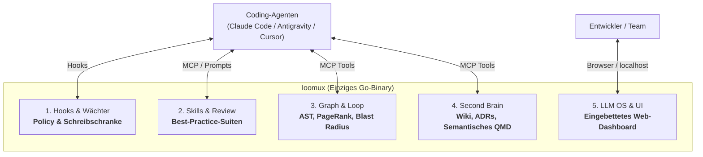
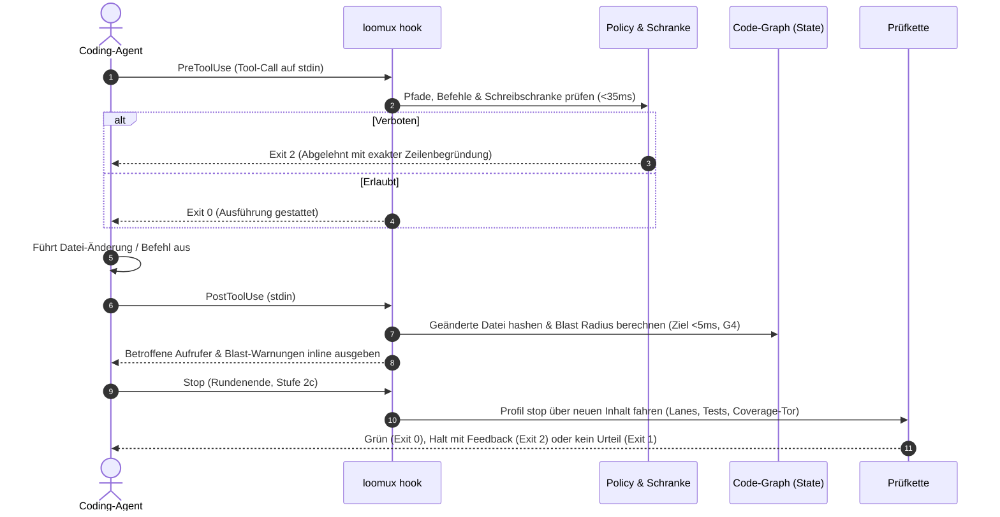
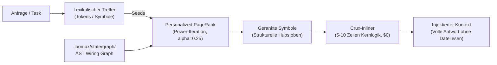
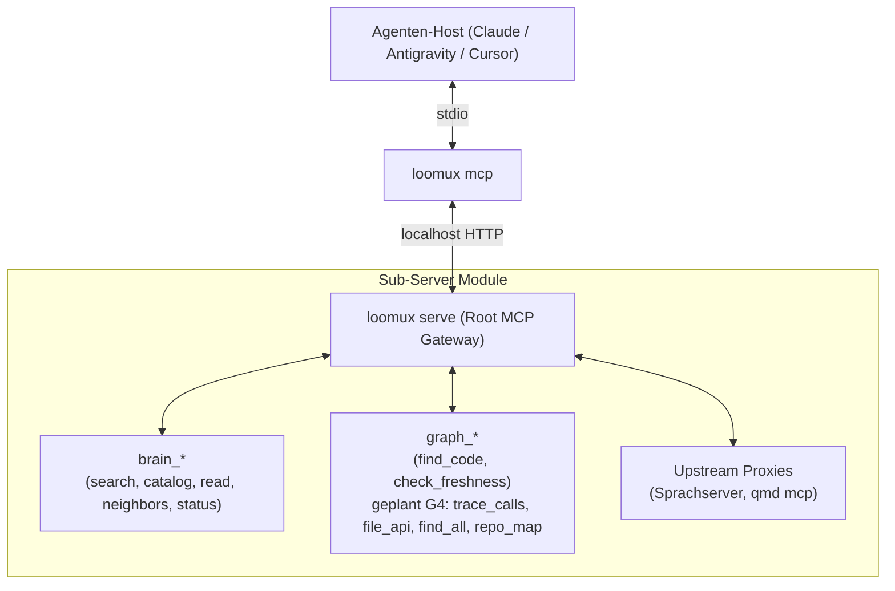

# loomux

🌐 **[English](README.md)** | **[Deutsch](README.de.md)** · 📖 **[Docs (EN)](docs/en/)** | **[Handbuch (DE)](docs/de/)**

**Die vereinte autonome Entwickler-Plattform in einem einzigen Go-Binary: Hooks, Skills, Code-Graph, Second Brain & LLM OS.**

Loomux gibt KI-Coding-Agenten (Claude Code, Antigravity, Cursor, Codex) tiefes Codebase-Verständnis, deterministisches Graph-Retrieval, undurchdringliche Schreibschranken und automatisierte Prüfketten — vollständig autark und ohne externe Laufzeit-Abhängigkeiten.

- **Kein Python. Kein Node.js.** Ein einziges, in sich geschlossenes Go-Binary (`loomux.exe` / `loomux`).
- **Kaltstart unter 35 ms.** Federleichte Ausführung, die sich strikt in die Latenz-Budgets von Agenten-Toolcalls einfügt.
- **100 % Test-Coverage je Funktion.** Kompromisslose Qualität mit Mutationstests und null ungetesteten Codepfaden.
- **Windows-First, POSIX-nativ.** Native Betriebssystem-Primitive (Job Objects, Junctions) mit voller Linux/macOS-Unterstützung.

> **Woher kommt der Name?**  
> **Loomux** verbindet den **Loom** (den Webstuhl, der die Fäden aus Agenten-Loops, Code-Graphen und Team-Wissen zu einem dichten, nahtlosen Gewebe verwebt) mit der Endung **-ux** (inspiriert von der Unix-Philosophie robuster, modularer Betriebssystem-Werkzeuge sowie einer kompromisslosen Developer & Agent Experience).

---

## Die 5 Säulen von Loomux



---

## Kern-Workflows

### 1. Der autonome Wächter- & Prüfkreislauf

Jede Interaktion eines Coding-Agenten wird in Echtzeit überwacht und validiert, ohne den Entwicklungsfluss zu blockieren.



### 2. Deterministisches Code-Graph-Retrieval ("GraphRank")

Agenten erkunden Codebasen oft bei jeder Sitzung mühsam von Neuem und verbrennen dabei Zeit und Token. Loomux baut einmalig einen lokalen, deterministischen AST-Code-Graphen auf und beantwortet Abfragen daraus via **Personalized PageRank**.

> **Stand (Stufe G3).** Stufe G2b hat den Abfragepfad vollendet: `loomux graph ask` sucht Code-Symbole gerankt nach BM25-artigem lexikalischen Matching verschmolzen mit Personalized PageRank (alpha=0.25). Das Retrieval benötigt ~48 ms warm (~38 ms bei Namens-Matching ohne die 1-MB-Rumpfbeiakte auf diesem ~3.000-Knoten-Repo; die Beiakte dient der Skalierung auf 30.000+ Knoten). Quelltext-Spans werden bei Bedarf via `--source` inline eingeblendet. Bei Abweichung wird der Graph automatisch im Hintergrund neu gebaut, sofern `--no-refresh` fehlt; einen ersten Graphen baut keine Abfrage. Stufe G3 stellt dieselbe Abfrage und die Driftprüfung als `graph_find_code` und `graph_check_freshness` über MCP bereit (siehe §3). Graph-Navigation (`callers`, `blast`, `grep`, `skeleton`, `map`) wartet auf Stufe G4.



> **„Lexik schlägt vor, der Graph entscheidet“**: Keywords finden potenzielle Kandidaten; der strukturelle Aufrufgraph konzentriert die Masse auf die tatsächlich relevanten Kernkomponenten und filtert isolierten oder toten Code heraus.

### 3. Verschachteltes MCP-Composite-Gateway

`loomux serve` fungiert als modularer **MCP-Gateway-Router** über Streamable HTTP und stellt saubere Namensräume für Agenten bereit:



**Was heute steht (Stufen 1b-2 und G3):** der Wirt, die Brücke und die Wurzel über zwei
Loopback-Listener — einer je Kanal, jeder mit eigenem Token — und sieben Werkzeuge:
die fünf `brain_*`-Werkzeuge und, seit Stufe G3, `graph_find_code` und
`graph_check_freshness`. Die übrigen vier `graph_*`-Werkzeuge (Stufe G4) und die
Upstream-Proxies sind spezifiziert, nicht gebaut. `loomux mcp` fällt auf `--channel local` zurück,
startet und ersetzt den Dienst selbst, und der Pro-Edit-Hook-Pfad verlinkt
nichts davon, was ein Test über den Importgraphen festhält. Siehe
[`docs/de/cli-reference.md`](docs/de/cli-reference.md) §8.

---

## Migrationsplan

Wo jede Stufe und jede Funktion steht — Herkunft, Stand, Abhängigkeiten und
Priorität —, steht im **[Migrationsplan](docs/de/migration.md)**. Stufe 2c
(das Stop-Tor und die Subagenten-Hooks) ist für Claude Code fertig; ihr
Antigravity-Adapter steht noch aus.

---

## CLI-Referenz

Aktive Befehle nach den Stufen 1a, 1b-1, 1b-2, 2a, 2b und 2c im Vergleich zu spezifizierten Befehlen der Folge- und Graph-Stufen:

### Aktive Befehle (Stufen 1a, 1b-1, 1b-2, 2a, 2b und 2c)
```bash
loomux check <profil|arten>         # Fährt die [verify]-Lanes: edit, precommit, all oder lint,types,... (--root, --show, -v)
loomux check gocover --profile <p>  # 100 % je Funktion, oder eine Gesamtgrenze mit --floor N
loomux check commit-msg <datei>     # Prüft eine Commit-Nachricht: Kopf nach Conventional Commits und Sprache ([commit], --language, --calibrate N)
loomux check gofmt [pfade...]       # Prüft Go-Formatierung ohne Dateiänderungen
loomux hook pre-tool-use            # Prüft Policy und globale Schreibschranke gegen stdin
loomux hook post-tool-use           # Fährt die Lanes des Profils edit gegen die eben geänderte Datei (--budget, Vorgabe 50s)
loomux hook session-start           # Hält den Basis-Commit der Sitzung fest und warnt vor veraltetem Binary
loomux hook stop                    # Tor am Rundenende: Profil stop über neuen Inhalt, Befunde der Subagenten (--budget, Vorgabe 270s)
loomux hook subagent-start|subagent-stop  # Schnappschuss von origin, Branches und HEAD um einen Subagenten; parkt, was sich bewegt hat, für stop
loomux status|doctor|explain        # Zeigt Hook-Status, Prüfketten und erkannte Host-Harnesses (drei Namen, ein Codeweg)
loomux worktree link|unlink|remove  # Verwaltet isolierte Arbeitsbaum-Spiegel und Junction-Pfade
loomux dev swap-binary              # Tauscht laufendes Binary atomar gegen Neubau aus
loomux version                      # Gibt die Version dieses Binaries aus
loomux lint <datei>                 # Prüft Links und Frontmatter einer Wiki-Seite
loomux wiki-gate                    # Erzwingt Frische und strukturelle Schranken des Wikis
loomux brain search "<anfrage>"     # Durchsucht die sichtbaren Bereiche über den qmd-Daemon (--profile fast|full|keyword)
loomux brain catalog [--scope S]    # Wurzelkatalog der sichtbaren Bereiche oder das index.md eines Bereichs
loomux brain read <pfad> --scope S  # Eine Datei eines Bereichs oder einen Abschnitt daraus (--section)
loomux brain neighbors <pfad> --scope S  # Eingehende und ausgehende Links einer Seite
loomux brain status                 # Was man wissen muss, bevor man einer Antwort traut
loomux serve [--foreground]         # Startet den langlebigen localhost-MCP-Dienst, abgekoppelt oder hier
loomux serve status                 # Was serve.json sagt und ob der Listener antwortet
loomux serve stop [--force]         # Beendet den Dienst über seinen Endpunkt oder über seine PID
loomux mcp [--channel local|cloud]  # stdio-Brücke, die ein MCP-Wirt startet; sie startet den Dienst selbst
```

### Implementierte Befehle (Code-Graph — Stufen G2a–G2b)
```bash
loomux graph build [--root <pfad>]  # Extrahiert, löst auf und schreibt .loomux/state/graph/wiring.json
loomux graph check [--root <pfad>]  # Extrahiert neu und vergleicht mit Graph auf Platte (Exit 1 bei Drift)
loomux graph ask "<anfrage>" [flags] # Sucht Symbole gerankt nach lexikalischem Score und Personalized PageRank; baut nie einen ersten Graphen
```

### Spezifizierte Befehle (Code-Graph — Stufen G4–G5)

Stufe G1 hat die Rank- und Blast-Radius-Bibliotheken gebaut; die Stufen G2a und G2b haben
`build`, `check` und `ask` oben darauf verdrahtet, und Stufe G3 stellt `ask` und `check` über
MCP bereit; die Graph-Navigation (`callers`, `blast`, `grep`, `skeleton`, `map`) wartet auf Stufe G4.
```bash
loomux graph callers <symbol>       # Zeigt Aufrufer, Aufgerufene (--direction out) oder transitive Hülle (-d all)
loomux graph blast [dir]            # Berechnet den Blast-Radius eines Git-Diffs gegen Working Tree oder Merge-Base
loomux graph grep "<regex>"         # Regex-Suche gruppiert nach Symbol und sortiert nach Kopplung
loomux graph skeleton <datei>       # Gibt Signaturen und Zeilenspans einer Datei aus (~10x Token-Ersparnis)
loomux graph map                    # Gibt token-budgetierte Verzeichnis-Cluster, Hubs und Hotspots aus
loomux graph viz                    # Öffnet den interaktiven Graph-Viewer im Browser
```

### Spezifizierte Befehle (Second Brain & Dienste — Stufen 3–4 & W1–W5)
```bash
loomux brain reconcile             # Synchronisiert Zustandsänderungen, Identitäten und QMD-Sammlungen
loomux brain check file|bundle|all  # Die Regeln für OKF, Haus und Föderation über eine Seite, ein Bündel oder alle Bereiche
loomux brain embed                  # Erzeugt die Vektoren, die reindex offen lässt
loomux serve                        # Das eingebettete Web OS neben den MCP-Listenern
loomux init [--detect-only]         # Richtet Hooks, Einstellungen, Skills und AGENTS.md in erkannten Agenten ein
```

### Entwickler- & Worktree-Werkzeuge
```bash
loomux dev bench-hooks <fall>       # Misst die Latenz der Hook-Ausführung gegen die Grundlinie von < 35 ms
loomux dev bench [--dir <dir>] [--save] # Benchmark für Einzel-Repo oder Open-Source-Matrix-Korpus mit Lücken-Audit; --save sichert in docs/
loomux dev mutants <paket>          # Führt Mutationstests über kritische Entscheidungspakete aus
loomux dev record-case --out <dir>  # Zeichnet einen Lauf eines Referenz-Binaries als Fall auf
loomux dev import-cases --map <f>   # Übersetzt ein Verzeichnis aufgezeichneter Fälle in loomux-Fälle
loomux dev record-mcp-case --out <dir> # Zeichnet einen MCP-Werkzeugaufruf eines Referenzdienstes als Fall auf
loomux dev release <unterbefehl>    # Release-Regeln für die CI: next-version, parse-body, changelog-insert, build
```

---

## Architekturentscheidungen: Was wir bauen, ablösen und weglassen

| Komponente / Idee | Herkunft / Inspiration | Entscheidung in Loomux | Begründung |
|---|---|---|---|
| **Einziges Go-Binary** | Grundarchitektur | ✅ **Kernmandat** | 0 Python, 0 Node.js. 7,5 ms warmer Hook, autarke Auslieferung, 100 % Testabdeckung. |
| **AST-Code-Graph & PageRank** | `trailhq/Graft` | ✅ **Nativ übernommen** | $0 deterministischer Code-Graph. Personalized PageRank filtert strukturelle Kern-Hubs statt naiver Keyword-Listen. |
| **Blast Radius & Crux-Inlining** | `trailhq/Graft` | ✅ **Nativ übernommen** | Auswirkungsanalyse bei Edits (Ziel < 5 ms); liefert 5-10 Zeilen Kernlogik oder Spans ($0 Token-Lesekosten, ~48 ms warmes Retrieval). |
| **Symbol-gekoppelter Grep** | `trailhq/Graft` | ✅ **Nativ übernommen** | Regex-Treffer gruppiert nach umschließendem Symbol und gerankt nach Kanten-Kopplung (`inDegree`). |
| **Lokales Second Brain & Wiki** | Grundarchitektur | ✅ **Kernmandat** | Markdown-Wiki, ADRs und Identitätsregister direkt im Repo. Code-Symbole verlinken direkt auf Architektur-Entscheidungen. |
| **Node.js & C++ Toolchain** | `trailhq/Graft` | ❌ **Abgelehnt** | Graft setzt Node.js >=20, `node-gyp` und MSVC voraus. Loomux bleibt 100 % Pure Go ohne C-Compiler-Zwang. |
| **Cloud-Brain-Synchronisation** | `trailhq/Graft` | ❌ **Abgelehnt** | Graft synchronisiert Symbol-Hashes mit Cloud-APIs. Loomux hält alles Wissen, alle Regeln und Graphen 100 % lokal und offline. |
| **Telemetrie & Tracking** | `trailhq/Graft` | ❌ **Abgelehnt** | Graft sendet Nutzungsstatistiken an externe Server. Loomux hat null Telemetrie und telefoniert niemals nach Hause. |

---

## Architektur-Prinzipien

1. **Deterministisch als Standard**: Code-Graph, Blast-Radius und Schreibschranken laufen lokal, deterministisch und kosten $0.
2. **Startzeit-Disziplin**: `loomux` misst seinen Startboden (5,5 ms warm, 2026-09-17) kontinuierlich. Keine Paketvariable und kein `init()` darf eingebettete Daten parsen oder I/O durchführen.
3. **Strikte Isolierung**: Hook-Pfade laufen im Prozess und hängen niemals von einem laufenden `serve`-Daemon ab.
4. **Agentensichere Konfiguration**: `.loomux/config.toml` deklariert Schutzbereiche und Policies; sie wird vom Menschen gepflegt und ist für Agenten schreibgeschützt — für Schreibwerkzeuge wie für Shell-Befehle (`>`, `sed -i`, `tee`, `Set-Content`, `cp`/`mv` darauf). Maschinenzustand liegt in `.loomux/state/` (git-ignoriert).

---

## Dokumentations-Suite

Vollständige Handbücher und technische Leitfäden sind unter [`docs/de/`](docs/de/) gegliedert:

| Handbuch | Beschreibung |
|---|---|
| 🚀 **[Erste Schritte](docs/de/getting-started.md)** | Installation, 3-Minuten-Schnellstart und Anbindung an Agenten-Harnesses (Claude Code, Antigravity, Cursor). |
| 🏛️ **[Architektur & Konzepte](docs/de/architecture.md)** | Das theoretische Fundament: Andrej Karpathys LLM OS, Googles Knowledge Items (KI), Grafts AST-GraphRank und der Schreibschranken-Kernel. |
| ⚙️ **[Konfigurations-Referenz](docs/de/configuration.md)** | Vollständige Referenz für `.loomux/config.toml` (`[verify]`, `[policy]`, `[worktree]`, `[graph]`, `[skills]`, `[privacy]`). |
| 📖 **[CLI-Referenzhandbuch](docs/de/cli-reference.md)** | Detailliertes Handbuch aller Befehle, Flags, stdin-JSON-Nutzlasten und Exit-Codes. |
| 🪝 **[Hook-Lebenszyklus & Integration](docs/de/hooks.md)** | Technische Spezifikation des 4-Phasen-Hook-Zyklus, der Host-Formate und des entkoppelten SSE-Ereignisstroms. |
| 🗺️ **[Migrationsplan](docs/de/migration.md)** | Jede Stufe und jede Funktion der Fusion und des Code-Graphen: Herkunft, Stand, Abhängigkeiten und Priorität. |
| ⏱️ **[Leistungs-Benchmarks](docs/de/benchmarks.md)** | Chronologische Messungen gegenüber den Vorläufer-Programmen und verbindliche Latenzbudgets. |
| 📊 **[Benchmark-Matrix](docs/de/benchmarks/matrix.md)** | Open-Source-Matrix über Top-Sprachen hinweg mit Detailberichten pro Sprache und Repository. |

---

## Spezifikationen & Interne Arbeitspapiere

Detailentwürfe und interne Arbeitspapiere liegen unter `docs/.superpowers/specs/`:
- [Fusions-Design: Ultraloom & Ultra-Brain](docs/.superpowers/specs/2026-09-14-loomux-fusion-design.md)
- [Code-Graph Subsystem-Spezifikation](docs/.superpowers/specs/2026-09-14-loomux-code-graph-design.md)
- [Web OS & Skill-System-Spezifikation](docs/.superpowers/specs/2026-09-14-loomux-web-os-design.md)

---

## Releases

Binaries gibt es auf der [Releases-Seite](https://github.com/xidus90/loomux/releases):
`loomux_<version>_<os>_<arch>` für `windows/amd64` (`.exe`), `linux/amd64`,
`linux/arm64`, `darwin/amd64` und `darwin/arm64`. Geprüft wird gegen
`SHA256SUMS` aus demselben Release:

```sh
sha256sum --check --ignore-missing SHA256SUMS
```

Jeder gemergte Pull Request nach `master` wird nach seinem Label veröffentlicht:

| Label | Bedeutung | Version |
|---|---|---|
| `release:major` | Inkompatible Änderung an Befehl, Flag, Hook-Protokoll, Konfigurationsformat oder Exit-Code | `X+1.0.0` |
| `release:minor` | Neue Funktion, kompatibel | `X.Y+1.0` |
| `release:patch` | Fehlerbehebung oder Abhängigkeits-Update, kompatibel | `X.Y.Z+1` |
| `release:none` | Nur Doku, CI oder Tests | kein Release |

Jedes Release ist ein Beta-Pre-Release, bis `RELEASE_CHANNEL` auf `stable`
steht. Was sich geändert hat, steht in [`CHANGELOG.md`](CHANGELOG.md).

### Einen Pull Request öffnen

Auf `master` wird nie direkt committet; jede Änderung läuft über einen Pull
Request. Die Hooks in `.githooks` lehnen einen Commit auf `master` und einen
Push dorthin ab, sobald `git config core.hooksPath .githooks` gesetzt ist. Mit
einem LLM erledigt der Skill `release-pr` die Schritte unten; von Hand:

1. Commits thematisch gruppieren, ein Commit pro Änderung. Eine spätere
   Korrektur an etwas, das dieser Branch eingeführt hat, gehört in den
   Commit, der es eingeführt hat; nur die Behebung eines Fehlers, der schon
   auf `master` war, behält einen eigenen Commit. Einen bereits gepushten
   Branch neu zu schreiben braucht `git push --force-with-lease`. Jede
   Nachricht ist ein Conventional Commit (`feat: …`, `fix: …`, `docs: …`;
   `!` für eine inkompatible Änderung). Der Hook `commit-msg` prüft das
   lokal, und der Check `pr-label` lehnt einen Pull Request ab, sobald ein
   Commit-Titel die Form verletzt.
2. Ein Label aus der Tabelle oben wählen; zwischen zwei Stufen die höhere.
   Es liegt nie unter den Commits: `!` verlangt major, `feat` minor, `fix`
   patch.
3. Den Rumpf schreiben:
   ```
   Release: <level> — <one-sentence reason>

   ## Summary
   - <what changes for a user>

   ## Changelog
   ### Added
   - <entry>
   ```
   Changelog-Überschriften sind nur `Added`, `Changed`, `Deprecated`,
   `Removed`, `Fixed`, `Security`; bei `release:none` entfällt der Abschnitt.
4. Prüfen: `go run ./cmd/loomux dev release parse-body --labels release:<level> --body <file>`.
5. Branch pushen, dann `gh pr create --base master --label release:<level> --body-file <file>`.

### Releases einrichten (Maintainer)

1. Labels:
   ```sh
   gh label create release:major --color B60205 --description "Breaking change"
   gh label create release:minor --color 0E8A16 --description "New feature, compatible"
   gh label create release:patch --color 1D76DB --description "Bug fix or dependency update"
   gh label create release:none --color CCCCCC --description "No release"
   ```
2. Kanal: `gh variable set RELEASE_CHANNEL --body beta`
3. GitHub App (Settings → Developer settings → GitHub Apps → New): Name
   `loomux-release`, Webhook aus, Repository-Rechte `Contents: Read and
   write`, `Pull requests: Read-only`, `Metadata: Read-only`, „Only on this
   account“. Private Key erzeugen, App nur in `xidus90/loomux` installieren,
   dann:
   ```sh
   gh secret set RELEASE_APP_CLIENT_ID --body <client-id>
   gh secret set RELEASE_APP_PRIVATE_KEY < loomux-release.private-key.pem
   ```
4. Rulesets (erst wenn das Repository öffentlich ist): eines für `master`
   und eines für Tags `v*`, jeweils mit der App `loomux-release` als einzigem
   Bypass-Akteur. Das Ruleset für `master` verlangt außerdem die
   Statuschecks `gate-windows` und `build-linux` (Workflow `ci`) sowie
   `check` (Workflow `pr-label`).

Ist ein Release ausgefallen, den Workflow `release` von Hand starten
(`gh workflow run release.yml -f pr=<nummer>`). Er verweigert einen Pull
Request, der nicht nach `master` gemergt ist, und ein erneuter Lauf nach dem
`chore(release): v*`-Commit verwendet diesen Commit wieder. Gibt es für den Pull
Request schon einen Tag oder ein Release, nicht erneut starten, sondern das
vorhandene Release von Hand reparieren.

---

## Lizenz

PolyForm Noncommercial License 1.0 (`LICENSE.md`).
