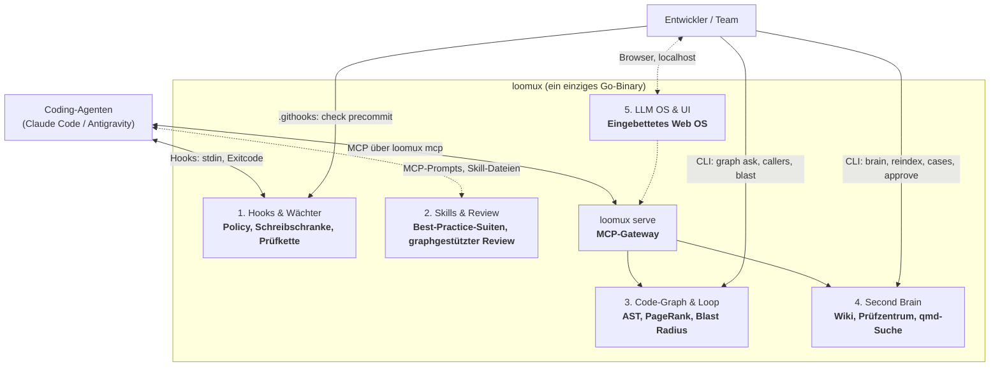
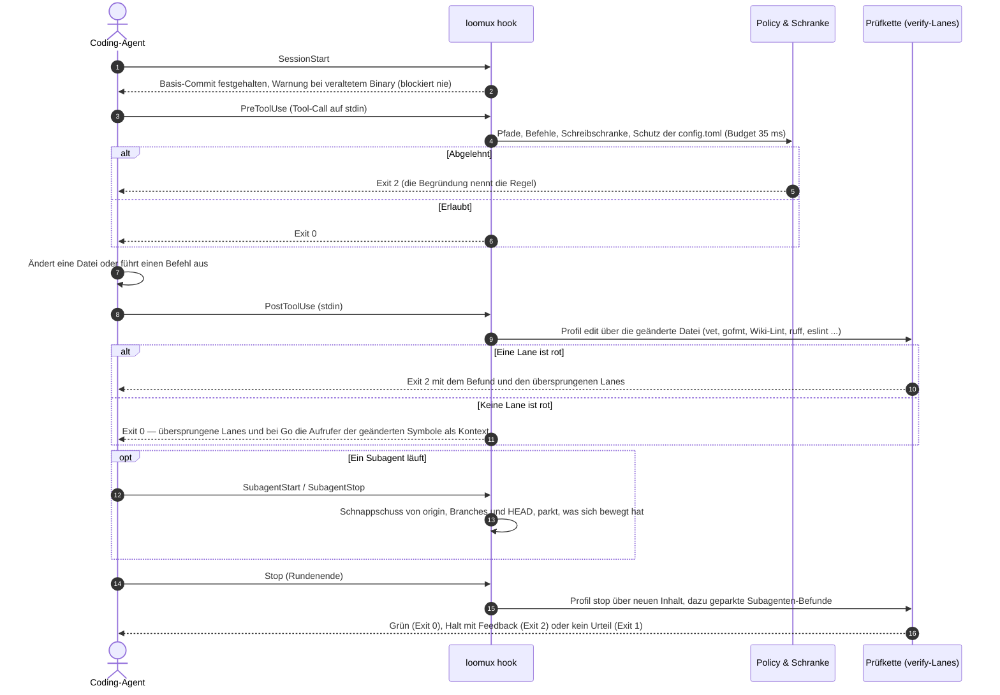
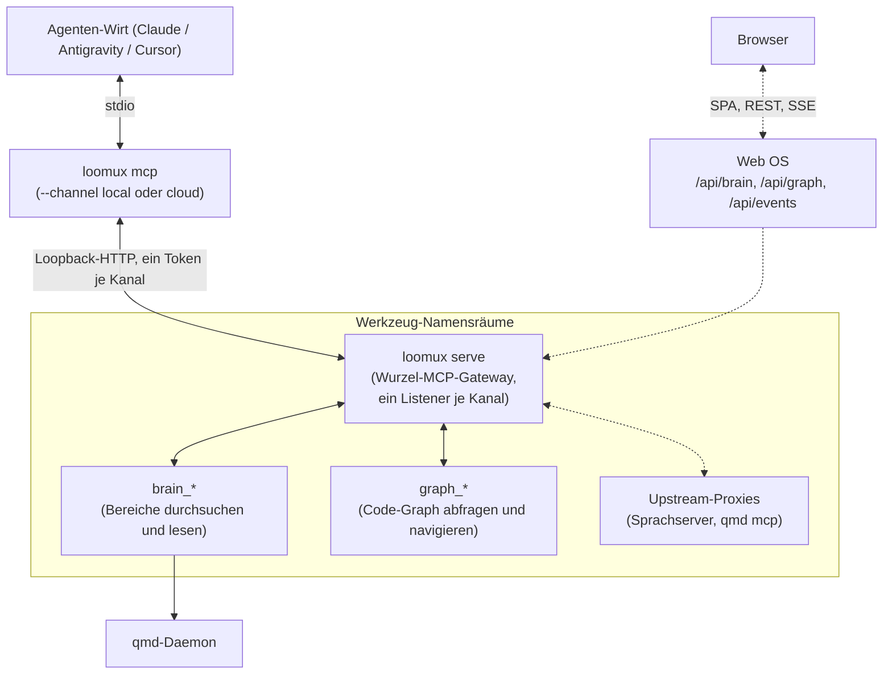

# loomux

🌐 **[English](README.md)** | **[Deutsch](README.de.md)** · 📖 **[Docs (EN)](docs/en/)** | **[Handbuch (DE)](docs/de/)**

**Die vereinte autonome Entwickler-Plattform in einem einzigen Go-Binary: Hooks, Skills, Code-Graph, Second Brain & LLM OS.**

Loomux gibt KI-Coding-Agenten (heute Hooks für Claude Code und Antigravity; Cursor nur als MCP-Client; Codex ist noch nicht angebunden) tiefes Codebase-Verständnis, deterministisches Graph-Retrieval, undurchdringliche Schreibschranken und automatisierte Prüfketten — vollständig autark und ohne externe Laufzeit-Abhängigkeiten.

- **Kein Python. Kein Node.js.** Ein einziges, in sich geschlossenes Go-Binary (`loomux.exe` / `loomux`).
- **Kaltstart unter 35 ms.** Federleichte Ausführung, die sich strikt in die Latenz-Budgets von Agenten-Toolcalls einfügt.
- **100 % Test-Coverage je Funktion.** Kompromisslose Qualität mit Mutationstests und null ungetesteten Codepfaden.
- **Windows-First, POSIX-nativ.** Native Betriebssystem-Primitive (Job Objects, Junctions) mit voller Linux/macOS-Unterstützung.

> **Woher kommt der Name?**  
> **Loomux** verbindet den **Loom** (den Webstuhl, der die Fäden aus Agenten-Loops, Code-Graphen und Team-Wissen zu einem dichten, nahtlosen Gewebe verwebt) mit der Endung **-ux** (inspiriert von der Unix-Philosophie robuster, modularer Betriebssystem-Werkzeuge sowie einer kompromisslosen Developer & Agent Experience).

---

## Die 5 Säulen von Loomux



*Eine gestrichelte Linie ist spezifiziert und nicht gebaut. Was jede
Migrationsstufe gebaut hat, steht im [Migrationsplan](docs/de/migration.md);
was danach kommt, in der [Roadmap](#roadmap).*

---

## Kern-Workflows

### 1. Der autonome Wächter- & Prüfkreislauf

Jede Interaktion eines Coding-Agenten wird in Echtzeit überwacht und validiert, ohne den Entwicklungsfluss zu blockieren.



Jede Phase mit Nutzlast, Exitcodes und Budgets: [Hook-Lebenszyklus](docs/de/hooks.md).

### 2. Deterministisches Code-Graph-Retrieval ("GraphRank")

Agenten erkunden Codebasen oft bei jeder Sitzung mühsam von Neuem und verbrennen dabei Zeit und Token. Loomux baut einmalig einen lokalen, deterministischen AST-Code-Graphen auf und beantwortet Abfragen daraus via **Personalized PageRank**.

Der Graph umfasst Go, gelesen mit `go/parser`, und Python, gelesen auf `gotreesitter`, einer Tree-sitter-Laufzeit in reinem Go, sodass das Binary CGo-frei bleibt. `loomux graph build` parst nur die Dateien, die sich seit dem letzten Build geändert haben, und nimmt den Rest aus seinem Extraktions-Cache; `--no-reuse` parst jede Datei.

`loomux graph ask` rankt Code-Symbole nach BM25-artiger lexikalischer Relevanz verschmolzen mit Personalized PageRank (alpha=0.25), baut einen driftenden Graphen vor der Antwort neu (nie einen ersten) und blendet mit `--source` den Span jedes Treffers ein. `loomux graph blast` zeigt über dieselben Kanten, was ein Git-Diff erreicht; die Prüfart `graph` prüft die gestagte Änderung in `loomux check precommit` genauso und am Stop-Tor die ganze Runde gegen `HEAD`, wo immer ein Graph gebaut wurde ([Konfiguration](docs/de/configuration.md#die-art-graph)).

> **„Lexik schlägt vor, der Graph entscheidet“**: Keywords finden potenzielle Kandidaten; der strukturelle Aufrufgraph konzentriert die Masse auf die tatsächlich relevanten Kernkomponenten und filtert isolierten oder toten Code heraus.

Abfragepfad und Blast-Radius Schritt für Schritt gezeichnet: [Architektur, Säule III](docs/de/architecture.md). Zeiten: [Benchmarks](docs/de/benchmarks.md).

### 3. Verschachteltes MCP-Composite-Gateway

`loomux serve` fungiert als modularer **MCP-Gateway-Router** über Streamable HTTP und stellt saubere Namensräume für Agenten bereit:



*Eine gestrichelte Linie ist spezifiziert und nicht gebaut.* Der Kanal ist die
Adresse: jeder Listener hat sein eigenes Token, und der Cloud-Kanal sieht nie
einen Bereich, der lokal bleibt. `loomux mcp` fällt auf `--channel local` zurück, bietet nur die Werkzeuge der Module an, die `[modules]` eingeschaltet lässt, startet und ersetzt den Dienst selbst,
und der Pro-Edit-Hook-Pfad verlinkt nichts davon, was ein Test über den Importgraphen
festhält. Jedes Werkzeug mit seinen Argumenten: [CLI-Referenz §8](docs/de/cli-reference.md).

---

## Migrationsplan

Wo jede Migrationsstufe und jede aus ultraloom und ultra-brain übernommene
Funktion steht — Herkunft, Stand, Abhängigkeiten und Priorität, mit einer
Karte, welche Stufe auf welche wartet —, steht im
**[Migrationsplan](docs/de/migration.md)**. Diese README beschreibt, was loomux
ist; der Plan sagt, wie weit die Migration ist, und die Roadmap darunter, was
danach kommt.

---

## Roadmap

Was loomux über die Migration hinaus bekommt. *Priorität* ist dieselbe
Reihenfolge wie im Migrationsplan, festgelegt in der
[Fusions-Spec](docs/.superpowers/specs/2026-09-14-loomux-fusion-design.md)
unter „Reihenfolge der offenen Stufen“ (1 zuerst); die offenen
Migrationsstufen 4a-2, 4c-1, 4e und 4f haben Priorität 3.

### Kommt

| Funktion | Was sie bringt | Stufe | Hängt ab von | Priorität |
|---|---|---|---|---|
| **Flow-Laufzeit** | Flows als Daten: ein Graph aus Knoten in TOML, der läuft, an einem Tor auf die Antwort eines Menschen wartet und sich aus einem Journal fortsetzen und wiedergeben lässt. Gebaut: das Ordnerformat mit seiner Ladeprüfung, der Katalog, Rollen, die `[agent]` an Modelle bindet, Overlays, `[flow] default` und `overrides`, die Wächterregeln für Torantworten, Laufdateien und mitgelieferte Flows, `loomux flow run\|resume\|replay\|show\|list` und der Hinweis des Session-Starts auf wartende Läufe ([Flows](docs/de/flows.md)). Tor- und Ausgangsknoten laufen; Agentenknoten warten auf die Modelladapter für Claude und Gemini (über deren CLIs, deren APIs oder beides, was Stufe B entscheidet), und `verify-until-green` als Daten-Flow auf die Bausteine der Stufe C | Flow B, C | Flow A ✅ | 4 |
| **Flows über MCP** | `flow_list`, `flow_show`, `flow_run` (ein Lauf in einem Kindprozess, den `serve` ablöst, mit sofortiger Antwort der Laufnummer) und `flow_status` auf dem lokalen Kanal, mit einer Statusdatei je Lauf, damit ein abgebrochener Lauf erkannt und fortgesetzt wird; kein Werkzeug beantwortet ein Tor | Flow A2 | Flow A ✅ | 4 |
| **Entwicklungszyklus als Default-Flow** | Von der Planung bis zum Pull Request: Klärung, Spec und Plan, jeweils von einem Fächer aus Prüflinsen geprüft, dann je Aufgabe Recherche, Test zuerst, Bau, Prüfkette, Codereview und Nacharbeit, zum Schluss Doku, Abschlussreview und Commit. Ein Mensch antwortet an festen Toren und immer dann, wenn ein Modell nicht weiterkommt, und pusht | Flow D | Flow B, C | 4 |
| **Community-Flows** | Der Entwicklungszyklus ist nur die Vorgabe. Gebaut: der Katalog unter `flows/catalog/` mit seinem Beitragstest (`go test ./flows` gegen ein Golden-Journal), `[flow] default` zur Wahl des Flows, Overlays einzelner Anweisungen und Fragen und Rollen, die ein Projekt an eigene Modelle bindet. Echte Läufe beigetragener Flows mit Agentenknoten warten auf die Modelladapter | Flow B | Flow A ✅ | 4 |
| **Web-OS-Shell** | Eine React/Vite-App, per `go:embed` eingebettet und von `loomux serve` auf `127.0.0.1` ausgeliefert: Eventbus, Layout, Command-Palette | W1 | 1b-2 ✅ | 5 |
| **Brain-Web-App** | Das Second Brain im Browser: Markdown-Editor, ADR-Katalog, Wissensgraph (Komponenten aus `ultra-brain/web`) | W2 | W1 | 5 |
| **Graph-Visualizer** | Ein interaktiver Code-Graph mit Kanten-Chips, Typfiltern und Blast-Overlays; Code-Symbole verknüpft mit ADRs und Entwurfsdoku | W3 | W1, G4a ✅ | 5 |
| **Skill-Suiten und Review** | Eingebettete Best-Practice-Regeln je Sprache (Go, Python, TypeScript, Rust); ein graphgestütztes Review, das `graph_blast` liest und die ADR-Treue prüft; verteilt über `.loomux/config.toml`, Host-Ordner, MCP-Prompts und die Web-Oberfläche | W4 | G4b ✅, Migrationsstufe 4 | 5 |
| **Flow-Editor und Kanban** | Flows als Graph im Web-OS zeichnen, wiedergeben und debuggen, im selben Format wie die Flow-Dateien; ein Kanban-Board, das Agentenschleifen, Prüf-Lanes und Subagenten live verfolgt | W5 | W1, Flow | 5 |
| **TypeScript/TSX im Code-Graphen** | Extraktion auf demselben Tree-sitter-Kern in reinem Go (`gotreesitter`), der seit G5a Python liest | G5b | G5a ✅ | 6 |
| **GDScript im Code-Graphen** | Derselbe Kern für GDScript aus Godot | G5c | G5b | 6 |
| **C++ im Code-Graphen** | Derselbe Kern für C++, sobald eine Recall-Prüfung von `gotreesitter` gegen die C-Laufzeit trägt | G5d | G5c | 6 |

### Vielleicht

| Funktion | Was sie bringt | Warum nur vielleicht |
|---|---|---|
| **Claude-Mods-Adapter** | Setzt die Schreibschranke in einen `tool.check`-Function-Hook ([claude-code#91870](https://github.com/anthropics/claude-code/issues/91870)), der über `$.mcp.call` mit einem langlebigen loomux spricht: kein Spawn je Aufruf, ein `ask`-Urteil und eine gerenderte Begründung | Nur Claude Code; der Exec-Hook bleibt der portable Weg |

Ein Pull Request, der Roadmap-Arbeit beginnt, abschließt, hinzufügt oder
streicht, ändert diesen Abschnitt und sein englisches Gegenstück in
[`README.md`](README.md#roadmap).

---

## CLI-Referenz

Die gebauten Befehle, je eine Zeile; jedes Flag und jeden Exitcode beschreibt die [CLI-Referenz](docs/de/cli-reference.md), was spezifiziert und noch nicht gebaut ist, steht im [Migrationsplan](docs/de/migration.md) oder in der [Roadmap](#roadmap).

### Befehle
```bash
loomux check <profil|arten>         # Fährt die [verify]-Lanes: edit, precommit, all oder Arten aus lint,types,test,coverage,graph (--root, --show, -v)
loomux check gocover --profile <p>  # 100 % je Funktion, oder eine Gesamtgrenze mit --floor N
loomux check commit-msg <datei>     # Prüft eine Commit-Nachricht: Kopf nach Conventional Commits und Sprache ([commit], --language, --calibrate N)
loomux check gofmt [pfade...]       # Prüft Go-Formatierung ohne Dateiänderungen
loomux hook pre-tool-use            # Prüft Policy und globale Schreibschranke gegen stdin
loomux hook post-tool-use           # Fährt die Lanes des Profils edit gegen die eben geänderte Datei und nennt dann die Aufrufer geänderter Go-Symbole (--budget, Vorgabe 50s)
loomux hook session-start           # Hält den Basis-Commit der Sitzung fest; warnt bei veraltetem Binary, bei einem serve außerhalb des Installationsorts und bei gescheitertem Self-Update; meldet Flow-Läufe, die an einem Tor warten, und übergangene Flow-Ordner
loomux hook stop                    # Tor am Rundenende: Profil stop (lint, types, test, coverage, graph) über neuen Inhalt, Befunde der Subagenten (--budget, Vorgabe 270s)
loomux hook subagent-start|subagent-stop  # Schnappschuss von origin, Branches und HEAD um einen Subagenten; parkt, was sich bewegt hat, für stop
loomux hook <event> --host antigravity    # dieselben Hooks für agy: ein gehaltener Stop läuft mit JSON auf stdout weiter; pre-tool-use verweigert und post-tool-use warnt mit 2
loomux flow run [<flow>]            # Startet einen Lauf eines Flows, ohne Namen [flow] default (--option name=wert); Exit 3, wenn er an einem Tor pausiert; Agentenknoten warten auf die Modelladapter
loomux flow resume <lauf>           # Setzt einen pausierten Lauf fort; --answer gibt ein Mensch, der Wächter verweigert es einem Agenten
loomux flow replay <lauf>           # Leitet einen beendeten Lauf aus seinem Journal neu her und führt nichts aus
loomux flow show <lauf|flow>        # Das Journal eines Laufs, oder Knoten, Rollen mit ihren aufgelösten Modellen und Kanten eines Flows
loomux flow list                    # Jeder Flow aus Katalog und Projekt, mit Herkunft, Default und dem Grund, warum einer nicht lädt
loomux status|doctor|explain        # Zeigt Hook-Status, Prüfketten und erkannte Host-Harnesses (drei Namen, ein Codeweg)
loomux worktree link|unlink|remove  # Verwaltet isolierte Arbeitsbaum-Spiegel und Junction-Pfade
loomux dev swap-binary              # Tauscht laufendes Binary atomar gegen Neubau aus
loomux version                      # Gibt die Version dieses Binaries aus
loomux lint <datei>                 # Prüft Links und Frontmatter einer Wiki-Seite
loomux lint [--scope all|S]         # Lintet jedes registrierte Bündel nach den zwölf Regeln der Referenz
loomux brain check file|bundle|all  # Die Regeln für OKF, Haus und Föderation über eine Seite, ein Bündel oder alle Bereiche (--notes)
loomux wiki init --scope S          # Legt das Gerüst des Wiki-Bündels eines Bereichs an
loomux wiki types                   # Zählt die Seitentypen über alle Bereiche, mit Rang und Altnamen
loomux wiki retype --scope S --from A --to B  # Benennt einen Seitentyp in einem Bündel um
loomux wiki-gate                    # Erzwingt Frische und strukturelle Schranken des Wikis
loomux brain search "<anfrage>"     # Durchsucht die sichtbaren Bereiche über den qmd-Daemon (--profile fast|full|keyword)
loomux brain catalog [--scope S]    # Wurzelkatalog der sichtbaren Bereiche oder das index.md eines Bereichs
loomux brain read <pfad> --scope S  # Eine Datei eines Bereichs oder einen Abschnitt daraus (--section)
loomux brain neighbors <pfad> --scope S  # Eingehende und ausgehende Links einer Seite
loomux brain status                 # Was man wissen muss, bevor man einer Antwort traut
loomux serve [--foreground]         # Startet den langlebigen localhost-MCP-Dienst, abgekoppelt oder hier; holt einen fälligen reconcile täglich nach
loomux serve status                 # Was serve.json sagt und ob der Listener antwortet
loomux serve stop [--force]         # Beendet den Dienst über seinen Endpunkt oder über seine PID
loomux upgrade                      # Ersetzt das maschinenweite Binary durch das neueste Release seines Kanals; serve tut das täglich
loomux mcp [--channel local|cloud] [--root D]  # stdio-Brücke, die ein MCP-Wirt startet; bietet die Werkzeuge der [modules] des Projekts an und startet den Dienst selbst
loomux reindex [--registry P]       # Erst abgleichen, dann Kataloge, Linkgraph, Identitätsregister und qmd-Sammlungen jedes Bereichs neu bauen
loomux embed [--registry P]         # Erzeugt die Vektoren, die reindex offen lässt (braucht qmd auf dem PATH)
loomux reconcile                    # Eröffnet Prüffälle für geänderte Quellen und gelandete Merges; ein Fall ist kein Fehlschlag
loomux area add [--path P] [--scope S]  # Meldet ein Repository als Bereich an, legt sein Wiki an und indiziert es (--wiki, --sources, --merge-branch, --privacy, --no-reindex)
loomux merge-hook install|status|remove  # Der post-merge-Hook jedes Bereichs, dessen Manifest [maintenance] on_merge = true sagt; er ruft `loomux merge-hook record`, das den Merge für reconcile vormerkt; noch in keinem Wirt in Gebrauch
loomux cases                        # Listet die Fälle, die im Prüfzentrum warten; ein Fall ist kein Fehlschlag
loomux case <id> [--package]        # Zeigt einen Fall mit Paket und Vorschlag; bei local_only zurückgehalten bis --package
loomux approve <id>                 # Entscheidet einen Fall: wendet den belegten Vorschlag an und committet ihn (--amend D, --reject, --defer)
loomux convert [datei]              # Wandelt die PDFs und Transkripte jedes beschreibbaren Eingangs, oder eine Datei, in <name>.<endung>.md mit Herkunftskopf; Exit 1, wenn etwas liegen bleibt (ein Befehl des Menschen, der Wächter verweigert ihn einem Agenten)
loomux fetch <url> [--scope S]      # Lässt yt-dlp die Untertitel eines Videos in den Eingang eines Bereichs legen, Vorgabe knowledge (ein Befehl des Menschen, der Wächter verweigert ihn einem Agenten)
loomux config [list|get K|set K V]  # zeigt jeden Schlüssel von .loomux/config.toml mit Herkunft, ändert eine Zeile nach Diff und y; ohne Unterbefehl Vollbild (--root, --global, --yes, --json; ein Befehl für Menschen, der Wächter verweigert ihn einem Agenten)
loomux config set|unset … --propose # der Weg eines Agenten: die geprüfte Änderung als Vorschlag ablegen; ein Mensch ruft `config proposals`, dann `config apply <id>|--all` oder `config reject`
loomux init                         # Richtet ein Projekt in Modulen ein (hooks, brain, graph): Binary, Konfiguration, Host-Einträge, Git-Hooks, Merge-Hook, Skills; jede Änderung als Diff, geschrieben nach einem y (--dry-run, --detect-only, --yes, --hooks|--brain|--graph=all|each|none, --hosts; ein Befehl des Menschen; seine ersten Läufe auf einem frischen Klon und in einem Wirt stehen aus)
```

**Der Eingang.** Ein Bereich, dessen Manifest `[layout] inbox` nennt, nimmt
dort Dateien für das Wiki an. `loomux convert` wandelt jede PDF und jedes
Transkript darin in `<name>.<endung>.md` neben der Quelle, mit einem
Herkunftskopf (Quell-URL, das Datum der Datei, der Wandler, ob
Spracherkennung den Text machte); ein zweiter Lauf schreibt kein Ziel neu,
dessen Text gleich bliebe, und ein Ziel, dessen Kopf kein Wandler schrieb,
wird nie überschrieben. PDFs gehen über `pdftotext` von Poppler, und nur über
das von Poppler (xpdf schreibt unter demselben Namen einen anderen Text); eine
Seite unter 100 Zeichen gilt als Scan und fällt weg, eine PDF nur aus Scans
bleibt für einen Menschen liegen. `loomux fetch <url>` lässt `yt-dlp` die
Untertitel eines Videos schreiben und legt sie als Transkript in den Eingang;
loomux selbst spricht nie ins Netz. Beide Programme werden auf dem `PATH`
gesucht und von Hand installiert (`winget install --id oschwartz10612.Poppler -e`,
`winget install --id yt-dlp.yt-dlp -e`); ein fehlendes wird mit diesem Befehl
genannt. Das Binary bettet eine deutsche Worthäufigkeitstabelle unter
CC BY-SA 4.0 für die Satzprüfung des Modells ein; ihre Lizenz und jede andere
fremde Lizenz im Binary stehen in `NOTICE.md` neben jedem Release.

**Das lokale Modell.** Für einen Bereich, dessen Manifest `[privacy] mode = "local_only"`
sagt, fragt `loomux reconcile` ein lokales Ollama nach einem Vorschlag zu jedem
Fall, den es eröffnet. Ein Vorschlag, dessen Behauptungen alle die Belegbindung
bestehen, landet als `proposal.md` neben dem Fall; alles andere — keine Antwort,
eine Behauptung ohne wörtliches Zitat — hinterlässt einen manuellen Fall;
`reconcile` schickt keinen anderen Bereich an das Modell. `loomux convert`
schon, gleich welcher Datenschutzmodus: Mit eingeschaltetem Modell schickt es
die ersten 1800 Zeichen jeder Datei, die es in einem Eingang wandelt, und
fragt nach dem einen Satz des Kopfs (Rolle `describe`) und, für eine neu
geschriebene Datei, nach dem Bereich, in den sie gehört (Rolle `place`; zur
Wahl stehen nur Bereiche, die nicht offener sind als der des Eingangs; ein
Vorschlag ist eine Zeile auf stdout, die Datei bleibt liegen). Alle drei
Rollen sind vorgegeben an, `enabled = true` allein schaltet also beide für
jeden Eingang ein; `roles` engt sie ein. `convert <datei>` fragt das Modell
nie. Die Einstellungen stehen in `[model]` der
rechnerweiten `config.toml` im Zustandsverzeichnis (Vorgabe
`%LOCALAPPDATA%\loomux\config.toml`): `enabled` (vorgegeben aus), `endpoint`,
`name`, `temperature` und `roles`, angezeigt und geändert mit
`loomux config --global` (ein Agent nur mit `--propose`). Die `.loomux/config.toml`
eines Bereichs darf nur `[model] enabled` und `roles` setzen, und nur, um
abzuschalten oder einzuengen, was der Rechner erlaubt. Der Endpunkt muss auf dem
Loopback bleiben (`127.0.0.1`, `localhost`, `::1`); kein Proxy wird aus der
Umgebung genommen, keiner Umleitung gefolgt.
`loomux init` lädt das Modell in Ollama, wenn es fehlt (Teil `model`, an für ein
`local_only`-Projekt oder mit `[model] enabled = true`), nach einem y wie jede
andere Änderung; `reconcile` lädt nie ein Modell.

Das Backbone der Suchmaschine ist `[search] backbone` in derselben Datei:
`cuda` (die Vorgabe), `vulkan` oder `cpu`, gesetzt mit
`loomux config --global set search.backbone vulkan`. Es gilt für den
qmd-Daemon, den loomux startet, und für jede qmd-Kommandozeile, die es aufruft;
ein `QMD_LLAMA_GPU` oder `QMD_FORCE_CPU` in der Umgebung gewinnt. Ein Daemon,
der schon läuft, behält sein Backbone, bis sein Prozess endet: den Prozess
beenden, der auf Port 8765 lauscht (den Befehl nennt `brain search` in der
CLI-Referenz; `qmd mcp stop` kann nach einem `qmd status` „Not running“
antworten, obwohl der Daemon noch läuft), und die nächste Suche startet ihn mit
dem neuen Backbone.

### Code-Graph
```bash
loomux graph build [--root <pfad>] [--no-reuse]  # Extrahiert Go und Python, löst auf und schreibt .loomux/state/graph/wiring.json; unveränderte Dateien kommen aus dem Extraktions-Cache
loomux graph check [--root <pfad>]  # Extrahiert neu und vergleicht mit Graph auf Platte (Exit 1 bei Drift)
loomux graph ask "<anfrage>" [flags] # Sucht Symbole gerankt nach lexikalischem Score und Personalized PageRank; baut nie einen ersten Graphen
loomux graph callers <symbol>       # Zeigt Aufrufer, Aufgerufene (--direction out) oder transitive Hülle (-d all)
loomux graph skeleton <datei>       # Gibt Signaturen und Zeilenspans einer Datei aus (~10x Token-Ersparnis)
loomux graph grep "<regex>"         # Regex-Suche gruppiert nach Symbol und sortiert nach Kopplung
loomux graph map                    # Gibt token-budgetierte Verzeichnis-Cluster, Hubs und Hotspots aus
loomux graph stats                  # Gibt Graph-Kennzahlen aus (Knoten, Kanten je Relation, Dateien, Sprachen, Größe)
loomux graph blast [--cached|--base B] [-d N|all]  # Was ein Git-Diff erreicht: Working Tree, Index oder B...HEAD (--json, --no-refresh)
loomux check graph-fresh [--wait 30s]  # Bringt den Graphen für ein Tor auf den Stand des Baums; Exit 1 ohne Graph, bei gescheitertem Neubau oder gehaltener Sperre
loomux check blast-audit [--cached|--base B] [--threshold 3]  # Exit 1, wenn ein geändertes Symbol mit so vielen Aufrufern keinen mitgeänderten erreichenden Test hat (--skip-test-callers)
```

### Entwickler- & Worktree-Werkzeuge
```bash
loomux dev bench hooks <fälle>      # Misst die Hook-Befehle eines Fallsatzes gegen die Grundlinie von < 35 ms (-n, --out <dir>)
loomux dev bench repos [--dir <dir>] [--save] # Misst die Hooks an einem Repo oder am Open-Source-Matrix-Korpus mit Lücken-Audit; --save sichert in docs/
loomux dev bench search [--corpus v1 --out <dir>] # Misst den Trefferrang der Suche über einen Fragensatz oder den Korpus v1 (--profile, --latency, --out <dir>)
loomux dev mutants <paket>          # Führt Mutationstests über kritische Entscheidungspakete aus
loomux dev record-case --out <dir>  # Zeichnet einen Lauf eines Referenz-Binaries als Fall auf
loomux dev import-cases --map <f>   # Übersetzt ein Verzeichnis aufgezeichneter Fälle in loomux-Fälle
loomux dev record-mcp-case --out <dir> # Zeichnet einen MCP-Werkzeugaufruf eines Referenzdienstes als Fall auf
loomux dev fake-ollama --fixture <f>  # Ein Ollama-Ersatz, der jede Anfrage mit der Fixture beantwortet, zum Aufzeichnen und Abspielen von Fällen (--addr, Vorgabe 127.0.0.1:11435; --log)
loomux dev release <unterbefehl>    # Release-Regeln für die CI: next-version, parse-body, changelog-insert, build
loomux dev notices [--out D]        # Schreibt NOTICE.md aus den Modulen und Grammatiken, die das Binary linkt; ein Test hält die eingecheckte Datei aktuell
loomux dev record-poppler --exe P --dir V --out D  # Zeichnet auf, was pdftotext von Poppler für jede PDF in V ausgibt, als Fixture für das Go-Golden
```

---

## Architekturentscheidungen: Was wir bauen, ablösen und weglassen

| Komponente / Idee | Herkunft / Inspiration | Entscheidung in Loomux | Begründung |
|---|---|---|---|
| **Einziges Go-Binary** | Grundarchitektur | ✅ **Kernmandat** | 0 Python, 0 Node.js. 7,5 ms warmer Hook, autarke Auslieferung, 100 % Testabdeckung. |
| **AST-Code-Graph & PageRank** | `trailhq/Graft` | ✅ **Nativ übernommen** | $0 deterministischer Code-Graph. Personalized PageRank filtert strukturelle Kern-Hubs statt naiver Keyword-Listen. |
| **Blast Radius** | `trailhq/Graft` | ✅ **Nativ übernommen** | Der Blast-Radius eines Git-Diffs mit Testsignal (`graph blast`, `graph_blast`). |
| **Crux-Inlining** | `trailhq/Graft` | ❌ **Weggelassen** | Grafts Crux ist ein Ausschnitt, den ein LLM gewählt hat; in loomux sitzt kein LLM im Pfad. `--source` blendet stattdessen den Span ein (höchstens 80 Zeilen, `--full` ohne Grenze), Grafts eigener Rückfall. |
| **Symbol-gekoppelter Grep** | `trailhq/Graft` | ✅ **Nativ übernommen** | Regex-Treffer gruppiert nach umschließendem Symbol und gerankt nach Kanten-Kopplung (`inDegree`). |
| **Lokales Second Brain & Wiki** | Grundarchitektur | ✅ **Kernmandat** | Markdown-Wiki, ADRs und Identitätsregister direkt im Repo. Code-Symbole verlinken direkt auf Architektur-Entscheidungen. |
| **Node.js & C++ Toolchain** | `trailhq/Graft` | ❌ **Abgelehnt** | Graft setzt Node.js >=20, `node-gyp` und MSVC voraus. Loomux bleibt 100 % Pure Go ohne C-Compiler-Zwang. |
| **Cloud-Brain-Synchronisation** | `trailhq/Graft` | ❌ **Abgelehnt** | Graft synchronisiert Symbol-Hashes mit Cloud-APIs. Loomux hält alles Wissen, alle Regeln und Graphen 100 % lokal und offline. |
| **Telemetrie & Tracking** | `trailhq/Graft` | ❌ **Abgelehnt** | Graft sendet Nutzungsstatistiken an externe Server. Loomux hat null Telemetrie und telefoniert niemals nach Hause. |

---

## Architektur-Prinzipien

1. **Deterministisch als Standard**: Code-Graph, Blast-Radius und Schreibschranken laufen lokal, deterministisch und kosten $0.
2. **Startzeit-Disziplin**: `loomux` misst seinen Startboden (5,5 ms warm, 2026-09-17) kontinuierlich. Keine Paketvariable und kein `init()` darf eingebettete Daten parsen oder I/O durchführen.
3. **Strikte Isolierung**: Hook-Pfade laufen im Prozess und hängen niemals von einem laufenden `serve`-Daemon ab.
4. **Agentensichere Konfiguration**: `.loomux/config.toml` deklariert Schutzbereiche und Policies; sie wird vom Menschen gepflegt und ist für Agenten schreibgeschützt — für Schreibwerkzeuge wie für Shell-Befehle (jedes Schreiben oder Löschen, das der Wächter aus einer Shell-Zeile liest — Umleitungen, `sed -i`, `tee`, `Set-Content`, `cp`/`mv`, `ln`, `tar`, `curl -o` und mehr — mit Braces und Globs aufgelöst, wie eine Shell es tut), unter jedem Ordner; die eigenen Pfadregeln eines Projekts gelten für die Shell ebenso. Maschinenzustand liegt in `.loomux/state/` (git-ignoriert).

---

## Dokumentations-Suite

Vollständige Handbücher und technische Leitfäden sind unter [`docs/de/`](docs/de/) gegliedert:

| Handbuch | Beschreibung |
|---|---|
| 🚀 **[Erste Schritte](docs/de/getting-started.md)** | Installation, 3-Minuten-Schnellstart und Anbindung an Agenten-Harnesses (Hooks für Claude Code und Antigravity, MCP für Cursor). |
| 🏛️ **[Architektur & Konzepte](docs/de/architecture.md)** | Das theoretische Fundament: Andrej Karpathys LLM OS, Googles Knowledge Items (KI), Grafts AST-GraphRank und der Schreibschranken-Kernel. |
| ⚙️ **[Konfigurations-Referenz](docs/de/configuration.md)** | Vollständige Referenz für `.loomux/config.toml` (`[verify]`, `[policy]`, `[modules]`, `[commit]`, `[worktree]`, `[privacy]`, `[model]`, `[agent]`, `[flow]`). |
| 🔀 **[Flows](docs/de/flows.md)** | Flows als Daten: das Ordnerformat, Rollen und Modelle, der Katalog und das Überschreiben, einen Flow beitragen und warum ein Tor einem Menschen gehört. |
| 📖 **[CLI-Referenzhandbuch](docs/de/cli-reference.md)** | Detailliertes Handbuch aller Befehle, Flags, stdin-JSON-Nutzlasten und Exit-Codes. |
| 🪝 **[Hook-Lebenszyklus & Integration](docs/de/hooks.md)** | Technische Spezifikation des 4-Phasen-Hook-Zyklus, der Host-Formate und des entkoppelten SSE-Ereignisstroms. |
| 🗺️ **[Migrationsplan](docs/de/migration.md)** | Jede Migrationsstufe und jede in der Fusion übernommene oder gebaute Funktion: Herkunft, Stand, Abhängigkeiten und Priorität. Was danach kommt, steht in der [Roadmap](#roadmap). |
| ⏱️ **[Leistungs-Benchmarks](docs/de/benchmarks.md)** | Chronologische Messungen gegenüber den Vorläufer-Programmen und verbindliche Latenzbudgets. |
| 📊 **[Benchmark-Matrix](docs/de/benchmarks/matrix.md)** | Open-Source-Matrix über Top-Sprachen hinweg mit Detailberichten pro Sprache und Repository. |

---

## Spezifikationen & Interne Arbeitspapiere

Detailentwürfe und interne Arbeitspapiere liegen unter `docs/.superpowers/specs/`:
- [Fusions-Design: Ultraloom & Ultra-Brain](docs/.superpowers/specs/2026-09-14-loomux-fusion-design.md)
- [Code-Graph Subsystem-Spezifikation](docs/.superpowers/specs/2026-09-14-loomux-code-graph-design.md)
- [Web OS & Skill-System-Spezifikation](docs/.superpowers/specs/2026-09-14-loomux-web-os-design.md)

---

## Releases

Binaries gibt es auf der [Releases-Seite](https://github.com/xidus90/loomux/releases):
`loomux_<version>_<os>_<arch>` für `windows/amd64` (`.exe`), `linux/amd64`,
`linux/arm64`, `darwin/amd64` und `darwin/arm64`. Geprüft wird gegen
`SHA256SUMS` aus demselben Release:

```sh
sha256sum --check --ignore-missing SHA256SUMS
```

Neben ihnen trägt jedes Release `NOTICE.md`, ebenfalls in `SHA256SUMS`
geführt: die Lizenz jedes fremden Teils im Binary — die Standardbibliothek
von Go, jedes gelinkte Modul, jede gelinkte Grammatik von tree-sitter und die
deutsche Worthäufigkeitstabelle unter CC BY-SA 4.0 samt ihren Quellen.

### Das maschinenweite Binary installieren

MCP-Brücke und `loomux serve` laufen aus einem Binary je Rechner,
`%LOCALAPPDATA%\loomux\bin\loomux.exe`, das aus einem Release stammt und nie
aus einem Checkout. Einmal installieren mit der
[GitHub CLI](https://cli.github.com/), angemeldet per `gh auth login`:

```powershell
$bin = "$env:LOCALAPPDATA\loomux\bin"
New-Item -ItemType Directory -Force $bin | Out-Null
gh release download <tag> --repo xidus90/loomux --pattern 'loomux_*_windows_amd64.exe' --pattern SHA256SUMS --dir $bin
```

Die Datei gegen `SHA256SUMS` prüfen, in `loomux.exe` umbenennen,
`SHA256SUMS` löschen und den MCP-Eintrag darauf zeigen lassen:

```powershell
claude mcp add loomux -s user -- "$env:LOCALAPPDATA\loomux\bin\loomux.exe" mcp --channel local
```

Danach hält `serve` es aktuell: eine Minute nach dem Start und danach täglich
holt es über `gh` das höchste Release des eigenen Kanals, prüft es gegen
`SHA256SUMS` und seine `--version` und tauscht die Datei. Die nächste Brücke
ersetzt den laufenden Dienst. `loomux upgrade` tut dasselbe von Hand. Was
der letzte Durchlauf fand, steht in `update.json` im Zustandsverzeichnis; der
Sitzungsstart warnt, wenn `serve` woanders läuft oder der Durchlauf
gescheitert ist. Vorerst nur unter Windows.

`loomux init` nimmt die ersten Schritte ab: Sein Teil `binary` holt das
neueste Release an denselben Ort, wenn dort keines liegt, und sein Teil
`mcp-json` schreibt die `.mcp.json` des Projekts, wenn der Nutzerbereich
keinen Server `loomux` kennt (siehe die
[CLI-Referenz](docs/de/cli-reference.md#11-projekt-einrichten-loomux-init)).
Sein erster Lauf durch einen Menschen steht noch aus.

Jeder gemergte Pull Request nach `master` wird nach seinem Label veröffentlicht:

| Label | Bedeutung | Version |
|---|---|---|
| `release:major` | Inkompatible Änderung an Befehl, Flag, Hook-Protokoll, Konfigurationsformat oder Exit-Code | `X+1.0.0` |
| `release:minor` | Neue Funktion, kompatibel | `X.Y+1.0` |
| `release:patch` | Fehlerbehebung oder Abhängigkeits-Update, kompatibel | `X.Y.Z+1` |
| `release:none` | Nur Doku, CI oder Tests | kein Release |

Jedes Release ist ein Beta-Pre-Release, bis `RELEASE_CHANNEL` auf `stable`
steht. Was sich geändert hat, steht in [`CHANGELOG.md`](CHANGELOG.md).

### Einen Pull Request öffnen

Auf `master` wird nie direkt committet; jede Änderung läuft über einen Pull
Request. Die Hooks in `.githooks` lehnen einen Commit auf `master` und einen
Push dorthin ab, sobald `git config core.hooksPath .githooks` gesetzt ist. Mit
einem LLM erledigt der Skill `release-pr` die Schritte unten; von Hand:

1. Commits thematisch gruppieren, ein Commit pro Änderung. Eine spätere
   Korrektur an etwas, das dieser Branch eingeführt hat, gehört in den
   Commit, der es eingeführt hat; nur die Behebung eines Fehlers, der schon
   auf `master` war, behält einen eigenen Commit. Einen bereits gepushten
   Branch neu zu schreiben braucht `git push --force-with-lease`. Jede
   Nachricht ist ein Conventional Commit (`feat: …`, `fix: …`, `docs: …`;
   `!` für eine inkompatible Änderung). Der Hook `commit-msg` prüft das
   lokal, und der Check `pr-label` lehnt einen Pull Request ab, sobald ein
   Commit-Titel die Form verletzt.
2. Ein Label aus der Tabelle oben wählen; zwischen zwei Stufen die höhere.
   Es liegt nie unter den Commits: `!` verlangt major, `feat` minor, `fix`
   patch.
3. Den Rumpf schreiben:
   ```
   Release: <level> — <one-sentence reason>

   ## Summary
   - <what changes for a user>

   ## Changelog
   ### Added
   - <entry>
   ```
   Changelog-Überschriften sind nur `Added`, `Changed`, `Deprecated`,
   `Removed`, `Fixed`, `Security`; bei `release:none` entfällt der Abschnitt.
4. Prüfen: `go run ./cmd/loomux dev release parse-body --labels release:<level> --body <file>`.
5. Branch pushen, dann `gh pr create --base master --label release:<level> --body-file <file>`.

### Releases einrichten (Maintainer)

1. Labels:
   ```sh
   gh label create release:major --color B60205 --description "Breaking change"
   gh label create release:minor --color 0E8A16 --description "New feature, compatible"
   gh label create release:patch --color 1D76DB --description "Bug fix or dependency update"
   gh label create release:none --color CCCCCC --description "No release"
   ```
2. Kanal: `gh variable set RELEASE_CHANNEL --body beta`
3. GitHub App (Settings → Developer settings → GitHub Apps → New): Name
   `loomux-release`, Webhook aus, Repository-Rechte `Contents: Read and
   write`, `Pull requests: Read-only`, `Metadata: Read-only`, „Only on this
   account“. Private Key erzeugen, App nur in `xidus90/loomux` installieren,
   dann:
   ```sh
   gh secret set RELEASE_APP_CLIENT_ID --body <client-id>
   gh secret set RELEASE_APP_PRIVATE_KEY < loomux-release.private-key.pem
   ```
4. Rulesets (erst wenn das Repository öffentlich ist): eines für `master`
   und eines für Tags `v*`, jeweils mit der App `loomux-release` als einzigem
   Bypass-Akteur. Das Ruleset für `master` verlangt außerdem die
   Statuschecks `gate-windows` und `build-linux` (Workflow `ci`) sowie
   `check` (Workflow `pr-label`).

Ist ein Release ausgefallen, den Workflow `release` von Hand starten
(`gh workflow run release.yml -f pr=<nummer>`). Er verweigert einen Pull
Request, der nicht nach `master` gemergt ist, und ein erneuter Lauf nach dem
`chore(release): v*`-Commit verwendet diesen Commit wieder. Gibt es für den Pull
Request schon einen Tag oder ein Release, nicht erneut starten, sondern das
vorhandene Release von Hand reparieren.

---

## Lizenz

PolyForm Noncommercial License 1.0 (`LICENSE.md`).
