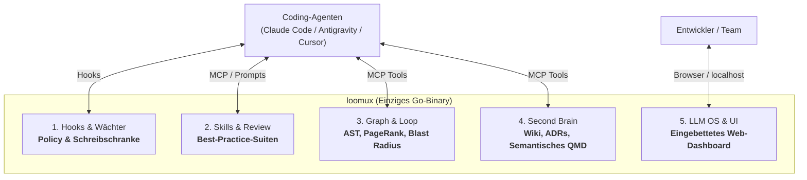
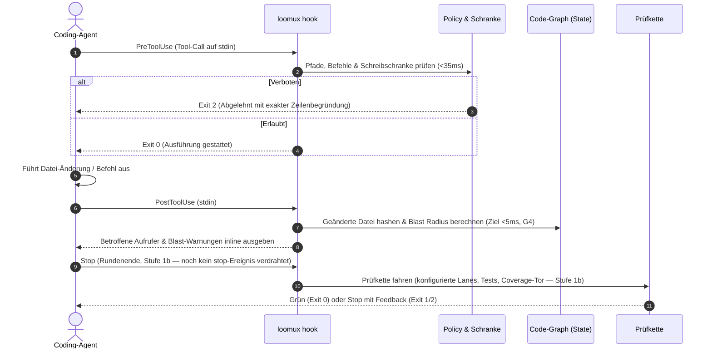
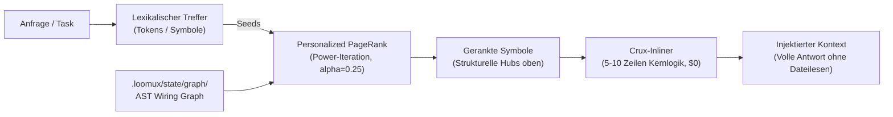
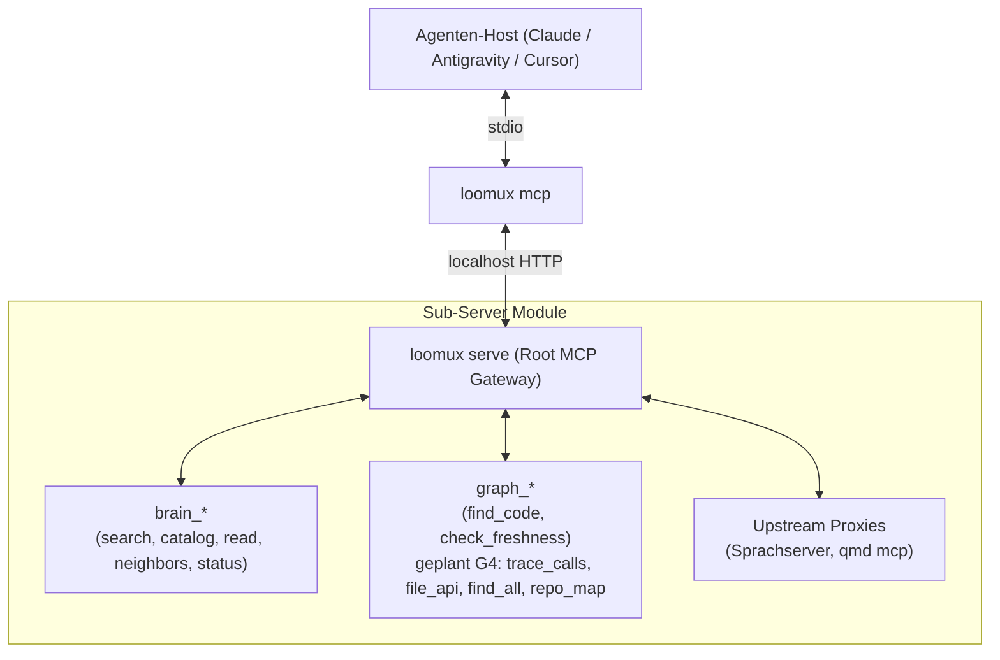

# loomux

🌐 **[English](README.md)** | **[Deutsch](README.de.md)** · 📖 **[Docs (EN)](docs/en/)** | **[Handbuch (DE)](docs/de/)**

**Die vereinte autonome Entwickler-Plattform in einem einzigen Go-Binary: Hooks, Skills, Code-Graph, Second Brain & LLM OS.**

Loomux gibt KI-Coding-Agenten (Claude Code, Antigravity, Cursor, Codex) tiefes Codebase-Verständnis, deterministisches Graph-Retrieval, undurchdringliche Schreibschranken und automatisierte Prüfketten — vollständig autark und ohne externe Laufzeit-Abhängigkeiten.

- **Kein Python. Kein Node.js.** Ein einziges, in sich geschlossenes Go-Binary (`loomux.exe` / `loomux`).
- **Kaltstart unter 35 ms.** Federleichte Ausführung, die sich strikt in die Latenz-Budgets von Agenten-Toolcalls einfügt.
- **100 % Test-Coverage je Funktion.** Kompromisslose Qualität mit Mutationstests und null ungetesteten Codepfaden.
- **Windows-First, POSIX-nativ.** Native Betriebssystem-Primitive (Job Objects, Junctions) mit voller Linux/macOS-Unterstützung.

> **Woher kommt der Name?**  
> **Loomux** verbindet den **Loom** (den Webstuhl, der die Fäden aus Agenten-Loops, Code-Graphen und Team-Wissen zu einem dichten, nahtlosen Gewebe verwebt) mit der Endung **-ux** (inspiriert von der Unix-Philosophie robuster, modularer Betriebssystem-Werkzeuge sowie einer kompromisslosen Developer & Agent Experience).

---

## Die 5 Säulen von Loomux



---

## Kern-Workflows

### 1. Der autonome Wächter- & Prüfkreislauf

Jede Interaktion eines Coding-Agenten wird in Echtzeit überwacht und validiert, ohne den Entwicklungsfluss zu blockieren.



### 2. Deterministisches Code-Graph-Retrieval ("GraphRank")

Agenten erkunden Codebasen oft bei jeder Sitzung mühsam von Neuem und verbrennen dabei Zeit und Token. Loomux baut einmalig einen lokalen, deterministischen AST-Code-Graphen auf und beantwortet Abfragen daraus via **Personalized PageRank**.

> **Stand (Stufe G3).** Stufe G2b hat den Abfragepfad vollendet: `loomux graph ask` sucht Code-Symbole gerankt nach BM25-artigem lexikalischen Matching verschmolzen mit Personalized PageRank (alpha=0.25). Das Retrieval benötigt ~48 ms warm (~38 ms bei Namens-Matching ohne die 1-MB-Rumpfbeiakte auf diesem ~3.000-Knoten-Repo; die Beiakte dient der Skalierung auf 30.000+ Knoten). Quelltext-Spans werden bei Bedarf via `--source` inline eingeblendet. Bei Abweichung wird der Graph automatisch im Hintergrund neu gebaut, sofern `--no-refresh` fehlt; einen ersten Graphen baut keine Abfrage. Stufe G3 stellt dieselbe Abfrage und die Driftprüfung als `graph_find_code` und `graph_check_freshness` über MCP bereit (siehe §3). Graph-Navigation (`callers`, `blast`, `grep`, `skeleton`, `map`) wartet auf Stufe G4.



> **„Lexik schlägt vor, der Graph entscheidet“**: Keywords finden potenzielle Kandidaten; der strukturelle Aufrufgraph konzentriert die Masse auf die tatsächlich relevanten Kernkomponenten und filtert isolierten oder toten Code heraus.

### 3. Verschachteltes MCP-Composite-Gateway

`loomux serve` fungiert als modularer **MCP-Gateway-Router** über Streamable HTTP und stellt saubere Namensräume für Agenten bereit:



**Was heute steht (Stufen 1b-2 und G3):** der Wirt, die Brücke und die Wurzel über zwei
Loopback-Listener — einer je Kanal, jeder mit eigenem Token — und sieben Werkzeuge:
die fünf `brain_*`-Werkzeuge und, seit Stufe G3, `graph_find_code` und
`graph_check_freshness`. Die übrigen vier `graph_*`-Werkzeuge (Stufe G4) und die
Upstream-Proxies sind spezifiziert, nicht gebaut. `loomux mcp` fällt auf `--channel local` zurück,
startet und ersetzt den Dienst selbst, und der Pro-Edit-Hook-Pfad verlinkt
nichts davon, was ein Test über den Importgraphen festhält. Siehe
[`docs/de/cli-reference.md`](docs/de/cli-reference.md) §8.

---

## Funktions- & Status-Matrix

Loomux setzt einen mehrstufigen Fusionsplan um. Eine zweite Spur — der
Code-Graph — läuft **neben** ihm statt hinter ihm, weil keine seiner fertigen
Stufen eine Abhängigkeit einzieht:

| Stufe | Stand | Was sie gebracht hat |
|---|---|---|
| **1a** | ✅ | Der Pilot: Repo-Gerüst, Tore, der vereinte Wächter, die Post-Edit-Lanes. loomux benutzt sich selbst |
| **1b-1** | ✅ | Die lesenden Brain-Befehle — `search`, `status`, `catalog`, `read`, `neighbors` — mit Parität zur Python-Referenz |
| **1b-2** | ✅ | `serve` mit MCP über Streamable HTTP und die stdio-Brücke, durch einen aufgezeichneten Fallkorpus an die Referenz gemessen. Upkeep ist Stufe 3 |
| **1b-3** | ✅ | Wiki und Dokumentation sind umgezogen |
| **2 – 4** | offen | Die vollständige Prüfkette, Brain-Pflege, Konvertierung und Abruf, `loomux migrate`, die Umstellung der Wirte |
| **G1** | ✅ | Rang und Blast-Radius als Bibliotheken, an portierten Testvektoren der Referenz belegt |
| **G2a** | ✅ | Extraktor, Auflösung, Speicher, Frischesonde sowie `graph build` und `graph check` |
| **G2b** | ✅ | Die Abfrage: lexikalische Saat, die Beiakte, `loomux graph ask` |
| **G3** | ✅ | `graph_find_code` und `graph_check_freshness` am Gateway von 1b-2; eine Abfrage baut nie einen ersten Graphen |
| **G4 – G5** | offen | Die übrige `graph`-Palette samt Hook-Anbindung, Mehrsprachigkeit über `wazero` |

Jede Stufe endet grün und wird einzeln übergeben, mit eigenem Plan und — sobald
sie fertig ist — eigener Paritätsakte, die jede ihrer Verfügungen festhält. Die
Matrix darunter sagt, wo die einzelnen Funktionen stehen:

| Säule / Funktion | Beschreibung | Status |
|---|---|---|
| **1. Hooks & Wächter** | | |
| Einheitlicher Pre-Tool Wächter | Prüfung von Schreibschranken, Pfadregeln und verbotenen Befehlen (< 35 ms Zielbudget; 32–34 ms gemessen am Vorgänger; ein Write in einem verknüpften Worktree gemessen 34,6 ms warm (2026-09-16)). Verknüpfte Git-Worktrees eines registrierten Workspace sind ohne eigenen Registry-Eintrag beschreibbar. Registry und Bereichsdeklarationen laufen durch dieselben Prüfungen wie die Brain-Befehle; ein kaputter Eintrag verweigert jeden Write. | ✅ **Implementiert** (Stufe 1a) |
| Post-Tool Prüf-Lanes | Die Lanes auf der eben geänderten Datei laufen nebeneinander, gewählt nach den Stacks, die die Erkennung im Baum findet — `go vet`, der Wiki-Lint im eigenen Prozess, ruff/mypy, eslint/tsc, stylelint und die übrigen. Eine gescheiterte Lane endet mit 2; ausgelassene werden dem Modell namentlich zurückgemeldet. | ✅ **Implementiert** (Stufe 1a) |
| Post-Tool Blast Monitor | Hashing geänderter Dateien und Warnung bei berührten Aufrufern. Den Wiring-Graphen, den es braucht, schreibt jetzt `loomux graph build`, aber der Edit-Hook liest ihn noch nicht: heute kein Hash und keine Warnung. | 📋 **Spezifiziert** (Stufe G4) |
| Sitzungsstart | Hält den Commit fest, auf dem eine Sitzung beginnt, und warnt, wenn das Binary im Projekt älter ist als `go.mod`, `go.sum` oder eine `.go`-Datei unter `cmd/` oder `internal/`. Kündigt nur an; blockiert nie einen Zug. | ✅ **Implementiert** (Stufe 1a) |
| Subagent-Drift & Stop-Tor | Drifterkennung für Subagenten und der Block-Zähler des Stop-Tors. `loomux hook` kennt drei Ereignisse — `pre-tool-use`, `post-tool-use`, `session-start`; kein `stop` und kein `subagent-*` ist verdrahtet. | 🚧 **In Migration** (Stufe 1b) |
| Prüfbefehle | `loomux check commit-msg` (Sprache und Form einer Nachricht), `check gofmt` (Formatierung, mit dem Exit-Code, den `gofmt -l` nicht gibt) und `dev covergate` (100 % je Funktion gegen ein Profil). | ✅ **Implementiert** (Stufe 1a) |
| Prüfketten-Tabelle | Eine konfigurierte Tabelle, die jede Lane fährt. `[check] lanes` wird aus dem Manifest gelesen, und `loomux status` nennt die Werkzeuge, die eine Lane bräuchte — ausgeführt wird die Tabelle von nichts; `config.example.toml` nennt den Abschnitt noch `[verify]`. | 🚧 **In Migration** (Stufe 1b) |
| Worktree-Spiegelung | Isolierte Subagent-Git-Worktrees mit NTFS-Junctions und Sitzungsverfolgung. | ✅ **Implementiert** (Stufe 1a) |
| Zonenfreier Startpfad | Gos lokale Zeitzone bleibt vom Hook-Pfad fern: Der TOML-Parser baut seine lokalen Zonen beim ersten Gebrauch (`third_party/toml`), und ein Test im Tor lässt jedes Paket-Init über 500 Allokationen scheitern. `hook pre-tool-use` 7,5 ms warm gegen 26,5 ms vorher (gemessen 2026-09-17). | ✅ **Implementiert** (ohne Stufe) |
| Claude-Mods-Adapter | Die Schreibschranke in einen `tool.check`-Function-Hook setzen ([claude-code#91870](https://github.com/anthropics/claude-code/issues/91870)), der über `$.mcp.call` mit einem langlebigen loomux spricht — entfernt den Spawn, bringt ein `ask`-Urteil und eine gerenderte Begründung. Nur für Claude Code; der Exec-Hook bleibt der portable Pfad. | 💡 **Optional** (ohne Stufe) |
| **2. Skills & Best Practices** | | |
| Kuratierte Sprach-Suiten | Eingebettete Best-Practice-Regeln für Go (Zero-Alloc, Error-Handling, no-init), Python, TS, Rust. | 📋 **Spezifiziert** (Stufe W4) |
| Graph-gestützter Code-Review | Review-Skills, die via `graph_blast` Aufrufer-Auswirkungen prüfen und ADRs abgleichen. | 📋 **Spezifiziert** (Stufe W4) |
| 3-Kanal-Distribution | Konfiguriert via `.loomux/config.toml`, synchronisiert in Host-Ordner, via MCP-Prompts oder Web OS. | 📋 **Spezifiziert** (Stufe W4) |
| **3. Code-Graph & Loop** | | |
| Nativer Go-AST-Extraktor | Deterministische Symbol- & Kantenextraktion allein via `go/parser` und `go/ast` — kein `go/types`, kein Build ($0, 0 Deps). Hinter `loomux graph build` verdrahtet; braucht auf diesem Repository in der Größenordnung eines Zehntel einer Sekunde, mit Befehl und Rohausgabe gemessen in `docs/de/benchmarks.md`. | ✅ **Implementiert** (Stufe G2a) |
| Personalized PageRank | Power-Iteration Random-Walk-Ranking über Aufruf- und Abhängigkeitsgraphen, ungerichtet über fünf Relationen, max-normiert mit deterministischer Gleichstandsordnung. Verschmolzen mit BM25-Kandidaten-Scoring in `loomux graph ask` (~48 ms warmes Retrieval). | ✅ **Implementiert** (Stufe G2b) |
| Blast-Radius-Engine | Transitive Hülle und Impact-Analyse (`In`/`Out`, Tiefenbegrenzung, kleinste Tiefe gewinnt). Noch fragt kein Befehl etwas. | 🧩 **Bibliothek** (Stufe G1) |
| Symbol-gekoppelter Grep | Regex-Suche, gruppiert nach umschließendem Symbol und gerankt nach Kanten-Grad (`inDegree`). | 📋 **Spezifiziert** (Stufe G4) |
| Multi-Language AST | CGo-freier Tree-sitter über WebAssembly (`wazero`) mit persistentem AOT-Kompilierungs-Cache. | 💡 **Geplant** (Stufe G5) |
| MCP-Dienst & stdio-Brücke | `loomux serve` hält zwei Loopback-Listener, je einen pro Kanal und jeden mit eigenem Token, und beantwortet sieben Werkzeuge über Streamable HTTP — die fünf `brain_*`-Werkzeuge und, seit Stufe G3, `graph_find_code` und `graph_check_freshness`; `loomux serve status` und `stop [--force]` steuern ihn, und `loomux mcp` ist die stdio-Brücke, die ein Wirt startet und die den Dienst selbst startet und ersetzt. `internal/hooks` bindet nichts davon: ein Tor-Test liest den Importgraphen. Die Front ist durch einen aufgezeichneten Fallkorpus an die MCP-Front der Python-Referenz gemessen; verglichen wird der Text jeder `CallToolResult` und `isError`, nicht der Umschlag, den zwei verschiedene SDKs aushandeln. | ✅ **Implementiert** (Stufen 1b-2, G3) |
| **4. Second Brain & Wiki** | | |
| Lokales Markdown-Wiki | Das Bündel selbst liegt in `docs/wiki/` (Bereich `project/loomux`, am 2026-09-16 Seite für Seite umgezogen und zeilenweise freigegeben). `loomux lint <datei>` prüft Links und Frontmatter einer Seite, `loomux wiki-gate` Frische und Struktur des Bündels. Identitätsregister und Themen-Graph schreibt der Reindex der Stufe 3, nicht der Umzug. | 🚧 **In Migration** (Stufe 2) |
| Semantischer QMD-Index | Einbettung lokaler Vektoren und neuronaler Suche mit Caching in `~/.cache/qmd`. | 🚧 **In Migration** (Stufe 3) |
| Brain-Datenbefehle | `loomux brain search`, `catalog`, `read`, `neighbors` und `status` über die eine Registry, an der Python-Referenz durch einen aufgezeichneten Fallkorpus gemessen. Eine Registry oder Bereichsdeklaration, die loomux nicht verwenden kann, verweigert den Aufruf und nennt Datei, Eintrag und Grund. | ✅ **Implementiert** (Stufe 1b-1) |
| Brain-zu-Graph Brücke | Code-Symbole verweisen direkt auf Architekturentscheidungen (ADRs) und Dokumentation. | 📋 **Spezifiziert** (Stufe W3) |
| **5. LLM OS & Web-Interface** | | |
| Eingebettetes Web-OS | Autarke React/Vite-SPA, per `go:embed` ausgeliefert über `loomux serve` auf `http://127.0.0.1` mit `embed_stub.go`-Fallback. | 📋 **Spezifiziert** (Stufe W1) |
| Interaktiver Graph-Visualizer | D3-Force / WebGL Graph mit Kanten-Chips, Typen-Filterung und Blast-Radius-Overlays. | 📋 **Spezifiziert** (Stufe W3) |
| Kanban Board & Loop Tracker | Echtzeit-Tracking von mehrstufigen Agenten-Workflows, Subagenten-Loops und Prüfketten. | 📋 **Spezifiziert** (Stufe W5) |
| Grafischer Flow-Editor | Visueller DAG-Canvas zum Entwerfen, Abspielen und Debuggen von Agenten-Prüfschleifen. | 💡 **Zukunft** (Stufe W5) |

*Legende: ✅ Im Go-Binary implementiert & verifiziert · 🧩 Bibliothek gebaut, noch an keinen Befehl verdrahtet · 🚧 In aktiver Migration / Fusion · 📋 Spezifiziert & Bau-Bereit · 💡 Geplant / Zukunftsvision*

---

## CLI-Referenz

Aktive Befehle nach den Stufen 1a, 1b-1 und 1b-2 im Vergleich zu spezifizierten Befehlen der Folge- und Graph-Stufen:

### Aktive Befehle (Stufen 1a, 1b-1 und 1b-2)
```bash
loomux check commit-msg <datei>     # Prüft Commit-Nachricht auf englische Sprache und Formatregeln
loomux check gofmt [pfade...]       # Prüft Go-Formatierung ohne Dateiänderungen
loomux hook pre-tool-use            # Prüft Policy und globale Schreibschranke gegen stdin
loomux hook post-tool-use           # Fährt die erkannten Prüf-Lanes gegen die eben geänderte Datei
loomux hook session-start           # Hält den Basis-Commit der Sitzung fest und warnt vor veraltetem Binary
loomux status|doctor|explain        # Zeigt Hook-Status, Prüfketten und erkannte Host-Harnesses (drei Namen, ein Codeweg)
loomux worktree link|unlink|remove  # Verwaltet isolierte Arbeitsbaum-Spiegel und Junction-Pfade
loomux dev covergate                # Erzwingt striktes 100 % Coverage-Tor pro Funktion
loomux dev swap-binary              # Tauscht laufendes Binary atomar gegen Neubau aus
loomux lint <datei>                 # Prüft Links und Frontmatter einer Wiki-Seite
loomux wiki-gate                    # Erzwingt Frische und strukturelle Schranken des Wikis
loomux brain search "<anfrage>"     # Durchsucht die sichtbaren Bereiche über den qmd-Daemon (--profile fast|full|keyword)
loomux brain catalog [--scope S]    # Wurzelkatalog der sichtbaren Bereiche oder das index.md eines Bereichs
loomux brain read <pfad> --scope S  # Eine Datei eines Bereichs oder einen Abschnitt daraus (--section)
loomux brain neighbors <pfad> --scope S  # Eingehende und ausgehende Links einer Seite
loomux brain status                 # Was man wissen muss, bevor man einer Antwort traut
loomux serve [--foreground]         # Startet den langlebigen localhost-MCP-Dienst, abgekoppelt oder hier
loomux serve status                 # Was serve.json sagt und ob der Listener antwortet
loomux serve stop [--force]         # Beendet den Dienst über seinen Endpunkt oder über seine PID
loomux mcp [--channel local|cloud]  # stdio-Brücke, die ein MCP-Wirt startet; sie startet den Dienst selbst
```

### Implementierte Befehle (Code-Graph — Stufen G2a–G2b)
```bash
loomux graph build [--root <pfad>]  # Extrahiert, löst auf und schreibt .loomux/state/graph/wiring.json
loomux graph check [--root <pfad>]  # Extrahiert neu und vergleicht mit Graph auf Platte (Exit 1 bei Drift)
loomux graph ask "<anfrage>" [flags] # Sucht Symbole gerankt nach lexikalischem Score und Personalized PageRank; baut nie einen ersten Graphen
```

### Spezifizierte Befehle (Code-Graph — Stufen G4–G5)

Stufe G1 hat die Rank- und Blast-Radius-Bibliotheken gebaut; die Stufen G2a und G2b haben
`build`, `check` und `ask` oben darauf verdrahtet, und Stufe G3 stellt `ask` und `check` über
MCP bereit; die Graph-Navigation (`callers`, `blast`, `grep`, `skeleton`, `map`) wartet auf Stufe G4.
```bash
loomux graph callers <symbol>       # Zeigt Aufrufer, Aufgerufene (--direction out) oder transitive Hülle (-d all)
loomux graph blast [dir]            # Berechnet den Blast-Radius eines Git-Diffs gegen Working Tree oder Merge-Base
loomux graph grep "<regex>"         # Regex-Suche gruppiert nach Symbol und sortiert nach Kopplung
loomux graph skeleton <datei>       # Gibt Signaturen und Zeilenspans einer Datei aus (~10x Token-Ersparnis)
loomux graph map                    # Gibt token-budgetierte Verzeichnis-Cluster, Hubs und Hotspots aus
loomux graph viz                    # Öffnet den interaktiven Graph-Viewer im Browser
```

### Spezifizierte Befehle (Second Brain & Dienste — Stufen 2–3 & W1–W5)
```bash
loomux brain reconcile             # Synchronisiert Zustandsänderungen, Identitäten und QMD-Sammlungen
loomux serve                        # Das eingebettete Web OS neben den MCP-Listenern
loomux init                         # Richtet Hooks, Einstellungen und Skills in erkannten Agenten ein
```

### Entwickler- & Worktree-Werkzeuge
```bash
loomux dev covergate --profile <p>  # Prüft das strikte 100-%-Coverage-Tor pro Funktion
loomux dev bench-hooks <fall>       # Misst die Latenz der Hook-Ausführung gegen die Grundlinie von < 35 ms
loomux dev bench [--dir <dir>] [--save] # Benchmark für Einzel-Repo oder Open-Source-Matrix-Korpus mit Lücken-Audit; --save sichert in docs/
loomux dev mutants <paket>          # Führt Mutationstests über kritische Entscheidungspakete aus
loomux dev record-case --out <dir>  # Zeichnet einen Lauf eines Referenz-Binaries als Fall auf
loomux dev import-cases --map <f>   # Übersetzt ein Verzeichnis aufgezeichneter Fälle in loomux-Fälle
```

---

## Architekturentscheidungen: Was wir bauen, ablösen und weglassen

| Komponente / Idee | Herkunft / Inspiration | Entscheidung in Loomux | Begründung |
|---|---|---|---|
| **Einziges Go-Binary** | Grundarchitektur | ✅ **Kernmandat** | 0 Python, 0 Node.js. 7,5 ms warmer Hook, autarke Auslieferung, 100 % Testabdeckung. |
| **AST-Code-Graph & PageRank** | `trailhq/Graft` | ✅ **Nativ übernommen** | $0 deterministischer Code-Graph. Personalized PageRank filtert strukturelle Kern-Hubs statt naiver Keyword-Listen. |
| **Blast Radius & Crux-Inlining** | `trailhq/Graft` | ✅ **Nativ übernommen** | Auswirkungsanalyse bei Edits (Ziel < 5 ms); liefert 5-10 Zeilen Kernlogik oder Spans ($0 Token-Lesekosten, ~48 ms warmes Retrieval). |
| **Symbol-gekoppelter Grep** | `trailhq/Graft` | ✅ **Nativ übernommen** | Regex-Treffer gruppiert nach umschließendem Symbol und gerankt nach Kanten-Kopplung (`inDegree`). |
| **Lokales Second Brain & Wiki** | Grundarchitektur | ✅ **Kernmandat** | Markdown-Wiki, ADRs und Identitätsregister direkt im Repo. Code-Symbole verlinken direkt auf Architektur-Entscheidungen. |
| **Node.js & C++ Toolchain** | `trailhq/Graft` | ❌ **Abgelehnt** | Graft setzt Node.js >=20, `node-gyp` und MSVC voraus. Loomux bleibt 100 % Pure Go ohne C-Compiler-Zwang. |
| **Cloud-Brain-Synchronisation** | `trailhq/Graft` | ❌ **Abgelehnt** | Graft synchronisiert Symbol-Hashes mit Cloud-APIs. Loomux hält alles Wissen, alle Regeln und Graphen 100 % lokal und offline. |
| **Telemetrie & Tracking** | `trailhq/Graft` | ❌ **Abgelehnt** | Graft sendet Nutzungsstatistiken an externe Server. Loomux hat null Telemetrie und telefoniert niemals nach Hause. |

---

## Architektur-Prinzipien

1. **Deterministisch als Standard**: Code-Graph, Blast-Radius und Schreibschranken laufen lokal, deterministisch und kosten $0.
2. **Startzeit-Disziplin**: `loomux` misst seinen Startboden (5,5 ms warm, 2026-09-17) kontinuierlich. Keine Paketvariable und kein `init()` darf eingebettete Daten parsen oder I/O durchführen.
3. **Strikte Isolierung**: Hook-Pfade laufen im Prozess und hängen niemals von einem laufenden `serve`-Daemon ab.
4. **Agentensichere Konfiguration**: `.loomux/config.toml` deklariert Schutzbereiche und Policies; sie wird vom Menschen gepflegt und ist für Agenten schreibgeschützt. Maschinenzustand liegt in `.loomux/state/` (git-ignoriert).

---

## Dokumentations-Suite

Vollständige Handbücher und technische Leitfäden sind unter [`docs/de/`](docs/de/) gegliedert:

| Handbuch | Beschreibung |
|---|---|
| 🚀 **[Erste Schritte](docs/de/getting-started.md)** | Installation, 3-Minuten-Schnellstart und Anbindung an Agenten-Harnesses (Claude Code, Antigravity, Cursor). |
| 🏛️ **[Architektur & Konzepte](docs/de/architecture.md)** | Das theoretische Fundament: Andrej Karpathys LLM OS, Googles Knowledge Items (KI), Grafts AST-GraphRank und der Schreibschranken-Kernel. |
| ⚙️ **[Konfigurations-Referenz](docs/de/configuration.md)** | Vollständige Referenz für `.loomux/config.toml` (`[verify]`, `[policy]`, `[worktree]`, `[graph]`, `[skills]`, `[privacy]`). |
| 📖 **[CLI-Referenzhandbuch](docs/de/cli-reference.md)** | Detailliertes Handbuch aller Befehle, Flags, stdin-JSON-Nutzlasten und Exit-Codes. |
| 🪝 **[Hook-Lebenszyklus & Integration](docs/de/hooks.md)** | Technische Spezifikation des 4-Phasen-Hook-Zyklus, der Host-Formate und des entkoppelten SSE-Ereignisstroms. |
| ⏱️ **[Leistungs-Benchmarks](docs/de/benchmarks.md)** | Chronologische Messungen gegenüber den Vorläufer-Programmen und verbindliche Latenzbudgets. |
| 📊 **[Benchmark-Matrix](docs/de/benchmarks/matrix.md)** | Open-Source-Matrix über Top-Sprachen hinweg mit Detailberichten pro Sprache und Repository. |

---

## Spezifikationen & Interne Arbeitspapiere

Detailentwürfe und interne Arbeitspapiere liegen unter `docs/.superpowers/specs/`:
- [Fusions-Design: Ultraloom & Ultra-Brain](docs/.superpowers/specs/2026-09-14-loomux-fusion-design.md)
- [Code-Graph Subsystem-Spezifikation](docs/.superpowers/specs/2026-09-14-loomux-code-graph-design.md)
- [Web OS & Skill-System-Spezifikation](docs/.superpowers/specs/2026-09-14-loomux-web-os-design.md)

---

## Releases

Binaries gibt es auf der [Releases-Seite](https://github.com/xidus90/loomux/releases):
`loomux_<version>_<os>_<arch>` für `windows/amd64` (`.exe`), `linux/amd64`,
`linux/arm64`, `darwin/amd64` und `darwin/arm64`. Geprüft wird gegen
`SHA256SUMS` aus demselben Release:

```sh
sha256sum --check --ignore-missing SHA256SUMS
```

Jeder gemergte Pull Request nach `master` wird nach seinem Label veröffentlicht:

| Label | Bedeutung | Version |
|---|---|---|
| `release:major` | Inkompatible Änderung an Befehl, Flag, Hook-Protokoll, Konfigurationsformat oder Exit-Code | `X+1.0.0` |
| `release:minor` | Neue Funktion, kompatibel | `X.Y+1.0` |
| `release:patch` | Fehlerbehebung oder Abhängigkeits-Update, kompatibel | `X.Y.Z+1` |
| `release:none` | Nur Doku, CI oder Tests | kein Release |

Jedes Release ist ein Beta-Pre-Release, bis `RELEASE_CHANNEL` auf `stable`
steht. Was sich geändert hat, steht in [`CHANGELOG.md`](CHANGELOG.md).

### Einen Pull Request öffnen

Auf `master` wird nie direkt committet; jede Änderung läuft über einen Pull
Request. Die Hooks in `.githooks` lehnen einen Commit auf `master` und einen
Push dorthin ab, sobald `git config core.hooksPath .githooks` gesetzt ist. Mit
einem LLM erledigt der Skill `release-pr` die Schritte unten; von Hand:

1. Commits thematisch gruppieren, ein Commit pro Änderung. Eine spätere
   Korrektur an etwas, das dieser Branch eingeführt hat, gehört in den
   Commit, der es eingeführt hat; nur die Behebung eines Fehlers, der schon
   auf `master` war, behält einen eigenen Commit. Einen bereits gepushten
   Branch neu zu schreiben braucht `git push --force-with-lease`. Jede
   Nachricht ist ein Conventional Commit (`feat: …`, `fix: …`, `docs: …`;
   `!` für eine inkompatible Änderung). Der Hook `commit-msg` prüft das
   lokal, und der Check `pr-label` lehnt einen Pull Request ab, sobald ein
   Commit-Titel die Form verletzt.
2. Ein Label aus der Tabelle oben wählen; zwischen zwei Stufen die höhere.
   Es liegt nie unter den Commits: `!` verlangt major, `feat` minor, `fix`
   patch.
3. Den Rumpf schreiben:
   ```
   Release: <level> — <one-sentence reason>

   ## Summary
   - <what changes for a user>

   ## Changelog
   ### Added
   - <entry>
   ```
   Changelog-Überschriften sind nur `Added`, `Changed`, `Deprecated`,
   `Removed`, `Fixed`, `Security`; bei `release:none` entfällt der Abschnitt.
4. Prüfen: `go run ./cmd/loomux dev release parse-body --labels release:<level> --body <file>`.
5. Branch pushen, dann `gh pr create --base master --label release:<level> --body-file <file>`.

### Releases einrichten (Maintainer)

1. Labels:
   ```sh
   gh label create release:major --color B60205 --description "Breaking change"
   gh label create release:minor --color 0E8A16 --description "New feature, compatible"
   gh label create release:patch --color 1D76DB --description "Bug fix or dependency update"
   gh label create release:none --color CCCCCC --description "No release"
   ```
2. Kanal: `gh variable set RELEASE_CHANNEL --body beta`
3. GitHub App (Settings → Developer settings → GitHub Apps → New): Name
   `loomux-release`, Webhook aus, Repository-Rechte `Contents: Read and
   write`, `Pull requests: Read-only`, `Metadata: Read-only`, „Only on this
   account“. Private Key erzeugen, App nur in `xidus90/loomux` installieren,
   dann:
   ```sh
   gh secret set RELEASE_APP_CLIENT_ID --body <client-id>
   gh secret set RELEASE_APP_PRIVATE_KEY < loomux-release.private-key.pem
   ```
4. Rulesets (erst wenn das Repository öffentlich ist): eines für `master`
   und eines für Tags `v*`, jeweils mit der App `loomux-release` als einzigem
   Bypass-Akteur. Das Ruleset für `master` verlangt außerdem die
   Statuschecks `gate-windows` und `build-linux` (Workflow `ci`) sowie
   `check` (Workflow `pr-label`).

Ist ein Release ausgefallen, den Workflow `release` von Hand starten
(`gh workflow run release.yml -f pr=<nummer>`). Er verweigert einen Pull
Request, der nicht nach `master` gemergt ist, und ein erneuter Lauf nach dem
`chore(release): v*`-Commit verwendet diesen Commit wieder. Gibt es für den Pull
Request schon einen Tag oder ein Release, nicht erneut starten, sondern das
vorhandene Release von Hand reparieren.

---

## Lizenz

PolyForm Noncommercial License 1.0 (`LICENSE.md`).
