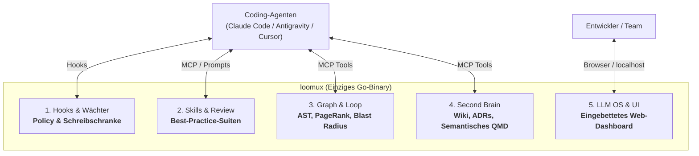
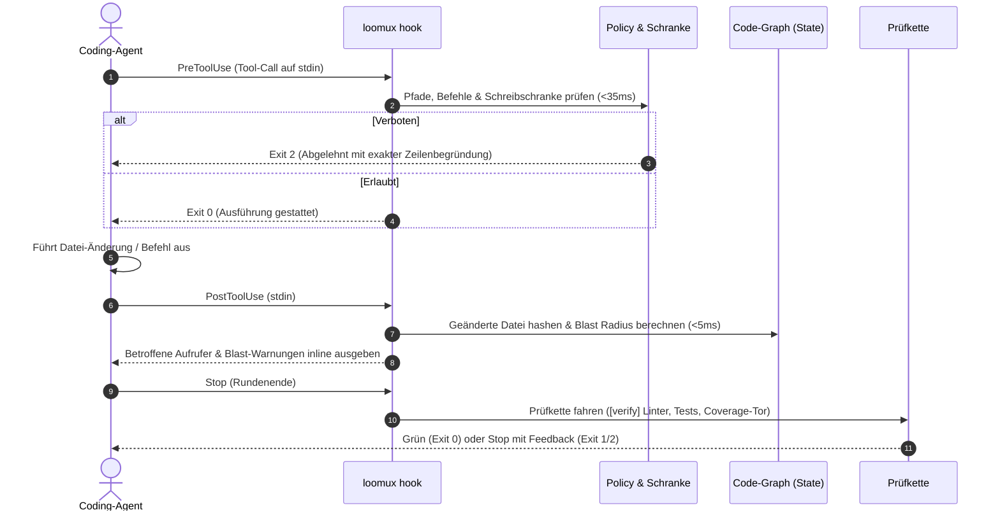
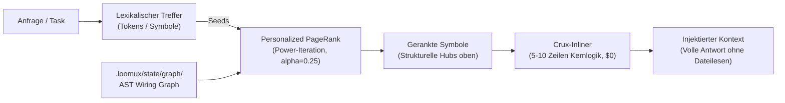
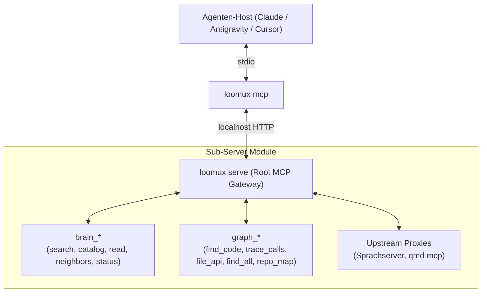

# loomux

🌐 **[English](README.md)** | **[Deutsch](README.de.md)** · 📖 **[Docs (EN)](docs/en/)** | **[Handbuch (DE)](docs/de/)**

**Die vereinte autonome Entwickler-Plattform in einem einzigen Go-Binary: Hooks, Skills, Code-Graph, Second Brain & LLM OS.**

Loomux gibt KI-Coding-Agenten (Claude Code, Antigravity, Cursor, Codex) tiefes Codebase-Verständnis, Sub-Millisekunden-Graph-Retrieval, undurchdringliche Schreibschranken und automatisierte Prüfketten — vollständig autark und ohne externe Laufzeit-Abhängigkeiten.

- **Kein Python. Kein Node.js.** Ein einziges, in sich geschlossenes Go-Binary (`loomux.exe` / `loomux`).
- **Kaltstart unter 35 ms.** Federleichte Ausführung, die sich strikt in die Latenz-Budgets von Agenten-Toolcalls einfügt.
- **100 % Test-Coverage je Funktion.** Kompromisslose Qualität mit Mutationstests und null ungetesteten Codepfaden.
- **Windows-First, POSIX-nativ.** Native Betriebssystem-Primitive (Job Objects, Junctions) mit voller Linux/macOS-Unterstützung.

> **Woher kommt der Name?**  
> **Loomux** verbindet den **Loom** (den Webstuhl, der die Fäden aus Agenten-Loops, Code-Graphen und Team-Wissen zu einem dichten, nahtlosen Gewebe verwebt) mit der Endung **-ux** (inspiriert von der Unix-Philosophie robuster, modularer Betriebssystem-Werkzeuge sowie einer kompromisslosen Developer & Agent Experience).

---

## Die 5 Säulen von Loomux



---

## Kern-Workflows

### 1. Der autonome Wächter- & Prüfkreislauf

Jede Interaktion eines Coding-Agenten wird in Echtzeit überwacht und validiert, ohne den Entwicklungsfluss zu blockieren.



### 2. Deterministisches Code-Graph-Retrieval ("GraphRank")

Agenten erkunden Codebasen oft bei jeder Sitzung mühsam von Neuem und verbrennen dabei Zeit und Token. Loomux baut einmalig einen lokalen, deterministischen AST-Code-Graphen auf und beantwortet Abfragen in unter 1 Millisekunde via **Personalized PageRank**.



> **„Lexik schlägt vor, der Graph entscheidet“**: Keywords finden potenzielle Kandidaten; der strukturelle Aufrufgraph konzentriert die Masse auf die tatsächlich relevanten Kernkomponenten und filtert isolierten oder toten Code heraus.

### 3. Verschachteltes MCP-Composite-Gateway

`loomux serve` fungiert als modularer **MCP-Gateway-Router** über Streamable HTTP und stellt saubere Namensräume für Agenten bereit:



---

## Funktions- & Status-Matrix

Loomux setzt derzeit seinen mehrstufigen Fusionsplan um (Stufe-1a-Pilot und Datenbefehle der Stufe 1b-1 abgeschlossen; Folgestufen in aktiver Entwicklung):

| Säule / Funktion | Beschreibung | Status |
|---|---|---|
| **1. Hooks & Wächter** | | |
| Einheitlicher Pre-Tool Wächter | Prüfung von Schreibschranken, Pfadregeln und verbotenen Befehlen (< 35 ms Zielbudget; 32–34 ms gemessen am Vorgänger; ein Write in einem verknüpften Worktree gemessen 34,6 ms warm (2026-09-16)). Verknüpfte Git-Worktrees eines registrierten Workspace sind ohne eigenen Registry-Eintrag beschreibbar. | ✅ **Implementiert** (Stufe 1a) |
| Post-Tool Blast Monitor | Blitzschnelles Hashing geänderter Dateien und Warnung bei berührten Aufrufern. | 🚧 **In Migration** (Stufe 1b) |
| Sitzungs- & Drift-Überwachung | `session-start`-Frischeprüfung, Subagent-Drifterkennung und Block-Zähler im Stop-Tor. | 🚧 **In Migration** (Stufe 1b) |
| Prüfkette (`[verify]`) | Konfigurierbare Prüftabelle: Parallele Test-Lanes, commit-msg-Kalibrierung, Coverage-Tor. | ✅ **Implementiert** (Stufe 1a) |
| Worktree-Spiegelung | Isolierte Subagent-Git-Worktrees mit NTFS-Junctions und Sitzungsverfolgung. | ✅ **Implementiert** (Stufe 1a) |
| Zonenfreier Startpfad | Gos lokale Zeitzone vom Hook-Pfad fernhalten: `time.Now().Zone()` allein kostet unter Windows 18,7 ms der ~28 ms des Wächters (gemessen 2026-09-15). | 💡 **Optional** (ohne Stufe) |
| Claude-Mods-Adapter | Die Schreibschranke in einen `tool.check`-Function-Hook setzen ([claude-code#91870](https://github.com/anthropics/claude-code/issues/91870)), der über `$.mcp.call` mit einem langlebigen loomux spricht — entfernt den Spawn, bringt ein `ask`-Urteil und eine gerenderte Begründung. Nur für Claude Code; der Exec-Hook bleibt der portable Pfad. | 💡 **Optional** (ohne Stufe) |
| **2. Skills & Best Practices** | | |
| Kuratierte Sprach-Suiten | Eingebettete Best-Practice-Regeln für Go (Zero-Alloc, Error-Handling, no-init), Python, TS, Rust. | 📋 **Spezifiziert** (Stufe W4) |
| Graph-gestützter Code-Review | Review-Skills, die via `graph_blast` Aufrufer-Auswirkungen prüfen und ADRs abgleichen. | 📋 **Spezifiziert** (Stufe W4) |
| 3-Kanal-Distribution | Konfiguriert via `.loomux/config.toml`, synchronisiert in Host-Ordner, via MCP-Prompts oder Web OS. | 📋 **Spezifiziert** (Stufe W4) |
| **3. Code-Graph & Loop** | | |
| Nativer Go-AST-Extraktor | Deterministische Symbol- & Kantenextraktion via `go/parser` und `go/types` ($0, 0 Deps). | 📋 **Spezifiziert** (Stufe G1) |
| Personalized PageRank | Power-Iteration Random-Walk-Ranking über Aufruf- und Abhängigkeitsgraphen in < 1 ms. | 📋 **Spezifiziert** (Stufe G2) |
| Blast-Radius-Engine | Transitive Hülle und Impact-Analyse (`DirectionIn`/`DirectionOut`, Tiefenbegrenzung). | 📋 **Spezifiziert** (Stufe G3) |
| Symbol-gekoppelter Grep | Regex-Suche, gruppiert nach umschließendem Symbol und gerankt nach Kanten-Grad (`inDegree`). | 📋 **Spezifiziert** (Stufe G4) |
| Multi-Language AST | CGo-freier Tree-sitter über WebAssembly (`wazero`) mit persistentem AOT-Kompilierungs-Cache. | 💡 **Geplant** (Stufe G5) |
| **4. Second Brain & Wiki** | | |
| Lokales Markdown-Wiki | Bidirektionale Markdown-Wissensbasis mit Identitätsregistern und Themen-Graphen. | 🚧 **In Migration** (Stufe 2) |
| Semantischer QMD-Index | Einbettung lokaler Vektoren und neuronaler Suche mit Caching in `~/.cache/qmd`. | 🚧 **In Migration** (Stufe 3) |
| Brain-Datenbefehle | `loomux brain search`, `catalog`, `read`, `neighbors` und `status` über die eine Registry, an der Python-Referenz durch einen aufgezeichneten Fallkorpus gemessen. | ✅ **Implementiert** (Stufe 1b-1) |
| Brain-zu-Graph Brücke | Code-Symbole verweisen direkt auf Architekturentscheidungen (ADRs) und Dokumentation. | 📋 **Spezifiziert** (Stufe W3) |
| **5. LLM OS & Web-Interface** | | |
| Eingebettetes Web-OS | Autarke React/Vite-SPA, per `go:embed` ausgeliefert über `loomux serve` auf `http://127.0.0.1` mit `embed_stub.go`-Fallback. | 📋 **Spezifiziert** (Stufe W1) |
| Interaktiver Graph-Visualizer | D3-Force / WebGL Graph mit Kanten-Chips, Typen-Filterung und Blast-Radius-Overlays. | 📋 **Spezifiziert** (Stufe W3) |
| Kanban Board & Loop Tracker | Echtzeit-Tracking von mehrstufigen Agenten-Workflows, Subagenten-Loops und Prüfketten. | 📋 **Spezifiziert** (Stufe W5) |
| Grafischer Flow-Editor | Visueller DAG-Canvas zum Entwerfen, Abspielen und Debuggen von Agenten-Prüfschleifen. | 💡 **Zukunft** (Stufe W5) |

*Legende: ✅ Im Go-Binary implementiert & verifiziert · 🚧 In aktiver Migration / Fusion · 📋 Spezifiziert & Bau-Bereit · 💡 Geplant / Zukunftsvision*

---

## CLI-Referenz

Aktive Befehle nach den Stufen 1a und 1b-1 im Vergleich zu spezifizierten Befehlen der Folge- und Graph-Stufen:

### Aktive Befehle (Stufen 1a und 1b-1)
```bash
loomux check commit-msg <datei>     # Prüft Commit-Nachricht auf englische Sprache und Formatregeln
loomux check gofmt [pfade...]       # Prüft Go-Formatierung ohne Dateiänderungen
loomux hook pre-tool-use            # Prüft Policy und globale Schreibschranke gegen stdin
loomux hook post-tool-use           # Protokolliert Werkzeug-Ende im Journal und triggert Hooks
loomux hook session-start           # Kündigt Sitzungsstart an und synchronisiert Host-Umgebung
loomux status                       # Zeigt Hook-Status, Prüfketten und erkannte Host-Harnesses
loomux worktree link|unlink|remove  # Verwaltet isolierte Arbeitsbaum-Spiegel und Junction-Pfade
loomux dev covergate                # Erzwingt striktes 100 % Coverage-Tor pro Funktion
loomux dev swap                     # Tauscht laufendes Binary atomar gegen Neubau aus
loomux lint                         # Prüft Markdown-Wiki-Links und Frontmatter
loomux wiki-gate                    # Erzwingt Frische und strukturelle Schranken des Wikis
loomux brain search "<anfrage>"     # Durchsucht die sichtbaren Bereiche über den qmd-Daemon (--profile fast|full|keyword)
loomux brain catalog [--scope S]    # Wurzelkatalog der sichtbaren Bereiche oder das index.md eines Bereichs
loomux brain read <pfad> --scope S  # Eine Datei eines Bereichs oder einen Abschnitt daraus (--section)
loomux brain neighbors <pfad> --scope S  # Eingehende und ausgehende Links einer Seite
loomux brain status                 # Was man wissen muss, bevor man einer Antwort traut
```

### Spezifizierte Befehle (Code-Graph — Stufen G1–G5)
```bash
loomux graph build [dir]            # Baut/aktualisiert .loomux/state/graph/wiring.json
loomux graph ask "<anfrage>"        # Sucht Symbole gerankt nach Personalized PageRank
loomux graph callers <symbol>       # Zeigt Aufrufer, Aufgerufene (--direction out) oder transitive Hülle (-d all)
loomux graph blast [dir]            # Berechnet den Blast-Radius eines Git-Diffs gegen Working Tree oder Merge-Base
loomux graph grep "<regex>"         # Regex-Suche gruppiert nach Symbol und sortiert nach Kopplung
loomux graph skeleton <datei>       # Gibt Signaturen und Zeilenspans einer Datei aus (~10x Token-Ersparnis)
loomux graph map                    # Gibt token-budgetierte Verzeichnis-Cluster, Hubs und Hotspots aus
loomux graph check                  # Prüft Frische des Graphen gegenüber dem Arbeitsbaum (Exit 1 bei Drift)
loomux graph viz                    # Öffnet den interaktiven Graph-Viewer im Browser
```

### Spezifizierte Befehle (Second Brain & Dienste — Stufen 2–3 & W1–W5)
```bash
loomux brain reconcile             # Synchronisiert Zustandsänderungen, Identitäten und QMD-Sammlungen
loomux serve                        # Startet den langlebigen localhost HTTP MCP-Dienst und das Web OS
loomux mcp                          # stdio-Brücke für Claude Code, Cursor und Antigravity
loomux init                         # Richtet Hooks, Einstellungen und Skills in erkannten Agenten ein
```

### Entwickler- & Worktree-Werkzeuge
```bash
loomux worktree mirror              # Synchronisiert NTFS-Junctions und Spiegel für Agenten-Worktrees
loomux dev covergate --profile <p>  # Prüft das strikte 100-%-Coverage-Tor pro Funktion
loomux dev bench-hooks              # Misst die Latenz der Hook-Ausführung gegen die Grundlinie von < 35 ms
loomux dev mutants <paket>          # Führt Mutationstests über kritische Entscheidungspakete aus
```

---

## Architekturentscheidungen: Was wir bauen, ablösen und weglassen

| Komponente / Idee | Herkunft / Inspiration | Entscheidung in Loomux | Begründung |
|---|---|---|---|
| **Einziges Go-Binary** | Grundarchitektur | ✅ **Kernmandat** | 0 Python, 0 Node.js. ~32 ms Kaltstart, autarke Auslieferung, 100 % Testabdeckung. |
| **AST-Code-Graph & PageRank** | `trailhq/Graft` | ✅ **Nativ übernommen** | $0 deterministischer Code-Graph. Personalized PageRank filtert strukturelle Kern-Hubs statt naiver Keyword-Listen. |
| **Blast Radius & Crux-Inlining** | `trailhq/Graft` | ✅ **Nativ übernommen** | Blitzschnelle Auswirkungsanalyse bei Edits (<5 ms); liefert 5–10 Zeilen Kernlogik statt ganzer Dateidumps. |
| **Symbol-gekoppelter Grep** | `trailhq/Graft` | ✅ **Nativ übernommen** | Regex-Treffer gruppiert nach umschließendem Symbol und gerankt nach Kanten-Kopplung (`inDegree`). |
| **Lokales Second Brain & Wiki** | Grundarchitektur | ✅ **Kernmandat** | Markdown-Wiki, ADRs und Identitätsregister direkt im Repo. Code-Symbole verlinken direkt auf Architektur-Entscheidungen. |
| **Node.js & C++ Toolchain** | `trailhq/Graft` | ❌ **Abgelehnt** | Graft setzt Node.js >=20, `node-gyp` und MSVC voraus. Loomux bleibt 100 % Pure Go ohne C-Compiler-Zwang. |
| **Cloud-Brain-Synchronisation** | `trailhq/Graft` | ❌ **Abgelehnt** | Graft synchronisiert Symbol-Hashes mit Cloud-APIs. Loomux hält alles Wissen, alle Regeln und Graphen 100 % lokal und offline. |
| **Telemetrie & Tracking** | `trailhq/Graft` | ❌ **Abgelehnt** | Graft sendet Nutzungsstatistiken an externe Server. Loomux hat null Telemetrie und telefoniert niemals nach Hause. |

---

## Architektur-Prinzipien

1. **Deterministisch als Standard**: Code-Graph, Blast-Radius und Schreibschranken laufen lokal, deterministisch und kosten $0.
2. **Startzeit-Disziplin**: `loomux` misst seinen Kaltstart (~32 ms) kontinuierlich. Keine Paketvariable und kein `init()` darf eingebettete Daten parsen oder I/O durchführen.
3. **Strikte Isolierung**: Hook-Pfade laufen im Prozess und hängen niemals von einem laufenden `serve`-Daemon ab.
4. **Agentensichere Konfiguration**: `.loomux/config.toml` deklariert Schutzbereiche und Policies; sie wird vom Menschen gepflegt und ist für Agenten schreibgeschützt. Maschinenzustand liegt in `.loomux/state/` (git-ignoriert).

---

## Dokumentations-Suite

Vollständige Handbücher und technische Leitfäden sind unter [`docs/de/`](docs/de/) gegliedert:

| Handbuch | Beschreibung |
|---|---|
| 🚀 **[Erste Schritte](docs/de/getting-started.md)** | Installation, 3-Minuten-Schnellstart und Anbindung an Agenten-Harnesses (Claude Code, Antigravity, Cursor). |
| 🏛️ **[Architektur & Konzepte](docs/de/architecture.md)** | Das theoretische Fundament: Andrej Karpathys LLM OS, Googles Knowledge Items (KI), Grafts AST-GraphRank und der Schreibschranken-Kernel. |
| ⚙️ **[Konfigurations-Referenz](docs/de/configuration.md)** | Vollständige Referenz für `.loomux/config.toml` (`[verify]`, `[policy]`, `[worktree]`, `[graph]`, `[skills]`, `[privacy]`). |
| 📖 **[CLI-Referenzhandbuch](docs/de/cli-reference.md)** | Detailliertes Handbuch aller Befehle, Flags, stdin-JSON-Nutzlasten und Exit-Codes. |
| 🪝 **[Hook-Lebenszyklus & Integration](docs/de/hooks.md)** | Technische Spezifikation des 4-Phasen-Hook-Zyklus, der Host-Formate und des entkoppelten SSE-Ereignisstroms. |
| ⏱️ **[Leistungs-Benchmarks](docs/de/benchmarks.md)** | Chronologische Messungen gegenüber den Vorläufer-Programmen und verbindliche Latenzbudgets. |

---

## Spezifikationen & Interne Arbeitspapiere

Detailentwürfe und interne Arbeitspapiere liegen unter `docs/.superpowers/specs/`:
- [Fusions-Design: Ultraloom & Ultra-Brain](docs/.superpowers/specs/2026-09-14-loomux-fusion-design.md)
- [Code-Graph Subsystem-Spezifikation](docs/.superpowers/specs/2026-09-14-loomux-code-graph-design.md)
- [Web OS & Skill-System-Spezifikation](docs/.superpowers/specs/2026-09-14-loomux-web-os-design.md)

---

## Lizenz

PolyForm Noncommercial License 1.0 (`LICENSE.md`).
