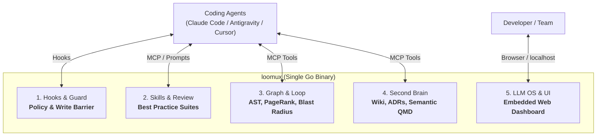
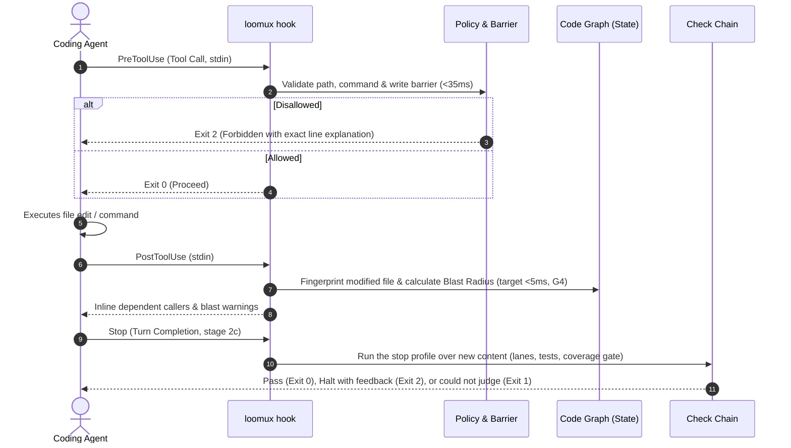
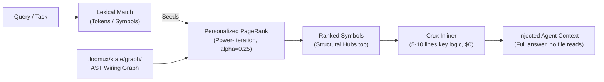
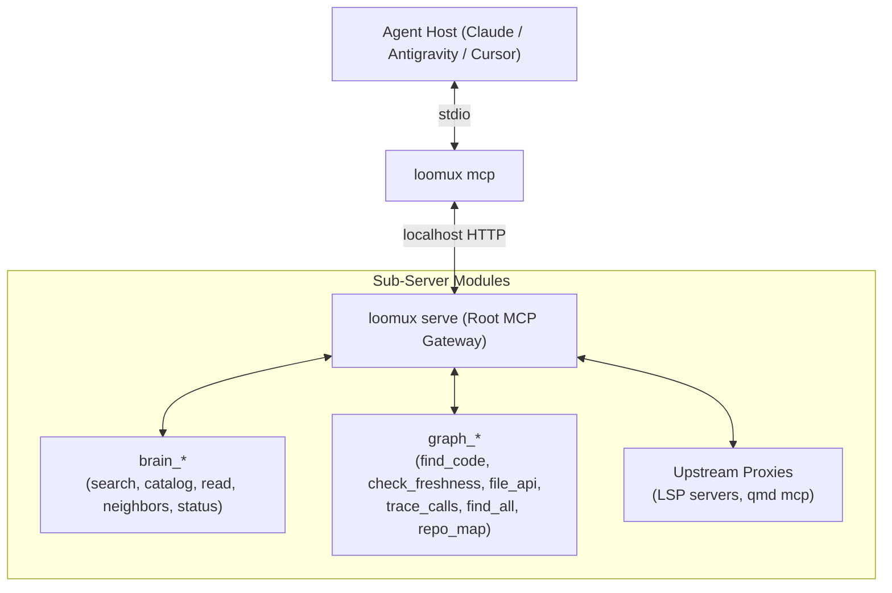

# loomux

🌐 **[English](README.md)** | **[Deutsch](README.de.md)** · 📖 **[Docs (EN)](docs/en/)** | **[Handbuch (DE)](docs/de/)**

**The unified autonomous developer runtime in a single Go binary: Hooks, Skills, Code Graph, Second Brain & LLM OS.**

Loomux gives AI coding agents (Claude Code, Antigravity, Cursor, Codex) deep codebase understanding, deterministic graph retrieval, impenetrable write barriers, and automated verification loops — with zero external runtime dependencies.

- **Zero Python. Zero Node.js.** A single, self-contained Go binary (`loomux.exe` / `loomux`).
- **Sub-35ms cold start.** Lightweight execution that fits strictly within agent tool-call budgets.
- **100% test coverage per function.** Rigorous quality with mutation testing and zero unchecked code paths.
- **Windows-first, POSIX-native.** Native OS primitives (Job Objects, Junctions) with full Linux/macOS support.

> **What’s in a name?**  
> **Loomux** brings together the **Loom** (the loom that weaves together agent loops, execution threads, code graphs, and team knowledge into a single coherent fabric) and **-ux** (inspired by the Unix philosophy of small, robust, composable OS tooling and a frictionless Developer/Agent Experience).

---

## The 5 Pillars of Loomux



---

## Core Workflows

### 1. The Autonomous Guard & Verification Loop

Every agent interaction is guarded and monitored in real time without blocking developer momentum.



### 2. Deterministic Code Graph Retrieval ("GraphRank")

Most coding agents re-explore codebases from scratch every session, burning tokens and tool calls. Loomux builds a local, deterministic AST code graph once and answers queries from it using **Personalized PageRank**.

> **State (stage G4a).** Stage G2b completed the query path: `loomux graph ask` retrieves code symbols ranked by BM25-style lexical relevance blended with Personalized PageRank (alpha=0.25). Retrieval takes ~48 ms warm (~38 ms when matching names without the 1MB body sidecar on this ~3,000-node repo; the sidecar exists to scale to 30,000+ nodes). Inlined code spans are provided via `--source`. Automatic background graph rebuild triggers on drift unless `--no-refresh` is passed; a query never builds a first graph. Stage G3 serves the query and the drift check over MCP as `graph_find_code` and `graph_check_freshness` (see §3). Stage G4a delivers the full code graph navigation palette (`callers`, `skeleton`, `grep`, `map`, `stats`) and their four MCP tools (`graph_file_api`, `graph_trace_calls`, `graph_find_all`, `graph_repo_map`). Stage G4b adds git-diff blast radius analysis and the post-edit blast monitor hook.



> **"Lexical proposes, graph disposes"**: Keywords find candidate symbols; the structural call graph concentrates mass on the components that actually matter, filtering out dead or isolated hits.

### 3. Nested MCP Composite Gateway

`loomux serve` acts as a modular **MCP Gateway Router** over Streamable HTTP, exposing cleanly namespaced capabilities to your coding agents:



**What stands today (Stages 1b-2, G3 and G4a):** the host, the bridge and the root over two
loopback listeners — one per channel, each with its own token — and eleven tools:
the five `brain_*` tools and, from Stages G3 and G4a, six `graph_*` tools
(`graph_find_code`, `graph_check_freshness`, `graph_file_api`, `graph_trace_calls`,
`graph_find_all`, `graph_repo_map`). The upstream proxies are specified, not built.
`loomux mcp` defaults to `--channel local`, starts and replaces the
service itself, and the per-edit hook path links none of it, which an
import-graph test holds. See [`docs/en/cli-reference.md`](docs/en/cli-reference.md) §8.

---

## Migration Plan

Where each stage and each capability stands — origin, status, dependencies
and priority — is in the **[migration plan](docs/en/migration.md)**. Stage 2c
(the stop gate and the subagent hooks) is done for Claude Code and Antigravity. Stage 3a (`reindex`, `embed`, `reconcile`, `area add`) is
done; this machine runs it over its own registry. Stage 3b (`cases`, `case`,
`approve`) is done, its self-use against the real registry included. Stage 3c
(`brain check`, `lint --scope`, `wiki init|types|retype`, the daily catch-up in
`serve`) is done; its reading commands have run against the real registry.
Stage G4a (`callers`, `skeleton`, `grep`, `map`, `stats`, and 4 MCP tools) is done.

---

## CLI Reference

Commands active after Stages 1a, 1b-1, 1b-2, 2a, 2b, 2c, 3a, 3b and 3c vs. specified for subsequent fusion and graph stages:

### Active Commands (Stages 1a, 1b-1, 1b-2, 2a, 2b, 2c, 3a, 3b and 3c)
```bash
loomux check <profile|kinds>        # run the [verify] lanes: edit, precommit, all, or lint,types,... (--root, --show, -v)
loomux check gocover --profile <p>  # 100% per function, or a total with --floor N
loomux check commit-msg <file>      # validate a commit message: Conventional Commits header and its language ([commit], --language, --calibrate N)
loomux check gofmt [paths...]       # inspect Go file formatting without modifying files
loomux hook pre-tool-use            # run policy and global write barrier against stdin payload
loomux hook post-tool-use           # run the edit profile's lanes against the file just edited (--budget, default 50s)
loomux hook session-start           # record the session's base commit; warn about a stale binary, a serve outside the install location and a failed self-update
loomux hook stop                    # the turn-end gate: the stop profile over new content, subagent findings (--budget, default 270s)
loomux hook subagent-start|subagent-stop  # snapshot origin, branches and HEAD around a subagent; park what moved for stop
loomux status|doctor|explain        # inspect hook setup, verification lanes, and active harnesses (three names, one code path)
loomux worktree link|unlink|remove  # manage isolated worktree mirrors and junction paths
loomux dev swap-binary              # atomically swap running binary with new compilation
loomux version                      # print the version of this binary
loomux lint <file>                  # lint one markdown wiki page's links and frontmatter
loomux lint [--scope all|S]         # lint every registered bundle by the reference's twelve rules
loomux brain check file|bundle|all  # the OKF, house and federation rules over a page, a bundle or every area (--notes)
loomux wiki init --scope S          # lay out the frame of an area's wiki bundle
loomux wiki types                   # count the page types across every area, with rank and old names
loomux wiki retype --scope S --from A --to B  # rename one page type in one bundle
loomux wiki-gate                    # gate wiki freshness and structural constraints
loomux brain search "<query>"       # search the visible areas through the qmd daemon (--profile fast|full|keyword)
loomux brain catalog [--scope S]    # the root catalog of the visible areas, or one area's index.md
loomux brain read <path> --scope S  # one file of an area, or one section of it (--section)
loomux brain neighbors <path> --scope S  # incoming and outgoing links of one page
loomux brain status                 # what to know before trusting an answer
loomux serve [--foreground]         # start the long-lived localhost MCP service, detached or here; catches up on a due reconcile daily
loomux serve status                 # what serve.json says and whether the listener answers
loomux serve stop [--force]         # end the service through its own endpoint, or by its PID
loomux self-update                  # replace the machine-wide binary with the newest release of its channel; serve does this daily
loomux mcp [--channel local|cloud]  # stdio bridge an MCP host starts; it starts the service itself
loomux reindex [--registry P]       # reconcile first, then rebuild every area's catalogs, link graph, identity register and qmd collections
loomux embed [--registry P]         # generate the vectors reindex leaves pending (needs qmd on PATH)
loomux reconcile                    # open review cases for changed sources and landed merges; a case is not a failure
loomux area add [--path P] [--scope S]  # register a repository as an area, scaffold its wiki and index it (--wiki, --sources, --merge-branch, --privacy, --no-reindex)
loomux cases                        # list the cases waiting in the review centre; a case is not a failure
loomux case <id> [--package]        # show a case with its package and proposal; withheld for local_only until --package
loomux approve <id>                 # decide a case: apply the evidence-bound proposal and commit it (--amend F, --reject, --defer)
```

### Implemented Commands (Code Graph — Stages G2a–G4a)
```bash
loomux graph build [--root <path>]  # extract, resolve and write .loomux/state/graph/wiring.json
loomux graph check [--root <path>]  # re-extract and diff against the graph on disk (exit 1 on drift)
loomux graph ask "<query>" [flags]  # retrieve code symbols ranked by lexical score and Personalized PageRank; never builds a first graph
loomux graph callers <symbol>       # list direct callers, callees (--direction out), or full closure (-d all)
loomux graph skeleton <file>        # export definition signatures and line spans (~10x token reduction)
loomux graph grep "<regex>"         # regex search grouped by enclosing symbol and ranked by coupling
loomux graph map                    # print token-budgeted directory clusters, hubs, and hotspots
loomux graph stats                  # display graph metrics (nodes, edges by relation, files, languages, size)
```

### Specified Commands (Code Graph — Stages G4b–G5)

Stage G4a delivered navigation and retrieval (`callers`, `skeleton`, `grep`, `map`, `stats`); stage G4b adds `blast` and the post-tool blast monitor; stage G5 adds multi-language extraction via `wazero`.
```bash
loomux graph blast [dir]            # compute blast radius of a git diff against working tree or merge base
loomux graph viz                    # launch the interactive graph viewer in your browser
```

### Specified Commands (Second Brain & Services — Stages 4 & W1–W5)
```bash
loomux serve                        # the embedded Web OS beside the MCP listeners
loomux init [--detect-only]         # wire hooks, settings, skills and AGENTS.md into detected coding agents
```

### Developer & Worktree Tools
```bash
loomux dev bench-hooks <case>       # benchmark hook execution latency against the <35ms baseline
loomux dev bench [--dir <dir>] [--save] # benchmark repo/corpus with gap audit; --save persists to docs/
loomux dev mutants <pkg>            # run mutation test suites across critical decision packages
loomux dev record-case --out <dir>  # record one run of a reference binary as a case
loomux dev import-cases --map <f>   # translate a directory of recorded cases into loomux cases
loomux dev record-mcp-case --out <dir> # record one MCP tool call of a reference service as a case
loomux dev release <sub>            # release rules for CI: next-version, parse-body, changelog-insert, build
```

---

## Architectural Decisions: What We Built, Replaced, and Left Out

| Component / Idea | Origin / Inspiration | Decision in Loomux | Rationale |
|---|---|---|---|
| **Single Go Binary** | Architecture | ✅ **Core Mandate** | Zero Python, zero Node.js. 7.5 ms warm hook, single executable deployment, 100% test coverage. |
| **AST Code Graph & PageRank** | `trailhq/Graft` | ✅ **Adopted Natively** | $0 deterministic code graph. Personalized PageRank concentrates mass on structural hubs instead of naive keyword dumps. |
| **Blast Radius & Crux Inlining** | `trailhq/Graft` | ✅ **Adopted Natively** | Impact calculation on edit (target <5ms); inlines 5-10 critical logic lines or spans ($0 token read cost, ~48 ms warm retrieval). |
| **Symbol-Coupled Grep** | `trailhq/Graft` | ✅ **Adopted Natively** | Regex hits grouped by enclosing symbol and ranked by incoming call edges (`inDegree`). |
| **Local Second Brain & Wiki** | Architecture | ✅ **Core Mandate** | Markdown wiki, ADRs, and identity registers stored in-repo. Code symbols directly link to architectural decisions. |
| **Node.js & C++ Toolchain** | `trailhq/Graft` | ❌ **Rejected** | Graft requires Node.js >=20, `node-gyp`, and MSVC C++ builds. Loomux remains 100% pure Go with zero external compilers. |
| **Cloud Brain Synchronization** | `trailhq/Graft` | ❌ **Rejected** | Graft syncs symbol hashes to commercial cloud APIs. Loomux keeps all knowledge, rules, and graphs 100% local and offline. |
| **Telemetry & Usage Tracking** | `trailhq/Graft` | ❌ **Rejected** | Graft includes remote telemetry pings. Loomux has zero telemetry and never calls home. |

---

## Architecture Principles

1. **Deterministic by Default**: Code graph construction, blast radius traversal, and write barriers never invoke external LLM APIs by default. They run locally, deterministically, and cost $0.
2. **Start-Time Discipline**: `loomux` measures its start floor (5.5 ms warm, 2026-09-17) continuously. No package-level variable or `init()` function may parse embedded data or perform network I/O.
3. **Strict Isolation**: Hook paths execute in-process and never depend on a running `serve` daemon.
4. **Agent-Safe Configuration**: `.loomux/config.toml` declares trust barriers and policies; it is human-maintained and write-protected from agent edits, by writing tools and by shell commands alike (`>`, `sed -i`, `tee`, `Set-Content`, `cp`/`mv` onto it). Runtime state lives in `.loomux/state/` (git-ignored).

---

## Documentation Suite

Exhaustive guides and technical manuals are organized under [`docs/en/`](docs/en/):

| Guide | Description |
|---|---|
| 🚀 **[Getting Started](docs/en/getting-started.md)** | Installation, 3-minute quickstart, and agent harness wiring (Claude Code, Antigravity, Cursor). |
| 🏛️ **[Architecture & Concepts](docs/en/architecture.md)** | Deep dive into Andrej Karpathy's LLM OS, Google Knowledge Items (KI), Graft AST GraphRank, and the Write Barrier Kernel. |
| ⚙️ **[Configuration Reference](docs/en/configuration.md)** | Complete reference for `.loomux/config.toml` (`[verify]`, `[policy]`, `[worktree]`, `[graph]`, `[skills]`, `[privacy]`). |
| 📖 **[CLI Reference Manual](docs/en/cli-reference.md)** | Comprehensive UNIX-style manual for all commands, flags, stdin JSON payloads, and exit codes. |
| 🪝 **[Hook Lifecycle & Integration](docs/en/hooks.md)** | Technical specification of the 4-phase hook lifecycle, host payload formats, and decoupled SSE event streaming. |
| 🗺️ **[Migration Plan](docs/en/migration.md)** | Every stage and every capability of the fusion and the code graph: origin, status, dependencies and priority. |
| ⏱️ **[Performance Benchmarks](docs/en/benchmarks.md)** | Measured baseline performance against predecessor binaries and strict execution budgets. |
| 📊 **[Benchmark Matrix](docs/en/benchmarks/matrix.md)** | Open-source matrix across top languages with detailed reports per language and repository. |

---

## Specifications & Internal Working Papers

Design documents and internal working papers are located under `docs/.superpowers/specs/`:
- [Fusion Design: Ultraloom & Ultra-Brain](docs/.superpowers/specs/2026-09-14-loomux-fusion-design.md)
- [Code Graph Subsystem Specification](docs/.superpowers/specs/2026-09-14-loomux-code-graph-design.md)
- [Web OS & Skill System Specification](docs/.superpowers/specs/2026-09-14-loomux-web-os-design.md)

---

## Releases

Download a binary from the [Releases page](https://github.com/xidus90/loomux/releases):
`loomux_<version>_<os>_<arch>` for `windows/amd64` (`.exe`), `linux/amd64`,
`linux/arm64`, `darwin/amd64` and `darwin/arm64`. Verify it against
`SHA256SUMS` from the same release:

```sh
sha256sum --check --ignore-missing SHA256SUMS
```

### Installing the machine-wide binary

The MCP bridge and `loomux serve` run from one binary per machine,
`%LOCALAPPDATA%\loomux\bin\loomux.exe`, taken from a release and never from a
checkout. Install it once with the [GitHub CLI](https://cli.github.com/),
logged in with `gh auth login`:

```powershell
$bin = "$env:LOCALAPPDATA\loomux\bin"
New-Item -ItemType Directory -Force $bin | Out-Null
gh release download <tag> --repo xidus90/loomux --pattern 'loomux_*_windows_amd64.exe' --pattern SHA256SUMS --dir $bin
```

Check the file against `SHA256SUMS`, rename it to `loomux.exe`, delete
`SHA256SUMS`, and point the MCP entry at it:

```powershell
claude mcp add loomux -s user -- "$env:LOCALAPPDATA\loomux\bin\loomux.exe" mcp --channel local
```

From then on `serve` keeps it current: a minute after it starts and daily
after that it takes the highest release of the binary's own channel through
`gh`, checks it against `SHA256SUMS` and its `--version`, and swaps the file.
The next bridge replaces the running service. `loomux self-update` does the
same by hand. What the last pass found is in `update.json` beside the binary's
directory; session start warns when `serve` runs from anywhere else or the
pass failed. Windows only for now.

Every merged pull request to `master` is released according to its label:

| Label | Meaning | Version |
|---|---|---|
| `release:major` | Breaking change to a command, flag, hook protocol, config format or exit code | `X+1.0.0` |
| `release:minor` | New feature, compatible | `X.Y+1.0` |
| `release:patch` | Bug fix or dependency update, compatible | `X.Y.Z+1` |
| `release:none` | Docs, CI or tests only | no release |

Every release is a beta pre-release until `RELEASE_CHANNEL` is set to
`stable`. What changed is in [`CHANGELOG.md`](CHANGELOG.md).

### Opening a pull request

Nobody commits to `master`; every change goes through a pull request. The
hooks in `.githooks` refuse a commit on `master` and a push to it once
`git config core.hooksPath .githooks` is set. With an LLM, the `release-pr`
skill does the steps below; by hand:

1. Group the commits by theme, one commit per change. Fold a later
   correction of something this branch introduced into the commit that
   introduced it; only a fix of a bug that was already on `master` keeps its
   own commit. Rewriting a pushed branch needs
   `git push --force-with-lease`. Every message is a Conventional Commit
   (`feat: …`, `fix: …`, `docs: …`; `!` for a breaking change). The
   `commit-msg` hook checks this locally, and the `pr-label` check refuses
   a pull request with any commit header outside the form.
2. Pick one label from the table above; between two levels take the higher.
   It is never lower than the commits: `!` needs major, `feat` minor, `fix`
   patch.
3. Write the body:
   ```
   Release: <level> — <one-sentence reason>

   ## Summary
   - <what changes for a user>

   ## Changelog
   ### Added
   - <entry>
   ```
   Changelog headings are only `Added`, `Changed`, `Deprecated`, `Removed`,
   `Fixed`, `Security`; with `release:none` the section is left out.
4. Check it: `go run ./cmd/loomux dev release parse-body --labels release:<level> --body <file>`.
5. Push the branch, then `gh pr create --base master --label release:<level> --body-file <file>`.

### Setting up releases (maintainers)

1. Labels:
   ```sh
   gh label create release:major --color B60205 --description "Breaking change"
   gh label create release:minor --color 0E8A16 --description "New feature, compatible"
   gh label create release:patch --color 1D76DB --description "Bug fix or dependency update"
   gh label create release:none --color CCCCCC --description "No release"
   ```
2. Channel: `gh variable set RELEASE_CHANNEL --body beta`
3. GitHub App (Settings → Developer settings → GitHub Apps → New): name
   `loomux-release`, webhook off, repository permissions `Contents: Read and
   write`, `Pull requests: Read-only`, `Metadata: Read-only`, "Only on this
   account". Generate a private key, install the app only on
   `xidus90/loomux`, then:
   ```sh
   gh secret set RELEASE_APP_CLIENT_ID --body <client-id>
   gh secret set RELEASE_APP_PRIVATE_KEY < loomux-release.private-key.pem
   ```
4. Rulesets (once the repository is public): one for `master` and one for
   tags `v*`, each with the `loomux-release` app as the only bypass actor.
   The `master` ruleset also requires the status checks `gate-windows` and
   `build-linux` (workflow `ci`) and `check` (workflow `pr-label`).

If a release was dropped, run the `release` workflow by hand
(`gh workflow run release.yml -f pr=<number>`). It refuses a pull request
not merged into `master`, and a rerun after the `chore(release): v*` commit landed
reuses that commit. If a tag or release already exists for that pull
request, do not dispatch again; fix the existing release by hand.

---

## Licence

PolyForm Noncommercial License 1.0 (`LICENSE.md`).
