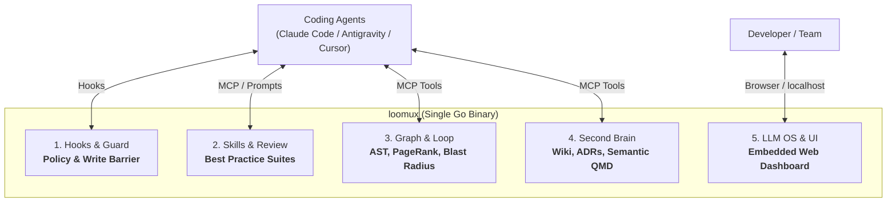
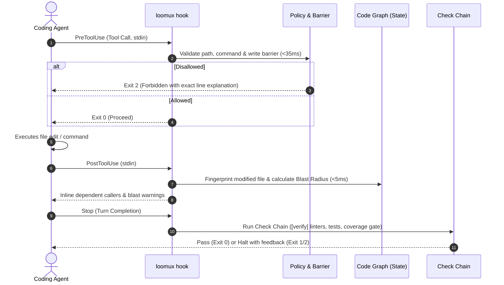
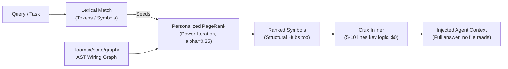
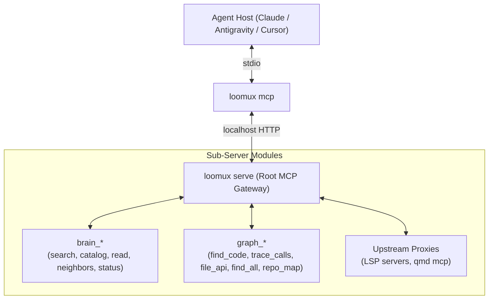

# loomux

🌐 **[English](README.md)** | **[Deutsch](README.de.md)** · 📖 **[Docs (EN)](docs/en/)** | **[Handbuch (DE)](docs/de/)**

**The unified autonomous developer runtime in a single Go binary: Hooks, Skills, Code Graph, Second Brain & LLM OS.**

Loomux gives AI coding agents (Claude Code, Antigravity, Cursor, Codex) deep codebase understanding, sub-millisecond graph retrieval, impenetrable write barriers, and automated verification loops — with zero external runtime dependencies.

- **Zero Python. Zero Node.js.** A single, self-contained Go binary (`loomux.exe` / `loomux`).
- **Sub-35ms cold start.** Lightweight execution that fits strictly within agent tool-call budgets.
- **100% test coverage per function.** Rigorous quality with mutation testing and zero unchecked code paths.
- **Windows-first, POSIX-native.** Native OS primitives (Job Objects, Junctions) with full Linux/macOS support.

> **What’s in a name?**  
> **Loomux** brings together the **Loom** (the loom that weaves together agent loops, execution threads, code graphs, and team knowledge into a single coherent fabric) and **-ux** (inspired by the Unix philosophy of small, robust, composable OS tooling and a frictionless Developer/Agent Experience).

---

## The 5 Pillars of Loomux



---

## Core Workflows

### 1. The Autonomous Guard & Verification Loop

Every agent interaction is guarded and monitored in real time without blocking developer momentum.



### 2. Deterministic Code Graph Retrieval ("GraphRank")

Most coding agents re-explore codebases from scratch every session, burning tokens and tool calls. Loomux builds a local, deterministic AST code graph once and answers queries in under 1 millisecond using **Personalized PageRank**.



> **"Lexical proposes, graph disposes"**: Keywords find candidate symbols; the structural call graph concentrates mass on the components that actually matter, filtering out dead or isolated hits.

### 3. Nested MCP Composite Gateway

`loomux serve` acts as a modular **MCP Gateway Router** over Streamable HTTP, exposing cleanly namespaced capabilities to your coding agents:



---

## Feature & Status Matrix

Loomux is currently executing its staged fusion plan (Stage 1a pilot complete; subsequent stages in active development):

| Pillar / Capability | Description | Status |
|---|---|---|
| **1. Hooks & Guard** | | |
| Unified Pre-Tool Guard | Single-pass validation of write barriers, path protections, and forbidden commands (<35ms budget; 32–34ms measured on predecessor). | ✅ **Implemented** (Stage 1a) |
| Post-Tool Blast Monitor | Instant dirty-file hashing and dependent caller warning on edit. | 🚧 **In Migration** (Stage 1b) |
| Session & Remote Drift | Session-start freshness checks, subagent drift detection, and stop-gate execution counter. | 🚧 **In Migration** (Stage 1b) |
| Check Chain (`[verify]`) | Unified verification table: multi-lane test runners, commit-msg calibration, coverage gates. | ✅ **Implemented** (Stage 1a) |
| Worktree Mirroring | Isolated subagent git worktrees with symlink/junction mirroring and session tracking. | ✅ **Implemented** (Stage 1a) |
| **2. Skills & Best Practices** | | |
| Curated Language Suites | Embedded best-practice rules for Go (zero-alloc, err-handling, no-init), Python, TypeScript, and Rust. | 📋 **Specified** (Stage W4) |
| Graph-Aware Code Review | Review skills that leverage `graph_blast` to inspect caller impact and enforce ADR conformance. | 📋 **Specified** (Stage W4) |
| 3-Channel Distribution | Configured via `.loomux/config.toml`, synced to host folders, served via MCP prompts, or run via Web UI. | 📋 **Specified** (Stage W4) |
| **3. Code Graph & Loop** | | |
| Go Native AST Extractor | Deterministic symbol & call extraction via `go/parser` and `go/types` ($0, zero dependencies). | 📋 **Specified** (Stage G1) |
| Personalized PageRank | Power-iteration random-walk ranking over call and dependency graphs in <1ms. | 📋 **Specified** (Stage G2) |
| Blast Radius Engine | Transitive closure and impact analysis (`DirectionIn`/`DirectionOut`, depth limits). | 📋 **Specified** (Stage G3) |
| Symbol-Coupled Grep | Regex search grouped by enclosing symbol and ranked by incoming edge degree (`inDegree`). | 📋 **Specified** (Stage G4) |
| Multi-Language AST | CGo-free Tree-sitter extraction via WebAssembly (`wazero`) with persistent AOT cache. | 💡 **Planned** (Stage G5) |
| **4. Second Brain & Wiki** | | |
| Local Markdown Wiki | Bidirectional markdown knowledge base with identity registers and topic graphs. | 🚧 **In Migration** (Stage 2) |
| Semantic QMD Index | Embedding and neural search integration with local caching in `~/.cache/qmd`. | 🚧 **In Migration** (Stage 3) |
| Brain-to-Graph Bridge | Code symbols link directly to architectural decisions (ADRs) and design documentation. | 📋 **Specified** (Stage W3) |
| **5. LLM OS & Web Interface** | | |
| Embedded Web OS Dashboard | Self-contained React/Vite SPA embedded via `go:embed` on `http://127.0.0.1:<port>` with `embed_stub.go` fallback. | 📋 **Specified** (Stage W1) |
| Interactive Graph Visualizer | D3-Force / WebGL interactive graph with edge chips, type filtering, and blast overlays. | 📋 **Specified** (Stage W3) |
| Kanban Board & Loop Tracker | Real-time visual tracking of multi-step agent loops, verification lanes, and subagent state. | 📋 **Specified** (Stage W5) |
| Graphical Flow Editor | Visual DAG canvas for designing, replaying, and debugging agent verification loops. | 💡 **Future** (Stage W5) |

*Legend: ✅ Implemented & Verified in Binary · 🚧 In Active Migration / Fusion · 📋 Fully Specified & Ready for Build · 💡 Planned Vision*

---

## CLI Reference

Commands currently active in the Stage 1a pilot vs. specified for subsequent fusion and graph stages:

### Active Commands (Stage 1a Pilot)
```bash
loomux check commit-msg <file>      # validate commit message against language & structure rules
loomux check gofmt [paths...]       # inspect Go file formatting without modifying files
loomux hook pre-tool-use            # run policy and global write barrier against stdin payload
loomux hook post-tool-use           # record tool completion into journal and trigger hooks
loomux hook session-start           # announce session start and sync harness environment
loomux status                       # inspect hook setup, verification lanes, and active harnesses
loomux worktree link|unlink|remove  # manage isolated worktree mirrors and junction paths
loomux dev covergate                # enforce 100% test coverage per function
loomux dev swap                     # atomically swap running binary with new compilation
loomux lint                         # lint markdown wiki links and frontmatter
loomux wiki gate                    # gate wiki freshness and structural constraints
```

### Specified Commands (Code Graph — Stages G1–G5)
```bash
loomux graph build [dir]            # build/rebuild .loomux/state/graph/wiring.json
loomux graph ask "<query>"          # retrieve code symbols ranked by Personalized PageRank
loomux graph callers <symbol>       # list direct callers, callees (--direction out), or full closure (-d all)
loomux graph blast [dir]            # compute blast radius of a git diff against working tree or merge base
loomux graph grep "<regex>"         # regex search grouped by enclosing symbol and ranked by coupling
loomux graph skeleton <file>        # export definition signatures and line spans (~10x token reduction)
loomux graph map                    # print token-budgeted directory clusters, hubs, and hotspots
loomux graph check                  # verify graph freshness against the working tree (exit 1 on drift)
loomux graph viz                    # launch the interactive graph viewer in your browser
```

### Specified Commands (Second Brain & Services — Stages 2–3 & W1–W5)
```bash
loomux brain search "<query>"       # hybrid semantic & keyword search across wiki and ADRs
loomux brain catalog               # list all tracked areas, topics, and identity documents
loomux brain read <path>           # read a wiki page, concept, or identity definition
loomux brain reconcile             # synchronize state changes, identities, and index collections
loomux serve                        # start long-running localhost HTTP MCP service and Web OS
loomux mcp                          # stdio bridge for Claude Code, Cursor, and Antigravity
loomux init                         # wire hooks, settings, and skills into detected coding agents
```

### Developer & Worktree Tools
```bash
loomux worktree mirror              # synchronize NTFS junctions and mirrors for agent worktrees
loomux dev covergate --profile <p>  # verify strict 100% test coverage threshold
loomux dev bench-hooks              # benchmark hook execution latency against the <35ms baseline
loomux dev mutants <pkg>            # run mutation test suites across critical decision packages
```

---

## Architectural Decisions: What We Built, Replaced, and Left Out

| Component / Idea | Origin / Inspiration | Decision in Loomux | Rationale |
|---|---|---|---|
| **Single Go Binary** | Architecture | ✅ **Core Mandate** | Zero Python, zero Node.js. 32ms cold start, single executable deployment, 100% test coverage. |
| **AST Code Graph & PageRank** | `trailhq/Graft` | ✅ **Adopted Natively** | $0 deterministic code graph. Personalized PageRank concentrates mass on structural hubs instead of naive keyword dumps. |
| **Blast Radius & Crux Inlining** | `trailhq/Graft` | ✅ **Adopted Natively** | Instant impact calculation on edit (<5ms); inlines 5–10 critical logic lines instead of full file reads. |
| **Symbol-Coupled Grep** | `trailhq/Graft` | ✅ **Adopted Natively** | Regex hits grouped by enclosing symbol and ranked by incoming call edges (`inDegree`). |
| **Local Second Brain & Wiki** | Architecture | ✅ **Core Mandate** | Markdown wiki, ADRs, and identity registers stored in-repo. Code symbols directly link to architectural decisions. |
| **Node.js & C++ Toolchain** | `trailhq/Graft` | ❌ **Rejected** | Graft requires Node.js >=20, `node-gyp`, and MSVC C++ builds. Loomux remains 100% pure Go with zero external compilers. |
| **Cloud Brain Synchronization** | `trailhq/Graft` | ❌ **Rejected** | Graft syncs symbol hashes to commercial cloud APIs. Loomux keeps all knowledge, rules, and graphs 100% local and offline. |
| **Telemetry & Usage Tracking** | `trailhq/Graft` | ❌ **Rejected** | Graft includes remote telemetry pings. Loomux has zero telemetry and never calls home. |

---

## Architecture Principles

1. **Deterministic by Default**: Code graph construction, blast radius traversal, and write barriers never invoke external LLM APIs by default. They run locally, deterministically, and cost $0.
2. **Start-Time Discipline**: `loomux` measures its cold-start baseline (~32ms) continuously. No package-level variable or `init()` function may parse embedded data or perform network I/O.
3. **Strict Isolation**: Hook paths execute in-process and never depend on a running `serve` daemon.
4. **Agent-Safe Configuration**: `.loomux/config.toml` declares trust barriers and policies; it is human-maintained and write-protected from agent edits. Runtime state lives in `.loomux/state/` (git-ignored).

---

## Documentation Suite

Exhaustive guides and technical manuals are organized under [`docs/en/`](docs/en/):

| Guide | Description |
|---|---|
| 🚀 **[Getting Started](docs/en/getting-started.md)** | Installation, 3-minute quickstart, and agent harness wiring (Claude Code, Antigravity, Cursor). |
| 🏛️ **[Architecture & Concepts](docs/en/architecture.md)** | Deep dive into Andrej Karpathy's LLM OS, Google Knowledge Items (KI), Graft AST GraphRank, and the Write Barrier Kernel. |
| ⚙️ **[Configuration Reference](docs/en/configuration.md)** | Complete reference for `.loomux/config.toml` (`[verify]`, `[policy]`, `[worktree]`, `[graph]`, `[skills]`, `[privacy]`). |
| 📖 **[CLI Reference Manual](docs/en/cli-reference.md)** | Comprehensive UNIX-style manual for all commands, flags, stdin JSON payloads, and exit codes. |
| 🪝 **[Hook Lifecycle & Integration](docs/en/hooks.md)** | Technical specification of the 4-phase hook lifecycle, host payload formats, and decoupled SSE event streaming. |
| ⏱️ **[Performance Benchmarks](docs/en/benchmarks.md)** | Measured baseline performance against predecessor binaries and strict execution budgets. |

---

## Specifications & Internal Working Papers

Design documents and internal working papers are located under `docs/.superpowers/specs/`:
- [Fusion Design: Ultraloom & Ultra-Brain](docs/.superpowers/specs/2026-09-14-loomux-fusion-design.md)
- [Code Graph Subsystem Specification](docs/.superpowers/specs/2026-09-14-loomux-code-graph-design.md)
- [Web OS & Skill System Specification](docs/.superpowers/specs/2026-09-14-loomux-web-os-design.md)

---

## Licence

PolyForm Noncommercial License 1.0 (`LICENSE.md`).
