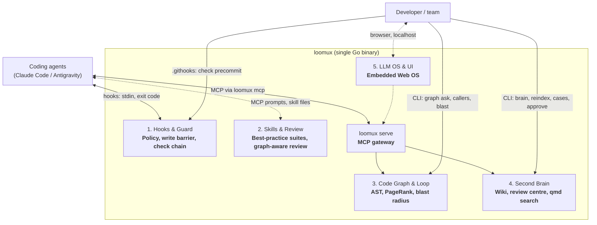
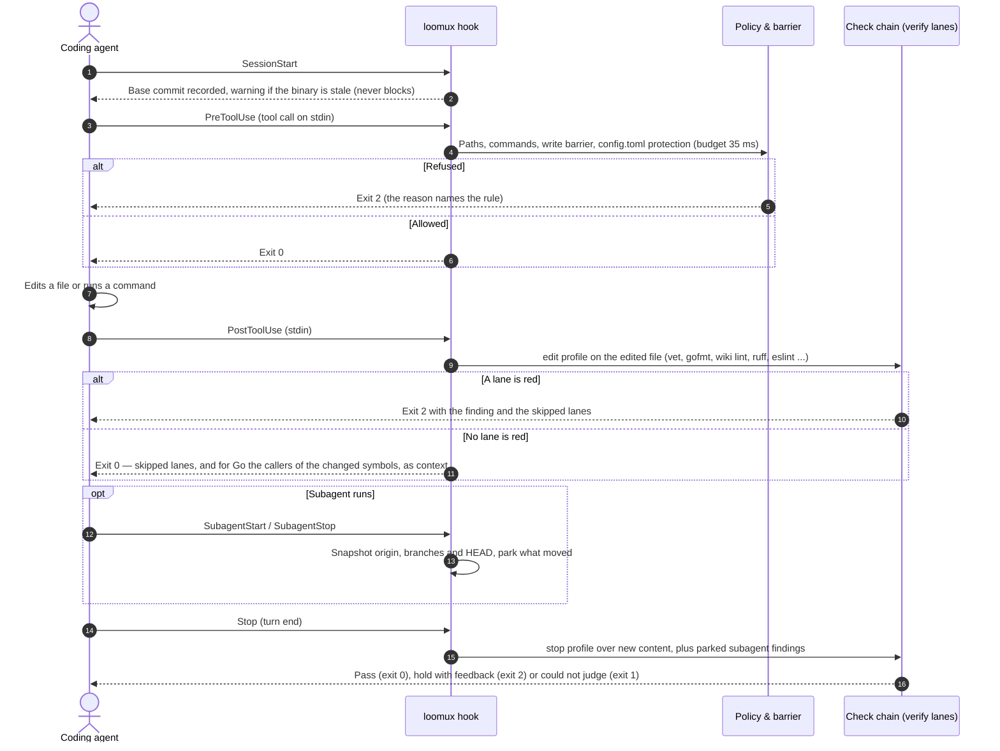
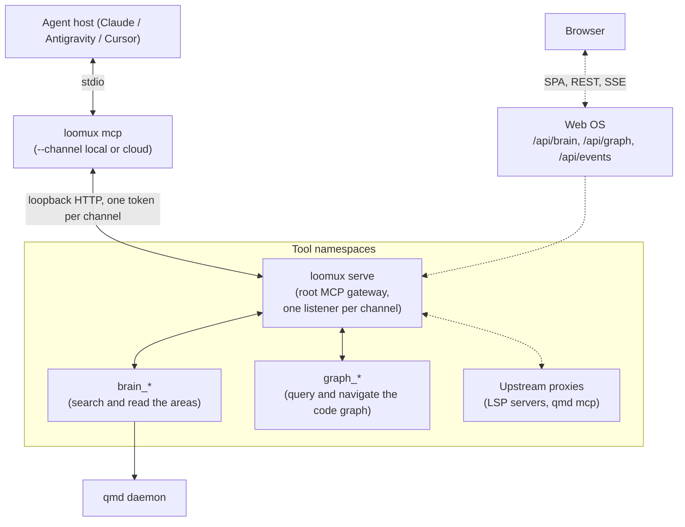

# loomux

🌐 **[English](README.md)** | **[Deutsch](README.de.md)** · 📖 **[Docs (EN)](docs/en/)** | **[Handbuch (DE)](docs/de/)**

**The unified autonomous developer runtime in a single Go binary: Hooks, Skills, Code Graph, Second Brain & LLM OS.**

Loomux gives AI coding agents (hooks for Claude Code and Antigravity today; Cursor only as an MCP client; Codex is not wired yet) deep codebase understanding, deterministic graph retrieval, impenetrable write barriers, and automated verification loops — with zero external runtime dependencies.

- **Zero Python. Zero Node.js.** A single, self-contained Go binary (`loomux.exe` / `loomux`).
- **Sub-35ms cold start.** Lightweight execution that fits strictly within agent tool-call budgets.
- **100% test coverage per function.** Rigorous quality with mutation testing and zero unchecked code paths.
- **Windows-first, POSIX-native.** Native OS primitives (Job Objects, Junctions) with full Linux/macOS support.

> **What’s in a name?**  
> **Loomux** brings together the **Loom** (the loom that weaves together agent loops, execution threads, code graphs, and team knowledge into a single coherent fabric) and **-ux** (inspired by the Unix philosophy of small, robust, composable OS tooling and a frictionless Developer/Agent Experience).

---

## The 5 Pillars of Loomux



*A dashed line is specified and not built. What each migration stage built is
in the [migration plan](docs/en/migration.md); what comes after it is on the
[roadmap](#roadmap).*

---

## Core Workflows

### 1. The Autonomous Guard & Verification Loop

Every agent interaction is guarded and monitored in real time without blocking developer momentum.



Every phase with its payloads, exit codes and budgets: [hook lifecycle](docs/en/hooks.md).

### 2. Deterministic Code Graph Retrieval ("GraphRank")

Most coding agents re-explore codebases from scratch every session, burning tokens and tool calls. Loomux builds a local, deterministic AST code graph once and answers queries from it using **Personalized PageRank**.

The graph covers Go, read with `go/parser`, and Python, read on `gotreesitter`, a Tree-sitter runtime in pure Go, so the binary stays CGo-free. `loomux graph build` parses only the files that changed since the last build and takes the rest from its extract cache; `--no-reuse` parses every file.

`loomux graph ask` ranks code symbols by BM25-style lexical relevance blended with Personalized PageRank (alpha=0.25), rebuilds a drifted graph before it answers (never a first one), and with `--source` inlines each hit's span. `loomux graph blast` shows what a git diff reaches over the same edges; the verify kind `graph` audits the staged change the same way in `loomux check precommit`, and the whole turn against `HEAD` at the stop gate, wherever a graph was built ([configuration](docs/en/configuration.md#the-graph-kind)).

> **"Lexical proposes, graph disposes"**: Keywords find candidate symbols; the structural call graph concentrates mass on the components that actually matter, filtering out dead or isolated hits.

The retrieval path and the blast radius, drawn step by step: [architecture, pillar III](docs/en/architecture.md#4-conceptual-pillar-iii-structural-graph-intelligence-graft). Timings: [benchmarks](docs/en/benchmarks.md).

### 3. Nested MCP Composite Gateway

`loomux serve` acts as a modular **MCP Gateway Router** over Streamable HTTP, exposing cleanly namespaced capabilities to your coding agents:



*A dashed line is specified and not built.* The channel is the address: each
listener has its own token, and the cloud channel never sees an area kept
local, not even where its wiki lies inside another area's tree. `loomux mcp` defaults to `--channel local`, offers only the tools of the modules `[modules]` leaves on, starts and replaces the
service itself, and the per-edit hook path links none of it, which an
import-graph test holds. Every tool with its arguments: [CLI reference §8](docs/en/cli-reference.md#8-mcp-service--stdio-bridge-loomux-serve--loomux-mcp).

---

## Migration Plan

Where each migration stage and each capability carried over from ultraloom
and ultra-brain stands — origin, status, dependencies and priority, with a map
of which stage waits for which — is in the
**[migration plan](docs/en/migration.md)**. This README describes what loomux
is; the plan says how far the migration has got, and the roadmap below what
comes after it.

---

## Roadmap

What loomux will gain beyond the migration. *Priority* is the same order the
migration plan uses, set in the
[fusion spec](docs/.superpowers/specs/2026-09-14-loomux-fusion-design.md)
under "Reihenfolge der offenen Stufen" (1 first); the open migration stages
4c-1, 4e and 4f hold priority 3.

### Coming

| Feature | What it brings | Stage | Depends on | Priority |
|---|---|---|---|---|
| **Flow runtime** | Flows as data: a graph of nodes in TOML, run, paused at a gate for a human's answer, resumed and replayed from a journal. Built: the folder format with its load check, the catalog, roles bound to models in `[agent]`, overlays, `[flow] default` and `overrides`, the guard rules for gate answers, run files and bundled flows, `loomux flow run\|resume\|replay\|show\|list` and the session-start notice of waiting runs ([Flows](docs/en/flows.md)). Gate and exit nodes run; agent nodes wait for the model adapters for Claude and Gemini (through their CLIs, their APIs or both, which stage B decides), and `verify-until-green` as a data flow for the building blocks of stage C | Flow B, C | Flow A ✅ | 4 |
| **Flows over MCP** | `flow_list`, `flow_show`, `flow_run` (a run in a child process `serve` detaches, answering at once with the run number) and `flow_status` on the local channel, with a status file per run so that a cut-off run is seen and carried on; no tool answers a gate | Flow A2 | Flow A ✅ | 4 |
| **Development cycle as the default flow** | From planning to the pull request: clarification, spec and plan, each checked by a fan of reviewer lenses, then per task research, test first, build, check chain, code review and rework, then docs, final review and commit. A human answers at fixed gates and whenever a model is stuck, and pushes | Flow D | Flow B, C | 4 |
| **Community flows** | The development cycle is only the default. Built: the catalog under `flows/catalog/` with its contribution test (`go test ./flows` against a golden journal), `[flow] default` to pick the flow, overlays of single instructions and questions, and roles a project binds to its own models. Real runs of contributed flows with agent nodes wait for the model adapters | Flow B | Flow A ✅ | 4 |
| **Web OS shell** | A React/Vite app embedded with `go:embed` and served by `loomux serve` on `127.0.0.1`: event bus, layout, command palette | W1 | 1b-2 ✅ | 5 |
| **Brain web app** | The second brain in the browser: markdown editor, ADR catalog, knowledge graph (components from `ultra-brain/web`) | W2 | W1 | 5 |
| **Graph visualizer** | An interactive code graph with edge chips, type filters and blast overlays; code symbols linked to ADRs and design docs | W3 | W1, G4a ✅ | 5 |
| **Skill suites and review** | Embedded best-practice rules per language (Go, Python, TypeScript, Rust); graph-aware review that reads `graph_blast` and checks ADR conformance; distributed through `.loomux/config.toml`, host folders, MCP prompts and the web UI | W4 | G4b ✅, migration stage 4 | 5 |
| **Flow editor and Kanban** | Flows drawn, replayed and debugged as a graph in the Web OS, in the same format as the flow files; a Kanban board that tracks agent loops, check lanes and subagents live | W5 | W1, Flow | 5 |
| **TypeScript/TSX in the code graph** | Extraction on the same pure-Go Tree-sitter core (`gotreesitter`) that reads Python since G5a | G5b | G5a ✅ | 6 |
| **GDScript in the code graph** | The same core for Godot's GDScript | G5c | G5b | 6 |
| **C++ in the code graph** | The same core for C++, once a recall check of `gotreesitter` against the C runtime holds | G5d | G5c | 6 |

### Maybe

| Feature | What it brings | Why only maybe |
|---|---|---|
| **Claude Mods adapter** | Seats the write barrier in a `tool.check` function hook ([claude-code#91870](https://github.com/anthropics/claude-code/issues/91870)) talking to a long-lived loomux over `$.mcp.call`: no spawn per call, an `ask` verdict and a rendered reason | Claude Code only; the exec hook stays the portable path |

A pull request that starts, finishes, adds or drops roadmap work updates this
section and its German twin in [`README.de.md`](README.de.md#roadmap).

---

## CLI Reference

The commands that are built, one line each; every flag and exit code is in the [CLI reference](docs/en/cli-reference.md), and what is specified and not built yet is in the [migration plan](docs/en/migration.md) or on the [roadmap](#roadmap).

### Commands
```bash
loomux check <profile|kinds>        # run the [verify] lanes: edit, precommit, all, or kinds of lint,types,test,coverage,graph (--root, --show, -v)
loomux check gocover --profile <p>  # 100% per function, or a total with --floor N
loomux check commit-msg <file>      # validate a commit message: Conventional Commits header and its language ([commit], --language, --calibrate N)
loomux check gofmt [paths...]       # inspect Go file formatting without modifying files
loomux hook pre-tool-use            # run policy and global write barrier against stdin payload
loomux hook post-tool-use           # run the edit profile's lanes against the file just edited, then name the callers of changed Go symbols (--budget, default 50s)
loomux hook session-start           # record the session's base commit; warn about a stale binary, a serve outside the install location and a failed self-update; announce flow runs waiting at a gate and ignored flow folders
loomux hook stop                    # the turn-end gate: the stop profile (lint, types, test, coverage, graph) over new content, subagent findings (--budget, default 270s)
loomux hook subagent-start|subagent-stop  # snapshot origin, branches and HEAD around a subagent; park what moved for stop
loomux hook <event> --host antigravity    # the same hooks for agy: a held stop continues with JSON on stdout; pre-tool-use refuses and post-tool-use warns with 2
loomux flow run [<flow>]            # start a run of a flow, [flow] default without a name (--option name=value); exit 3 when it pauses at a gate; agent nodes wait for the model adapters
loomux flow resume <run>            # carry a paused run on; --answer is a human's, the guard refuses it to an agent
loomux flow replay <run>            # re-derive a finished run from its journal, executing nothing
loomux flow show <run|flow>         # a run's journal, or a flow's nodes, roles with the models they resolve to, and edges
loomux flow list                    # every flow of the catalog and the project, with its origin, the default, and why one does not load
loomux status|doctor|explain        # inspect hook setup, verification lanes, and active harnesses (three names, one code path)
loomux worktree link|unlink|remove  # manage isolated worktree mirrors and junction paths
loomux dev swap-binary              # atomically swap running binary with new compilation
loomux version                      # print the version of this binary
loomux lint <file>                  # lint one markdown wiki page's links and frontmatter
loomux lint [--scope all|S]         # lint every registered bundle by the reference's twelve rules
loomux brain check file|bundle|all  # the OKF, house and federation rules over a page, a bundle or every area (--notes)
loomux wiki init --scope S          # lay out the frame of an area's wiki bundle
loomux wiki types                   # count the page types across every area, with rank and old names
loomux wiki retype --scope S --from A --to B  # rename one page type in one bundle
loomux wiki-gate                    # gate wiki freshness and structural constraints
loomux brain search "<query>"       # search the visible areas through the qmd daemon (--profile fast|full|keyword)
loomux brain catalog [--scope S]    # the root catalog of the visible areas, or one area's index.md
loomux brain read <path> --scope S  # one file of an area, or one section of it (--section)
loomux brain neighbors <path> --scope S  # incoming and outgoing links of one page
loomux brain status                 # what to know before trusting an answer
loomux serve [--foreground]         # start the long-lived localhost MCP service, detached or here; catches up on a due reconcile daily
loomux serve status                 # what serve.json says and whether the listener answers
loomux serve stop [--force]         # end the service through its own endpoint, or by its PID
loomux upgrade                      # replace the machine-wide binary with the newest release of its channel; serve does this daily
loomux mcp [--channel local|cloud] [--root D]  # stdio bridge an MCP host starts; offers the tools of the project's [modules] and starts the service itself
loomux reindex [--registry P]       # reconcile first, then rebuild every area's catalogs, link graph, identity register and qmd collections
loomux embed [--registry P]         # generate the vectors reindex leaves pending (needs qmd on PATH)
loomux reconcile                    # open review cases for changed sources and landed merges; a case is not a failure
loomux area add [--path P] [--scope S]  # register a repository as an area, scaffold its wiki and index it (--wiki, --sources, --merge-branch, --privacy, --no-reindex)
loomux merge-hook install|status|remove  # the post-merge hook of every area whose manifest says [maintenance] on_merge = true; it calls `loomux merge-hook record`, which notes the merge for reconcile; not yet in use on a host
loomux cases                        # list the cases waiting in the review centre; a case is not a failure
loomux case <id> [--package]        # show a case with its package and proposal; withheld for local_only until --package
loomux approve <id>                 # decide a case: apply the evidence-bound proposal and commit it (--amend F, --reject, --defer)
loomux convert [file]               # turn the PDFs and transcripts of every writable inbox, or one file, into <name>.<ext>.md with a provenance head; exit 1 when anything is left (a human's command, the guard refuses an agent)
loomux fetch <url> [--scope S]      # have yt-dlp put a video's subtitles into an area's inbox, knowledge by default (a human's command, the guard refuses an agent)
loomux config [list|get K|set K V]  # show every key of .loomux/config.toml with its origin, change one line after a diff and a y; bare: full-screen (--root, --global, --yes, --json; a human's command, the guard refuses an agent)
loomux config set|unset … --propose # an agent's way: store the checked change as a proposal; a human runs `config proposals`, then `config apply <id>|--all` or `config reject`
loomux init                         # set a project up in modules (hooks, brain, graph): binary, config, host entries, git hooks, merge hook, skills; every change as a diff, written after a y (--dry-run, --detect-only, --yes, --hooks|--brain|--graph=all|each|none, --hosts; a human's command; its first runs on a fresh clone and a host are pending)
```

**The inbox.** An area whose manifest names `[layout] inbox` takes files for
the wiki there. `loomux convert` turns each PDF and transcript in it into
`<name>.<ext>.md` beside the source, with a provenance head (source URL, the
file's date, the converter, whether speech recognition made the text); a
second run rewrites no target whose text would stay the same, and a target
whose head no converter wrote is never overwritten. PDFs go through `pdftotext` from
Poppler, and only Poppler's (xpdf writes another text under the same name);
a page under 100 characters counts as a scan and is left out, a PDF of scans
alone is left for a person. `loomux fetch <url>` has `yt-dlp` write a
video's subtitles and files them in the inbox as a transcript; loomux itself
never speaks to the network. Both programs are found on the `PATH` and
installed by hand (`winget install --id oschwartz10612.Poppler -e`,
`winget install --id yt-dlp.yt-dlp -e`); a missing one is named with that
command. The binary embeds a German word-frequency table under CC BY-SA 4.0
for the model's sentence check; its licence and every other third-party
licence the binary carries are in `NOTICE.md` beside every release.

**The local model.** For an area whose manifest says `[privacy] mode = "local_only"`,
`loomux reconcile` asks a local Ollama for a proposal on each case it opens. A
proposal whose every claim passes the evidence binding lands beside the case as
`proposal.md`; anything else — no answer, a claim without a verbatim quote —
leaves a manual case; `reconcile` sends no other area to the model. `loomux
convert` does, whatever the area's privacy mode: with the model on, it sends
the first 1800 characters of each file it converts in an inbox to ask for the
head's one sentence (role `describe`) and, for a file it newly wrote, for the
area it belongs in (role `place`, offered only the areas no more open than
the inbox's own; a suggestion is a line on stdout, the file stays). All three
roles are on by default, so `enabled = true` alone turns both on for every
inbox; `roles` narrows them. `convert <file>` never asks the model. The settings are
`[model]` in the machine-wide `config.toml` of the state directory (by default
`%LOCALAPPDATA%\loomux\config.toml`): `enabled` (off by default), `endpoint`,
`name`, `temperature` and `roles`, shown and changed with `loomux config --global`
(an agent only with `--propose`). An area's `.loomux/config.toml` may set only
`[model] enabled` and `roles`, and only to switch off or narrow what the machine
allows. The endpoint must stay on the loopback (`127.0.0.1`, `localhost`, `::1`);
no proxy is taken from the environment and no redirect is followed.
`loomux init` pulls the model into Ollama when it is missing (part `model`, on
for a `local_only` project or with `[model] enabled = true`), after a y like any
other change; `reconcile` never downloads a model.

The search engine's backbone is `[search] backbone` in the same file: `cuda`
(the default), `vulkan` or `cpu`, set with
`loomux config --global set search.backbone vulkan`. It applies to the qmd
daemon loomux starts and to every qmd command line it runs; a `QMD_LLAMA_GPU`
or `QMD_FORCE_CPU` in the environment wins. A daemon that is already running
keeps its backbone until its process ends: stop the process listening on port
8765 (see `brain search` in the CLI reference for the command; `qmd mcp stop`
may answer "Not running" after a `qmd status` although the daemon still runs),
and the next search starts it with the new backbone.

### Code Graph
```bash
loomux graph build [--root <path>] [--no-reuse]  # extract Go and Python, resolve and write .loomux/state/graph/wiring.json; unchanged files come from the extract cache
loomux graph check [--root <path>]  # re-extract and diff against the graph on disk (exit 1 on drift)
loomux graph ask "<query>" [flags]  # retrieve code symbols ranked by lexical score and Personalized PageRank; never builds a first graph
loomux graph callers <symbol>       # list direct callers, callees (--direction out), or full closure (-d all)
loomux graph skeleton <file>        # export definition signatures and line spans (~10x token reduction)
loomux graph grep "<regex>"         # regex search grouped by enclosing symbol and ranked by coupling
loomux graph map                    # print token-budgeted directory clusters, hubs, and hotspots
loomux graph stats                  # display graph metrics (nodes, edges by relation, files, languages, size)
loomux graph blast [--cached|--base B] [-d N|all]  # what a git diff reaches: working tree, index, or B...HEAD (--json, --no-refresh)
loomux check graph-fresh [--wait 30s]  # drive the graph to match the tree for a gate; exit 1 without a graph, on a failed rebuild or a held lock
loomux check blast-audit [--cached|--base B] [--threshold 3]  # exit 1 when a changed symbol with that many callers has no changed test reaching it (--skip-test-callers)
```

### Developer & Worktree Tools
```bash
loomux dev bench hooks <cases>      # time the hook commands of a case file against the <35ms baseline (-n, --out <dir>)
loomux dev bench repos [--dir <dir>] [--save] # time the hooks on a repo or the open-source corpus with gap audit; --save persists to docs/
loomux dev bench search [--corpus v1 --out <dir>] # measure the rank of search hits over a question set or the corpus v1 (--profile, --latency, --out <dir>)
loomux dev mutants <pkg>            # run mutation test suites across critical decision packages
loomux dev record-case --out <dir>  # record one run of a reference binary as a case
loomux dev import-cases --map <f>   # translate a directory of recorded cases into loomux cases
loomux dev record-mcp-case --out <dir> # record one MCP tool call of a reference service as a case
loomux dev fake-ollama --fixture <f>  # a stand-in Ollama that answers every request with the fixture, for recording and replaying cases (--addr, default 127.0.0.1:11435; --log)
loomux dev release <sub>            # release rules for CI: next-version, parse-body, changelog-insert, build
loomux dev notices [--out F]        # write NOTICE.md from the modules and grammars the binary links; a test holds the committed file current
loomux dev record-poppler --exe P --dir D --out F  # record what Poppler's pdftotext prints for each PDF in D as a fixture for the Go golden
```

---

## Architectural Decisions: What We Built, Replaced, and Left Out

| Component / Idea | Origin / Inspiration | Decision in Loomux | Rationale |
|---|---|---|---|
| **Single Go Binary** | Architecture | ✅ **Core Mandate** | Zero Python, zero Node.js. 7.5 ms warm hook, single executable deployment, 100% test coverage. |
| **AST Code Graph & PageRank** | `trailhq/Graft` | ✅ **Adopted Natively** | $0 deterministic code graph. Personalized PageRank concentrates mass on structural hubs instead of naive keyword dumps. |
| **Blast Radius** | `trailhq/Graft` | ✅ **Adopted Natively** | The blast radius of a git diff with a test signal (`graph blast`, `graph_blast`). |
| **Crux Inlining** | `trailhq/Graft` | ❌ **Left Out** | Graft's crux is an excerpt an LLM chose; no LLM sits in loomux's path. `--source` inlines the span instead (at most 80 lines, `--full` uncapped), Graft's own fallback. |
| **Symbol-Coupled Grep** | `trailhq/Graft` | ✅ **Adopted Natively** | Regex hits grouped by enclosing symbol and ranked by incoming call edges (`inDegree`). |
| **Local Second Brain & Wiki** | Architecture | ✅ **Core Mandate** | Markdown wiki, ADRs, and identity registers stored in-repo. Code symbols directly link to architectural decisions. |
| **Node.js & C++ Toolchain** | `trailhq/Graft` | ❌ **Rejected** | Graft requires Node.js >=20, `node-gyp`, and MSVC C++ builds. Loomux remains 100% pure Go with zero external compilers. |
| **Cloud Brain Synchronization** | `trailhq/Graft` | ❌ **Rejected** | Graft syncs symbol hashes to commercial cloud APIs. Loomux keeps all knowledge, rules, and graphs 100% local and offline. |
| **Telemetry & Usage Tracking** | `trailhq/Graft` | ❌ **Rejected** | Graft includes remote telemetry pings. Loomux has zero telemetry and never calls home. |

---

## Architecture Principles

1. **Deterministic by Default**: Code graph construction, blast radius traversal, and write barriers never invoke external LLM APIs by default. They run locally, deterministically, and cost $0.
2. **Start-Time Discipline**: `loomux` measures its start floor (5.5 ms warm, 2026-09-17) continuously. No package-level variable or `init()` function may parse embedded data or perform network I/O.
3. **Strict Isolation**: Hook paths execute in-process and never depend on a running `serve` daemon.
4. **Agent-Safe Configuration**: `.loomux/config.toml` declares trust barriers and policies; it is human-maintained and write-protected from agent edits, by writing tools and by shell commands alike (every write or removal the guard reads from a shell line — redirections, `sed -i`, `tee`, `Set-Content`, `cp`/`mv`, `ln`, `tar`, `curl -o` and more — with braces and globs unfolded as a shell does), under any directory; a project's own path rules hold for the shell the same way. Runtime state lives in `.loomux/state/` (git-ignored).

---

## Documentation Suite

Exhaustive guides and technical manuals are organized under [`docs/en/`](docs/en/):

| Guide | Description |
|---|---|
| 🚀 **[Getting Started](docs/en/getting-started.md)** | Installation, 3-minute quickstart, and agent harness wiring (hooks for Claude Code and Antigravity, MCP for Cursor). |
| 🏛️ **[Architecture & Concepts](docs/en/architecture.md)** | Deep dive into Andrej Karpathy's LLM OS, Google Knowledge Items (KI), Graft AST GraphRank, and the Write Barrier Kernel. |
| ⚙️ **[Configuration Reference](docs/en/configuration.md)** | Complete reference for `.loomux/config.toml` (`[verify]`, `[policy]`, `[modules]`, `[commit]`, `[worktree]`, `[privacy]`, `[model]`, `[agent]`, `[flow]`). |
| 🔀 **[Flows](docs/en/flows.md)** | Flows as data: the folder format, roles and models, the catalog and overrides, contributing a flow, and why a gate is a human's. |
| 📖 **[CLI Reference Manual](docs/en/cli-reference.md)** | Comprehensive UNIX-style manual for all commands, flags, stdin JSON payloads, and exit codes. |
| 🪝 **[Hook Lifecycle & Integration](docs/en/hooks.md)** | Technical specification of the 4-phase hook lifecycle, host payload formats, and decoupled SSE event streaming. |
| 🗺️ **[Migration Plan](docs/en/migration.md)** | Every migration stage and every capability carried over or built during the fusion: origin, status, dependencies and priority. What comes after it is on the [roadmap](#roadmap). |
| ⏱️ **[Performance Benchmarks](docs/en/benchmarks.md)** | Measured baseline performance against predecessor binaries and strict execution budgets. |
| 📊 **[Benchmark Matrix](docs/en/benchmarks/matrix.md)** | Open-source matrix across top languages with detailed reports per language and repository. |

---

## Specifications & Internal Working Papers

Design documents and internal working papers are located under `docs/.superpowers/specs/`:
- [Fusion Design: Ultraloom & Ultra-Brain](docs/.superpowers/specs/2026-09-14-loomux-fusion-design.md)
- [Code Graph Subsystem Specification](docs/.superpowers/specs/2026-09-14-loomux-code-graph-design.md)
- [Web OS & Skill System Specification](docs/.superpowers/specs/2026-09-14-loomux-web-os-design.md)

---

## Releases

Download a binary from the [Releases page](https://github.com/xidus90/loomux/releases):
`loomux_<version>_<os>_<arch>` for `windows/amd64` (`.exe`), `linux/amd64`,
`linux/arm64`, `darwin/amd64` and `darwin/arm64`. Verify it against
`SHA256SUMS` from the same release:

```sh
sha256sum --check --ignore-missing SHA256SUMS
```

Beside them every release carries `NOTICE.md`, listed in `SHA256SUMS` as
well: the licence of every third-party part the binary carries — Go's
standard library, each linked module, each tree-sitter grammar it links, and
the German word-frequency table under CC BY-SA 4.0 with its sources.

### Installing the machine-wide binary

The MCP bridge and `loomux serve` run from one binary per machine,
`%LOCALAPPDATA%\loomux\bin\loomux.exe`, taken from a release and never from a
checkout. Install it once with the [GitHub CLI](https://cli.github.com/),
logged in with `gh auth login`:

```powershell
$bin = "$env:LOCALAPPDATA\loomux\bin"
New-Item -ItemType Directory -Force $bin | Out-Null
gh release download <tag> --repo xidus90/loomux --pattern 'loomux_*_windows_amd64.exe' --pattern SHA256SUMS --dir $bin
```

Check the file against `SHA256SUMS`, rename it to `loomux.exe`, delete
`SHA256SUMS`, and point the MCP entry at it:

```powershell
claude mcp add loomux -s user -- "$env:LOCALAPPDATA\loomux\bin\loomux.exe" mcp --channel local
```

From then on `serve` keeps it current: a minute after it starts and daily
after that it takes the highest release of the binary's own channel through
`gh`, checks it against `SHA256SUMS` and its `--version`, and swaps the file.
The next bridge replaces the running service. `loomux upgrade` does the
same by hand. What the last pass found is in `update.json` beside the binary's
directory; session start warns when `serve` runs from anywhere else or the
pass failed. Windows only for now.

`loomux init` takes over the first steps: its part `binary` puts the newest
release at the same place when none stands there, and its part `mcp-json`
writes the project's `.mcp.json` when the user scope has no server `loomux`
(see the [CLI reference](docs/en/cli-reference.md#11-project-setup-loomux-init)).
Its first run by a human is still pending.

Every merged pull request to `master` is released according to its label:

| Label | Meaning | Version |
|---|---|---|
| `release:major` | Breaking change to a command, flag, hook protocol, config format or exit code | `X+1.0.0` |
| `release:minor` | New feature, compatible | `X.Y+1.0` |
| `release:patch` | Bug fix or dependency update, compatible | `X.Y.Z+1` |
| `release:none` | Docs, CI or tests only | no release |

Every release is a beta pre-release until `RELEASE_CHANNEL` is set to
`stable`. What changed is in [`CHANGELOG.md`](CHANGELOG.md).

### Opening a pull request

Nobody commits to `master`; every change goes through a pull request. The
hooks in `.githooks` refuse a commit on `master` and a push to it once
`go run ./cmd/loomux init --yes` has armed a fresh clone (by hand:
`git config core.hooksPath .githooks`). With an LLM, the `release-pr`
skill does the steps below; by hand:

1. Group the commits by theme, one commit per change. Fold a later
   correction of something this branch introduced into the commit that
   introduced it; only a fix of a bug that was already on `master` keeps its
   own commit. Rewriting a pushed branch needs
   `git push --force-with-lease`. Every message is a Conventional Commit
   (`feat: …`, `fix: …`, `docs: …`; `!` for a breaking change). The
   `commit-msg` hook checks this locally, and the `pr-label` check refuses
   a pull request with any commit header outside the form.
2. Pick one label from the table above; between two levels take the higher.
   It is never lower than the commits: `!` needs major, `feat` minor, `fix`
   patch.
3. Write the body:
   ```
   Release: <level> — <one-sentence reason>

   ## Summary
   - <what changes for a user>

   ## Changelog
   ### Added
   - <entry>
   ```
   Changelog headings are only `Added`, `Changed`, `Deprecated`, `Removed`,
   `Fixed`, `Security`; with `release:none` the section is left out.
4. Check it: `go run ./cmd/loomux dev release parse-body --labels release:<level> --body <file>`.
5. Push the branch, then `gh pr create --base master --label release:<level> --body-file <file>`.

### Setting up releases (maintainers)

1. Labels:
   ```sh
   gh label create release:major --color B60205 --description "Breaking change"
   gh label create release:minor --color 0E8A16 --description "New feature, compatible"
   gh label create release:patch --color 1D76DB --description "Bug fix or dependency update"
   gh label create release:none --color CCCCCC --description "No release"
   ```
2. Channel: `gh variable set RELEASE_CHANNEL --body beta`
3. GitHub App (Settings → Developer settings → GitHub Apps → New): name
   `loomux-release`, webhook off, repository permissions `Contents: Read and
   write`, `Pull requests: Read-only`, `Metadata: Read-only`, "Only on this
   account". Generate a private key, install the app only on
   `xidus90/loomux`, then:
   ```sh
   gh secret set RELEASE_APP_CLIENT_ID --body <client-id>
   gh secret set RELEASE_APP_PRIVATE_KEY < loomux-release.private-key.pem
   ```
4. Rulesets (once the repository is public): one for `master` and one for
   tags `v*`, each with the `loomux-release` app as the only bypass actor.
   The `master` ruleset also requires the status checks `gate-windows` and
   `build-linux` (workflow `ci`) and `check` (workflow `pr-label`).

If a release was dropped, run the `release` workflow by hand
(`gh workflow run release.yml -f pr=<number>`). It refuses a pull request
not merged into `master`, and a rerun after the `chore(release): v*` commit landed
reuses that commit. If a tag or release already exists for that pull
request, do not dispatch again; fix the existing release by hand.

---

## Licence

PolyForm Noncommercial License 1.0 (`LICENSE.md`).
