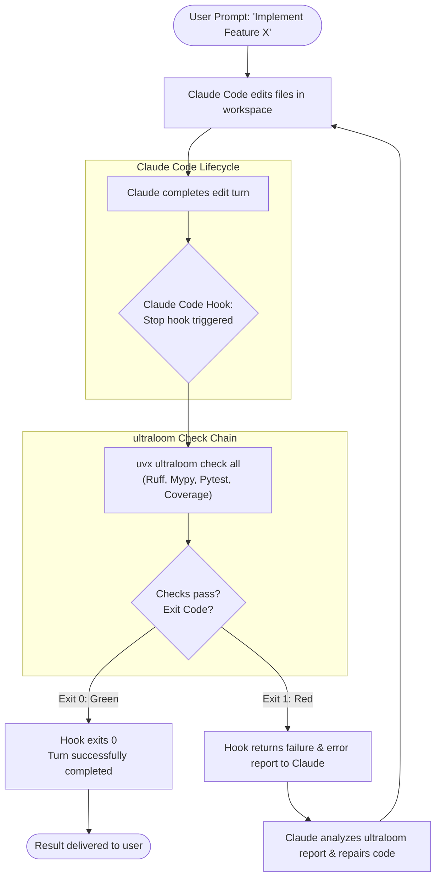

# Multi-Provider LLM Support (Gemini & Claude) Design Specification

## 1. Overview & Context

Ultraloom provides a deterministic check-chain (`ultraloom check`) for linters and tests, alongside an agent flow runner (`ultraloom run`) such as `verify_until_green`. Currently, the agent execution layer is tightly coupled to the Claude Agent SDK (`claude-agent-sdk`).

This specification outlines the architecture to make ultraloom's agent flows **LLM-agnostic**. The system will natively support **Google Gemini** and **Anthropic Claude**, with an extensible foundation for additional providers (OpenAI, DeepSeek, local models via Ollama/vLLM) without changing the core graph execution engine.

---

## 2. Goals & Non-Goals

### Goals
- **Model-Agnostic Flow Execution:** Flow nodes (`AgentNode`) interact with a unified `Model` interface regardless of the underlying LLM provider.
- **Native Tool Execution Engine:** Ultraloom provides a lightweight, secure, and uniform tool executor in Python (`Read`, `Edit`, `Write`, `Bash`, `Glob`, `Grep`) with profile-based permissions (`read_only`, `edit`, `shell`).
- **First-Class Gemini & Claude Adapters:**
  - `GeminiAdapter`: Built on `google-genai` SDK using Gemini function calling and structured outputs.
  - `ClaudeAdapter`: Built on `anthropic` SDK (or `claude-agent-sdk` when CLI integration is preferred) using tool use and JSON schemas.
- **Flexible Configuration & CLI Overrides:**
  - Configure default provider, model, and environment variables in `.ultraloom/config.toml`.
  - Override provider and model on the command line via `--provider` and `--model`.
- **Modular Packaging:**
  - Providers packaged as optional extras: `ultraloom[gemini]`, `ultraloom[claude]`, `ultraloom[agent]` (all).
  - Check-chain remains completely zero-dependency and LLM-free.
- **Offline Testability:** All adapters and tool execution components must be 100% unit-testable without external network access or paid API keys.

### Non-Goals
- Modifying the check-chain (`ultraloom check`), which remains strictly deterministic and LLM-free.
- Introducing heavy multi-agent or prompt-engineering frameworks (e.g., LangChain, AutoGen).

---

## 3. Architecture & Component Design

```
                     ┌────────────────────────────────┐
                     │          ultraloom CLI         │
                     │  (ultraloom run <flow> ...)    │
                     └───────────────┬────────────────┘
                                     │
                     ┌───────────────▼────────────────┐
                     │          Flow Runner           │
                     │      (AgentNode Execution)     │
                     └───────────────┬────────────────┘
                                     │
               ┌─────────────────────▼─────────────────────┐
               │                Model Port                 │
               │   ask(request: Request) -> Reply          │
               └───────────────┬─────────────┬─────────────┘
                               │             │
              ┌────────────────▼─┐         ┌─▼────────────────┐
              │  Gemini Adapter  │         │  Claude Adapter  │
              │  (google-genai)  │         │   (anthropic)    │
              └────────┬─────────┘         └────────┬─────────┘
                       │                            │
                       └─────────────┬──────────────┘
                                     │
                     ┌───────────────▼────────────────┐
                     │       Tool Executor Engine     │
                     │  (Read, Edit, Write, Bash...)  │
                     └────────────────────────────────┘
```

### 3.1. File Structure

```
src/ultraloom/
├── model/
│   ├── port.py              # Core Model protocol: Request, Reply, ModelError
│   ├── factory.py           # Factory resolving provider & instantiating adapters
│   ├── fake.py              # Mock model for offline unit tests
│   ├── tools/
│   │   ├── definitions.py   # Standard tool schemas (Read, Edit, Write, Bash, Glob, Grep)
│   │   └── executor.py      # Execution of tool calls with guardrails & permissions
│   └── adapters/
│       ├── gemini.py        # Gemini adapter (google-genai function calling loop)
│       └── claude.py        # Claude adapter (anthropic tool-use loop)
├── config.py                # Config models: [agent] provider, model, api_keys
└── cli.py                   # CLI flags: --provider, --model
```

---

## 4. Detailed Component Specifications

### 4.1. Tool Executor Engine (`src/ultraloom/model/tools/`)

The tool executor implements the tool operations requested by the LLM:

* **`Read(path: str, offset: int = 0, limit: int | None = None)`**: Reads file contents within the project root.
* **`Edit(path: str, old_str: str, new_str: str)`**: Performs precise string replacement. Refused if target path is in `[verify].tests`.
* **`Write(path: str, content: str)`**: Creates or overwrites a file. Refused if target path is in `[verify].tests`.
* **`Glob(pattern: str, path: str = ".")`**: Finds files matching glob patterns.
* **`Grep(pattern: str, path: str = ".", include: str | None = None)`**: Searches for text / regex across files.
* **`Bash(command: str, timeout: int = 30)`**: Runs shell command in project directory (only allowed with `shell` profile).

**Guardrails:**
* Absolute paths outside the workspace root are strictly refused.
* Edits or writes targeting test paths (configured under `[verify].tests`) raise an explicit permission refusal.

### 4.2. Provider Adapters (`src/ultraloom/model/adapters/`)

Each adapter implements the `Model` protocol:
```python
class Model(Protocol):
    def ask(self, request: Request) -> Reply: ...
```

#### Gemini Adapter (`src/ultraloom/model/adapters/gemini.py`):
1. Converts `request.tools` into Gemini `FunctionDeclaration` objects.
2. Calls Gemini (`gemini-2.5-pro` or configured model) via `google-genai` client.
3. If model returns function calls:
   - Invokes `ToolExecutor`.
   - Sends tool responses back in chat history.
   - Continues loop until model produces final content.
4. Validates structured JSON output against `request.schema` and computes token usage.

#### Claude Adapter (`src/ultraloom/model/adapters/claude.py`):
1. Converts `request.tools` into Anthropic tool definitions (`input_schema`).
2. Calls Claude API (`claude-3-7-sonnet-20250219` or configured model).
3. Executes tool-use loop with `ToolExecutor`.
4. Enforces JSON Schema structured output and returns `Reply(value=parsed, tokens=token_count)`.

---

## 5. Configuration & CLI

### 5.1. Configuration (`.ultraloom/config.toml`)

```toml
[agent]
provider = "gemini"                      # "gemini" | "claude" (default: "claude")
model = "gemini-2.5-pro"                 # default model for selected provider
cli_path = "path/to/claude.exe"          # optional for Claude CLI mode

[agent.gemini]
api_key_env = "GEMINI_API_KEY"          # env var holding the Gemini API key

[agent.claude]
api_key_env = "ANTHROPIC_API_KEY"       # env var holding the Anthropic API key
```

### 5.2. CLI Flags

```bash
# Run with default provider from config.toml
ultraloom run verify_until_green

# Override provider & model via CLI
ultraloom run verify_until_green --provider gemini --model gemini-2.5-pro
ultraloom run verify_until_green --provider claude --model claude-3-7-sonnet-20250219
```

---

## 6. Dependencies & Packaging (`pyproject.toml`)

```toml
[project.optional-dependencies]
claude = [
    "anthropic>=0.40.0",
    "claude-agent-sdk>=0.2.143",
]
gemini = [
    "google-genai>=1.0.0",
]
agent = [
    "ultraloom[claude,gemini]",
]
```

If an adapter is invoked but its dependency is missing, ultraloom outputs an actionable error message:
> `error: provider 'gemini' requires the 'gemini' extra; install with: uv add "ultraloom[gemini]"`

---

## 7. Verification & Testing Strategy

1. **Tool Executor Tests (`tests/test_tool_executor.py`):**
   - Verify `Read`, `Edit`, `Write`, `Glob`, `Grep`, `Bash`.
   - Test directory guardrails (prevent escapes outside root).
   - Test test-file protection (`[verify].tests`).
2. **Adapter Unit Tests (`tests/adapters/`):**
   - Mock API responses for Gemini and Claude.
   - Verify tool loop execution, schema validation, and token reporting.
   - Verify clean error raising on API failure / rate limits.
3. **Config & Factory Tests (`tests/test_model_factory.py`):**
   - Test resolution of `--provider`, `--model`, and `.ultraloom/config.toml`.
   - Test missing API key and missing extra error handling.
4. **End-to-End Flow Tests (`tests/flows/test_verify_until_green.py`):**
   - Execute complete repair flows using `FakeModel` across all provider profiles.

---

## 8. Integration Examples: Claude Code & AI Agent Hooks

Ultraloom serves as a deterministic verification gate that can be integrated directly into AI assistant workflows, Git hooks, and CI/CD pipelines.

### 8.1. Claude Code `Stop` Hook Integration

When integrated into Claude Code, ultraloom runs the check chain at the end of each turn. If checks fail, the hook blocks completion and returns the diagnostic report directly to Claude for automated self-repair.

#### Lifecycle Flow



#### Configuration Example (`.claude/config.json`)

```json
{
  "hooks": {
    "Stop": [
      {
        "type": "command",
        "command": "uv run ultraloom check all"
      }
    ]
  }
}
```

### 8.2. Autonomous Self-Repair Hook

Alternatively, the hook can trigger ultraloom's own autonomous repair flow (`verify_until_green`), running with either Gemini or Claude:

```json
{
  "hooks": {
    "Stop": [
      {
        "type": "command",
        "command": "uv run ultraloom run verify_until_green --provider gemini --checks quick"
      }
    ]
  }
}
```

### 8.3. Subscriptions vs. Paid API Tokens

The architecture fully supports existing user subscriptions without requiring per-token API billing:

1. **Interactive Hook Workflow (Claude Pro / Gemini Subscriptions):**
   - In interactive assistant sessions (Claude Code, Antigravity, Gemini), code editing runs under the user's active subscription.
   - The triggered command (`ultraloom check all`) runs purely locally on the developer machine (executing Ruff, Mypy, Pytest). It consumes **0 API tokens and incurs 0 extra cost**.
   - Diagnostics are fed back to the assistant in the existing chat/CLI session.

2. **Autonomous Execution via CLI Logins (`ultraloom run`):**
   - **Claude:** Uses `claude-agent-sdk` connected to the local Claude CLI (`claude.exe`). When the CLI is authenticated via `claude login` (using Claude Pro/Team/Enterprise), ultraloom leverages the subscription session directly with no Anthropic API key required.
   - **Gemini:** Supports Google AI Studio's free-tier API keys (requiring no billing/credit card setup) as well as environment/OAuth credentials from Antigravity/Google Cloud.


