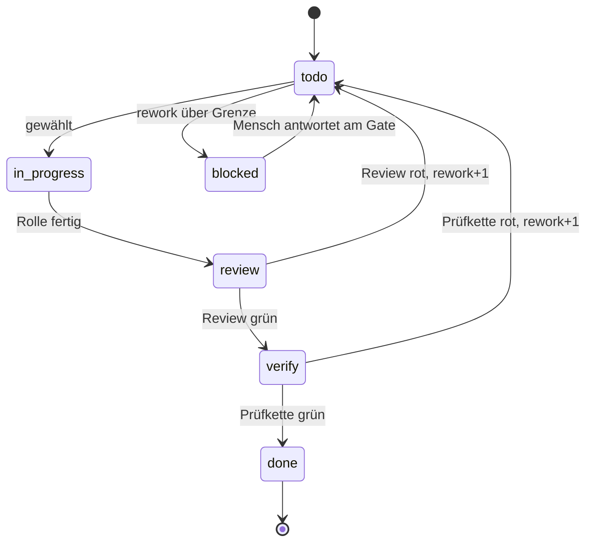
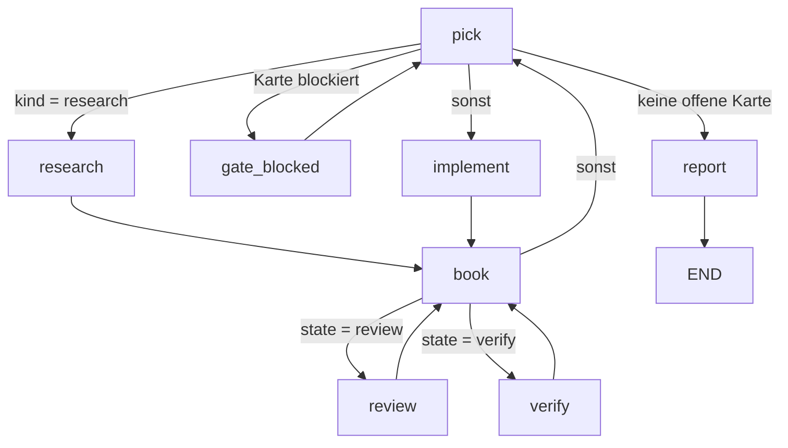

# Agent-Harness: Kanban-Board, Rollenknoten und ein Modell pro Rolle

**Stand:** 2026-09-10 · **Ort der Umsetzung:** Repository `ultraloom`, kein
eigenes Projekt

## 1. Wozu

Ein Loop-/Graph-Harness, der einen freigegebenen Plan unbeaufsichtigt abarbeitet:
Teilaufgaben liegen als Karten auf einem Board, eine Karte wandert durch feste
Zustände (implementiert → Review → Prüfkette), und die Rollen dahinter laufen auf
verschiedenen Anbietern — Recherche auf Gemini, Implementierung auf einem
dritten Modell, Orchestrierung auf Claude.

Die Grenze zum interaktiven Arbeiten liegt beim **freigegebenen Plan**.
Brainstorming, Spec und Plan entstehen weiterhin vorne im Gespräch
(`superpowers` in Claude Code, `agy` für Gemini). Der Harness beginnt dort, wo
ein Plan mit Aufgabenliste vorliegt.

## 2. Warum hier und nicht in einem eigenen Repo

Gemessen am Baum, nicht vermutet:

- Die Laufzeit steht bereits: `graph.py` (228 Zeilen), `runner.py` (376),
  `state.py` (60), `journal.py` (116), Modellport plus SDK-Adapter (333).
  Zusammen 1113 Zeilen, die ein eigenes Projekt neu bauen müsste.
- Die Rollen sind schon Knotenarten: `CodeNode` ist der Executor, `AgentNode`
  mit Profil `edit` der Implementer, `AgentNode` mit `read_only` der Validator.
  `verify_until_green.py` fährt diese drei bereits als `check`, `repair`,
  `guard`.
- Anbieterunabhängigkeit ist **Kernarbeit**: ein zweiter `Model` hinter dem Port
  und eine Werkzeugnamen-Abbildung in `tools.py`, deren Profile heute
  Claude-Code-Namen führen. Ein eigenes Repo müsste diese Änderung trotzdem hier
  landen.
- `discovery.py:20,146` kennt genau zwei Flow-Quellen: `.ultraloom/flows` im
  Projekt und das gebündelte `ultraloom.flows`. Keine Entry-Points. Die Flows
  eines Fremdpakets wären für `ultraloom run` unsichtbar.
- Die Trennung, die ein eigenes Repo herstellen sollte, existiert bereits als
  Paketierung: `dependencies = []`, der Agentpfad hängt am Extra `agent`. Die
  Prüfkette bleibt LLM-frei, egal wie groß der Harness wird.

Der Zweig `feature/multi-provider-llm` ist **keine** Basis: von 155 Commits
berühren neun den Strang, sechs davon sind Kern-Commits, die `master` längst
hat; der Diff in `model/` ist gegenüber `master` negativ. Einziger Vermögenswert
ist die Spec vom 2026-08-24 (271 Zeilen) — brauchbar als Quelle für den
Werkzeugausführer (§4.1 dort), mit zwei Mängeln: veraltete Modell-IDs
(`claude-3-7-sonnet`, `gemini-2.5-pro`) und der falsche Ablageort
`docs/superpowers/` statt `docs/.superpowers/`.

## 3. Nicht-Ziele

- Die Prüfkette (`ultraloom check`) bleibt deterministisch und LLM-frei.
- Keine parallelen Arbeiter. Der Runner läuft sequenziell — in 376 Zeilen kommt
  weder `thread` noch `async` noch `concurrent` vor. Ein Board mit gleichzeitig
  laufenden Rollen ist eine spätere Frage, keine von v1.
- Kein Brainstorming und kein Planschreiben im Harness. `GateNode` stellt eine
  Frage und beendet den Lauf wiederaufnehmbar; ein Gespräch wären Dutzende
  Läufe.
- Keine vorab entworfene Rollenbibliothek. Die Knoten dieses Flows *sind* die
  erste Instanz von Researcher, Implementer und Validator. Extrahiert wird beim
  zweiten Flow, wenn eine echte Wiederverwendung existiert.

## 4. Der Board-Automat

Eine Karte trägt: `id`, `kind` (`research` | `implement`), `state`, `rework`
(Zähler) und den Text der Aufgabe. Die erlaubten Übergänge sind **Daten**, keine
Prompt-Anweisung — das ist die Zusicherung hinter „nach der Implementierung
immer durch die Review":



Aus `in_progress` führt kein Weg an `review` vorbei, und aus `review` keiner an
`verify`. Diese Tabelle ist testbar; ein Prompt wäre es nicht.

Wer welchen Übergang schreibt, gehört zur Tabelle dazu: `todo → in_progress`
und `todo → blocked` gehören `pick` (die Grenze für `rework` prüft also der
Wähler, nicht der Bucher), alle übrigen gehören `book`.

## 5. Der Flow-Graph

Knotenarten: **C** = `CodeNode` (kostet nichts, reproduzierbar), **A** =
`AgentNode` (ein Modellaufruf), **G** = `GateNode` (Lauf endet wiederaufnehmbar).



| Knoten | Art | Profil | Rolle / Modell |
|---|---|---|---|
| `pick` | **offen** (§8.1) | — | Wähler: nächste Karte und ihre Rolle |
| `research` | A | `mcp` (Leseprofil plus benannte Server) | Researcher |
| `implement` | A | `edit` | Implementer |
| `review` | A | `read_only` | Validator |
| `verify` | C | — | Prüfkette, `ultraloom check` |
| `book` | C | — | trägt die Antwort ins Board ein |
| `gate_blocked` | G | — | fragt den Menschen |
| `report` | C | — | schließt den Lauf ab |

Drei Eigenschaften der Laufzeit, die der Graph ausnutzt:

- **Kantenreihenfolge trägt Bedeutung.** `next_name` nimmt die erste Kante,
  deren Bedingung hält; eine Kante ohne Bedingung hält immer. Die unbedingte
  Kante von `pick` steht deshalb zuletzt.
- **Jeder Zyklus ist gedeckelt.** `validate()` weist einen Knoten auf einem
  Zyklus ab, der nur einen Besuch erlaubt. Alle Knoten außer `report` sitzen
  hier auf einem Zyklus; ihre `max_visits` werden gerechnet, nicht geschätzt —
  aber **je Knoten aus seiner Rolle im Automaten**, nicht mit einer Zahl für
  alle: `pick` einmal je Wahl, `book` einmal je Übergang, `review` höchstens
  `len(karten) × (rework_grenze + 1)`. `_guard_visits` zählt pro Knoten.
- **Der Graph entsteht zur Laufzeit.** `build(context) -> LoadedFlow` liest den
  Plan, bevor er den Graphen zusammensetzt — die Deckel kennen die Kartenzahl
  also.

**Ein Agent kann das Board nicht bewegen.** `AgentNode.schema` muss ein frozen
dataclass sein, dessen Felder ausschließlich `str`, `int`, `float` oder `bool`
sind (`graph.py:38–44`). Jede Rolle antwortet flach — `card_id`, `outcome`,
`detail` —, und `book` verbucht.

Für `pick` folgt daraus die Arbeitsteilung je nach Ausgang von §8.1: als
`CodeNode` wählt und bucht er `todo → in_progress` in einem Schritt; als
`AgentNode` **nennt** er nur Karte und Rolle, und der Übergang wird von einem
Code-Schritt geschrieben. Der Graph oben zeichnet den ersten Fall.

## 6. Die Kernänderungen

| Stelle | heute | nötig |
|---|---|---|
| `runner.py:73` | `Runner(model: Model \| None)` — ein Modell pro Lauf | Auflösung pro Knoten: `Mapping[str, Model]` oder ein Resolver |
| `graph.py:47` | `AgentNode` hat `tools`, `effort`, kein Modellfeld | ein Feld, das einen **Namen** trägt, nicht die Instanz — damit das Journal ihn schreiben und ein Replay ihn nachvollziehen kann |
| `journal.py` `Entry` | schreibt `tools`, `effort`, `tokens` (`kind` ist die Knotenart, nicht das Modell) | ein neues Feld `model` mit dem Namen aus `[agent.models]`; sonst sagt das Journal nicht, wer die Arbeit tat |
| `config.py` | kennt keine Anbieter | `[agent.models]`: Name → Anbieter + Modell |
| `tools.py` | Profile führen Claude-Code-Namen | Abbildung der Profilnamen auf die Werkzeugnamen des Zielanbieters |
| `model/` | ein Adapter (`AgentSdkModel`) | je Anbieterfamilie einer, plus eine Fabrik, die aus der Konfiguration auflöst |

Konfigurationsentwurf:

```toml
[agent]
default = "orchestrator"

[agent.models.orchestrator]
provider = "claude"
model = "claude-opus-5"

[agent.models.researcher]
provider = "agy"
model = "gemini-3.1-pro-high"

[agent.models.implementer]
provider = "agy"
model = "gpt-oss-120b-medium"
```

## 7. Verträglichkeit zwischen den Anbietern

Der entscheidende Punkt: **kein Knoten reicht ein Gespräch weiter.** Es gibt
genau drei Kanäle zwischen zwei Rollen, und alle drei sind anbieterlos:

1. **Der Zustand.** Eine Rolle antwortet mit einem schemavalidierten flachen
   Datenobjekt, das der Runner in die eingefrorene Nutzlast mischt
   (`State.merged`). Was Gemini produziert, sieht der nächste Anbieter als
   typisiertes Feld — nicht als Chatverlauf, den er anders interpretiert. Dieser
   Kanal ist obendrein journaliert.
2. **Der Arbeitsbaum.** Die eigentliche Übergabe von `implement` an `review`
   sind die geänderten Dateien, nicht der Zustand: `implement` fährt mit Profil
   `edit`, `review` liest. Anbieterneutral von Natur aus, aber **nicht**
   journaliert — was ein Knoten geschrieben hat, steht im Git-Diff, nicht im
   Journal.
3. **Die Gate-Antwort.** `ultraloom resume --answer` kommt von außen und ist
   von jedem Anbieter unabhängig.

Die Rolleninstruktion lebt deshalb im Flow-Modul (`AgentNode.prompt:
Callable[[T], str]`), nicht in `.claude/skills` oder `.claude/agents`: jene
Formate sind anbietergebunden (zwei Definitionen wären zu synchronisieren), der
Prompt einer Wirtsdatei ist für die Offline-Tests gegen `FakeModel` unsichtbar,
und das Antwortschema erzwingt ohnehin der Aufruf. Wo eine Prozedur länger ist
als ein Prompt, verweist der Knoten auf ein gewöhnliches Markdown unter `docs/`
— anbieterneutral, versioniert, von jedem Wirt lesbar.

## 8. Offene Entscheidungen

### 8.1 Wer wählt die nächste Karte

`pick` als `CodeNode` oder als `AgentNode`. Nach der Einführung des Boards
schrumpft der Abstand: die Pflichtübergänge liegen in der Tabelle aus §4, die
Rollenzuordnung folgt aus `kind`, und das Board bewegt in beiden Fällen Code.
Für den Agenten bleibt im Wesentlichen ein Argument — **Umplanen im Lauf**:
Karten nachtragen oder streichen, wenn sich bei Karte 3 zeigt, dass Karte 8
hinfällig ist.

Dagegen stehen: der Graph würde zum Stern (alle Rollenknoten hängen am Wähler,
das Diagramm sagt nichts mehr über den Ablauf); die Terminierung wäre die
einzige Bremse, und ein Lauf endet dann typisch mit `VisitLimitError` statt
fertig zu werden; jede Wahl kostet einen Aufruf mit dem ganzen Board im Prompt;
und ein übersprungener Review sähe im Journal aus wie eine Entscheidung.

**Vorschlag für v1:** `CodeNode`, Umplanen über `gate_blocked`. Der Austausch
bleibt lokal — die Kartenliste liegt im Zustand, `pick` ist ein Knoten. Als
Zwischenstufe denkbar: Code wählt, ein Agent darf Karten **nachtragen** (er
ändert die Liste, nicht die Reihenfolge), womit die Terminierungsgarantie
stehen bleibt.

### 8.2 Zugangsbahn zu den fremden Modellen

**Fremdes CLI starten** — ein dünner Adapter pro CLI, wie `master` es für Claude
über den Agent SDK bereits tut. Gemessen am 2026-09-10: `agy` beherrscht
`--print`, `--json-schema`, `--model`, `--effort`,
`--dangerously-skip-permissions` und liefert über ein Binary Gemini 3.8 Flash,
Gemini 3.1 Pro, Claude 4.6 und gpt-oss-120b. **Aber kein `--allowed-tools`:** die
Zusicherung aus `tools.py` — „das Werkzeug fehlt, nicht der Knoten benimmt sich"
— ist auf dieser Bahn nicht erzwingbar, nur `--sandbox` und
`--mode plan|accept-edits` als grobe Hebel. Für `implement` mit Schreibrechten
ist das der wunde Punkt.

**Direkte API** — `google-genai` plus ein OpenAI-kompatibler Adapter; ultraloom
baut Read/Edit/Write/Bash/Glob/Grep und die Werkzeugschleife selbst (die Spec
von 2026-08-24, §4.1, hat das ausformuliert). Die Werkzeugdecke wird wieder hart
durchgesetzt, der Aufwand ist eine Größenordnung höher, und jeder Adapter trägt
seine eigene Schleife.

**Gemischt** — CLI, wo ein Harness existiert; direkte API, wo keiner existiert.
Dann muss der Journaleintrag die Bahn mitschreiben, sonst ist nicht
rekonstruierbar, was ein Knoten durfte.

### 8.3 Wie Qwen erreicht wird

`agy models` listet am 2026-09-10 kein Qwen — nur Gemini, Claude und
gpt-oss-120b. Ein Qwen-Knoten braucht also entweder einen OpenAI-kompatiblen
Adapter (deckt Ollama und DeepSeek mit ab) oder eine andere CLI. Zu klären,
bevor eine Rolle darauf gelegt wird.

## 9. Ablage, Doku und Prüfung

Der Flow wird als gebündeltes Modul geliefert (`src/ultraloom/flows/`), damit
`ultraloom run` ihn in jedem Projekt findet.

Seine Dokumentation gehört nach `docs/flows/` — englische Fassung plus
`.de.md`, jede mit dem Diagramm aus §5 unter dem Marker `<!-- flow-graph -->`.
Das ist keine Formalie: `tests/test_flow_docs.py:112–140` liest diesen Block und
hält die gezeichneten Knoten und Kanten gegen `Graph.edges()`, in beide
Richtungen. Ein abgewichenes Diagramm macht den Test rot. Die Zeichnung ist
damit erst Spezifikation und danach Prüfung.

Der Board-Automat aus §4 fällt nicht unter diesen Test — er ist kein Graph im
Sinne von `graph.py`. Seine Entsprechung ist ein Test über die
Übergangstabelle: aus `in_progress` führt kein Weg an `review` vorbei.

## 10. Persistenz des Boards

Neu gegenüber allem Bestehenden: das Board lebt **länger als ein Lauf**.
`State` ist eine eingefrorene Nutzlast pro Lauf, das Journal eine JSONL-Datei
pro Lauf. Ein Tupel eingefrorener Karten passt in die Nutzlast — `input_hash`
nimmt `dataclasses.asdict`, jede Kartenlage wird also mitgehasht —, aber wer die
Datei zwischen den Läufen schreibt, wann, und was bei Abbruch gilt, ist neue
Arbeit. Sie fällt unabhängig davon an, wie §8.1 ausgeht.
