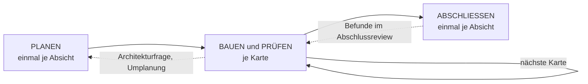
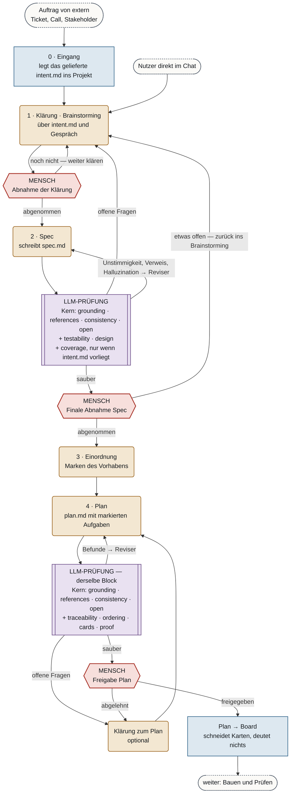
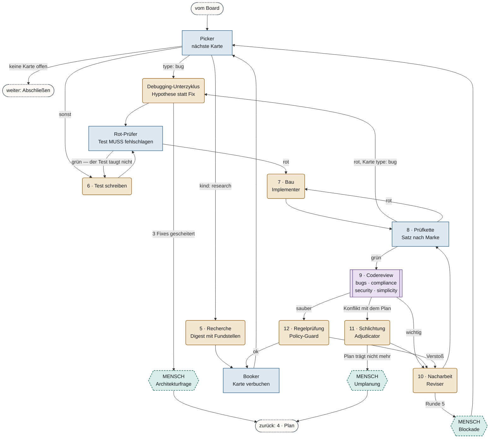
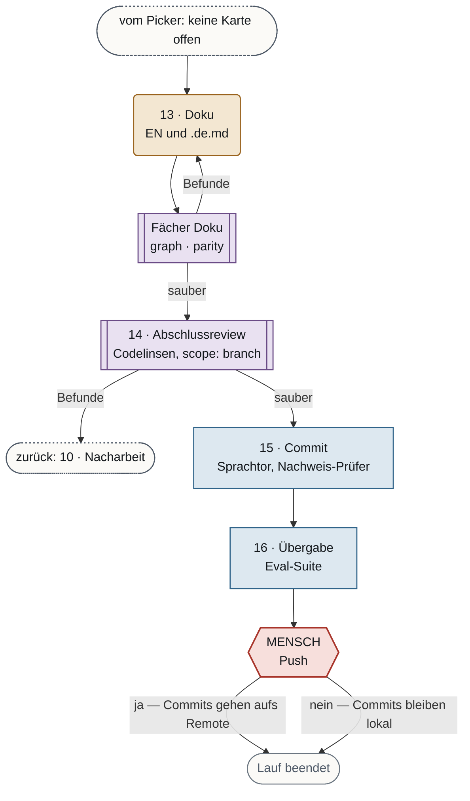

# Agent-Harness: der lokale Entwicklungszyklus als Graph

**Stand:** 2026-09-11 · **Zweig:** `feature/agent-harness` · **Kein Spec.**
Begleitpapier: [Knotenkatalog](2026-09-10-agent-harness-knotenkatalog.md)

Zwei Eingänge, siebzehn Phasen, sechs Schleifen und acht Stellen, an denen ein
Mensch antwortet: vier davon immer und vier nur dann, wenn das Modell nicht
weiterkommt. Auslieferung und Betrieb gehören nicht
in dieses Bild.

## Legende

| Form | Knotenart | Bedeutung |
|---|---|---|
| `[ Rechteck ]` blau | Codeknoten | deterministisch, kostet keine Tokens |
| `( abgerundet )` ocker | Agentenknoten | ein Modellaufruf |
| `[[ doppelt ]]` violett | Prüferfächer | N Linsen parallel, danach zusammengeführt |
| `{{ Sechseck }}` rot | Mensch, unabdinglich | Tor: eine Frage, der Lauf endet und lässt sich wiederaufnehmen |
| `{{ Sechseck }}` grün gestrichelt | Mensch, optional | Notausgang, wenn es nicht weitergeht |
| `([ Stadion ])` grau gestrichelt | Eingang oder Verweis | Start, oder Sprung in einen anderen Abschnitt |

## Überblick

## 1. Planen

**Zwei Eingänge, ein Treffpunkt.** Ein Auftrag von extern (Ticket, Call,
Stakeholder) liefert ein `intent.md`, das ins Projekt gelegt wird. Oder du
beginnst direkt im Chat. Beide Wege münden ins Brainstorming, und es läuft so
lange, bis du die Klärung **abnimmst**. Erst dann wird die Spec geschrieben.

Ein eigenes Annahmetor für externe Aufträge gibt es nicht mehr. Die Abnahme der
Klärung übernimmt diese Rolle auf beiden Wegen. Soll ein Auftrag nicht
weiterverfolgt werden, nimmst du die Klärung nicht ab, und der Lauf endet.

**`intent.md` gibt es nur auf dem Auftragsweg.** Beginnst du im Chat, ist die
Spec das erste Artefakt. Ein nachgeschriebenes `intent.md` wäre dort nur eine Kopie
der Spec: Problem, Ziel, Randbedingungen und verworfene Alternativen stehen
ohnehin in ihr. Deshalb läuft auch die Linse `coverage` nur, wenn ein
`intent.md` vorliegt. Sie braucht einen Maßstab, den niemand im Harness
geschrieben hat, und den gibt es nur, wenn die Anforderung von außen kommt.
Beginnst du im Chat, übernimmst du den Abgleich an der finalen Abnahme der Spec,
weil du im Gespräch dabei warst.

**Ein Prüfblock, zweimal eingesetzt.** Spec und Plan durchlaufen
dieselbe Prüfung mit derselben Rolle und derselben Anweisung, nur das Artefakt
davor wechselt. Vier Linsen bilden den gemeinsamen Kern:

| Linse | Fehlerbild |
|---|---|
| `grounding` | Halluzination: eine genannte Datei, Funktion, ein Schalter oder eine Messung, die es nicht gibt. Gegen das Repo nachgerechnet, nicht gelesen |
| `references` | ein Verweis oder Link zeigt ins Leere |
| `consistency` | Widerspruch im Dokument |
| `open` | offene Frage, stehengebliebener Platzhalter, aufgeschobene Entscheidung |

Dazu kommen die Linsen je Artefakt:

| Artefakt | Linse | Fehlerbild |
|---|---|---|
| `spec.md` | `coverage` | Anforderung erfunden, oder das `intent.md` ist nicht gedeckt. Nur auf dem Auftragsweg |
| | `testability` | ein Kriterium, das niemand prüfen kann |
| | `design` | Schnittstellen, Fehlerfälle, Datenmodell, Bedrohung oder Leistung tragen nicht |
| `plan.md` | `traceability` | Aufgabe ohne Bezug zur Spec, oder Spec-Punkt ohne Aufgabe |
| | `ordering` | Abhängigkeit verletzt; zwei Aufgaben fassen dieselbe Datei an |
| | `cards` | das Board kann keine Karten schneiden: Marke fehlt, oder die Aufgabe ist zu groß für einen Zug |
| | `proof` | Aufgabe ohne benannten Beweis, dass sie fertig ist |

Der Kern hat beim Zusammenführen **Vorrang**: meldet er etwas, geht das Artefakt
zurück, bevor ein anderer Befund gewichtet wird. Alle Linsen laufen trotzdem
parallel, denn der Kern besteht meistens.

**Wohin ein Befund geht, hängt davon ab, wer ihn beheben kann.** Eine
Unstimmigkeit, ein toter Verweis oder eine Halluzination lässt sich am Dokument
reparieren; das macht der Reviser. Eine **offene Frage** kann nur der Nutzer
beantworten, deshalb geht sie zurück ins Brainstorming und nicht an den
Reviser, der sie sonst mit einer erfundenen Antwort schließen würde. Nach
derselben Regel geht eine offene Frage im Plan in die Klärung zum Plan.

**Der Mensch sieht nur ein sauberes Artefakt**, weil die Schleife zwischen
Erzeuger und Prüfung vorher ausläuft. Bleibt bei der finalen Abnahme trotzdem
etwas offen, geht es zurück ins Brainstorming.

**Der Plan schneidet die Karten, nicht das Board.** Jede Aufgabe im `plan.md`
trägt schon `type`, `area`, `size`, ihre Abhängigkeiten und ihren Beweis.
`Plan → Board` übernimmt das wörtlich und deutet nichts.

**Kein gezeichneter Verwurf vom Plantor zurück zur Spec.** Ein Tor beendet den
Lauf. Wer den Plan ganz verwirft, antwortet nicht und startet einen neuen Lauf
ab der Spec. Eine gezeichnete Kante würde die Spec auf den Zyklus des Plans
legen, und ihr Besuchsdeckel müsste Spec-Runden mal Plan-Runden abdecken.

## 2. Bauen und Prüfen — je Karte

**Die Reihenfolge der Kanten trägt Bedeutung.** `next_name` nimmt die erste
Kante, deren Bedingung hält. Eine Kante ohne Bedingung hält immer und steht
deshalb zuletzt. Aus `pick` heißt das: zuerst „keine Karte offen", dann
Recherche, dann Fehler, und die unbedingte Kante in den Bau ganz am Ende.
Dasselbe gilt für `verify`: eine rote Fehlerkarte geht zurück ins Debugging,
bevor die allgemeine Kante „rot → Bau" greift.

**Nacharbeit läuft durch die Prüfkette.** Der Reviser ändert Code, also muss die
Änderung erst wieder grün sein, bevor der Codefächer sie erneut liest.

## 3. Abschließen — einmal je Absicht

## Mensch in der Schleife

Ein Tor stellt **eine** Frage, und der Lauf endet so, dass er sich
wiederaufnehmen lässt. Weitergefahren wird mit `ultraloom resume --answer`, und
die Antwort wählt die Kante. Jedes Tor hat deshalb zwei Ausgänge.

### Unabdinglich

| Tor | wann | warum | bei „nein" |
|---|---|---|---|
| Abnahme der Klärung | Ende des Brainstormings, auf beiden Eingängen | du erklärst die Klärung für fertig; erst dann wird eine Spec geschrieben. Ersetzt das frühere Annahmetor für externe Aufträge | weiter klären; wird nie abgenommen, endet der Lauf |
| Finale Abnahme Spec | die LLM-Prüfung meldet sauber | ob es die *richtige* Absicht war, prüft kein Modell | etwas offen: zurück ins Brainstorming |
| Freigabe Plan | LLM-Prüfung meldet sauber | der letzte Punkt, an dem eine Kurskorrektur billig ist | Klärung zum Plan, dann neuer Plan |
| Push | nach Commit und Eval-Suite | Projektregel: ein Lauf darf committen, über das Remote entscheidet ein Mensch | Commits bleiben lokal |

### Optional — wenn das Modell nicht weiterkommt

| Tor | Auslöser | warum |
|---|---|---|
| Blockade | Runde 5 der Nacharbeit an derselben Karte; ab Runde 4 lief schon ein stärkeres Modell | die Sicherung fällt, statt eine sechste Runde zu versuchen |
| Architekturfrage | 3 gescheiterte Fixes im Debugging | kein vierter Versuch, sondern die Bauart infrage stellen |
| Umplanung | der Schlichter findet, dass der Plan nicht mehr trägt | der Schlichter darf entscheiden, aber nicht den Plan wegwerfen |
| Triage *(nur Anhang)* | ein Detektor schreibt ein `intent.md` | das einzige Artefakt ohne menschlichen Autor; ohne Triage wird aus der Schleife ein Generator |

## Schleifen

`validate()` weist einen Knoten ab, der auf einem Zyklus sitzt und nur einen
Besuch erlaubt. Jede Schleife hier braucht deshalb einen Deckel.

| # | Schleife | Weg | Deckel |
|---|---|---|---|
| L1 | Artefaktschleife | Spec ⇄ LLM-Prüfung · Plan ⇄ LLM-Prüfung · Doku ⇄ Fächer | 5 Runden. Ab Runde 4 ein frischer Arbeiter eine Modellstufe höher; in Runde 5 entscheidet der Schlichter jeden offenen Befund einzeln |
| L2 | Klärungsschleife | Abnahme der Klärung → Klärung · Prüfung (offene Fragen) → Klärung · Finale Abnahme Spec → Klärung · Freigabe Plan → Klärung zum Plan → Plan | `max_visits` über eins an allen drei Toren und an der Klärung, sonst lehnt `validate()` den Graphen ab. Ein Rundendeckel ergibt hier wenig Sinn: die Schleife treibt ein Mensch, nicht das Modell |
| L3 | Rot-Grün | Test → Rot-Prüfer → Bau → Prüfkette → Bau | die Rundenzahl der Karte. Der Rot-Prüfer schickt zurück, wenn der neue Test grün ist, denn dann prüft er nichts |
| L4 | Kartenschleife | Picker → … → Booker → Picker | aus der Kartenzahl gerechnet, je Knoten aus seiner Rolle im Automaten |
| L5 | Debugging | Debugging → Rot-Prüfer → Bau → Prüfkette → Debugging | 3 Fixversuche, dann das Tor Architekturfrage. Keine Reparatur, bevor die Ursache feststeht |
| L6 | Äußere Schleife *(Anhang, optional)* | Detektor → `intent.md` → Triage → Phase 0 | die Bänder: 1σ protokollieren, 2σ mit `read_only` diagnostizieren, 3σ mit `edit` vorschlagen |

## Phasen

| # | Phase | Art | Was sie tut | Ausgabe |
|---|---|---|---|---|
| 0 | Eingang | Code | Ein Auftrag von extern liefert ein `intent.md`, das ins Projekt gelegt wird. Beginnst du direkt im Chat, gibt es nichts abzulegen | `intent.md` oder nichts |
| 1 | Klärung | Agent + Tor | Brainstorming über `intent.md` und Gespräch, bis du die Klärung abnimmst | abgenommene Klärung |
| 2 | Spec | Agent + LLM-Prüfung | Anforderungen und Entwurf in einem Dokument, deshalb keine eigene Entwurfsphase. Enthält auch Problem, Ziel, Randbedingungen und verworfene Alternativen; auf dem Ideenweg ist sie das erste Artefakt | `spec.md` |
| 3 | Einordnung | Agent | Marken des Vorhabens. *Offen: einfalten, weil der Plan die Marken inzwischen selbst vergibt* | Marken |
| 4 | Plan | Agent + LLM-Prüfung | Dateien, Reihenfolge, Risiken, Beweis. Schneidet die Aufgaben selbst, jede mit `type`, `area`, `size`, Abhängigkeiten und Beweis | `plan.md` mit markierten Aufgaben |
| 5 | Recherche | Agent | holt Wissen von außen, jede Behauptung mit Fundstelle; einziger Knoten mit Profil `mcp` | Digest |
| 6 | Test schreiben | Agent + Code | Test zuerst, und der Rot-Prüfer belegt, dass er fehlschlägt | Testdatei, rotes Protokoll |
| 7 | Bau | Agent | einziger Knoten mit `edit` am Produktivcode; liest seinen Aufgabenbrief, nie den ganzen Plan | Diff, Commit |
| 8 | Prüfkette | Code | Lint, Typen, Tests, Coverage, plus was die Marke verlangt: Sichtvergleich und WCAG bei `frontend`, Migrationslauf bei `data`, SAST bei `security` | Urteil |
| 9 | Codereview | Fächer | vier Linsen parallel: `bugs` (falsch), `compliance` (richtig gebaut, aber nicht das Verlangte), `security`, `simplicity`. Danach entdoppeln, nach Schwere ordnen, Kleinkram auf fünf deckeln | Befunde |
| 10 | Nacharbeit | Agent | arbeitet Befunde ein und darf einen begründet ablehnen; die Ablehnung steht im Journal | Änderung |
| 11 | Schlichtung | Agent | entscheidet, wo Befund und Plan sich widersprechen; die Antwort trägt `cost_if_wrong` | Entscheidung |
| 12 | Regelprüfung | Agent | kein `Any`, kein `type: ignore` ohne Begründung, Kommentare englisch, keine Testdatei angefasst, die nicht angefasst werden durfte | Urteil |
| 13 | Doku | Agent + Fächer | englische Fassung plus `.de.md`; der Fächer hält das Mermaid-Diagramm gegen den echten Graphen | Flow-Seite |
| 14 | Abschlussreview | Fächer | dieselben Codelinsen mit `scope: branch` auf dem stärksten Modell; hier wird der abgelegte Kleinkram vorgelegt | Befunde |
| 15 | Commit | Code | Nachricht, Sprachtor, und der Nachweis-Prüfer verlangt die Ausgabe des Prüfbefehls, bevor „grün" behauptet wird | Commit |
| 16 | Übergabe | Code + Tor | die Eval-Suite fährt den Harness gegen sich selbst; sinkt die Bestehensquote, braucht die Änderung eine Freigabe | Bestehensquote |

## Offen

- **Einordnung einfalten?** Der Planschreiber sieht Spec und Absicht und vergibt
  die Marken ohnehin. Ein Knoten, dessen Ausgabe der nächste überschreibt, ist
  ein Modellaufruf ohne Ertrag.
- **Picker:** Code- oder Agentenknoten.
- **Artefaktnamen des Playbooks** (`intent.md`, `spec.md`, `plan.md`) übernehmen?
- **Modell im `FlowContext`:** ohne das gibt es keinen Fächerknoten.
