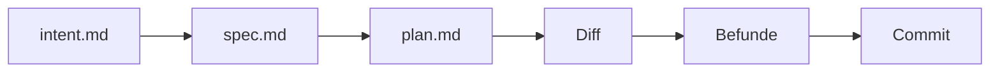
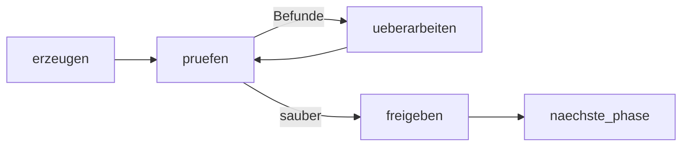

# Knotenkatalog des Agent-Harness

**Stand:** 2026-09-10 · **Zweig:** `feature/agent-harness` · **Kein Spec.**

Dieses Papier zählt auf, *welche Arten von Knoten es gibt* — nicht, wie sie
verbunden werden. Kanten und Modellzuordnung bleiben offen. Zweck ist, aus einer
vollständigen Liste heraus zu entscheiden, statt beim Zeichnen zu merken, dass
etwas fehlt.

**Zuschnitt:** der reine Entwicklungszyklus auf dem eigenen Rechner, von der
Absicht bis zum Commit. Auslieferung und Betrieb stehen im Anhang (§13) und sind
optional; der Lauf endet am Push-Gate.

Vierte Fassung, nach `superpowers`, den gängigen Lebenszyklen, dem **AI-Native
SDLC Playbook** von Anthropic und einer Kritik daran (Quellen am Ende).

## 1. Die Artefaktkette

Der wichtigste Satz des Playbooks: **jede Stufe endet damit, ein Artefakt zu
committen, das die nächste liest.** Die Commit-Historie ist damit die Prüfspur.

| Stufe | Artefakt | Inhalt |
|---|---|---|
| Absicht | `intent.md` | Titel, Autor, Status; Problem, gewünschtes Ergebnis, betroffene Systeme, Randbedingungen, offene Fragen |
| Entwurf | `spec.md` | Anforderungen und Entwurf in einem, mit markierten Bedenken |
| Planung | `plan.md` | welche Dateien, in welcher Reihenfolge, Risiken, **Beweis** (welche Tests zeigen es) |
| Bau | Diff, Testausgabe | Nachweis der Prüfung |
| Prüfung | Befunde, `REVIEW.md` | Prüfpolitik und Ergebnis |

**Damit löst sich ein offener Punkt der zweiten Fassung.** Dort stand, der
Arbeitsbaum sei ein Übergabekanal *ohne* Journal. Die Antwort ist: **committen.**
Jede Phase endet mit einem Commit, dessen SHA als flaches Feld in den Zustand
wandert — `intent_sha`, `spec_sha`, `plan_sha`. Schemakonform, das Journal führt
die Kette per Verweis, und es ist zugleich der Provenienzstempel, den die Kritik
verlangt: ein Artefakt trägt die SHA dessen, woraus es abgeleitet wurde.

**Zwei Glieder dieser Kette prüft niemand von selbst** — die Kritik benennt
genau die Stellen, an denen dieser Katalog Linsen vorsieht (§3):

| ungeprüftes Glied | Linse |
|---|---|
| `intent.md` → `spec.md` | `coverage`: deckt die Spec die Absicht, oder wurden Anforderungen erfunden? |
| Diff → `spec.md` | `compliance`: baut der Diff, was die Spec verlangte — nicht nur: baut er es richtig? |

## 2. Das Grundmuster

Innerhalb jeder Phase wiederholt sich **ein Muster** — nur das Artefakt
wechselt:

**Die Schleife trägt eigene Regeln, nicht die Knoten** — aus
`subagent-driven-development`, weil sie dort aus echten Läufen stammen:

- Runde 1–3: derselbe Arbeiter wird fortgesetzt.
- Runde ≥ 4: **frischer** Arbeiter, Modell **eine Stufe stärker**.
- Runde 5: Sicherung fällt, jeder offene Befund wird einzeln entschieden
  (→ Adjudicator).
- Geringfügige Befunde gehen nie in die Schleife; sie werden abgelegt und beim
  Abschlussreview vorgelegt.

Modelleskalation ist damit Eigenschaft **der Schleife**, nicht des Knotens.

**Zwei Rückkopplungen, nicht eine.** Die *während* der Arbeit (ein Knoten prüft
sich selbst, bevor jemand hinsieht — Tests, Build, Bildvergleich) und die
*danach* (ein frischer Knoten, der von der Arbeit nichts weiß). Die erste ist
dieses Muster, die zweite ist der Nachweis-Prüfer (§6.2).

## 3. Prüferfächer: eine Rolle, mehrere Linsen

„Prüfen" ist nie eine Frage, sondern mehrere unabhängige. Beim Code ist das
offensichtlich — allgemeine Fehler, Spec-Treue, Sicherheit sind drei Blicke, die
sich gegenseitig nicht ersetzen. Dasselbe gilt für jedes andere Artefakt.

Eine **Linse** ist eine Instanz der Prüferrolle mit eigenem `instruction`,
eigenem `model` und eigenem `effort`. Der Fächer ist die Menge der Linsen, die
auf ein Artefakt angesetzt werden.

### 3.1 Wie der Fächer läuft — und dass er heute schon parallel kann

N Linsen sind N unabhängige Lesevorgänge ohne gemeinsamen Zustand. Genau das
fächert die Prüfkette bereits auf: `checks.py:527–540` verteilt Befehle über
einen `ThreadPoolExecutor`, gedeckelt durch `max_parallel` aus
`.ultraloom/config.toml`.

Der Graphrunner dagegen läuft strikt sequenziell. Die Auflösung ist deshalb
nicht „nebenläufiger Runner", sondern: **ein Graphknoten, der intern fächert.**
Ein `CodeNode`, dessen `run` die N `Model.ask()`-Aufrufe unter denselben Pool
legt und *eine* Delta zurückgibt. Parallel heute, ohne neuen Runner.

Zwei Folgen, beide zu tragen:

- **Das Journal sieht einen Eintrag statt N.** Der Fächerknoten schreibt deshalb
  je Linse eine Berichtdatei und legt flache Felder in die Delta
  (`lens_security_verdict`, `lens_security_count`, …).
- **Eine Klempnerei fehlt.** `FlowContext` führt `root`, `config`, `options`,
  `baseline`, `run_files` — **kein Modell**. Das Modell entsteht in
  `cli.py:423` und geht an den `Runner`, nicht an `build()`. Ein modellrufender
  Codeknoten braucht es im Kontext; das ist eine kleine, aber echte Änderung.

Die Gegenbauart wäre **ein** Agent mit drei Durchgängen, so wie `REVIEW.md` es
beschreibt: ein Aufruf, ein Lesevorgang, billiger. Der Preis ist, dass die
Linsen um Aufmerksamkeit konkurrieren — eine schwache Linse verschwindet hinter
einer starken — und dass alle dasselbe Modell teilen. Mit dem Fächer bekommt
Sicherheit das stärkste und Stil das billigste Modell.

### 3.2 Die zweite Hälfte desselben Knotens: Befunde zusammenführen

Wenn der Pool zusammenläuft, gibt es N Berichte. Derselbe Knoten führt sie
zusammen, und hier lebt die Politik aus `REVIEW.md`:

- entdoppeln (zwei Linsen finden dieselbe Zeile),
- nach Schwere ordnen: was Verhalten bricht, Daten preisgibt oder eine Politik
  verletzt, ist wichtig; Stil und Benennung sind Kleinkram,
- **Kleinkram deckeln** — höchstens fünf, der Rest als Zahl,
- routen: wichtig → Reviser-Schleife, geringfügig → Ablage, Konflikt mit dem
  Plan → Adjudicator.

### 3.3 Die Fächer je Phase

Eine Linse wird aus einem **Fehlerbild** abgeleitet, nicht aus einer Tugend: was
sieht ein schlechtes Artefakt dieser Art aus? Drei bis fünf, nicht mehr — ein
Fächer, den niemand mehr liest, ist keiner.

**`spec.md`**

| Linse | Fehlerbild |
|---|---|
| `coverage` | Anforderung erfunden, oder die Absicht ist nicht gedeckt (Glied 1 aus §1) |
| `consistency` | Abschnitte widersprechen sich, Platzhalter stehen noch drin |
| `testability` | ein Abnahmekriterium, das niemand prüfen kann |
| `nonfunctional` | Sicherheit, Datenschutz, Leistung kommen gar nicht vor |

**`plan.md`**

| Linse | Fehlerbild |
|---|---|
| `traceability` | Aufgabe ohne Bezug zur Spec, oder ein Spec-Punkt ohne Aufgabe |
| `ordering` | Abhängigkeit verletzt; zwei Aufgaben fassen dieselbe Datei an |
| `size` | Aufgabe zu groß, um in einem Zug prüfbar zu sein (→ `size: l`, §10) |
| `proof` | Aufgabe ohne benannten Beweis, dass sie fertig ist |

**Entwurf**

| Linse | Fehlerbild |
|---|---|
| `interfaces` | Schnittstelle, die zwei Aufrufer verschieden verstehen |
| `errors` | Fehlerfälle sind nicht entworfen, nur der Gutfall |
| `threat` | Bedrohungsmodell fehlt (die Sicherheitsbrille am Entwurf) |
| `data` | Datenmodell ohne Migrationsweg |

**Tests**

| Linse | Fehlerbild |
|---|---|
| `assertion` | der Test behauptet nichts |
| `duplication` | die Logik des Codes ist im Test nachgebaut statt geprüft |
| `flake` | Zeit- oder Reihenfolgeabhängigkeit |

**Code** — der Fall, den du genannt hast:

| Linse | Fehlerbild |
|---|---|
| `bugs` | falsch: Logik, Randfälle, Regressionen |
| `compliance` | richtig gebaut, aber nicht das Verlangte (Glied 2 aus §1) |
| `security` | Injektion, Authentifizierung, PII |
| `simplicity` | doppelte Logik, unnötige Abstraktion, toter Code |

Nach Marke kommen hinzu (§9): `a11y` bei `frontend`, `performance` bei
`backend`, `migration` bei `data`.

**Dokumentation**

| Linse | Fehlerbild |
|---|---|
| `graph` | das Diagramm weicht vom Graphen ab — existiert bereits als Test (`tests/test_flow_docs.py`) |
| `parity` | die beiden Sprachfassungen tragen nicht dasselbe |

## 4. Verfahren je Phase

Brainstorming ist **keine eigene Phase**, sondern der erste Teil der Planung.
Was aber je Phase festgelegt sein muss, ist das **Verfahren** — der Wert des
Deskriptorfeldes `procedure`.

| Phase | Verfahren | Anmerkung |
|---|---|---|
| Absicht | — | Vorlage statt Verfahren: die Gliederung von `intent.md` |
| Planung, Teil 1 (Klärung) | `superpowers:brainstorming` | hier sitzt das Brainstorming |
| Planung, Teil 2 (Spec) | `superpowers:brainstorming` (Spec-Teil) + `spec-document-reviewer-prompt` | der Prüfer hat dort schon eine Vorlage |
| Planung, Teil 3 (Plan) | `superpowers:writing-plans` + `plan-document-reviewer-prompt` | |
| Test schreiben | `superpowers:test-driven-development` | trägt auch die Rot-Regel |
| Bau | `subagent-driven-development/implementer-prompt` | |
| Prüfung (Code) | `requesting-code-review/code-reviewer` + die Durchgänge aus `REVIEW.md` | Grundlage der Linsen aus §3.3 |
| Nacharbeit | `superpowers:receiving-code-review` | ausdrücklich: Befunde prüfen, nicht blind umsetzen |
| Debugging | `superpowers:systematic-debugging` | §8 |
| Abschluss | `superpowers:verification-before-completion` | das ist der Nachweis-Prüfer |
| Recherche | — | kein Kandidat; hier fährt agy/Gemini |
| Dokumentation | — | kein Kandidat |

Zwei Regeln zu dieser Tabelle:

- **Leere Zellen sind Information**, keine Lücke im Papier: dort gibt es heute
  kein Verfahren, und eines zu erfinden ist eine eigene Entscheidung.
- **Auf einem Gemini-Knoten muss das Verfahren ein gewöhnliches Markdown unter
  `docs/` sein.** `.claude/skills` liest dort niemand (§5.2).

## 5. Der Knotendeskriptor

Zwei Felder gehören der **Art**, der Rest der **Instanz** — diese Trennung
erlaubt später, den Katalog als TOML zu führen statt als Python (offen, §12).

| Feld | gehört | Bedeutung |
|---|---|---|
| `name` | Instanz | Adresse im Graphen |
| `kind` | **Art** | `code` \| `agent` \| `gate` |
| `schema` | **Art** | Antwortform; frozen dataclass, nur `str`/`int`/`float`/`bool` (`graph.py:38–44`) |
| `purpose` | Instanz | ein Satz: was dieser Knoten entscheidet oder erzeugt |
| `instruction` | Instanz | die vollständige Anweisung — der Prompt, als Funktion des Zustands |
| `procedure` | Instanz | Verfahrensdokument (§4) |
| `model` | Instanz | Name aus `[agent.models]`, nicht die Instanz selbst |
| `effort` | Instanz | `low` … `max` |
| `tools` | Instanz | Profil aus `tools.py`: `read_only`, `edit`, `shell`, `mcp` |
| `reads` | Instanz | welche Zustandsfelder und Dateien der Knoten sehen darf — **erzwungen, nicht dokumentiert** |
| `writes` | Instanz | Arbeitsbaum, Board, oder nichts |
| `applies_to` | Instanz | Prädikat über die Marken der Karte; leer heißt „immer" (§9) |
| `lens` | Instanz | bei Prüfern: welches Fehlerbild diese Instanz sucht (§3.3) |
| `scope` | Instanz | bei Prüfern: Aufgabe, Nacharbeit, ganzer Zweig |
| `evidence` | Instanz | welche Ausgabe vorliegen muss, damit Erfolg behauptet werden darf |
| `max_visits` | Instanz | Besuchsdeckel; Pflicht > 1 auf jedem Zyklus |
| `on_error` | Instanz | Zielknoten im Fehlerfall |

`instruction` bleibt der Kern: ein Knoten ist **Modell + Effort + vollständige
Beschreibung dessen, was er tut**.

### 5.1 Was der Graph mechanisch prüft

`validate()` weist heute ab: unbekanntes Kantenziel, unerreichbare Insel, Knoten
ohne Ausgang, ungedeckelter Zyklus. Dazu kommt **eine Regel aus dem Playbook,
und sie ist die erste, die der Harness durchsetzt statt sie zu bitten**:

> **Trennung der Pflichten.** Wer den Code geschrieben hat, darf ihn nicht
> abnehmen. Für jedes Paar (Producer, Prüfer) auf derselben Karte muss der
> `model`-Name verschieden sein — oder der Prüfer eine frische Instanz.

Prüfbar, weil `Entry` künftig den Modellnamen führt. Eine Regel, die nur im
Prompt steht, ist keine Trennung der Pflichten.

### 5.2 Zwei Orte der Durchsetzung

- **Skills sind beratend.** „A skill is a control, though an advisory one" — das
  Modell wendet sie wahrscheinlich an, nicht sicher. Das ist `procedure`.
- **Hooks sind deterministisch.** Sie erlauben, fragen oder blockieren am
  Werkzeugaufruf. ultraloom hat das bereits: `ulguard` als PreToolUse-Wache. Eine
  Blockade muss sich erklären — Grund *und* Weg zur Freigabe in der Ausgabe.

Der Graph entscheidet, *was* läuft; der Hook, *was dabei erlaubt ist*.

## 6. Die Arten

### 6.1 Agentenknoten

**Producer** — erzeugt ein Artefakt. Antwort: **vier Zustände mit je eigener
Behandlung** (aus `subagent-driven-development`):

| Status | Behandlung |
|---|---|
| `DONE` | Paket bauen, Fächer ansetzen |
| `DONE_WITH_CONCERNS` | Zweifel lesen. Korrektheit oder Zuschnitt → vor dem Prüfen klären; Beobachtung → notieren |
| `NEEDS_CONTEXT` | fehlenden Kontext nachreichen, neu rufen |
| `BLOCKED` | Kontext fehlt → nachreichen; zu schwer → stärkeres Modell; zu groß → zerlegen; **Plan falsch → Adjudicator** |

Werkzeuge: `edit`. Schreibt: Arbeitsbaum, und **endet mit einem Commit** (§1).
`reads` ist scharf: nie der ganze Plan, sondern der Aufgabenbrief (§6.2).
Instanzen: Intent-, Spec-, Plan-, Test-, Doku-Schreiber, Implementer,
**Planpflege** (ändert `plan.md`, wenn die Umsetzung abweicht — Eingabe ist die
Entscheidung des Adjudicators).

**Prüfer** — liest ein Artefakt durch **eine Linse** (§3). Findet, verbessert
nicht. Antwort: `verdict`, `count`, `worst`, `report_path`. Werkzeuge:
`read_only`. Modellklasse: **stärker als der Producer** — das ist der Sinn der
Rolle; je Linse aber eigen wählbar.

**Reviser (Überarbeiter)** — arbeitet Befunde ein. Antwort: `path`, `addressed`,
`refused`, `reason` — er darf begründet ablehnen, und das steht im Journal.
Werkzeuge: `edit`.

**Adjudicator (Schlichter)** — entscheidet, wo Befund und Auftrag sich
widersprechen: nicht den Befund verwerfen, nicht dem Plan folgen, sondern
entscheiden. Spec ist bindend, der Plan ist ihr Argument.
Antwort: `decision`, `reason`, `cost_if_wrong` — die dritte Angabe ist Pflicht;
eine Entscheidung ohne benannten Preis ist eine Meinung.

**Researcher** — holt Wissen von außen; jede Behauptung mit Fundstelle. Antwort:
`digest_path`, `sources`, `confidence`. Werkzeuge: `mcp`.

**Policy-Guard** — kein `Any`, kein `type: ignore` ohne Begründung, Kommentare
englisch, keine Testdatei angefasst, die nicht angefasst werden durfte. Existiert
als `guard` in `verify_until_green.py`. Kleines Modell reicht.

**Tagger** — ordnet eine eingehende Karte ein (§10). Effort: niedrig.

### 6.2 Codeknoten

**Executor** — führt ein deterministisches Werkzeug aus und macht ein Urteil
daraus: Prüfkette, `gofmt`, ein Testlauf, ein Sicherheitsscanner. Trägt
`applies_to`.

**Fächerknoten** — die N Linsen unter dem Pool, dann das Zusammenführen (§3).

**Rot-Prüfer** — der neue Test **muss** fehlschlagen, bevor der Implementer
läuft. Ohne ihn unterscheidet die Schleife „Test zuerst" nicht von „Test danach
geschrieben".

**Brief-Erzeuger** — zieht den Text *einer* Aufgabe in eine eigene Datei, damit
`reads` einhaltbar ist.

**Paketierer** — Prüfpaket als Datei: Commit-Liste, `--stat`, `git diff -U10`
seit dem gemerkten Basiscommit. Der wird **vor** dem Producer gemerkt; `HEAD~1`
verlöre bei mehreren Commits alle bis auf den letzten.

**Provenienz-Stempel** — schreibt in den Commit des Artefakts die SHA des
Artefakts, aus dem es abgeleitet wurde (§1).

**Eval-Suite** — die Prompts des Harness *sind* seine Konfiguration. 20–50 echte
Aufgaben, jede mit Abnahmekriterium (Tests grün, Lint sauber, Verhalten
unverändert, Politik eingehalten). Läuft bei jeder Änderung an `instruction`,
`procedure`, `tools` oder Hooks; eine sinkende Bestehensquote braucht eine
Freigabe. Die Rekursion ist beabsichtigt: die Suite fährt den Harness gegen sich
selbst.

**Booker** — verbucht eine Antwort im Board, schreibt den Zustandsübergang und
stellt den Prüfsatz der Karte aus ihren Marken zusammen (§9).

**Picker** — wählt die nächste Karte. Offen, ob Code oder Agent. Darf **bündeln**:
mehrere gleichförmige kleine Karten in einen Auftrag.

**Reporter** — schließt den Lauf ab: was grün wurde, was offen blieb, wo das
Journal liegt, welcher Kleinkram abgelegt wurde.

**Nachweis-Prüfer** — Erfolg darf nur behauptet werden, wenn die Ausgabe des
Prüfbefehls vorliegt. Das ist `evidence`, an einem Knoten durchgesetzt.

**Budget-Wächter / Rundenbrecher** — bricht ab, wenn Tokens, Zeit oder Runden
erschöpft sind; bei Runde 5 übernimmt der Adjudicator.

### 6.3 Tore

**Gate** — hält an, stellt **eine** Frage, beendet den Lauf wiederaufnehmbar.
Fünf Anlässe im lokalen Zyklus:

- **Annahme** eines `intent.md` — die Entscheidung, dass daraus Arbeit wird.
- **Freigabe** von Spec oder Plan.
- **Blockade**: Nacharbeitsgrenze gerissen.
- **Architekturfrage** nach drei gescheiterten Fixes an derselben Sache.
- **Push** — „No subagent pushes. A run may commit; whether those commits reach
  the remote is a human's decision."

## 7. Was aus `superpowers` nichts Neues wurde

- *Implementer / Task-Reviewer / Re-Reviewer* → Producer und Prüfer mit `scope`.
- *Ledger* → das Journal, plus zwei Zustandsfelder: Entscheidungen des
  Adjudicators, Ablage des Kleinkrams.
- *Model Selection* („das schwächste Modell, das die Rolle trägt"; „Zugzahl
  schlägt Tokenpreis") → Regel für `model` und `effort`.
- *Dispatching parallel agents* → für den Fächer nicht nötig (§3.1). Für
  parallele *Karten* schon; die ehrliche Grenze nennt das Playbook: „wie viele
  Ströme ein Mensch noch ordentlich prüfen kann".
- *Using git worktrees* → Vorbedingung eines Laufs, kein Knoten.

## 8. Der Debugging-Unterzyklus

`systematic-debugging` ist dasselbe Muster mit einem anderen Artefakt: einer
**Hypothese**. Keine neuen Rollen — zwei harte Regeln und ein Tor:

- **Keine Reparatur ohne Ursachensuche.**
- **Vor dem Fix ein fehlschlagender Test** (Rot-Prüfer).
- **Architekturfrage-Gate** nach drei gescheiterten Fixes.

Als Instanzen treten auf: Reproduktion, Instrumentierung an den
Komponentengrenzen (Executor mit `shell`), Rückwärtsverfolgung zum Ursprung des
falschen Werts, Vergleich gegen ein funktionierendes Beispiel.

## 9. Prüfprofile nach Marke

Der Tagger vergibt nicht nur Etiketten, er **wählt aus, welche Prüfer laufen.**
Der Mechanismus existiert: `ultraloom check` kennt Profile, `[verify]` bildet
Prüfart auf Befehl ab. Jede Executor- und Linseninstanz trägt `applies_to`, der
Booker stellt den Satz zusammen — `verify` bleibt **ein** Knoten, dessen Inhalt
sich mit der Karte ändert.

| Bereich | zusätzlich |
|---|---|
| `frontend` | Sichtvergleich gegen Baseline, Linse `a11y`, End-to-End |
| `design` | Design-Token-Audit **vor** der Komponentenarbeit |
| `backend` | API-Kontraktprüfung, Linse `performance` |
| `data` | Migration vorwärts und rückwärts, Trockenlauf, Datenverlustprüfung |
| `infra` | Konfigurationslinter, Geheimnisscan |
| `security` | SAST, Abhängigkeitsaudit |
| alle | Lint, Typen, Tests, Coverage, Policy-Guard, Codefächer aus §3.3 |

## 10. Backlog und Marken

Wenige Marken, die auf eine Handlung zeigen — eine große Taxonomie wird nicht
konsistent angewendet.

| Marke | Werte | wozu |
|---|---|---|
| `type` | `bug`, `feature`, `refactor`, `chore`, `docs`, `spike`, `security` | bestimmt die Phasenkette: ein `bug` startet im Debugging-Unterzyklus, ein `spike` endet mit einer Antwort statt mit Code |
| `area` | `frontend`, `backend`, `data`, `infra`, `design`, `docs` | bestimmt Prüfsatz und Linsen (§9) |
| `priority` | Zahl | Reihenfolge des Pickers |
| `size` | `s`, `m`, `l` | `l` heißt: zerlegen — der rekursive Plan-Producer |

**Grenze:** Abhängigkeiten sind eine Liste, das Antwortschema erlaubt nur flache
Skalare. Entweder `blocked_by` als kommagetrennte Zeichenkette, die der Booker
zerlegt, oder ein Aufruf je Abhängigkeit. Zu entscheiden.

## 11. Das Raster

| # | Phase | Producer | Fächer (§3.3) | Executor | Gate |
|---|---|---|---|---|---|
| 0 | Aufnahme | Intent-Schreiber | — | `intake` | **Annahme** |
| 1 | Einordnung | **Tagger** | — | — | — |
| 2 | Planung: Klärung | Producer (Brainstorming) | — | — | — |
| 3 | Planung: Spec | Producer | `coverage`, `consistency`, `testability`, `nonfunctional` | Provenienz-Stempel | Freigabe |
| 4 | Planung: Entwurf | Producer | `interfaces`, `errors`, `threat`, `data` | Token-Audit | — |
| 5 | Planung: Plan | Producer | `traceability`, `ordering`, `size`, `proof` | `plan_to_board`, Brief-Erzeuger | Freigabe |
| 6 | Recherche | **Researcher** | Belegprüfung | — | — |
| 7 | Test schreiben | Producer | `assertion`, `duplication`, `flake` | **Rot-Prüfer** | — |
| 8 | Bau | Producer | — | — | — |
| 9 | Prüfung | — | — | Prüfsatz aus §9 | — |
| 10 | Codereview | — | `bugs`, `compliance`, `security`, `simplicity` (+ nach Marke) | Paketierer | — |
| 11 | Nacharbeit | **Reviser** | dieselben Linsen, `scope: fix` | Rundenbrecher | Blockade |
| 12 | Schlichtung | — | **Adjudicator** | — | Architekturfrage |
| 13 | Regelprüfung | — | **Policy-Guard** | — | — |
| 14 | Doku | Producer | `graph`, `parity` | `doc_check` | — |
| 15 | Abschlussreview | — | Codelinsen, `scope: branch` | Paketierer | — |
| 16 | Commit | Producer (Nachricht) | — | `commit-msg`-Tor, Nachweis-Prüfer | — |
| 17 | Übergabe | — | — | Eval-Suite | **Push-Gate** |

## 12. Offen

- **Wer wählt** (Picker: Code oder Agent) und **wie verbunden wird**.
- **Übernehmen wir die Artefaktnamen des Playbooks** (`intent.md`, `spec.md`,
  `plan.md`, `REVIEW.md`)? Dieses Repo legt Arbeitspapiere heute unter
  `docs/.superpowers/` ab.
- **Das Modell in den `FlowContext`** (§3.1) — kleine Änderung, aber ohne sie
  gibt es keinen Fächerknoten.
- **Ob der Katalog Daten oder Code ist.**
- **`blocked_by`** als Zeichenkette oder als mehrere Aufrufe (§10).
- **Metriken.** Das Playbook gibt je Stufe Früh- und Spätindikator (Zeit von
  `intent.md` bis `spec.md`; Zahl der `spec.md`-Commits nach dem ersten
  `plan.md` als Maß der Nacharbeit; Anteil der Änderungen, die im ersten
  Durchgang durchgehen; Bestehensquote der Evals). Vermutlich eine **Abfrage
  über das Journal**, kein Knoten — `Entry` führt `seconds`, `tokens`, künftig
  `model`, und `visits` zählt die Nacharbeitsrunden. Nachzurechnen.
- **Leere Zellen in §4** — für Recherche und Dokumentation gibt es kein
  Verfahren.

## 13. Anhang: außerhalb des lokalen Zyklus

Optional, und heute nicht Teil des Zuschnitts. Festgehalten, damit die Schleife
später ohne Neuentwurf geschlossen werden kann.

Ein *Lauf* endet am Push-Gate. Die *Schleife* schließt sich über Läufe hinweg:
ein **Detektor** überwacht eine Kennzahl — **deterministisch, versioniert, mit
eigenen Tests, ohne Modell**; die Erkennung bleibt in der Hand, das Modell wird
erst danach gerufen. Die Stufe bestimmt das Werkzeugprofil:

| Band | Handlung | Profil |
|---|---|---|
| 1σ | protokollieren | keins, kein Modellaufruf |
| 2σ | diagnostizieren | `read_only` |
| 3σ | vorschlagen (PR oder vorab freigegebener Ablauf) | `edit`, danach Push-Gate |

Bei 3σ schreibt der Lauf seine Diagnose als `intent.md` — und ein **Triage-Gate**
entscheidet, ob daraus Arbeit wird. Das ist das dritte ungeprüfte Glied der
Kette: das einzige Artefakt ohne menschlichen Autor. Ohne Triage wird aus der
geschlossenen Schleife ein Generator.

## 14. Was der Harness nebenbei löst

Kontexterschöpfung. Jeder Knoten ist ein frischer Aufruf, der nur den Zustand
und seine Anweisung sieht. Genau deshalb führt `subagent-driven-development` ein
Fortschrittsbuch: dort überlebt der Verlauf die Verdichtung nicht. Hier sind
Journal und Artefaktkette die Übergabe.

## Quellen

**AI-Native SDLC Playbook (Anthropic)**

- [The AI-Native SDLC playbook (Blog)](https://claude.com/blog/the-ai-native-sdlc-playbook)
- [Introduction](https://academy.claude.com/courses/ai-native-sdlc-playbook/introduction)
- [Capture as intent.md](https://academy.claude.com/courses/ai-native-sdlc-playbook/capture-intent)
- [Requirements and design](https://academy.claude.com/courses/ai-native-sdlc-playbook/requirements-and-design)
- [Plan mode as the default starting point](https://academy.claude.com/courses/ai-native-sdlc-playbook/plan-mode)
- [Skills as institutional knowledge](https://academy.claude.com/courses/ai-native-sdlc-playbook/skills-as-institutional-knowledge)
- [Parallel sessions and subagents](https://academy.claude.com/courses/ai-native-sdlc-playbook/parallel-sessions-and-subagents)
- [Give Claude a feedback loop](https://academy.claude.com/courses/ai-native-sdlc-playbook/give-claude-a-feedback-loop)
- [Continuous evals in CI](https://academy.claude.com/courses/ai-native-sdlc-playbook/continuous-evals-in-ci)
- [AI in the PR review loop](https://academy.claude.com/courses/ai-native-sdlc-playbook/ai-in-the-pr-review-loop)
- [Hooks as approval gates](https://academy.claude.com/courses/ai-native-sdlc-playbook/hooks-as-approval-gates)
- [Closing the loop on metrics](https://academy.claude.com/courses/ai-native-sdlc-playbook/closing-the-loop-on-metrics)

**Kritik und Umsetzung**

- [menuagentic: Three Links Have No Check](https://menuagentic.com/blogs/ai-native-sdlc-artifact-chain/)
- [Port: Implementing the Anthropic AI-Native SDLC Playbook](https://www.port.io/blog/anthropic-ai-native-sdlc-playbook)

**Lebenszyklen, Sicherheit, Ablagepflege, Frontend**

- [Atlassian: What is the Software Development Life Cycle?](https://www.atlassian.com/agile/software-development/sdlc)
- [AWS: What is SDLC?](https://aws.amazon.com/what-is/sdlc/)
- [Wiz: DevSecOps Pipeline Best Practices for 2026](https://www.wiz.io/academy/application-security/devsecops-pipeline-best-practices)
- [Cloudaware: DevSecOps Lifecycle](https://cloudaware.com/blog/devsecops-lifecycle/)
- [Dosu: Mastering Auto-Labeling](https://dosu.dev/blog/mastering-auto-labeling-taming-the-backlog-with-intelligent-labels)
- [Python Developer's Guide: GitHub labels](https://devguide.python.org/triage/labels/)
- [Storybook: The accessibility pipeline for frontend teams](https://storybook.js.org/blog/the-accessibility-pipeline-for-frontend-teams/)
- [alexop.dev: A Modern Frontend Quality Pipeline](https://alexop.dev/posts/modern-frontend-quality-pipeline/)
- [arXiv: LLM-Based Multi-Agent Systems for Software Engineering](https://arxiv.org/html/2404.04834v4)
- [arXiv: AgentMesh](https://arxiv.org/html/2507.19902)
