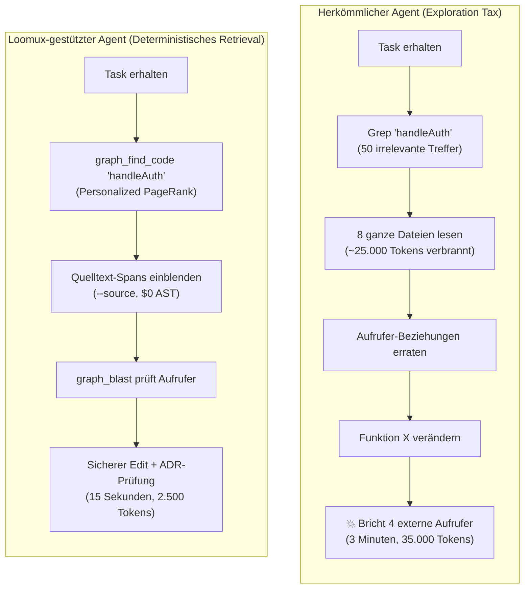
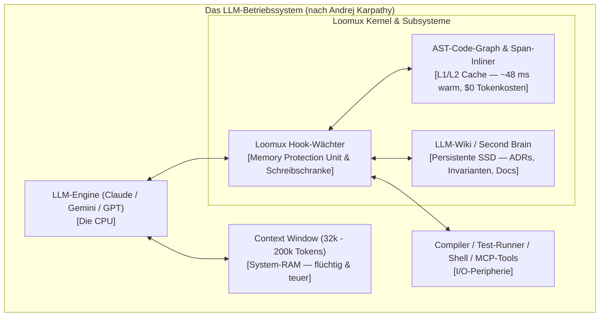
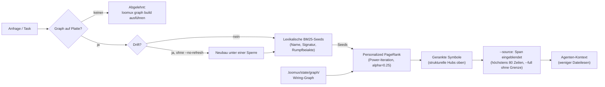
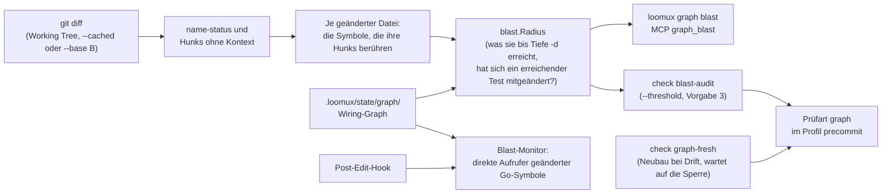
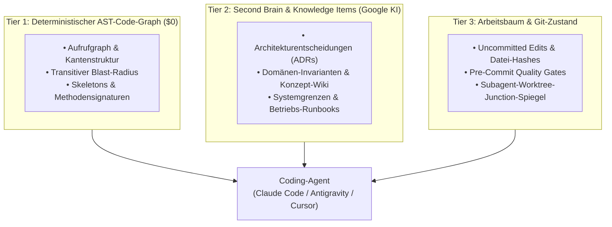

# Loomux Architektur & Konzeptionelles Fundament

> **„Entwickler arbeiten sich einmal in eine Codebasis ein. Coding-Agenten tun dies bei jeder einzelnen Sitzung von vorn.“**

Loomux schließt die fundamentale Lücke zwischen modernen Large Language Models (LLMs) und produktiven Software-Repositories. Es vereint **Hooks, Skills, Code-Graph + Loop Engineering, Second Brain / LLM-Wiki und LLM OS** in einem einzigen, abhängigkeits- und CGo-freien Go-Binary.

---

## 1. Das Kernproblem: Die Explorations-Steuer für Agenten

Jedes Mal, wenn ein autonomer Coding-Agent (Claude Code, Antigravity, Cursor) eine Aufgabe beginnt, startet er mit vollständiger Amnesie. Bevor er eine einzige Codezeile ändert, verbringt er Minuten mit blinder Erkundung des Repositories:
1. Er grept nach Begriffen (`grep "auth"`) mit hunderten irrelevanten Treffern.
2. Er liest ganze Dateien in das teure Context Window ein, um Abhängigkeiten zu erraten.
3. Er spekuliert über Aufruferstrukturen und Methoden-Receiver.
4. Er refaktoriert eine Funktion und bricht dabei unbemerkt 4 Aufrufer in entfernten Paketen.
5. Er verbrennt enorme Token-Mengen, agiert langsam und erzeugt subtile Regressionen.



Loomux beseitigt diese Explorations-Steuer durch eine einheitliche Laufzeitumgebung, die **Gedächtnis, Struktur und strikte Leitplanken** bereitstellt.

---

## 2. Säule I: Andrej Karpathys „LLM OS“-Architektur

Ende 2023 definierte der KI-Forscher Andrej Karpathy das LLM nicht als einfachen Chatbot, sondern als die **Central Processing Unit (CPU) eines neuartigen Betriebssystems**:
- **CPU**: Das LLM (Befehlsausführung, Schlussfolgerung, Synthese).
- **RAM**: Das Context Window (schnell, hohe Bandbreite, aber flüchtig, teuer und begrenzt).
- **L1/L2 Cache**: Der **deterministische AST-Code-Graph & Span-Inliner** (Struktur-Zugriff bei null Tokenkosten; `loomux graph ask` antwortet auf diesem Repository in ~48 ms warm, siehe [Benchmarks](benchmarks.md)).
- **Nichtflüchtiger Speicher (Festplatte / SSD)**: Das **Second Brain / LLM-Wiki** (kuratierte Architectural Decision Records (ADRs), Systemgrenzen, Invarianten, Runbooks).
- **Kernel & Memory Protection Unit (MPU)**: Die **Loomux Hooks & Schreibschranke** (erzwingt Datei-Grenzen, prüft Werkzeug-Aufrufe vorab, blockiert destruktive Systembefehle).
- **I/O-Peripherie**: Terminals, Compiler, Git und MCP-Protokoll-Server.



In dieser Architektur agiert Loomux als **Betriebssystem-Kernel und Laufzeit-Supervisor**:
- Es stellt sicher, dass der Agent keine geschützten Dateien überschreibt oder unzulässige Shell-Befehle ausführt (MPU / Schreibschranke).
- Es stellt ein nicht-flüchtiges Projektgedächtnis bereit, sodass Entscheidungen der Vorwoche nicht heute erneut erraten werden müssen (SSD / Wiki).
- Es versorgt die CPU mit mikroskopisch präzisen Code-Auszügen statt gigantischer Dateidumps (L1 Cache / eingeblendete Spans).

---

## 3. Säule II: Googles Open Knowledge / Knowledge Items (KI)

Reines Vektor-RAG scheitert an großen Codebasen. Wer Code in beliebige Textblöcke zerschneidet und in eine Vektordatenbank wirft, erhält unzusammenhängende Bruchstücke ohne architektonischen Kontext, Begründungen oder Schnittstellengrenzen.

Loomux adaptiert die Philosophie des **Open Knowledge und Knowledge Item (KI)**-Systems von Google DeepMind und Antigravity:

### 1. Kuratierte Wissens-Artefakte
Ein Knowledge Item ist kein unstrukturierter Textdump, sondern ein strukturiertes Markdown-Dokument:
- **Typisiertes Frontmatter**: Explizite Deklaration der Kategorie (`Architecture`, `Decision`, `Runbook`, `Data Model`).
- **Kontext & Begründung**: Das nicht-triviale *Warum* hinter dem Code, nicht bloß das *Was*.
- **Verifizierte Referenzen**: Klickbare Verknüpfungen zu Code-Symbolen, Tests und aktiven Spezifikationen.

### 2. Das Ground-Truth-Prinzip
> **„Knowledge Items sind verifizierte Startpunkte, nicht die absolute Wahrheit.“**

Code verändert sich. Eine Architekturnotiz von vor drei Monaten darf niemals ungeprüft Vorrang vor aktivem Code haben:
1. Der Agent liest das Wiki-ADR, um die ursprüngliche Absicht und Schnittstellengrenze zu verstehen.
2. Der Agent gleicht die Behauptung live mit dem aktiven AST-Code-Graphen ab (`loomux graph ask` / `callers`).
3. Wird ein Drift festgestellt, legt `loomux reconcile` ihn als Prüffall an, der Agent zieht die Seite nach, und `loomux lint` und `loomux wiki-gate` prüfen das Ergebnis.

### 3. Typologie & Taxonomien
Loomux erzwingt eine klare Wissens-Kategorisierung:
- **`CORE_TYPES`**:
  - `Architecture`: Systemtopologie, Modulgrenzen, Datenfluss-Invarianten.
  - `Decision`: Architekturentscheidungen (ADRs) mit Begründung vergangener Trade-offs.
  - `Open Question`: Ungeklärte technische Fragestellungen, die menschliche Abstimmung erfordern.
  - `Reference`: Kanonische Spezifikationen, externe Protokolle und RFCs.
- **`CATALOGUE_TYPES`**:
  - `API Endpoint`: REST-, gRPC- und MCP-Vertragsspezifikationen.
  - `Data Model`: Schemas, Structs, Datenbank-Entitäten und Validierungsregeln.
  - `Metric`: Performanz-Benchmarks, Latenzziele und SLAs.
  - `Runbook`: Betriebsprozesse, Failover-Anweisungen und Bereitstellungsleitfäden.
  - `Glossary Entry`: Begriffsdefinitionen des Projekts.
- **`ORIGIN_TYPES`**:
  - `Source`: Externe Quellen und Zitate.
  - `Topic`: Fachliche Domänenkonzepte und thematische Gruppierungen.
  - `Entity`: Konkrete Domänenobjekte und Systemidentitäten.
  - `Synthesis`: Querschnittsanalysen und Forschungssynthesen.

---

## 4. Säule III: Strukturelle Graph-Intelligenz

Reine Text-Embeddings können nicht feststellen, ob eine Änderung an `Funktion A` transitive Aufrufer in `Funktion B` bricht. Loomux wendet Graph-Prinzipien an, angeregt von [trailhq/Graft](https://github.com/trailhq/Graft):



> **Pakete.** Das Lesemodell und die beiden Rechner sind `internal/code/model`,
> `internal/code/pagerank` und `internal/code/blast`; den Graphen, den sie lesen,
> erzeugen `sourceset`, die Extraktoren in `extract/all` (`extract/golang` auf
> `go/parser`, `extract/python` auf dem gemeinsamen Tree-sitter-Kern
> `extract/treesitter`, der auf `gotreesitter` in reinem Go läuft), `resolve` und
> `store`, und `freshness` beantwortet, ob er noch zum Baum passt. `internal/code/lexicon` tokenisiert
> Anfragen und Dokumente und führt die Beiakte `ask-index.json`; `internal/code/ask`
> verschmilzt BM25-artige Relevanz über Name, Signatur und Rumpf mit Personalized
> PageRank (alpha=0.25), blendet Quelltext-Spans ein und fährt den gesperrten
> Neubau. `ask` importiert den Extraktor nicht: der Neubau kommt als
> `Rebuild`-Funktion herein, so bleibt der Abfragepfad vom Parser getrennt. Was
> noch offen ist (Stufen G5b bis G5d), steht in der
> [Roadmap](../../README.de.md#roadmap); jeden Befehl beschreibt die
> [CLI-Referenz](cli-reference.md).

### 1. „Lexik schlägt vor, der Graph entscheidet“
- **Lexikalischer Schritt** (G2): BM25- und Exakt-Symbol-Indizierung finden rasch Kandidaten-Knoten zu den Begriffen des Prompts.
- **Graph-Schritt** (G1, `internal/code/pagerank`): Ein **Personalized PageRank**-Random-Walk wird gestartet, besamt mit diesen Kandidaten. Durch die Graph-Kanten konzentriert sich die Wahrscheinlichkeitsmasse auf die echten strukturellen Hubs — isolierter Code, tote Hilfsfunktionen oder Test-Mocks werden automatisch nach unten gereiht.

Der Rang trifft die Kanten **ungerichtet**, wo der Blast-Radius darunter
dieselben Kanten gerichtet trifft. Wer einen Bereich verstehen will, dem wiegt
ein Aufruf nach außen so viel wie einer von außen, also muss die Masse über
einen Aufruf in beide Richtungen fließen; „wer bricht, wenn sich das ändert“
ist die andere Frage, und die hat eine Richtung. Eine Parallelkante wird nicht
zusammengefasst: sie zählt in der Nachbarliste doppelt und teilt die Masse
entsprechend, wie in der Referenz. Eine Kante, deren Ziel kein Knoten des
Graphen ist — ein unaufgelöster Import, der sein Modul nennt —, verwirft der
Rang, weil sie sonst Masse sammelte und als Ergebnis gemeldet würde, das
niemand öffnen kann.

### 2. Die Blast-Radius-Engine
Vor jeder Datei-Änderung oder PR-Zusammenführung berechnet Loomux die
**transitive Hülle** über die eingehenden Kanten (G1, `internal/code/blast`):
$$\text{BlastRadius}(S) = \{ u \in V \mid u \rightsquigarrow S \}$$
Dadurch wird der Agent sofort gewarnt:
> *„Änderung an `guard.go:checkTool` betrifft 8 Aufrufer in `cli`, `hooks` und `serve`.“*

Fünf Relationen tragen den Lauf — `calls`, `references`, `imports`,
`implements` und `extends`. `contains` bleibt bewusst draußen: eine Datei
enthält jedes in ihr definierte Symbol, ein Lauf über diese Kante machte also
jede Datei zum Hub und überschwemmte den Lauf. Wo der Rang ein unaufgelöstes
Ziel verwirft, behält der Lauf es als Treffer ohne Knoten, statt die
Abhängigkeit zu verstecken. Ein Knoten wird einmal gemeldet, in der kleinsten
Tiefe, in der ihn irgendein Startknoten erreicht hat; ein Startknoten ist nie
sein eigener Treffer.

Der Blast-Radius einer ganzen Änderung beginnt beim Git-Diff und läuft über
dieselben Kanten. Seit Stufe G4b ist alles davon gebaut:



### 3. Spans statt einer Crux
Eine Datei mit 1.000 Zeilen komplett einzulesen, nur um eine 20-zeilige Methode zu prüfen, verschwendet Kontext und Tokens. `loomux graph ask --source` hängt jedem Treffer seinen eigenen Span an, höchstens 80 Zeilen (`--full` hebt die Grenze auf), bei **$0 Tokenkosten** für die Suche. Der Crux des Vorbilds — ein Ausschnitt, den ein LLM gewählt und am Knoten abgelegt hat — bleibt bewusst weg: in loomux sitzt kein LLM im Pfad, und der Span ist der eigene Rückfall des Vorbilds für einen Knoten ohne Crux (`internal/code/ask/source.go`).

---

## 5. Säule IV: Die Sub-35ms Schreibschranke

Agenten-Harnesses rufen Hooks synchron bei jedem einzelnen Werkzeugaufruf auf. Benötigt ein Hook 700 ms (wie bei Python- oder Node-Laufzeiten üblich), verliert eine Sitzung mit 50 Werkzeugaufrufen über 35 Sekunden allein an Hook-Latenz.

Loomux läuft als kompaktes Go-Binary mit einem **Zielbudget von unter 35 ms**:

```
Hook-Laufzeit (warme Mediane, siehe Benchmarks, 2026-09-18):
├── Startboden (`loomux version`, SDK gelinkt):  6,4 ms
└── `hook pre-tool-use`, Edit auf README.md:     9,0 ms
```

### Strikte Entkopplung:
- **Hooks sprechen niemals mit HTTP-Servern**: `loomux hook pre-tool-use` ruft weder Sockets noch APIs auf. Es liest `stdin`, prüft die Schranke und beendet sich; ein Journal schreibt es nicht (ein Ereignisjournal unter `.loomux/state/journal/` ist mit dem Web OS geplant, Stufe W1).
- **Deterministische Ablehnung (Exit-Code 2)**: Jeder Schreibzugriff außerhalb registrierter Projektbereiche oder im Widerspruch zu `.loomux/config.toml` wird sofort mit klarer Begründung auf `stderr` blockiert.

---

## 6. Das 3-Tier Speicher- & Kontextmodell

Loomux koordiniert drei getrennte Speicherebenen, um Agenten vollständige Situationskontrolle zu geben:



Gemeinsam verwandeln diese drei Ebenen autonome Agenten von blinden Ratefüchsen in disziplinierte, architekturtreue Software-Ingenieure.
