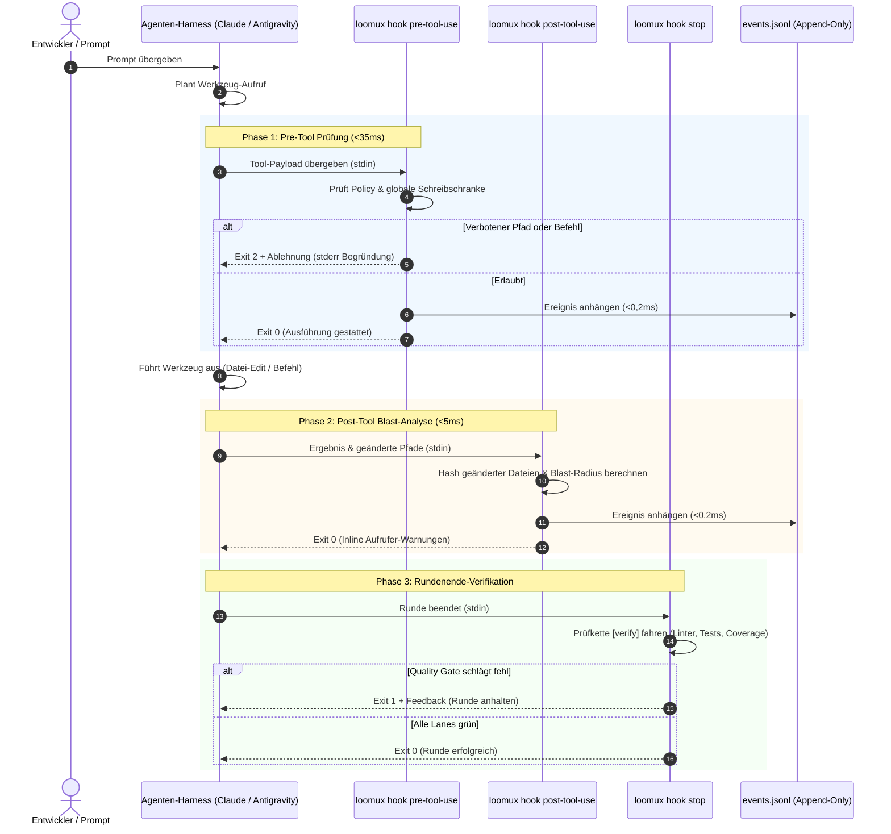

# Loomux Hook-Lebenszyklus & Host-Integration

Dieses Dokument beschreibt den Lebenszyklus der Hook-Ausführung, die Nutzlast-Spezifikationen für verschiedene Agenten-Harnesses und die entkoppelte Ereignisstrom-Architektur.

---

## 1. Der 4-Phasen Hook-Lebenszyklus

Loomux fängt Agenten-Interaktionen in vier kritischen Phasen ab:



---

## 2. Host-Nutzlastformate

Loomux normalisiert die Payloads der unterstützten Agenten-Hosts automatisch.

### A. Claude Code
Claude Code übergibt Standard-Tool-Call-Objekte auf `stdin`:

```json
{
  "tool_name": "Write",
  "tool_input": {
    "file_path": "C:/Projekte/loomux/.env"
  }
}
```

Für Shell-Befehle (`Bash`):
```json
{
  "tool_name": "Bash",
  "tool_input": {
    "command": "git push origin main"
  }
}
```

### B. Google Antigravity
Antigravity kapselt Werkzeugaufrufe in camelCase-Strukturen:

```json
{
  "toolCall": {
    "name": "write_to_file",
    "args": {
      "TargetFile": "C:/Projekte/loomux/.env",
      "CodeContent": "SECRET_KEY=12345"
    }
  }
}
```

Für Shell-Befehle (`run_command`):
```json
{
  "toolCall": {
    "name": "run_command",
    "args": {
      "CommandLine": "git push origin main"
    }
  }
}
```

Loomux verarbeitet beide Varianten nativ und überführt sie intern in eine einheitliche Repräsentation (`tool`, `input`).

---

## 3. Die entkoppelte Ereignisstrom-Architektur

Eine gefährliche Fehlerquelle in Agenten-Werkzeugen sind synchrone HTTP-Aufrufe oder IPC-Sockets von Hooks zu einem Hintergrunddienst. Dies erzeugt untragbare Latenzen (>10ms) und führt zum Komplettausfall, wenn der Hintergrunddienst abstürzt.

Loomux garantiert vollständige Entkopplung über ein **Append-Only Datei-Journal**:

```
Hook-Prozess (loomux hook pre/post-tool-use)
   │
   └── Schreibt einzelne JSON-Zeile (O_APPEND, <0,2ms)
       │
       ▼
.loomux/state/journal/events.jsonl
       │
       ▲
       └── Hintergrund-Tailing-Routine (Inotify / Stat-Polling)
           │
   ┌───────┴────────────────────────┐
   ▼                                ▼
loomux serve                   Verbundene Browser
(Root Gateway)                 (SSE /api/events)
```

1. **Null-Overhead beim Schreiben**: Hooks hängen Ereignisse direkt über Filedeskriptoren in `<0,2ms` an.
2. **Crash-Resistenz**: Läuft `loomux serve` nicht, arbeiten die Hooks ohne jede Beeinträchtigung weiter.
3. **Live-Synchronisation**: Läuft `loomux serve`, liest es neue Zeilen aus `events.jsonl` fortlaufend aus und streamt sie per Server-Sent Events (SSE) live an das Web OS Dashboard und das Kanban-Board.

---

## 4. Ablehnungs-Umschläge & Diagnose

Wird eine Aktion durch `loomux hook pre-tool-use` abgewiesen, gibt Loomux Folgendes aus:

### 1. `stdout` JSON-Envelope (für den Agenten-Host)
```json
{
  "hookSpecificOutput": {
    "permissionDecision": "deny",
    "permissionDecisionReason": "secrets are not written by an agent: .env"
  }
}
```

### 2. `stderr` Klartext (für Terminal & Logs)
```text
loomux policy refused this Write:
  - secrets are not written by an agent
```

### 3. Exit-Code: `2`
Exit-Code 2 signalisiert dem Agenten-Harness unmissverständlich, dass die Aktion verboten wurde und nicht mit denselben Parametern wiederholt werden darf.

---

## 5. Die post-edit-Lanes je Sprachstack

`loomux hook post-tool-use` liest den bearbeiteten Pfad aus der Nutzlast
(`file_path`, sonst `notebook_path`) und startet nur die Lanes des Stacks, zu
dem die Endung gehört — und nur, wenn dieser Stack im Projekt an seinen
Markerdateien erkannt wurde (`go.mod`, `pyproject.toml`, `Cargo.toml`,
`project.godot`, `tsconfig.json` neben `package.json`, …). Die Lanes laufen
parallel; eine scheiternde Lane beendet den Hook mit Exit 2 und ihrer Ausgabe
auf stderr.

| Stack | Endungen | Lanes |
|---|---|---|
| Python | `.py` | `ruff check --output-format=concise .` und ein Typprüfer: `mypy --no-error-summary --no-pretty`; `dmypy run -- --no-error-summary --no-pretty`, wo `uv.lock` liegt; `pyright` (`uv run pyright` mit `uv.lock`), wo `pyrightconfig.json` oder `[tool.pyright]` steht |
| GDScript | `.gd` | `gdlint <datei>`, im Verzeichnis des Godot-Projekts |
| C / C++ | `.c`, `.h`, `.cc`, `.cpp`, `.cxx`, `.hpp` | `clang-format -i <datei>`, `cmake --build build --parallel` |
| TypeScript / JavaScript | `.ts`, `.tsx`, `.js`, `.jsx` | `npx eslint --cache <datei>`, `npx tsc --noEmit` |
| Vue | `.vue` | `npx vue-tsc --noEmit` |
| Svelte | `.svelte` | `npx svelte-check` |
| CSS | `.css`, `.scss`, `.sass`, `.less` | `npx stylelint <datei>` |
| HTML | `.html`, `.htm` | `npx htmlhint <datei>` |
| Shell | `.sh`, `.bash`, `.zsh` | `shellcheck <datei>` |
| SQL | `.sql` | `sqlfluff lint <datei>` |
| Rust | `.rs` | `cargo clippy -- -D warnings`, `cargo fmt --check` |
| Go | `.go` | `go vet ./...` |
| Wiki | `.md` im Bündel | die Prüfung von `loomux lint <datei>`, im Prozess des Hooks selbst |
| — | `.md` außerhalb des Bündels; `.txt`, `.json`, `.yaml`, `.yml`, `.toml`, `.svg`, `.png`, `.jpg`, `.jpeg`, `.import`, `.lock` | keine; der Hook endet sofort mit 0 |

- **Ein Paket in einem Unterverzeichnis.** Ist das erste Verzeichnis des
  bearbeiteten Pfads keines von `src`, `lib`, `pkg`, `cmd`, `tests`, `test`,
  `dist`, `build`, `public`, laufen die Web-Lanes über das Paket dieses
  Verzeichnisses:
  `npx --prefix <verz> eslint --config <verz>/eslint.config.js --cache <datei>`
  und `npm --prefix <verz> run typecheck`; Vue fährt
  `npm --prefix <verz> run typecheck`, Svelte `npm --prefix <verz> run check`,
  CSS `npx --prefix <verz> stylelint <datei>`.
- **Jede andere Endung** startet alle Lanes aller erkannten Stacks, die weite
  Kette. Die Wiki-Lane bleibt draußen, weil sie ohne Seite nichts zu lesen hat.
- **Ein Werkzeug, das nicht im `PATH` steht,** überspringt seine Lane, statt sie
  scheitern zu lassen: der Exit-Code bleibt 0, und der Hook nennt die
  übersprungene Lane in `hookSpecificOutput.additionalContext`.
- **Keine Formatprüfung für Go.** `gofmt` läuft im Pre-Commit-Tor, nicht nach
  einer Bearbeitung.

---

## 6. CRLF ist keine Formatierungsfrage

`gofmt` schreibt ausschließlich LF und meldet jede mit CRLF ausgecheckte
Go-Datei als unformatiert. Das Pre-Commit-Tor (`.githooks/pre-commit`) führt
sie dann unter `gofmt: these files are not formatted:` — eine Meldung, die die
falsche Ursache nennt.

Dieses Repo nagelt die Zeilenenden in `.gitattributes` fest
(`* text=auto eol=lf`). **Die Regel wirkt aber erst beim nächsten Auschecken**;
bereits ausgecheckte Dateien fasst sie nicht an, und auf einer Maschine mit
`core.autocrlf = true` bleiben sie CRLF. Auch `git add --renormalize .` hilft
nicht: es schreibt den Index, der ohnehin schon LF führt, und lässt den
Arbeitsbaum, wie er ist.

Die beiden Fälle trennt `git ls-files --eol <pfad>`: `w/crlf` in der zweiten
Spalte ist ein Auscheckproblem, kein Formatierungsbefund. Ein `grep` nach einem
CR am Zeilenende ersetzt das nicht: das `grep` von Git für Windows findet `\r$`
nur mit `-U` (gemessen am 2026-09-17 mit GNU grep 3.0) und antwortet also gerade
dort mit „kein CRLF", wo das Problem auftritt.

Die gemeldeten Dateien einzeln heilen:

```sh
rm -f internal/verify/gofmt.go && git checkout -- internal/verify/gofmt.go
```

Die weite Fassung heilt einen ganzen Checkout auf einmal — **verwirft aber jede
nicht vorgemerkte Änderung an einer `.go`-Datei, und zwar wortlos**. Also erst
`git status` lesen, dann committen oder `git stash`, dann:

```sh
git ls-files -z -- '*.go' | xargs -0 rm -f && git checkout -- '*.go'
```
