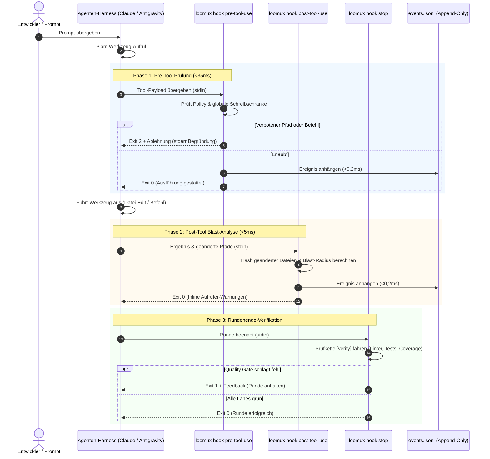

# Loomux Hook-Lebenszyklus & Host-Integration

Dieses Dokument beschreibt den Lebenszyklus der Hook-Ausführung, die Nutzlast-Spezifikationen für verschiedene Agenten-Harnesses und die entkoppelte Ereignisstrom-Architektur.

---

## 1. Der 4-Phasen Hook-Lebenszyklus

Loomux fängt Agenten-Interaktionen in vier kritischen Phasen ab:



---

## 2. Host-Nutzlastformate

Loomux normalisiert die Payloads der unterstützten Agenten-Hosts automatisch.

### A. Claude Code
Claude Code übergibt Standard-Tool-Call-Objekte auf `stdin`:

```json
{
  "tool_name": "Write",
  "tool_input": {
    "file_path": "C:/Projekte/loomux/.env"
  }
}
```

Für Shell-Befehle (`Bash`):
```json
{
  "tool_name": "Bash",
  "tool_input": {
    "command": "git push origin main"
  }
}
```

### B. Google Antigravity
Antigravity kapselt Werkzeugaufrufe in camelCase-Strukturen:

```json
{
  "toolCall": {
    "name": "write_to_file",
    "args": {
      "TargetFile": "C:/Projekte/loomux/.env",
      "CodeContent": "SECRET_KEY=12345"
    }
  }
}
```

Für Shell-Befehle (`run_command`):
```json
{
  "toolCall": {
    "name": "run_command",
    "args": {
      "CommandLine": "git push origin main"
    }
  }
}
```

Loomux verarbeitet beide Varianten nativ und überführt sie intern in eine einheitliche Repräsentation (`tool`, `input`).

---

## 3. Die entkoppelte Ereignisstrom-Architektur

Eine gefährliche Fehlerquelle in Agenten-Werkzeugen sind synchrone HTTP-Aufrufe oder IPC-Sockets von Hooks zu einem Hintergrunddienst. Dies erzeugt untragbare Latenzen (>10ms) und führt zum Komplettausfall, wenn der Hintergrunddienst abstürzt.

Loomux garantiert vollständige Entkopplung über ein **Append-Only Datei-Journal**:

```
Hook-Prozess (loomux hook pre/post-tool-use)
   │
   └── Schreibt einzelne JSON-Zeile (O_APPEND, <0,2ms)
       │
       ▼
.loomux/state/journal/events.jsonl
       │
       ▲
       └── Hintergrund-Tailing-Routine (Inotify / Stat-Polling)
           │
   ┌───────┴────────────────────────┐
   ▼                                ▼
loomux serve                   Verbundene Browser
(Root Gateway)                 (SSE /api/events)
```

1. **Null-Overhead beim Schreiben**: Hooks hängen Ereignisse direkt über Filedeskriptoren in `<0,2ms` an.
2. **Crash-Resistenz**: Läuft `loomux serve` nicht, arbeiten die Hooks ohne jede Beeinträchtigung weiter.
3. **Live-Synchronisation**: Läuft `loomux serve`, liest es neue Zeilen aus `events.jsonl` fortlaufend aus und streamt sie per Server-Sent Events (SSE) live an das Web OS Dashboard und das Kanban-Board.

---

## 4. Ablehnungs-Umschläge & Diagnose

Wird eine Aktion durch `loomux hook pre-tool-use` abgewiesen, gibt Loomux Folgendes aus:

### 1. `stdout` JSON-Envelope (für den Agenten-Host)
```json
{
  "hookSpecificOutput": {
    "permissionDecision": "deny",
    "permissionDecisionReason": "secrets are not written by an agent: .env"
  }
}
```

### 2. `stderr` Klartext (für Terminal & Logs)
```text
loomux policy refused this Write:
  - secrets are not written by an agent
```

### 3. Exit-Code: `2`
Exit-Code 2 signalisiert dem Agenten-Harness unmissverständlich, dass die Aktion verboten wurde und nicht mit denselben Parametern wiederholt werden darf.
