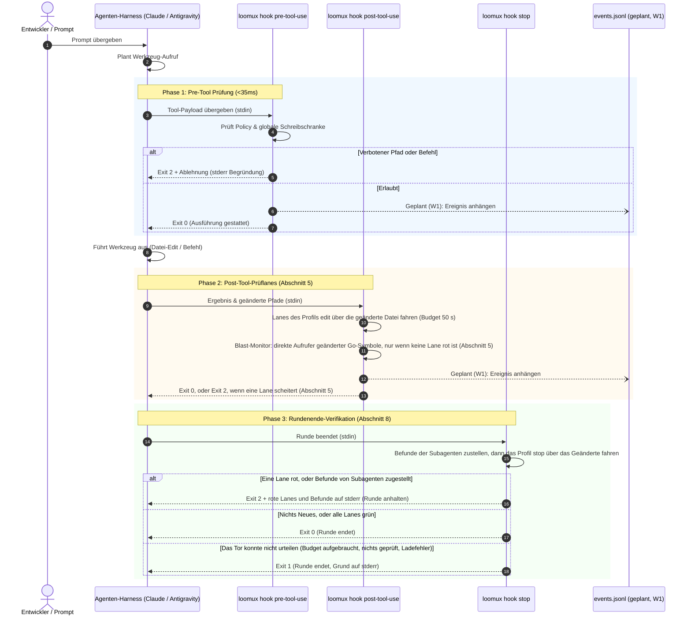
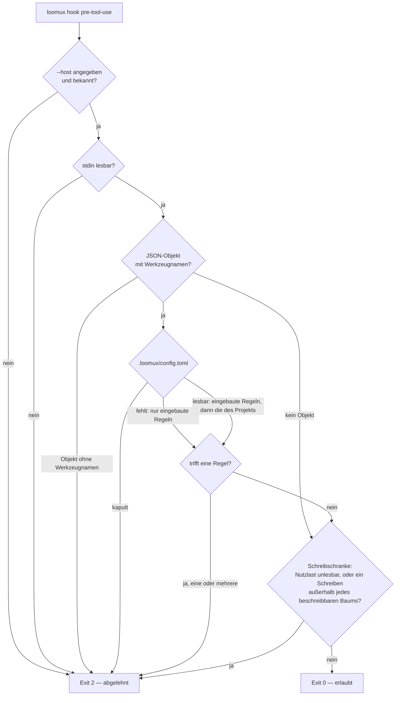
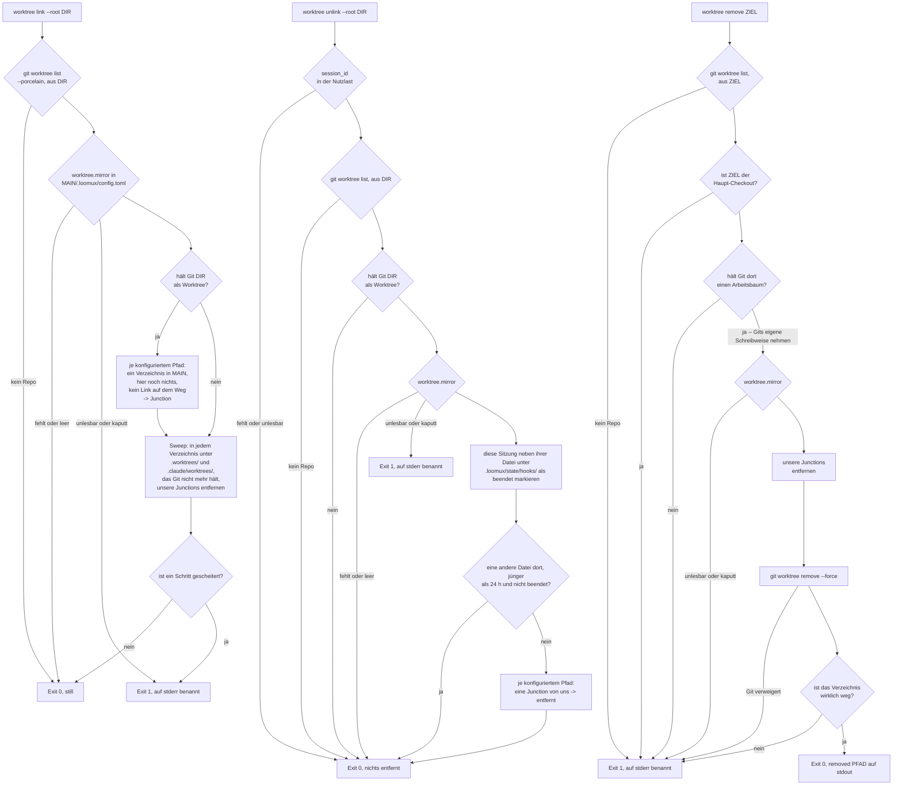

# Loomux Hook-Lebenszyklus & Host-Integration

Dieses Dokument beschreibt den Lebenszyklus der Hook-Ausführung, die Nutzlast-Spezifikationen für verschiedene Agenten-Harnesses und die entkoppelte Ereignisstrom-Architektur.

---

## 1. Der Hook-Lebenszyklus

Loomux fängt Agenten-Interaktionen vor einem Werkzeug, danach und am Rundenende ab (Sitzungs- und Subagenten-Hooks: Abschnitt 8):



---

## 2. Host-Nutzlastformate

Loomux normalisiert die Payloads der unterstützten Agenten-Hosts automatisch.

### A. Claude Code
Claude Code übergibt Standard-Tool-Call-Objekte auf `stdin`:

```json
{
  "tool_name": "Write",
  "tool_input": {
    "file_path": "C:/Projekte/loomux/.env"
  }
}
```

Für Shell-Befehle (`Bash`):
```json
{
  "tool_name": "Bash",
  "tool_input": {
    "command": "git push origin main"
  }
}
```

### B. Google Antigravity
Antigravity kapselt Werkzeugaufrufe in camelCase-Strukturen:

```json
{
  "toolCall": {
    "name": "write_to_file",
    "args": {
      "TargetFile": "C:/Projekte/loomux/.env",
      "CodeContent": "SECRET_KEY=12345"
    }
  }
}
```

Für Shell-Befehle (`run_command`):
```json
{
  "toolCall": {
    "name": "run_command",
    "args": {
      "CommandLine": "git push origin main"
    }
  }
}
```

Loomux verarbeitet beide Varianten nativ und überführt sie intern in eine einheitliche Repräsentation (`tool`, `input`).

---

## 3. Die entkoppelte Ereignisstrom-Architektur

Eine gefährliche Fehlerquelle in Agenten-Werkzeugen sind synchrone HTTP-Aufrufe oder IPC-Sockets von Hooks zu einem Hintergrunddienst. Dies erzeugt untragbare Latenzen (>10ms) und führt zum Komplettausfall, wenn der Hintergrunddienst abstürzt.

Loomux garantiert vollständige Entkopplung über ein **Append-Only Datei-Journal**:

> **Geplant (Stufe W1).** Noch schreibt kein Hook das Journal, und `loomux serve`
> liest nichts mit; die Entkopplung selbst gilt schon heute: `internal/hooks`
> verlinkt nichts aus `serve`, was ein Test über den Importgraphen festhält.
> Stand: [Roadmap](../../README.de.md#roadmap).

```
Hook-Prozess (loomux hook pre/post-tool-use)
   │
   └── Schreibt einzelne JSON-Zeile (O_APPEND, <0,2ms)
       │
       ▼
.loomux/state/journal/events.jsonl
       │
       ▲
       └── Hintergrund-Tailing-Routine (Inotify / Stat-Polling)
           │
   ┌───────┴────────────────────────┐
   ▼                                ▼
loomux serve                   Verbundene Browser
(Root Gateway)                 (SSE /api/events)
```

1. **Null-Overhead beim Schreiben**: Hooks hängen Ereignisse direkt über Filedeskriptoren in `<0,2ms` an.
2. **Crash-Resistenz**: Läuft `loomux serve` nicht, arbeiten die Hooks ohne jede Beeinträchtigung weiter.
3. **Live-Synchronisation**: Läuft `loomux serve`, liest es neue Zeilen aus `events.jsonl` fortlaufend aus und streamt sie per Server-Sent Events (SSE) live an das Web OS Dashboard und das Kanban-Board.

---

## 4. Ablehnungs-Umschläge & Diagnose

Wird eine Aktion durch `loomux hook pre-tool-use` abgewiesen, gibt Loomux Folgendes aus:

### 1. `stdout` JSON-Envelope (für den Agenten-Host)
```json
{
  "decision": "deny",
  "reason": "loomux policy refused this tool call:\n  - secrets are not written by an agent",
  "hookSpecificOutput": {
    "hookEventName": "PreToolUse",
    "permissionDecision": "deny",
    "permissionDecisionReason": "loomux policy refused this tool call:\n  - secrets are not written by an agent"
  }
}
```

Der Umschlag steht auf einer Zeile; `decision` und `reason` auf oberster Ebene
sind die ältere Hook-Schreibweise und bleiben neben `hookSpecificOutput`
stehen. Die Ablehnung trägt der Exit-Code, ob ein Host das eine oder das andere
liest oder nicht.

### 2. `stderr` Klartext (für Terminal & Logs)
```text
loomux policy refused this tool call:
  - secrets are not written by an agent
```

### 3. Exit-Code: `2`
Exit-Code 2 signalisiert dem Agenten-Harness unmissverständlich, dass die Aktion verboten wurde und nicht mit denselben Parametern wiederholt werden darf.

---

## 5. Die post-edit-Lanes je Sprachstack

`loomux hook post-tool-use` liest den bearbeiteten Pfad aus der Nutzlast
(`file_path`, sonst `notebook_path`), bestimmt den Stack, zu dem die Endung
gehört, und fährt die Lanes des Profils `edit` (vorgegeben `lint` und `types`)
für diesen Stack — nur, wenn der Stack aktiv ist: im Projekt an seinen
Markerdateien erkannt (`go.mod`, `pyproject.toml`, `Cargo.toml`,
`project.godot`, `tsconfig.json` neben `package.json`, …) oder in
`[verify.<stack>]` mit einem Befehl versehen. Die Lanes kommen aus den Presets
und `[verify]`, wie die
[Konfiguration](configuration.md#verify-prüfketten--quality-gates) sie
beschreibt; hat eine Lane eine `on_file`-Form, läuft diese, sonst ihre
`commands`. Die Lanes laufen nebeneinander, jeder Befehl als argv ohne Shell.
Eine scheiternde Lane beendet den Hook mit Exit 2 und ihrer Ausgabe auf
stderr.

Die Presets, wie `loomux status` sie auflistet (`{file}` ist die bearbeitete
Datei, relativ zu ihrem Bereich):

| Stack | Endungen | `lint` | `types` |
|---|---|---|---|
| Go | `.go` | `go vet ./...`, `loomux check gofmt {file}` | — |
| Python | `.py` | `uvx ruff check . --output-format=concise` | `uv run mypy --no-error-summary --no-pretty`; stattdessen `uv run pyright`, wo `pyrightconfig.json` oder `[tool.pyright]` steht |
| GDScript | `.gd` | `uvx gdlint {file}` | — |
| C / C++ | `.c`, `.h`, `.cc`, `.cpp`, `.cxx`, `.hpp` | `clang-format --dry-run --Werror {file}` | `cmake --build build --parallel` |
| TypeScript / JavaScript | `.ts`, `.tsx`, `.js`, `.jsx` | `npx eslint --cache {file}`; stattdessen `npx biome check {file}`, wo `biome.json` liegt | `npx tsc --noEmit` |
| Vue | `.vue` | — | `npx vue-tsc --noEmit` |
| Svelte | `.svelte` | — | `npx svelte-check` |
| CSS | `.css`, `.scss`, `.sass`, `.less` | `npx stylelint {file}` | — |
| HTML | `.html`, `.htm` | `npx htmlhint {file}` | — |
| Shell | `.sh`, `.bash`, `.zsh` | `shellcheck {file}` | — |
| SQL | `.sql` | `sqlfluff lint {file}` | — |
| Rust | `.rs` | `cargo clippy -- -D warnings`, `cargo fmt --check` | — |
| Wiki | `.md` im Bündel | die Prüfung von `loomux lint <datei>`, im Prozess des Hooks selbst | — |
| — | `.md` außerhalb des Bündels; `.txt`, `.json`, `.yaml`, `.yml`, `.toml`, `.svg`, `.png`, `.jpg`, `.jpeg`, `.import`, `.lock` | keine; der Hook endet sofort mit 0 | |

- **Der Bereich.** Eine Lane läuft in dem Bereich, der die Datei enthält: Für
  `web/src/app.ts` in einem Projekt, in dem `web/` eigene `package.json` und
  `tsconfig.json` hat, laufen eslint und tsc in `web/` mit
  `{file}` = `src/app.ts`. Die Workspace-Skripte eines Projekts
  (`npm run typecheck`) werden nicht erraten; wer sie will, nennt sie in
  `[verify.typescript]`.
- **Jede andere Endung**, oder eine, deren Stack nicht aktiv ist, bekommt keine
  Lanes: Der Hook endet mit 0. Lanes aus `[verify.project]` laufen nur neben
  den Lanes eines aktiven Stacks und nur mit `on_file`.
- **Übersprungen, nicht rot**: eine Lane, deren Werkzeug nicht auf dem `PATH`
  liegt, ein noch nicht importiertes Godot-Projekt und eine Lane, die das
  Budget (`--budget`, Vorgabe 50 s) nicht mehr erreicht. Der Exit-Code bleibt
  0, und der Hook nennt die übersprungene Lane in
  `hookSpecificOutput.additionalContext`; bei einer `.go`-Datei schreibt der
  Blast-Monitor unten in dasselbe Feld.
- **Prüfungen schreiben nie um.** `clang-format` läuft mit
  `--dry-run --Werror`; eine Bearbeitung wird beurteilt, die Datei bleibt, wie
  der Agent sie schrieb.
- **`gofmt` prüft nur die bearbeitete Datei**: Eine unformatierte Datei
  anderswo muss nicht diese Bearbeitung beheben. Das Pre-Commit-Tor prüft
  alles.

### Der Blast-Monitor

Nach den Lanes eines Edits an einer `.go`-Datei, und nur wenn keine davon rot
ist, sagt der Hook dem Modell, wer aufruft, was der Edit gerade geändert hat.
Er liest den Graphen auf der Platte (`.loomux/state/graph/wiring.json`),
extrahiert die bearbeitete Datei neu und vergleicht den Rumpf-Hash jedes
Symbols mit den Knoten desselben Pfads im Graphen:

- **Seeds** sind die Symbole, die der Graph hat und die Datei nicht mehr
  (entfernt, zuerst genannt: ihre Aufrufer brechen sicher), dann die, deren
  Rumpf-Hash abweicht (geändert). Ein neues Symbol seedet nichts; es hat im
  alten Graphen keine Aufrufer. Der Dateiknoten seedet nie: seine eingehenden
  Kanten sind Importe, und die kommen nur in einer Repräsentanten-Datei je
  Paket an; eine Änderung zwischen den Symbolen (ein Import, eine Konstante
  auf Paketebene) würde gemeldet oder nicht, je nachdem, welche Datei des
  Pakets bearbeitet wurde.
- **Er meldet** die direkten Aufrufer der Seeds in anderen Dateien,
  höchstens zehn Zeilen und einen Zähler für den Rest, im selben
  `hookSpecificOutput.additionalContext` wie die übersprungenen Lanes:

  ```text
  [graph] internal/code/blast/reach.go: changed Reach; callers in other files:
    EdgeWalk (internal/code/blast/edgewalk.go)
    Radius (internal/code/blast/radius.go)
    signal (internal/code/blast/radius.go)
  ```

- **Ein geänderter Typ bekommt einen Hinweis, mit oder ohne Aufrufer.** Der
  Go-Graph hat keine Kanten auf Typen; Schweigen hieße dort „nichts hängt
  daran“. Ist ein Seed `struct`, `interface` oder `type`, endet der Kontext mit
  `[graph] Modified struct/interface/type: type coupling not wired in graph v1 (check references via grep)`.
- **Er schweigt** ohne Graph, bei einem Graphen eines anderen Schemas oder
  einem, den kein Build mit dem Go-Extraktor dieses Binarys geschrieben hat,
  wenn die Datei sich nicht lesen oder nicht parsen lässt (ein halb fertiger Edit), wenn sich kein
  Symbol geändert hat (auch bei schon frischem Graphen) und wenn die einzigen
  Aufrufer in der bearbeiteten Datei selbst liegen. Er endet nie mit Exit 1
  und blockiert nie; weder die Frischeprobe noch `graph check` läuft im Hook.
- **Eine rote Lane geht vor.** Ist eine Lane rot, endet der Hook mit Exit 2
  und dem Befund auf `stderr` und schreibt keinen Blast-Kontext: der Befund
  ist wichtiger, und `stdout` bleibt gültiges JSON oder leer.
- **Er wiederholt sich bis zum Neubau.** Der Graph bleibt, wie er war, bis
  zum nächsten `graph build`, einer Abfrage, die ihn auffrischt, oder dem
  `graph-fresh` des Pre-Commit-Tors; jeder weitere Edit an derselben Datei
  nennt dieselben Seeds noch einmal. Ein Gedächtnis je Datei gibt es nicht.
- **Nur Go.** Ein Edit an einer `.py`-Datei bekommt keinen Blast-Kontext:
  jeder solche Edit zahlte das Laden einer Grammatik und das Parsen der
  Datei, gegen das Ziel von unter 100 ms Eigenzeit des Monitors, und eine
  einzelne große Datei kann allein über eine Sekunde zum Parsen brauchen. Der Graph
  bleibt veraltet, bis der nächste Build ihn erneuert. `internal/hooks`
  importiert die Tree-sitter-Laufzeit nicht, und
  `TestHooksNeverReachTreeSitter` hält das fest.
- **Kosten**: 24,7 ms auf dem 7,07-MiB-Graphen dieses Repositorys, etwa 4 ms
  mehr je MiB `wiring.json`
  ([Benchmarks, 2026-09-23 22:55](benchmarks.md#2026-09-23-2255--post-edit-auf-einer-go-datei-mit-dem-blast-monitor)).

---

## 6. CRLF ist keine Formatierungsfrage

`gofmt` schreibt ausschließlich LF und meldet jede mit CRLF ausgecheckte
Go-Datei als unformatiert. Das Pre-Commit-Tor (`.githooks/pre-commit`) führt
sie dann unter `gofmt: these files are not formatted:` — eine Meldung, die die
falsche Ursache nennt.

Dieses Repo nagelt die Zeilenenden in `.gitattributes` fest
(`* text=auto eol=lf`). **Die Regel wirkt aber erst beim nächsten Auschecken**;
bereits ausgecheckte Dateien fasst sie nicht an, und auf einer Maschine mit
`core.autocrlf = true` bleiben sie CRLF. Auch `git add --renormalize .` hilft
nicht: es schreibt den Index, der ohnehin schon LF führt, und lässt den
Arbeitsbaum, wie er ist.

Die beiden Fälle trennt `git ls-files --eol <pfad>`: `w/crlf` in der zweiten
Spalte ist ein Auscheckproblem, kein Formatierungsbefund. Ein `grep` nach einem
CR am Zeilenende ersetzt das nicht: das `grep` von Git für Windows findet einen
Wagenrücklauf vor dem Zeilenende nur mit `-U` und einem echten CR im Muster,
`grep -U $'\r$' <pfad>` in Bash (gemessen am 2026-09-17 mit GNU grep 3.0). Ohne
`-U` antwortet es gerade dort mit „kein CRLF", wo das Problem auftritt, und ein
in Hochkommas gesetztes `'\r$'` trifft Zeilen, die auf den Buchstaben `r`
enden.

Die gemeldeten Dateien einzeln heilen:

```sh
rm -f internal/verify/gofmt.go && git checkout -- internal/verify/gofmt.go
```

Die weite Fassung heilt einen ganzen Checkout auf einmal — **verwirft aber jede
nicht vorgemerkte Änderung an einer `.go`-Datei, und zwar wortlos**. Also erst
`git status` lesen, dann committen oder `git stash`, dann:

```sh
git ls-files -z -- '*.go' | xargs -0 rm -f && git checkout -- '*.go'
```

---

## 7. Der Entscheidungsweg von `pre-tool-use`

Ein Werkzeugaufruf, eine Antwort: der Host fragt, bevor das Werkzeug läuft, und
`loomux hook pre-tool-use --host <host> --root <projekt>` antwortet mit einem
Exit-Code. Zuerst entscheidet die Policy des Projekts, danach die globale
Schreibschranke.



**Nie Exit 1.** Ein Host liest 1 als nicht blockierenden Fehler und führt das
Werkzeug trotzdem aus. Darum lehnt jeder Weg, auf dem dieser Hook scheitern
kann, mit 2 ab — ein fehlendes oder unbekanntes `--host`, ein unlesbares stdin,
eine Nutzlast, die kein JSON-Objekt ist, ein Objekt ohne Werkzeugnamen, eine
kaputte `.loomux/config.toml`, eine Panik (`internal/cli/hook.go`,
`internal/hooks/pretool.go`). Eine Policy, die Aufrufe durchwinkt, sobald ihre
eigene Konfiguration unlesbar ist, wäre genau die Schranke, die man für
vorhanden hält und die es nicht ist. Einen Aufruf ohne Werkzeugnamen verweigert
die Policy, bevor sie die Konfiguration liest, weil keine Regel auf ihn passen
kann; eine Nutzlast, die kein Objekt ist, bleibt der Schreibschranke, die sie
mit ihrem eigenen Wortlaut ablehnt.

**Pfade und Befehlszeilen, kein Inhalt.** Ein schreibendes Werkzeug — `Write`,
`Edit`, `MultiEdit`, `NotebookEdit` und Antigravitys `write_to_file`,
`replace_file_content` und `multi_replace_file_content` — liefert jedes Ziel,
das es unter `file_path`, `notebook_path`, `TargetFile` oder `target_file`
nennt; geprüft werden alle, nicht das erste gefundene. `Bash` und `PowerShell`
liefern ihr `command`, Antigravitys `run_command` seine Befehlszeile unter
`CommandLine` (gemessen mit agy 1.2.11; `commandLine` und `command_line`, die
anderen Schreibweisen in agy.exe, werden mitgeprüft). In eine von
`run_command` offen gelassene Aufgabe tippt agy mit `manage_task`, dessen
Aktion `send_input` das Getippte unter `Input` liefert (gemessen mit agy
1.2.11); `send_command_input`, das ältere Werkzeug dafür, das agy.exe noch
trägt, liefert `Input`, ein ungemessener Name. Argumentnamen werden ohne
Rücksicht auf die Schreibung verglichen, und jeder gefundene Wert wird
geprüft, ein harmloses `Input` verdeckt also kein verbotenes `input`; ein
Wert darunter, der kein String ist, wird verweigert (bei `Bash` und
`PowerShell` übergangen, weil ihr Werkzeug immer einen String schickt), ein
leerer trägt keine Zeile. Was ein Agent in eine Aufgabe tippt, wird nur als
ganze Zeilen geprüft: Jeder Wert muss auf ein Zeilenende enden, darf außer
den Zeilenenden kein Steuerzeichen tragen und keine Zeile auf einen
Backslash oder einen Backtick enden lassen, mit denen bash und PowerShell in
der nächsten Zeile fortsetzen; er wird an jedem Zeilenende geteilt, und jede
Zeile wird für sich geprüft. Ein Bruchstück, eine einzelne Taste, Ctrl-C,
eine Pfeiltaste, ein Rückschritt, ein Tab oder eine Zeilenfortsetzung wird
verweigert, weil
das Terminal die Zeile vollenden, ändern oder ergänzen könnte, nachdem der
Wächter sie gelesen hat; `kill` beendet eine Aufgabe weiter. `list`, `status`
und `kill` von `manage_task` tragen keine Zeile und laufen durch, aber nur ein
Aufruf ohne Zeile: Eine Zeile wird geprüft, gleich welche Aktion der Aufruf
nennt, und still ist ein Aufruf nur, wenn jeder Schlüssel mit der Schreibung
`action` eine der drei nennt; jede andere Aktion und ein Aufruf ohne Aktion
wird geprüft. Ein `run_command`, `send_command_input` oder `manage_task` ohne
einen seiner Namen wird verweigert. Was ein Werkzeug in eine Datei schreibt,
wird nicht geprüft.

**Pfade werden relativ zur Wurzel verglichen.** Ein Muster ohne Schrägstrich
(`*.pem`, `go.sum`) trifft den Dateinamen, eines mit Schrägstrich (`.aws/**`)
trifft ab der Wurzel. Ein Ziel außerhalb der Wurzel behält seinen absoluten
Pfad, darum erreichen es nur noch Muster ohne Schrägstrich; wohin ein solches
Schreiben fällt, beantwortet die Schreibschranke. Ohne `--root` sucht loomux
aufwärts nach einer `.loomux/config.toml`; findet es keine, gelten nur die
eingebauten Regeln.

**Jeder Grund, nicht der erste.** Erst kommen die eingebauten Regeln, dann die
des Projekts in der Reihenfolge der Datei, und jede treffende Regel fügt ihren
Grund hinzu; die Ablehnung nennt alle. Sonst räumte der Agent einen Grund weg,
liefe in den nächsten und bräuchte eine Runde je Regel. Ein Glob, der sich
nicht auswerten lässt, ist eine Ablehnung für sich.

**Die Konfiguration wird bei jedem Aufruf mit Werkzeugnamen gelesen**, bevor
eine Regel geprüft wird. Eine kaputte Datei lehnt darum jeden Aufruf ab, der
den Hook erreicht, nicht nur die, über die eine Regel geurteilt hätte.

**Kein Erlaubnismodus.** Die eingebauten Regeln gelten immer; ein Projekt kann
Regeln hinzufügen (`[policy.paths]`, `[policy.commands]`, siehe
[Konfiguration](configuration.md)), sie aber weder entfernen noch umkehren. Ein
Repo ohne `.loomux/config.toml` ist durch die eingebauten Regeln geschützt, ohne
dass jemand etwas eingerichtet hat.

Die eingebauten Regeln (`internal/hooks/guard.go`):

| Art | Trifft | Grund |
|---|---|---|
| Pfad | zehn Geheimnismuster, darunter `.env`, `.env.*`, `*.pem`, `*.key`, `id_rsa*`, `credentials.json` und `.aws/**` | secrets are not written by an agent |
| Pfad | `.loomux/no-verify`, `.loomux/state/hooks/**` | the stop gate's own controls are not written by the party it gates |
| Pfad | `.loomux/state/runs/**`, Journale und Marken der [Flow-Läufe](flows.md#2-einen-flow-fahren) | a flow's journal and marker are written by loomux, not by the party the gates ask |
| Pfad | `.loomux/flows/<name>/` und alles darin, für jeden Flow im Katalog dieses Binarys und jeden Namen in `[flow] overrides`; ein Flow unter eigenem Namen bleibt frei | a bundled flow's gates and instructions are a human's to change; give your flow a name of its own, or ask the user to hide or overlay `<name>` |
| Pfad | sieben Lockdateien, darunter `go.sum`, `package-lock.json` und `Cargo.lock` | lock files are written by their package manager, not by hand |
| Befehl | `(^\|\s)git\s+push(\s\|$)` | Whether commits reach the remote is a human's decision. |
| Befehl | ein Schreiben per Shell auf `.loomux/state/runs` oder eine Datei darin (`>`, `tee`, `sed -i`, `Set-Content`, `cp`/`mv` darauf und mehr) und ein Löschen (`rm`, `Remove-Item`, `git rm`, …) davon, von `.loomux/state` darüber oder eines Globs an seiner Stelle | a flow's journal and marker are written by loomux, not by the party the gates ask |
| Befehl | dieselben Formen auf den Ordner eines geschützten Flows unter `.loomux/flows/` oder auf einen Glob an der Stelle eines Flows (`cp x .loomux/flows/ex*/…`) und ein Löschen davon oder von `.loomux/flows` darüber | der Grund der Pfadregel, mit jedem geschützten Namen |
| Befehl | `loomux flow resume … --answer` in jeder Schreibweise, die die Regel für `loomux config` liest (ein Pfad zum Binary, Anführungszeichen, verkettete Befehle, `--answer text`, `--answer=text`), und jedes `Start-Process` von loomux, dessen Argumente der Wächter nicht sieht | a flow's gate asks a human; the answer is theirs. Ask the user to answer it with `flow resume <run> --answer "…"` themselves |

**Die eingebauten Pfadregeln treffen in jeder Schreibweise**: Windows und
macOS halten `.LOOMUX/State/Runs` und `.loomux/state/runs` als einen Ordner,
darum wird die Regel kleingeschrieben mit einem kleingeschriebenen Ziel
verglichen, und die Regel für Flow-Ordner vergleicht den Namen des Ordners
ebenso. Die eigenen `[policy]`-Regeln eines Projekts treffen so, wie das
Projekt sie schrieb. Die Regel für Flow-Ordner liest `[flow]` der
`.loomux/config.toml`, und nur für ein Ziel unter `.loomux/flows` oder eine
Shell-Zeile, die `flows` enthält; ein `[flow]`, das sich nicht lesen lässt,
verweigert jedes Schreiben dort (`loomux cannot read [flow] of
.loomux/config.toml, so it refuses writes under .loomux/flows: …`). Warum die
Tore bewacht sind und was einem Agenten offen bleibt, steht in
[Flows](flows.md#6-tore-gehören-einem-menschen).

**Die Regeln zu loomux' eigenen Befehlen erkennen das Programm an seinem
Dateinamen**: `loomux` oder `loomux.exe` unter jedem Pfad, oder `go run` von
`cmd/loomux`. Ein kopiertes oder umbenanntes Binary (`cp bin/loomux.exe x.exe`,
dann `x.exe flow resume … --answer yes`) kommt an jeder von ihnen vorbei; die
Pfadregeln oben gelten weiter.

Die Schreibschranke nach der Policy entscheidet nur über schreibende Werkzeuge
mit Ziel: sie löst jedes Ziel auf und lehnt ein Schreiben außerhalb jedes
beschreibbaren Baums ab. Welche Bäume das sind und welche Orte immer offen
stehen, steht in
[Konfiguration](configuration.md#5-die-schreibschranke-und-das-memory-der-agenten).

---

## 8. Sitzungshooks

Die Policy lehnt einen Werkzeugaufruf ab, bevor er geschieht; Sitzungshooks
stellen hinterher fest, was geschehen ist. Das Design nennt fünf, und alle fünf
laufen:

| Ereignis in Claude Code | loomux-Hook | Stufe | Was er feststellt |
|---|---|---|---|
| `SessionStart` | `session-start` | 1a, läuft; Flow-Läufe seit Flow A | Den Commit, auf dem die Sitzung beginnt; eine Warnung, wenn das Pilot-Binary älter ist als seine Quellen; die Flow-Läufe, die an einem Tor warten |
| `PostToolUse` | `post-tool-use` | 1a, läuft; Lanes aus `[verify]` seit 2a | Die Lanes aus Abschnitt 5 für die bearbeitete Datei |
| `SubagentStart` | `subagent-start` | 2c, läuft | Wo `origin`, die lokalen Branches und `HEAD` vor einem Subagenten standen |
| `SubagentStop` | `subagent-stop` | 2c, läuft | Jeden Ref von `origin` und jeden lokalen Branch, der sich bewegt hat, dazukam oder verschwand, und die Commits, die `HEAD` und die bewegten Branches gewonnen haben — geparkt für das `stop` des Hauptagenten |
| `Stop` | `stop` | 2c, läuft | Ob alles seit dem letzten grünen Durchlauf grün ist — der einzige, der eine Runde anhalten kann |

`loomux hook` kennt sechs Ereignisse: `pre-tool-use`, `post-tool-use`,
`session-start`, `stop`, `subagent-start` und `subagent-stop`; jeder andere
Name wird mit Exit 2 abgelehnt (`unknown event`). Ein fehlerhafter Aufruf eines
der fünf Sitzungshooks — ein fehlendes oder unbekanntes `--host`, ein Flag, das
er nicht kennt, und ohne `--root` keine `.loomux/config.toml` oberhalb des
Arbeitsverzeichnisses — ist Exit 1, und der hält nichts an: ein Tor, das seinen
Aufruf nicht lesen kann, darf die Runde nicht deswegen festhalten. Ein
relatives `--root` wie Antigravitys `..` wird absolut gemacht, bevor etwas
daran gemessen wird.

**Claude Code und Antigravity haben Adapter** für die Hooks, die ihre
Nutzlast über `internal/hosts` lesen; `codex` ist eine Naht, die mit Exit 1
ablehnt, statt eine Form zu raten (`internal/hosts/codex.go`). `loomux hook`
gibt jede Antwort, eine Panik eingeschlossen, einmal an `hosts.Answer`. Für
`--host antigravity` (gemessen mit agy 1.2.8 und 1.2.11, 2026-09-25): Der
Exit 2 von `pre-tool-use` verweigert den Aufruf, der Exit 2 von
`post-tool-use` erreicht das Modell als Warnung, ohne abzubrechen, und ein
gehaltener Stop wird zu `{"decision":"continue","reason":…}` auf stdout mit
Exit 0, worauf agy erneut in seine Schleife eintritt; der Grund ist, was das
Tor nach stderr geschrieben hat. Jeder andere Code ungleich 0 endet mit 0.
Ein unbekanntes Ereignis bleibt auf jedem Wirt Exit 2. `session-start` läuft
auf `PreInvocation`, das vor jedem Modellaufruf feuert und sie in
`invocationNum` zählt; nur der erste warnt vor Binary und Self-Update. Ein
späterer nennt die Flow-Läufe, die noch an einem Tor warten, und die
übergangenen Flow-Ordner, wie jeder Start, und sagt, wenn die Sitzung für
worktree unlink nicht wieder mitzählt.
`subagent-start` und
`subagent-stop` sind für Antigravity nicht verdrahtet: seine Nutzlasten tragen
keine `agent_id`.

Das `PostToolUse` von Antigravity trägt den Aufruf, dem es folgt, `toolCall`
mit seinen `args`, neben `stepIdx` und `error` (gemessen mit agy 1.2.11; sein
Hook-Leitfaden nennt nur die beiden letzten). `post-tool-use` liest die Ziele
daraus wie der Wächter, prüft jedes in einem Budget für alle und prüft nichts
für einen Aufruf, dessen `error` gesetzt ist.

Eingetragen in `.claude/settings.json` sehen die drei Hooks der Stufe 2c so aus
(`loomux status` druckt die `Stop`-Zeile, ohne das vorgegebene `--budget`, und
meldet, welche der sechs Ereignisse eingetragen sind):

| Ereignis | Befehl | Frist |
|---|---|---|
| `Stop` | `loomux hook stop --host claude --root "${CLAUDE_PROJECT_DIR}" --budget 270s` | 300 |
| `SubagentStart` | `loomux hook subagent-start --host claude --root "${CLAUDE_PROJECT_DIR}"` | 30 |
| `SubagentStop` | `loomux hook subagent-stop --host claude --root "${CLAUDE_PROJECT_DIR}"` | 30 |

Dieses Repository fährt sie über seine eingecheckte `.claude/settings.json`,
neben seinen fünf übrigen Hook-Befehlen: `session-start` und `worktree link`
auf `SessionStart`, `worktree unlink` auf `SessionEnd` (Abschnitt 9),
`pre-tool-use` und `post-tool-use`.

`loomux init` schreibt Antigravitys `.agents/hooks.json` so:

| Ereignis | Matcher | Befehl | Frist |
|---|---|---|---|
| `PreInvocation` | — | `session-start` | 20 |
| `PreToolUse` | `write_to_file\|replace_file_content\|multi_replace_file_content\|run_command\|send_command_input\|manage_task` | `pre-tool-use` | 15 |
| `PostToolUse` | `write_to_file\|replace_file_content\|multi_replace_file_content` | `post-tool-use` | 60 |
| `Stop` | — | `stop --budget 270s` | 300 |

Jeder Eintrag ruft `%LOCALAPPDATA%/loomux/bin/loomux.exe hook <ereignis> --host antigravity --root ..`
ohne Anführungszeichen und mit Schrägstrichen auf, weil agy ihn über cmd.exe
startet, das `%LOCALAPPDATA%` auflöst, `${LOCALAPPDATA}` aber nicht, und einen
Programmpfad in Anführungszeichen zerbricht; `..` ist die Projektwurzel, weil
agy einen Hook aus `.agents/` startet. `PreInvocation` und `Stop` nehmen eine
flache Liste von Handlern: agy 1.2.11 verwirft die ganze Datei, wenn eines
davon einen `{"hooks": […]}`-Block trägt (`internal/setup/hostfile/table.go`).

### `session-start`

```sh
loomux hook session-start --host claude --root <projekt>   # Nutzlast auf stdin
```

- **Hält den Basis-Commit fest.** `HEAD` der Wurzel kommt als `base` in
  `.loomux/state/hooks/<session_id>.json`. Hier und nirgends sonst: beim ersten
  `Stop` ist die Runde schon gelaufen, und was sie committet hat, läge innerhalb
  der Grundlinie, die es sichtbar machen soll. Still, wenn die Nutzlast keine
  Sitzungs-ID trägt (nirgends abzulegen) oder die Wurzel kein Git-Repo ist
  (nichts abzulegen). Ein Schreiben, das scheitert, ist Exit 1.
- **Warnt vor einem veralteten Binary.** Liegt das laufende Binary im Projekt
  und ist älter als die jüngste von `go.mod`, `go.sum`, den `.go`-Dateien
  unter `cmd/` und `internal/` und jeder Datei unter `flows/`, deren Pfad kein
  Glied mit `_` oder `.` vorne hat (der Go-Quelltext des Pakets samt seinen
  Tests und der Katalog, den es einbettet), sagt der Hook das in
  `hookSpecificOutput.additionalContext`, mit dem Befehl zum Neubauen.
  Verglichen wird mit den Quellen, nicht mit `HEAD`: das Pre-Commit-Tor baut
  `bin/loomux.exe`, bevor der Commit existiert. Gibt es nichts zu sagen,
  schreibt der Hook nichts.
- **Meldet die Flow-Läufe, die an einem Tor warten**, bei jedem Start, auch
  einem wiederholten: Eine Frage bleibt offen, bis ein Mensch sie beantwortet,
  und eine Sitzung, die sie einmal hörte, hat sie womöglich inzwischen aus
  ihrem Kontext verloren. Eine Kontextzeile je Lauf, in der Reihenfolge der
  Läufe, mit dem Flow und seiner Herkunft (bei einem Overlay mit den ersetzten
  Dateien) und dem Befehl, mit dem ein Mensch antwortet, gebaut aus dem Pfad,
  aus dem der Hook läuft (`os.Executable`, mit Schrägstrichen, in doppelten
  Anführungszeichen, wenn er Leerraum oder ein anderes Zeichen enthält, das
  eine Shell liest), denn loomux liegt nicht auf jedem `PATH`:

  ```
  run 0001 (ship, project) is waiting at confirm: Ship it?
    a human answers it with: C:/Users/me/project/bin/loomux.exe flow resume 0001 --answer "your answer"
  ```

  Einen Laufordner, der sich nicht auflisten lässt, nennt der Hook auf
  `stderr` (`.loomux/state/runs cannot be read as a folder of runs: …`) und
  meldet nichts. Ein Journal oder eine Marke, die sich nicht lesen lässt,
  nennt der Hook mit Grund auf `stderr`, ohne zu blockieren, und sie verbirgt
  nur ihren eigenen Lauf. Lässt sich das Journal nicht lesen und sagt die Marke, dass eine
  andere loomux-Version den Lauf schrieb, nennt der Hook stattdessen beide
  Versionen (`run 0001 was written by loomux 0.0.0-dev, this is …`); welche
  neuer ist, rät er nicht, denn ein Checkout-Build nennt sich `0.0.0-dev`.
- **Nennt übergangene Flow-Ordner.** Ein Eintrag unter `.loomux/flows/`, der
  den Namen eines mitgelieferten Flows trägt, während `[flow] overrides` ihn
  nicht nennt, bekommt die Zeile `.loomux/flows/<name> is ignored: [flow]
  overrides does not name it`: Es fährt der mitgelieferte Flow, nicht die
  Dateien des Projekts. `[flow]` wird nur gelesen, wenn es einen solchen
  Eintrag gibt. Ein `.loomux/flows`, das sich nicht auflisten lässt, bekommt
  `.loomux/flows cannot be read as a folder of flows: …`, die Warnung, die
  `loomux flow` dafür gibt.
- **Exit 0 oder 1, nie 2.** Er ist eine Ankündigung und hat keine Runde
  anzuhalten. Ein fehlendes oder unbekanntes `--host`, ein stdin, das kein
  JSON-Objekt ist, und — ohne `--root` — keine `.loomux/config.toml` oberhalb
  des Arbeitsverzeichnisses sind Exit 1.

### `stop`

```sh
loomux hook stop --host claude --root <projekt> [--budget 270s]   # Nutzlast auf stdin
```

Das Tor am Rundenende. Es prüft, dass die Arbeit grün ist, und stellt zu, was
sich am Remote und an den Branches bewegt hat, während ein Subagent lief. In
dieser Reihenfolge
(`internal/hooks/stop.go`):

1. **Nutzlast.** Kein JSON oder keine `session_id`: Exit 1. Eine gemeinsame
   Ersatzdatei gibt es nicht, denn zwei Sitzungen zählten sonst einander die
   Blockaden. `stop_hook_active` wird nicht gelesen; der Blockzähler ist die
   eine Quelle.
2. **Befunde der Subagenten.** Jeder Befund, den ein beendeter Subagent unter
   `.loomux/state/hooks/<session_id>/agents/` hinterlassen hat, geht zuerst
   auf stderr, jede Zeile mit dem Präfix `subagent <agent_id>: `.
   Zugestellte Befunde halten die Runde an (Exit 2) — siehe unten.
3. **Zähler.** Nach **3 Blockaden in Folge** gibt das Tor für eine Runde auf:
   `gave up after 3 consecutive blocks; base stays at <sha>. Fix the lanes or
   set .loomux/no-verify.`, der Zähler geht auf 0, Exit 0. Die in Schritt 2
   geschriebenen Befunde bleiben in ihren Dateien — stderr bei Exit 0 liest
   niemand —, also stellt das nächste Rundenende sie erneut zu und hält an. In
   jeder anderen Runde werden die zugestellten Zeilen hier aus ihren Dateien
   geräumt.
4. **Marker.** Existiert `.loomux/no-verify`, läuft die Kette nicht: Exit 0,
   mit Befunden 2 — der Marker überspringt die Kette, nicht die Befunde. Nur
   ein Mensch setzt ihn; die Policy verweigert einem Agenten den Pfad
   (Abschnitt 7). Der Marker zählt nicht und setzt den Zähler nicht zurück.
5. **Fingerabdruck.** `gitwork.ContentTree` nimmt den Arbeitsbaum in eine
   Kopie des Index auf (im Temp-Verzeichnis des Systems, nicht im Zustand),
   streicht `.loomux/state` daraus und schreibt einen Baum: einen Hash des
   Inhalts, wie Git ihn committen würde, untracked Dateien eingeschlossen,
   ignorierte nicht. Ist dieser Baum gleich dem des letzten grünen Laufs
   (`green`) oder dem Baum der Basis, ist nichts neu: Exit 0 (mit Befunden 2),
   und kein Werkzeug startet. Das ist ein grüner Durchgang: ein Zähler über 0
   geht auf 0, sonst wird nichts geschrieben.
6. **Profil.** Die Kette fährt die Arten des Profils `stop` — vorgegeben
   `lint`, `types`, `test`, `coverage`, dieselben wie `precommit` — im
   Check-Scope, wie `loomux check` es täte, dazu die Lane `lint/wiki` über das
   Wiki-Bündel, wenn das Profil `lint` hat, das Projekt ein Wiki hat und
   `[verify.wiki] lint = false` sie nicht abschaltet. Diese Lane prüft nur die
   Struktur des Bündels; die Drift-Regel bleibt bei `loomux wiki-gate`.
7. **Kette.** Jede Lane läuft innerhalb von `--budget` (Vorgabe 270 s, unter
   den 300 s seines Settings-Eintrags); jeder Befehl bekommt das Kleinere aus
   seinem eigenen `timeout` und dem Rest des Budgets.

Was der Lauf entscheidet:

| Ausgang | Exit | Zähler | `base`, `green` |
|---|---|---|---|
| Nichts neu seit dem letzten grünen Lauf oder der Basis | 0 | auf 0 | unverändert |
| Jede Lane grün | 0 | auf 0 | `base` = `HEAD`, `green` = der Baum |
| Eine Lane rot (`failed`, `timed-out`, `blocked`, `missing-tool`, `unready`) | 2, die **roten** Lanes mit ihrer Ausgabe auf stderr | + 1 | unverändert |
| Ein Git-Befehl scheitert in einem Repo | 2, der Fehler auf stderr | + 1 | unverändert |
| Das Budget war aufgebraucht, bevor jede Lane geurteilt hatte | 1: `not everything was verified; raise --budget or shrink the stop profile` | unverändert | unverändert |
| Eine angefragte Art hatte keine Lane, die lief | 1: die Notizen, dann `nothing was verified for these kinds; the base stays` | unverändert | unverändert |
| `[verify]` lässt sich nicht laden, oder der Plan scheitert | 1, der Fehler auf stderr | unverändert | unverändert |

Exit 0 beendet die Runde, 2 hält sie mit dem Grund auf stderr an, 1 heißt: das
Tor konnte nicht urteilen — es lässt die Runde enden und sagt das. Nur rote
Lanes kommen auf stderr; grüne sind im Kontext des Agenten Rauschen. Die
Coverage-Dateien behandelt es wie `loomux check`: ein grüner Lauf löscht seine
eigenen, ein roter lässt sie liegen, damit der Agent sie lesen kann.

**Befunde halten die Runde an, und selbst eine 1 wird zur 2.** Die
Befunddateien sind nach dem Zustellen weg; nur eine angehaltene Runde sorgt
dafür, dass der Hauptagent sie liest. Wurden im selben Aufruf Befunde
zugestellt, wird darum jeder Ausgang, der die Runde enden ließe — Exit 0 oder
Exit 1 —, zu Exit 2, gleich was der Zähler sagt. Dieser Halt zählt nicht als
Blockade. Die Runde, in der der Zähler aufgibt, endet mit geschriebenen
Befunden und lässt sie darum für die nächste auf der Platte.

**Ein Befund, den das Tor nicht wegräumen kann, zählt als Blockade.** Lässt
sich die Datei eines Befunds nach dem Zustellen nicht entfernen, käme er an
jedem Rundenende wieder und hielte jedes an, und der Marker hilft nicht, weil
er Befunde nicht überspringt. Also zählt er, und die Aufgeben-Regel beendet die
Reihe wie die einer roten Kette: drei Runden angehalten, die vierte
durchgelassen, mit dem Befund geschrieben und weiter auf der Platte. Solange
ein Befund feststeckt, setzt auch eine grüne Kette den Zähler nicht zurück.
Ein Rundenende ist eine Blockade: eine rote Kette oder ein Git-Fehler neben
einem feststeckenden Befund zählt nicht ein zweites Mal.

**Woher die Basis kommt.** `session-start` schreibt sie, einmal: eine
fortgesetzte, geleerte oder kompaktierte Sitzung feuert `SessionStart` unter
derselben ID erneut und behält ihre Basis, und nur ein grüner Lauf rückt sie
vor. Fehlt sie, misst das
Tor ab `HEAD` und sagt das: `no base commit for this session; measuring from
HEAD, so what this session committed stays unseen`. Eine Basis, die nicht mehr
auflöst — nach `--amend` oder einem Rebase und einem `gc` —, ist kein
Git-Fehler: `base <sha> is gone; measuring from HEAD`, und der nächste grüne
Lauf setzt eine neue Basis. In einem Repo ohne Commit ist die Basis der leere
Baum.

**Kein Repo, oder eine Wurzel, die Git ignoriert:** es gibt keinen Baum zu
messen, also läuft die Kette an jedem Rundenende, ohne Abkürzung. Ein grüner
Lauf schreibt `base` und `green` dann leer.

**Was es kostet.** Ein Rundenende ohne neuen Inhalt braucht auf diesem
Repository (7.341 Dateien) 169,5 ms warm, davon rund 110 ms der Fingerabdruck;
in einer Welt mit drei Dateien 121,3 ms. Die Kette selbst kostet, was ihre
Werkzeuge kosten ([Benchmarks](benchmarks.md), Eintrag vom 2026-09-20).

### `subagent-start` und `subagent-stop`

```sh
loomux hook subagent-start --host claude --root <projekt>   # Nutzlast auf stdin
loomux hook subagent-stop  --host claude --root <projekt>   # Nutzlast auf stdin
```

Ein Subagent kann pushen, einen Branch verschieben oder committen, und nichts,
was der Hauptagent liest, sagte es ihm. Die beiden Hooks nehmen davor und
danach einen Schnappschuss und legen für den Hauptagenten ab, was sich
dazwischen bewegt hat. Das ist eine Beobachtung, keine Zuschreibung: pusht eine
andere Sitzung im selben Zeitraum nach `origin`, liest sich das genauso, und
nichts hier kann die beiden unterscheiden. Claude Code schickt beide mit der `session_id` des Hauptagenten und derselben
`agent_id` (gemessen mit Claude Code 2.1.276, `testdata/cases/2c-payloads/`).

- **Der Schnappschuss** hält die Refs von `origin` aus `git ls-remote origin`
  (Frist 10 s, mit `GIT_TERMINAL_PROMPT=0`, damit keine Passwortabfrage auf
  ein Terminal wartet), die lokalen Branches samt denen, die in einem anderen
  Worktree des Repos ausgecheckt sind, und `HEAD`. Ein Remote, der nicht
  antwortet — kein `origin`, kein Netz, die Frist —, wird als `unavailable`
  festgehalten, nicht als Remote ohne Refs.
- **`subagent-start`** schreibt den Schnappschuss nach
  `.loomux/state/hooks/<session_id>/agents/<agent_id>.json`, eine Datei je
  Subagent, atomar geschrieben, sodass zwei Subagenten, die in einer Nachricht
  starten, einander nicht überschreiben. Einen Befund, den ein früherer Lauf
  derselben Agent-ID dort geparkt hat und den noch kein Rundenende zugestellt
  hat, behält er neben dem neuen Schnappschuss.
- **`subagent-stop`** nimmt einen zweiten Schnappschuss und vergleicht. Eine
  Zeile je Unterschied: `origin <ref> is new at <sha>`,
  `… is gone; it was <sha>`, `… moved <alt> -> <neu>`, dieselben drei für
  `branch <name>`, und `new commit <oneline>` für jeden Commit, den `HEAD` und
  jeder bewegte Branch gewonnen haben, jeden Commit einmal. Ein bewegter
  Standard-Branch gibt zwei `origin`-Zeilen, eine für `HEAD` und eine für
  `refs/heads/<name>`, weil `ls-remote` beide meldet. Ist `origin` an keinem der beiden
  Enden eingerichtet, gibt es keine `origin`-Zeile. War der Remote an einem
  der beiden Enden nicht lesbar — dort nicht eingerichtet, oder eingerichtet
  und ohne Antwort —, steht genau eine Zeile da —
  `remote could not be read at start` bzw. `… at stop` — anstelle der
  `origin`-Zeilen; die `branch`- und `new commit`-Zeilen kommen trotzdem.
- **Branches anderer Worktrees bleiben draußen.** Lokale Branches teilen sich
  alle Worktrees eines Repos, und ein Branch, der in einem anderen ausgecheckt
  ist, bewegt sich mit der Sitzung, die dort arbeitet. Ein solcher Branch — am
  Start oder am Stop anderswo ausgecheckt, verglichen über die Pfade, die Git
  meldet — bekommt keine `branch`-Zeile und keine `new commit`-Zeilen.
  Branches, die nirgends ausgecheckt sind, und der Branch dieses Worktrees
  bleiben drin. Ein Subagent, der mit `isolation: "worktree"` startet,
  committet darum ohne Zeile hier auf dem Branch seines eigenen Worktrees; das
  Ergebnis des Agent-Werkzeugs nennt diesen Worktree und Branch.
- **Der Befund wird geparkt, nie fallengelassen.** Die Zeilen werden hinten an
  das angehängt, was die Datei schon trägt, ältester Lauf zuerst, ohne
  Entdoppelung; eine Datei, in der nichts bleibt, wird entfernt. Ohne Datei
  oder ohne Schnappschuss schweigt `subagent-stop`.
- **Zugestellt von `stop`.** Das eigene stdout und ein Exit 2 eines
  Subagenten-Hooks erreichten den Subagenten, nicht den Hauptagenten. Darum
  schreibt keiner der beiden etwas für das Modell: das nächste `stop` des
  Hauptagenten druckt die Zeilen und hält die Runde an (siehe oben).
- **Exit 0 oder 1, nie 2.** Eine Nutzlast ohne `session_id` oder `agent_id`
  oder eine Datei, die sich nicht schreiben lässt, ist Exit 1.

Bekannte Grenzen: ein Befund, der nach dem letzten `Stop` der Sitzung
entsteht, wird nie zugestellt. Ein Subagent, den der Wirt ohne `SubagentStop`
beendet, lässt seinen Schnappschuss liegen. Beide Dateien bleiben, bis
jemand sie löscht: kein Hook entfernt das Verzeichnis einer Sitzung, und
`loomux worktree unlink` (Abschnitt 9) markiert die Sitzung nur als beendet,
damit eine Fortsetzung unter derselben ID ihren Stand noch findet. Ein Schreiben, das genau zwischen das erneute
Lesen einer Befunddatei durch das Tor und deren Umbenennen fällt, verliert
eine Zeile; eine Sperre über eine Datei, die zwei Prozesse anfassen, gibt es
nicht. Und in einem Haupt-Checkout, der seine verknüpften Worktrees in sich
trägt, geht ein Worktree-Verzeichnis, das Git nicht ignoriert, als
eingebettetes Repository mit seinem `HEAD` in den Fingerabdruck ein: jeder
Commit dort ändert den Baum des Haupt-Checkouts, und dessen Tor fährt die
Kette erneut (dieses Repository ignoriert `.claude/worktrees/` in
`.git/info/exclude`).

Was sie kosten, ist `git ls-remote`: `subagent-start` braucht warm 101,4 ms
gegen ein lokales Bare-Remote und 1.038,7 ms gegen GitHub, Start und Stop eines
Subagenten zusammen 201,6 ms bzw. 2.068,6 ms ([Benchmarks](benchmarks.md),
Eintrag vom 2026-09-20).

### Der Sitzungszustand

Eine Datei je Sitzung unter `.loomux/state/hooks/` mit `base`, `blocks` und
`green` — die letzten beiden schreibt nur `stop`. Daneben ein Verzeichnis
`<session_id>/agents/` mit einer Datei je Subagent (`snapshot`, `finding`).
Eine Datei aus der Zeit vor Stufe 2c liest sich weiter; ihr Schlüssel
`snapshots` wird übergangen. Die Sitzungs-ID kommt von außen und darf nicht
entscheiden, wo die Datei landet: nur Buchstaben, Ziffern (im Unicode-Sinn),
`-` und `_` bleiben stehen, und eine ID, von der nichts übrig bleibt, wird zu
`unnamed`. Eine Datei, die sich nicht lesen lässt, zählt als leer: eine
Ausnahme beendete eine Runde wegen eines Zählers. Das Verzeichnis ist eine
eingebaute Pfadregel der Policy (Abschnitt 7), denn ein Agent, der seinen
eigenen Blockzähler zurücksetzt, hat das Tor abgeschafft.

---

## 9. Worktree-Spiegelung

`git worktree add` gibt einem neuen Arbeitsbaum nur, was Git verfolgt; jedes
git-ignorierte Verzeichnis fehlt dort — Abhängigkeitsbäume, Werkzeugketten,
Caches. loomux repariert das mit einer Windows-Junction je konfiguriertem Pfad,
die in den Haupt-Checkout führt:

```sh
loomux worktree link --root <verz>       # Sitzungsstart: Junctions anlegen, Reste wegräumen
loomux worktree unlink --root <verz>     # Sitzungsende: liest session_id aus der Nutzlast auf stdin
loomux worktree remove <worktree-pfad>   # von Hand: erst die Junctions, dann Git
```

Die Pfade kommen aus `[worktree] mirror` (siehe
[Konfiguration](configuration.md)), und alle drei lesen sie aus der
`.loomux/config.toml` des **Haupt-Checkouts**, nicht des Arbeitsverzeichnisses.
Junctions gibt es nur unter Windows: anderswo endet `link` beim ersten Pfad, den
es anlegen müsste, mit Exit 1. `loomux init` trägt die beiden Hook-Formen
nicht ein; ein Projekt, das sie will, trägt `worktree link` unter
`SessionStart` und `worktree unlink` unter `SessionEnd` selbst ein. Die
eingecheckte `.claude/settings.json` dieses Repos tut das, seine eigene
`.loomux/config.toml` deklariert aber keine `[worktree]`-Tabelle (nur ein
auskommentiertes Beispiel), also enden beide hier mit Exit 0, ohne etwas zu
tun.



Drei Dinge in diesem Bild zeichnet man leicht falsch, und
`internal/hooks/worktree.go` entscheidet sie:

- **Der Sweep hängt nicht daran, ob DIR ein Worktree ist.** Eine Sitzung im
  Haupt-Checkout ist der gewöhnliche Weg zu bemerken, dass ein Worktree weg ist.
- **Ein gescheitertes Anlegen hält den Sweep nicht auf.** Beide Schritte laufen,
  und scheitert einer, ist das Ergebnis Exit 1.
- **`unlink` markiert die eigene Sitzung als beendet, bevor es die anderen
  zählt.** Andersherum zählte die endende Sitzung als jemand anderes, und die
  letzte Sitzung auf einem Baum entfernte nie etwas. `sessions.Retire` legt
  eine Datei `<id>.ended` neben den Stand der Sitzung und lässt den Stand
  selbst stehen: eine unter derselben ID fortgesetzte Sitzung findet Basis,
  grünen Baum des Stop-Tors und die nicht zugestellten Befunde
  ihrer Subagenten, und `session-start` nimmt die Marke wieder weg. Eine
  Marke und nicht das Alter der Datei, weil ein Stop, der beim Ende der
  Sitzung noch läuft, die Datei danach neu schreibt.

### Nichts zu tun ist still, Schaden ist laut

Keine `.loomux/config.toml`, eine ohne `[worktree]` und ein leeres `mirror`
sind alle Exit 0 ohne ein Wort — ein global verdrahteter Hook trifft alle drei
in jedem fremden Projekt. Eine Datei, die sich nicht lesen oder parsen lässt,
oder ein `mirror`-Eintrag, der leer oder absolut ist oder mit `..` hinausführt,
ist Exit 1 und wird benannt: als „nichts zu spiegeln" gelesen, schaltete er den
Mechanismus ab, und das nächste Symptom wäre ein fehlendes Verzeichnis, das aus
scheinbar fremdem Grund scheitert. Die beiden Hook-Formen schreiben nur Fehler,
auf stderr; `remove` nennt den entfernten Pfad auf stdout, weil wer etwas
löscht, lesen soll, was gelöscht wurde.

### Was eine Junction zu unserer macht

Ein Reparse-Point an einem konfigurierten Pfad, der in den Haupt-Checkout führt
— beim Sweep zusätzlich in einem Verzeichnis, das Git nicht mehr hält. Ein
echtes Verzeichnis an diesem Pfad sind jemandes Daten und wird nie angefasst;
eine Junction, die anderswohin zeigt, ist jemandes eigene Einrichtung und
bleibt stehen. Entfernt wird mit `os.Remove`, nie mit `os.RemoveAll`: auf einem
Reparse-Point entfernt das erste den Punkt, das zweite liefe ins Ziel
(`internal/worktree/junction`). Ein Register der angelegten Junctions gibt
es nicht — es wäre ein zweiter Zustand, der abdriftet —, darum werden von Hand
angelegte Junctions an denselben Stellen mit demselben Ziel übernommen.

`link` füllt nur einen Pfad, der im Worktree fehlt und im Haupt-Checkout ein
Verzeichnis ist, und legt fehlende Elternverzeichnisse an. Jede Komponente
zwischen dem Baum und einem konfigurierten Pfad muss ein einfaches Verzeichnis
sein — bei `link` darf sie auch fehlen. Eine Junction an einem Elternteil ließe
die Operation sonst am Ziel der Junction wirken: Sweep und `unlink` entfernten
den Link des Haupt-Checkouts selbst, `link` legte einen außerhalb des Worktrees
an.

Pfade werden über ihre Identität verglichen (`os.SameFile`), nie als Text: Git
gibt unter Windows Schrägstriche aus, und ein gespeichertes Junction-Ziel trägt
einen abschließenden Trenner oder nicht, je nachdem, wer es angelegt hat
(`mklink /J` ohne, loomux mit).

### Ein lebendes Verzeichnis, das Git nicht hält, wird trotzdem geräumt

Der Sweep sucht eine Ebene unter `.worktrees/` und `.claude/worktrees/` des
Haupt-Checkouts. Ein Verzeichnis dort, das Git **nicht** als Worktree hält, das
aber eine passende Junction trägt, wird geräumt, auch während jemand darin
arbeitet, und `link` legt sie dort nicht wieder an, weil das Verzeichnis kein
Worktree ist. Das kostet eine Junction, die man von Hand neu anlegt, nie Daten:
jede Lockerung der Bedingungen oben machte den Sweep erst unsicher.

### Die 24-Stunden-Grenze, und warum sie in loomux schwächer ist

`unlink` zählt die anderen Sitzungsdateien, die jünger als 24 Stunden und
nicht als beendet markiert sind. Für eine Sitzung, die ohne SessionEnd endete,
ist die Änderungszeit der Datei die einzige Lebendigkeit, die sich lesen lässt.
Zwei Hooks schreiben diese Datei: `session-start` einmal, und `stop`, wann
immer eine Kette grün oder rot endet, ein Git-Fehler zählt, der Zähler aufgibt
oder ein Befund sich nicht wegräumen lässt. Ein Rundenende, das nichts Neues
findet oder über das das Tor nicht urteilen konnte, schreibt nichts, und die
Subagenten-Hooks schreiben nur ihre eigenen Dateien im Verzeichnis der Sitzung,
die das Zählen nicht liest. Eine Sitzung, deren letztes geschriebenes
Rundenende mehr als einen Tag zurückliegt, wird darum nicht gezählt, und eine
zweite Sitzung, die auf demselben Baum endet, zieht ihr die Junctions weg.
`stop` verengt dieses Loch; keine Zahl schließt es. Vierundzwanzig Stunden neigen wegen der
Asymmetrie zur langen Seite: eine stehen gebliebene Junction kostet nichts —
`link` überspringt sie, und der Sweep nimmt sie heraus, sobald Git einen Baum
unter `.worktrees/` oder `.claude/worktrees/` nicht mehr hält —, eine zu früh
entfernte kostet eine lebende Sitzung ihr Verzeichnis.

Ob ein Sitzungsende-Ereignis `unlink` überhaupt erreicht, ist nicht beobachtet:
der Befehl braucht eines, das `session_id` trägt (in Claude Code
`SessionEnd`). Ohne es sind der Sweep in `link` und `remove` die einzigen
beiden Aufräumwege.

### Warum `git worktree remove` eine Hülle braucht

Gemessen am 2026-09-07: `git worktree remove --force` auf einem Worktree mit
einer Junction endet mit 0, gibt nichts aus, streicht den Porcelain-Eintrag —
und lässt Verzeichnis und Junction stehen. `remove` stellt die Reihenfolge
richtig: erst kommen die Junctions heraus, dann wird Git gefragt. Vorher lehnt
es den Haupt-Checkout ab und jedes Verzeichnis, an dem Git keinen Arbeitsbaum
hält; es reicht Git dessen eigene Schreibweise des Pfads weiter, weil der
Git-Aufruf im Haupt-Checkout läuft, wo ein relatives Argument anderswohin
aufgelöst würde; und nach Exit 0 von Git prüft es, ob das Verzeichnis wirklich
weg ist. Verweigert Git, sind die Junctions schon heraus, und das nächste
`link` legt sie wieder an.

### Exit-Codes

    0  in Ordnung, oder absichtlich nichts zu tun
    1  ein Fehler, auf stderr benannt
    2  loomux worktree ohne Unterbefehl oder mit einem unbekannten

Keiner der drei kann eine Runde anhalten, und keiner soll es: eine Sitzung,
deren Spiegel nicht angelegt werden konnte, soll davon erfahren, nicht
angehalten werden.


---

## 10. Git-Repository-Hooks

Neben den Agenten-Harness-Hooks integriert loomux native Git-Hooks (konfiguriert über `git config core.hooksPath .githooks`):

### `.githooks/commit-msg`
Wird von Git beim Erstellen eines Commits aufgerufen. Führt aus der Repo-Wurzel aus:
```bash
bin/loomux.exe check commit-msg "$1"
```
oder `go run ./cmd/loomux check commit-msg "$1"`, solange das Pilot-Binary
nicht gebaut ist. Von Hand kennt die Prüfung auch `--language en|de` und
`--calibrate N`.

- **Prüfungen**:
  - **Sprache & Wortschatz**: Scannt alle Zeilen auf fremdsprachige Stopwörter (Variante B). Bei Zielsprache `en` zählt ein Wort mit Umlaut als Treffer; 82 deutsche Entwicklerwörter bilden eine vierte Wortquelle.
  - **Fremdschrift-Läufe**: Folgen von Nicht-Latein-Schriftzeichen (CJK, Kyrillisch etc.) werden als Fremdwort-Treffer gewertet.
  - **Spannen & Ausnahmen**: Kommentare (`#`), Text nach Scheren-Trennlinien (`# ------------------------ >8 ------------------------`), mehrzeilige Backtick-Codeblöcke, einzeilige Anführungszeichen, Pfad-Token, Namenspartikel (`van`, `von`) und Git-Trailers (`Signed-off-by:`, `Co-authored-by:`) werden nicht als Fremdwörter gewertet.
  - **Zulässige Ausnahmen**: Ausdrücke, die auf Muster in `[[commit.allow]]` passen, werden ignoriert.
  - **Conventional Commits**: Wenn `[commit].conventional = true` (Standard), wird das Format `<type>[(<scope>)][!]: <description>` der Betreffzeile geprüft.
- **Exit-Codes**: Beendet mit `0` bei Erfolg. Bei Verletzungen beendet der Hook mit Exit `1` und gibt Diagnoseinformationen samt Zeilennummern und Trefferwörtern auf `stderr` aus, wodurch der Commit abgebrochen wird.

### `.githooks/pre-commit`
Verweigert einen Commit auf `master`; verweigert, wenn eine Eingabe des Tors
(`*.go`, `*.toml`, `go.mod`, `go.sum`, `testdata`, `.githooks`, `ci`,
`.loomux`) vom Index abweicht oder unversioniert ist; fährt dann
`sh ci/gate.sh` und baut `bin/loomux.exe` über `loomux dev swap-binary` neu.

### `.githooks/pre-push`
Verweigert jeden Push, dessen Ziel `refs/heads/master` ist. `--no-verify`
überspringt ihn; sobald das Repo öffentlich ist, hält ein Ruleset auf GitHub
trotzdem.
