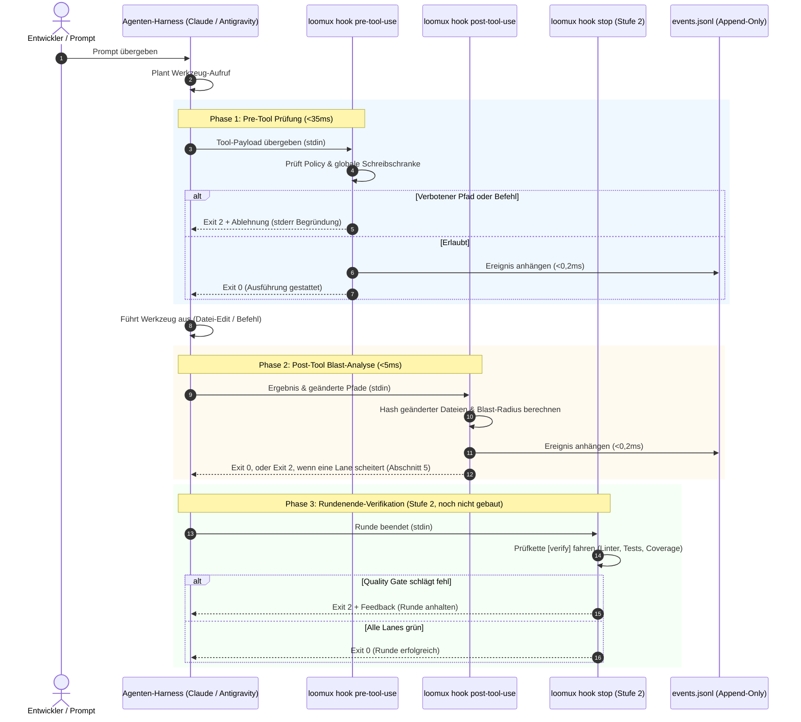
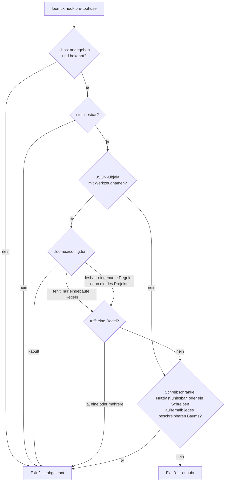
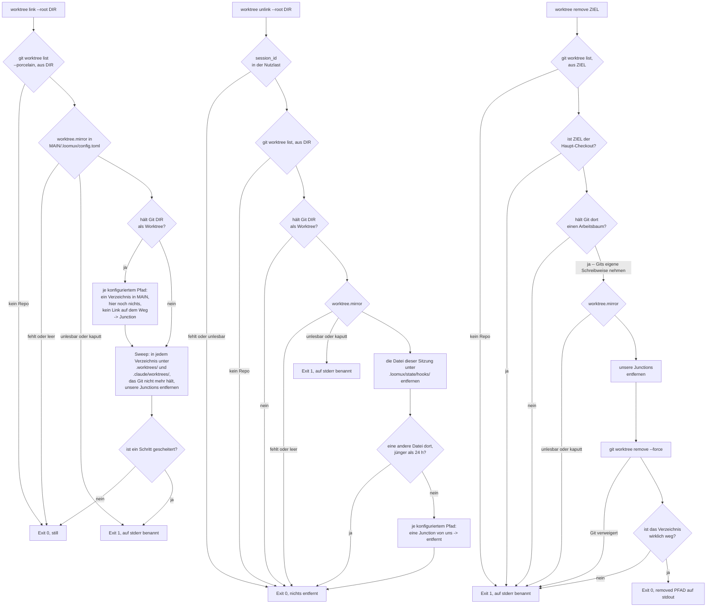

# Loomux Hook-Lebenszyklus & Host-Integration

Dieses Dokument beschreibt den Lebenszyklus der Hook-Ausführung, die Nutzlast-Spezifikationen für verschiedene Agenten-Harnesses und die entkoppelte Ereignisstrom-Architektur.

---

## 1. Der 4-Phasen Hook-Lebenszyklus

Loomux fängt Agenten-Interaktionen in vier kritischen Phasen ab:



---

## 2. Host-Nutzlastformate

Loomux normalisiert die Payloads der unterstützten Agenten-Hosts automatisch.

### A. Claude Code
Claude Code übergibt Standard-Tool-Call-Objekte auf `stdin`:

```json
{
  "tool_name": "Write",
  "tool_input": {
    "file_path": "C:/Projekte/loomux/.env"
  }
}
```

Für Shell-Befehle (`Bash`):
```json
{
  "tool_name": "Bash",
  "tool_input": {
    "command": "git push origin main"
  }
}
```

### B. Google Antigravity
Antigravity kapselt Werkzeugaufrufe in camelCase-Strukturen:

```json
{
  "toolCall": {
    "name": "write_to_file",
    "args": {
      "TargetFile": "C:/Projekte/loomux/.env",
      "CodeContent": "SECRET_KEY=12345"
    }
  }
}
```

Für Shell-Befehle (`run_command`):
```json
{
  "toolCall": {
    "name": "run_command",
    "args": {
      "CommandLine": "git push origin main"
    }
  }
}
```

Loomux verarbeitet beide Varianten nativ und überführt sie intern in eine einheitliche Repräsentation (`tool`, `input`).

---

## 3. Die entkoppelte Ereignisstrom-Architektur

Eine gefährliche Fehlerquelle in Agenten-Werkzeugen sind synchrone HTTP-Aufrufe oder IPC-Sockets von Hooks zu einem Hintergrunddienst. Dies erzeugt untragbare Latenzen (>10ms) und führt zum Komplettausfall, wenn der Hintergrunddienst abstürzt.

Loomux garantiert vollständige Entkopplung über ein **Append-Only Datei-Journal**:

```
Hook-Prozess (loomux hook pre/post-tool-use)
   │
   └── Schreibt einzelne JSON-Zeile (O_APPEND, <0,2ms)
       │
       ▼
.loomux/state/journal/events.jsonl
       │
       ▲
       └── Hintergrund-Tailing-Routine (Inotify / Stat-Polling)
           │
   ┌───────┴────────────────────────┐
   ▼                                ▼
loomux serve                   Verbundene Browser
(Root Gateway)                 (SSE /api/events)
```

1. **Null-Overhead beim Schreiben**: Hooks hängen Ereignisse direkt über Filedeskriptoren in `<0,2ms` an.
2. **Crash-Resistenz**: Läuft `loomux serve` nicht, arbeiten die Hooks ohne jede Beeinträchtigung weiter.
3. **Live-Synchronisation**: Läuft `loomux serve`, liest es neue Zeilen aus `events.jsonl` fortlaufend aus und streamt sie per Server-Sent Events (SSE) live an das Web OS Dashboard und das Kanban-Board.

---

## 4. Ablehnungs-Umschläge & Diagnose

Wird eine Aktion durch `loomux hook pre-tool-use` abgewiesen, gibt Loomux Folgendes aus:

### 1. `stdout` JSON-Envelope (für den Agenten-Host)
```json
{
  "decision": "deny",
  "reason": "loomux policy refused this tool call:\n  - secrets are not written by an agent",
  "hookSpecificOutput": {
    "hookEventName": "PreToolUse",
    "permissionDecision": "deny",
    "permissionDecisionReason": "loomux policy refused this tool call:\n  - secrets are not written by an agent"
  }
}
```

Der Umschlag steht auf einer Zeile; `decision` und `reason` auf oberster Ebene
sind die ältere Hook-Schreibweise und bleiben neben `hookSpecificOutput`
stehen. Die Ablehnung trägt der Exit-Code, ob ein Host das eine oder das andere
liest oder nicht.

### 2. `stderr` Klartext (für Terminal & Logs)
```text
loomux policy refused this tool call:
  - secrets are not written by an agent
```

### 3. Exit-Code: `2`
Exit-Code 2 signalisiert dem Agenten-Harness unmissverständlich, dass die Aktion verboten wurde und nicht mit denselben Parametern wiederholt werden darf.

---

## 5. Die post-edit-Lanes je Sprachstack

`loomux hook post-tool-use` liest den bearbeiteten Pfad aus der Nutzlast
(`file_path`, sonst `notebook_path`) und startet nur die Lanes des Stacks, zu
dem die Endung gehört — und nur, wenn dieser Stack im Projekt an seinen
Markerdateien erkannt wurde (`go.mod`, `pyproject.toml`, `Cargo.toml`,
`project.godot`, `tsconfig.json` neben `package.json`, …). Die Lanes laufen
parallel; eine scheiternde Lane beendet den Hook mit Exit 2 und ihrer Ausgabe
auf stderr.

| Stack | Endungen | Lanes |
|---|---|---|
| Python | `.py` | `ruff check --output-format=concise .` und ein Typprüfer: `mypy --no-error-summary --no-pretty`; `dmypy run -- --no-error-summary --no-pretty`, wo `uv.lock` liegt; `pyright` (`uv run pyright` mit `uv.lock`), wo `pyrightconfig.json` oder `[tool.pyright]` steht |
| GDScript | `.gd` | `gdlint <datei>`, im Verzeichnis des Godot-Projekts |
| C / C++ | `.c`, `.h`, `.cc`, `.cpp`, `.cxx`, `.hpp` | `clang-format -i <datei>`, `cmake --build build --parallel` |
| TypeScript / JavaScript | `.ts`, `.tsx`, `.js`, `.jsx` | `npx eslint --cache <datei>`, `npx tsc --noEmit` |
| Vue | `.vue` | `npx vue-tsc --noEmit` |
| Svelte | `.svelte` | `npx svelte-check` |
| CSS | `.css`, `.scss`, `.sass`, `.less` | `npx stylelint <datei>` |
| HTML | `.html`, `.htm` | `npx htmlhint <datei>` |
| Shell | `.sh`, `.bash`, `.zsh` | `shellcheck <datei>` |
| SQL | `.sql` | `sqlfluff lint <datei>` |
| Rust | `.rs` | `cargo clippy -- -D warnings`, `cargo fmt --check` |
| Go | `.go` | `go vet ./...` |
| Wiki | `.md` im Bündel | die Prüfung von `loomux lint <datei>`, im Prozess des Hooks selbst |
| — | `.md` außerhalb des Bündels; `.txt`, `.json`, `.yaml`, `.yml`, `.toml`, `.svg`, `.png`, `.jpg`, `.jpeg`, `.import`, `.lock` | keine; der Hook endet sofort mit 0 |

- **Ein Paket in einem Unterverzeichnis.** Ist das erste Verzeichnis des
  bearbeiteten Pfads keines von `src`, `lib`, `pkg`, `cmd`, `tests`, `test`,
  `dist`, `build`, `public`, laufen die Web-Lanes über das Paket dieses
  Verzeichnisses:
  `npx --prefix <verz> eslint --config <verz>/eslint.config.js --cache <datei>`
  und `npm --prefix <verz> run typecheck`; Vue fährt
  `npm --prefix <verz> run typecheck`, Svelte `npm --prefix <verz> run check`,
  CSS `npx --prefix <verz> stylelint <datei>`.
- **Jede andere Endung** startet alle Lanes aller erkannten Stacks, die weite
  Kette. Die Wiki-Lane bleibt draußen, weil sie ohne Seite nichts zu lesen hat.
- **Ein Werkzeug, das nicht im `PATH` steht,** überspringt seine Lane, statt sie
  scheitern zu lassen: der Exit-Code bleibt 0, und der Hook nennt die
  übersprungene Lane in `hookSpecificOutput.additionalContext`.
- **Keine Formatprüfung für Go.** `gofmt` läuft im Pre-Commit-Tor, nicht nach
  einer Bearbeitung.

---

## 6. CRLF ist keine Formatierungsfrage

`gofmt` schreibt ausschließlich LF und meldet jede mit CRLF ausgecheckte
Go-Datei als unformatiert. Das Pre-Commit-Tor (`.githooks/pre-commit`) führt
sie dann unter `gofmt: these files are not formatted:` — eine Meldung, die die
falsche Ursache nennt.

Dieses Repo nagelt die Zeilenenden in `.gitattributes` fest
(`* text=auto eol=lf`). **Die Regel wirkt aber erst beim nächsten Auschecken**;
bereits ausgecheckte Dateien fasst sie nicht an, und auf einer Maschine mit
`core.autocrlf = true` bleiben sie CRLF. Auch `git add --renormalize .` hilft
nicht: es schreibt den Index, der ohnehin schon LF führt, und lässt den
Arbeitsbaum, wie er ist.

Die beiden Fälle trennt `git ls-files --eol <pfad>`: `w/crlf` in der zweiten
Spalte ist ein Auscheckproblem, kein Formatierungsbefund. Ein `grep` nach einem
CR am Zeilenende ersetzt das nicht: das `grep` von Git für Windows findet einen
Wagenrücklauf vor dem Zeilenende nur mit `-U` und einem echten CR im Muster,
`grep -U $'\r$' <pfad>` in Bash (gemessen am 2026-09-17 mit GNU grep 3.0). Ohne
`-U` antwortet es gerade dort mit „kein CRLF", wo das Problem auftritt, und ein
in Hochkommas gesetztes `'\r$'` trifft Zeilen, die auf den Buchstaben `r`
enden.

Die gemeldeten Dateien einzeln heilen:

```sh
rm -f internal/verify/gofmt.go && git checkout -- internal/verify/gofmt.go
```

Die weite Fassung heilt einen ganzen Checkout auf einmal — **verwirft aber jede
nicht vorgemerkte Änderung an einer `.go`-Datei, und zwar wortlos**. Also erst
`git status` lesen, dann committen oder `git stash`, dann:

```sh
git ls-files -z -- '*.go' | xargs -0 rm -f && git checkout -- '*.go'
```

---

## 7. Der Entscheidungsweg von `pre-tool-use`

Ein Werkzeugaufruf, eine Antwort: der Host fragt, bevor das Werkzeug läuft, und
`loomux hook pre-tool-use --host <host> --root <projekt>` antwortet mit einem
Exit-Code. Zuerst entscheidet die Policy des Projekts, danach die globale
Schreibschranke.



**Nie Exit 1.** Ein Host liest 1 als nicht blockierenden Fehler und führt das
Werkzeug trotzdem aus. Darum lehnt jeder Weg, auf dem dieser Hook scheitern
kann, mit 2 ab — ein fehlendes oder unbekanntes `--host`, ein unlesbares stdin,
eine Nutzlast, die kein JSON-Objekt ist, eine kaputte `.loomux/config.toml`,
eine Panik (`internal/cli/hook.go`, `internal/hooks/pretool.go`). Eine Policy,
die Aufrufe durchwinkt, sobald ihre eigene Konfiguration unlesbar ist, wäre
genau die Schranke, die man für vorhanden hält und die es nicht ist.

**Pfade und Befehlszeilen, kein Inhalt.** Ein schreibendes Werkzeug — `Write`,
`Edit`, `MultiEdit`, `NotebookEdit` und Antigravitys `write_to_file`,
`replace_file_content` und `multi_replace_file_content` — liefert jedes Ziel,
das es unter `file_path`, `notebook_path`, `TargetFile` oder `target_file`
nennt; geprüft werden alle, nicht das erste gefundene. `Bash` und `PowerShell`
liefern ihr `command`. Was ein Werkzeug in eine Datei schreibt, wird nicht
geprüft, und Antigravitys `run_command` erreicht keine Befehlsregel.

**Pfade werden relativ zur Wurzel verglichen.** Ein Muster ohne Schrägstrich
(`*.pem`, `go.sum`) trifft den Dateinamen, eines mit Schrägstrich (`.aws/**`)
trifft ab der Wurzel. Ein Ziel außerhalb der Wurzel behält seinen absoluten
Pfad, darum erreichen es nur noch Muster ohne Schrägstrich; wohin ein solches
Schreiben fällt, beantwortet die Schreibschranke. Ohne `--root` sucht loomux
aufwärts nach einer `.loomux/config.toml`; findet es keine, gelten nur die
eingebauten Regeln.

**Jeder Grund, nicht der erste.** Erst kommen die eingebauten Regeln, dann die
des Projekts in der Reihenfolge der Datei, und jede treffende Regel fügt ihren
Grund hinzu; die Ablehnung nennt alle. Sonst räumte der Agent einen Grund weg,
liefe in den nächsten und bräuchte eine Runde je Regel. Ein Glob, der sich
nicht auswerten lässt, ist eine Ablehnung für sich.

**Die Konfiguration wird bei jedem Aufruf mit Werkzeugnamen gelesen**, bevor
eine Regel geprüft wird. Eine kaputte Datei lehnt darum jeden Aufruf ab, der
den Hook erreicht, nicht nur die, über die eine Regel geurteilt hätte.

**Kein Erlaubnismodus.** Die eingebauten Regeln gelten immer; ein Projekt kann
Regeln hinzufügen (`[policy.paths]`, `[policy.commands]`, siehe
[Konfiguration](configuration.md)), sie aber weder entfernen noch umkehren. Ein
Repo ohne `.loomux/config.toml` ist durch die eingebauten Regeln geschützt, ohne
dass jemand etwas eingerichtet hat.

Die eingebauten Regeln (`internal/hooks/guard.go`):

| Art | Trifft | Grund |
|---|---|---|
| Pfad | zehn Geheimnismuster, darunter `.env`, `.env.*`, `*.pem`, `*.key`, `id_rsa*`, `credentials.json` und `.aws/**` | secrets are not written by an agent |
| Pfad | `.claude/.no-verify`, `.loomux/state/hooks/**` | the stop gate's own controls are not written by the party it gates |
| Pfad | sieben Lockdateien, darunter `go.sum`, `package-lock.json` und `Cargo.lock` | lock files are written by their package manager, not by hand |
| Befehl | `(^\|\s)git\s+push(\s\|$)` | Whether commits reach the remote is a human's decision. |

Die Schreibschranke nach der Policy entscheidet nur über schreibende Werkzeuge
mit Ziel: sie löst jedes Ziel auf und lehnt ein Schreiben außerhalb jedes
beschreibbaren Baums ab. Welche Bäume das sind und welche Orte immer offen
stehen, steht in
[Konfiguration](configuration.md#5-die-schreibschranke-und-das-memory-der-agenten).

---

## 8. Sitzungshooks: was heute läuft, was mit Stufe 2 kommt

Die Policy lehnt einen Werkzeugaufruf ab, bevor er geschieht; Sitzungshooks
stellen hinterher fest, was geschehen ist. Das Design nennt fünf. Zwei laufen
heute:

| Ereignis in Claude Code | loomux-Hook | Stufe | Was er feststellt |
|---|---|---|---|
| `SessionStart` | `session-start` | 1a, läuft | Den Commit, auf dem die Sitzung beginnt; eine Warnung, wenn das Pilot-Binary älter ist als seine Quellen |
| `PostToolUse` | `post-tool-use` | 1a, läuft | Die Lanes aus Abschnitt 5 für die bearbeitete Datei |
| `SubagentStart` | `subagent-start` | 2 | Wo die Remote-Refs und der lokale `HEAD` vor einem Subagenten standen |
| `SubagentStop` | `subagent-stop` | 2 | Jeden Remote-Ref, der sich bewegt hat, dazukam oder verschwand, und die Commits, die `HEAD` gewonnen hat |
| `Stop` | `stop` | 2 | Ob alles seit dem letzten grünen Durchlauf grün ist — der einzige, der eine Runde anhalten kann |

Bis Stufe 2 kennt `loomux hook` die Ereignisse `pre-tool-use`,
`post-tool-use` und `session-start`; jeder andere Name wird mit Exit 2
abgelehnt (`unknown event`). Phase 3 im Diagramm aus Abschnitt 1 ist Stufe 2.

### `session-start` heute

```sh
loomux hook session-start --host claude --root <projekt>   # Nutzlast auf stdin
```

- **Hält den Basis-Commit fest.** `HEAD` der Wurzel kommt als `base` in
  `.loomux/state/hooks/<session_id>.json`. Hier und nirgends sonst: beim ersten
  `Stop` ist die Runde schon gelaufen, und was sie committet hat, läge innerhalb
  der Grundlinie, die es sichtbar machen soll. Still, wenn die Nutzlast keine
  Sitzungs-ID trägt (nirgends abzulegen) oder die Wurzel kein Git-Repo ist
  (nichts abzulegen). Ein Schreiben, das scheitert, ist Exit 1.
- **Warnt vor einem veralteten Binary.** Liegt das laufende Binary im Projekt
  und ist älter als die jüngste von `go.mod`, `go.sum` und den `.go`-Dateien
  unter `cmd/` und `internal/`, sagt der Hook das in
  `hookSpecificOutput.additionalContext`, mit dem Befehl zum Neubauen.
  Verglichen wird mit den Quellen, nicht mit `HEAD`: das Pre-Commit-Tor baut
  `bin/loomux.exe`, bevor der Commit existiert. Gibt es nichts zu sagen,
  schreibt der Hook nichts.
- **Meldet keine wartenden Flow-Läufe.** Das kommt mit der Flow-Migration
  zurück.
- **Nur `--host claude` hat einen Adapter.** `antigravity` und `codex` sind
  Nähte: ihre Sitzungsnutzlast ist ungemessen, und der Hook lehnt sie mit
  Exit 1 ab, statt eine Form zu raten (`internal/hosts/codex.go`).
- **Exit 0 oder 1, nie 2.** Er ist eine Ankündigung und hat keine Runde
  anzuhalten. Ein fehlendes oder unbekanntes `--host`, ein stdin, das kein
  JSON-Objekt ist, und — ohne `--root` — keine `.loomux/config.toml` oberhalb
  des Arbeitsverzeichnisses sind Exit 1.

### Der Sitzungszustand

Eine Datei je Sitzung unter `.loomux/state/hooks/` mit `base`, `blocks` und
`snapshots` — die letzten beiden für die Hooks aus Stufe 2. Die Sitzungs-ID
kommt von außen und darf nicht entscheiden, wo die Datei landet: nur
Buchstaben, Ziffern (im Unicode-Sinn), `-` und `_` bleiben stehen, und eine ID,
von der nichts übrig bleibt, wird zu `unnamed`. Eine Datei, die sich nicht
lesen lässt, zählt als leer: eine Ausnahme beendete eine Runde wegen eines
Zählers. Das Verzeichnis ist eine eingebaute Pfadregel der Policy
(Abschnitt 7), denn ein Agent, der seinen eigenen Blockzähler zurücksetzt, hat
das Tor abgeschafft.

### Was Stufe 2 bringt

So steht es im Fusionsdesign: `stop` fährt die Prüfkette über das, was sich
seit der Basis geändert hat, mit einem `MAX_BLOCKS`-Zähler im Sitzungszustand,
und liest `stop_hook_active` absichtlich nicht; `subagent-start` und
`subagent-stop` halten den Remote-Stand fest und melden Drift. Zielwert: unter
100 ms Eigenzeit je Hook, ohne die Zeit der Tore selbst.

---

## 9. Worktree-Spiegelung

`git worktree add` gibt einem neuen Arbeitsbaum nur, was Git verfolgt; jedes
git-ignorierte Verzeichnis fehlt dort — Abhängigkeitsbäume, Werkzeugketten,
Caches. loomux repariert das mit einer Windows-Junction je konfiguriertem Pfad,
die in den Haupt-Checkout führt:

```sh
loomux worktree link --root <verz>       # Sitzungsstart: Junctions anlegen, Reste wegräumen
loomux worktree unlink --root <verz>     # Sitzungsende: liest session_id aus der Nutzlast auf stdin
loomux worktree remove <worktree-pfad>   # von Hand: erst die Junctions, dann Git
```

Die Pfade kommen aus `[worktree] mirror` (siehe
[Konfiguration](configuration.md)), und alle drei lesen sie aus der
`.loomux/config.toml` des **Haupt-Checkouts**, nicht des Arbeitsverzeichnisses.
Junctions gibt es nur unter Windows: anderswo endet `link` beim ersten Pfad, den
es anlegen müsste, mit Exit 1. In diesem Repo verdrahtet nichts die beiden
Hook-Formen — `.claude/settings.json` ruft keine davon, und seine eigene
`.loomux/config.toml` deklariert keine `[worktree]`-Tabelle —, der Mechanismus
ruht hier also.



Drei Dinge in diesem Bild zeichnet man leicht falsch, und
`internal/hooks/worktree.go` entscheidet sie:

- **Der Sweep hängt nicht daran, ob DIR ein Worktree ist.** Eine Sitzung im
  Haupt-Checkout ist der gewöhnliche Weg zu bemerken, dass ein Worktree weg ist.
- **Ein gescheitertes Anlegen hält den Sweep nicht auf.** Beide Schritte laufen,
  und scheitert einer, ist das Ergebnis Exit 1.
- **`unlink` entfernt die eigene Sitzungsdatei, bevor es die anderen zählt.**
  Andersherum zählte die endende Sitzung als jemand anderes, und die letzte
  Sitzung auf einem Baum entfernte nie etwas.

### Nichts zu tun ist still, Schaden ist laut

Keine `.loomux/config.toml`, eine ohne `[worktree]` und ein leeres `mirror`
sind alle Exit 0 ohne ein Wort — ein global verdrahteter Hook trifft alle drei
in jedem fremden Projekt. Eine Datei, die sich nicht lesen oder parsen lässt,
oder ein `mirror`-Eintrag, der leer oder absolut ist oder mit `..` hinausführt,
ist Exit 1 und wird benannt: als „nichts zu spiegeln" gelesen, schaltete er den
Mechanismus ab, und das nächste Symptom wäre ein fehlendes Verzeichnis, das aus
scheinbar fremdem Grund scheitert. Die beiden Hook-Formen schreiben nur Fehler,
auf stderr; `remove` nennt den entfernten Pfad auf stdout, weil wer etwas
löscht, lesen soll, was gelöscht wurde.

### Was eine Junction zu unserer macht

Ein Reparse-Point an einem konfigurierten Pfad, der in den Haupt-Checkout führt
— beim Sweep zusätzlich in einem Verzeichnis, das Git nicht mehr hält. Ein
echtes Verzeichnis an diesem Pfad sind jemandes Daten und wird nie angefasst;
eine Junction, die anderswohin zeigt, ist jemandes eigene Einrichtung und
bleibt stehen. Entfernt wird mit `os.Remove`, nie mit `os.RemoveAll`: auf einem
Reparse-Point entfernt das erste den Punkt, das zweite liefe ins Ziel
(`internal/worktree/junction`). Ein Register der angelegten Junctions gibt
es nicht — es wäre ein zweiter Zustand, der abdriftet —, darum werden von Hand
angelegte Junctions an denselben Stellen mit demselben Ziel übernommen.

`link` füllt nur einen Pfad, der im Worktree fehlt und im Haupt-Checkout ein
Verzeichnis ist, und legt fehlende Elternverzeichnisse an. Jede Komponente
zwischen dem Baum und einem konfigurierten Pfad muss ein einfaches Verzeichnis
sein — bei `link` darf sie auch fehlen. Eine Junction an einem Elternteil ließe
die Operation sonst am Ziel der Junction wirken: Sweep und `unlink` entfernten
den Link des Haupt-Checkouts selbst, `link` legte einen außerhalb des Worktrees
an.

Pfade werden über ihre Identität verglichen (`os.SameFile`), nie als Text: Git
gibt unter Windows Schrägstriche aus, und ein gespeichertes Junction-Ziel trägt
einen abschließenden Trenner oder nicht, je nachdem, wer es angelegt hat
(`mklink /J` ohne, loomux mit).

### Ein lebendes Verzeichnis, das Git nicht hält, wird trotzdem geräumt

Der Sweep sucht eine Ebene unter `.worktrees/` und `.claude/worktrees/` des
Haupt-Checkouts. Ein Verzeichnis dort, das Git **nicht** als Worktree hält, das
aber eine passende Junction trägt, wird geräumt, auch während jemand darin
arbeitet, und `link` legt sie dort nicht wieder an, weil das Verzeichnis kein
Worktree ist. Das kostet eine Junction, die man von Hand neu anlegt, nie Daten:
jede Lockerung der Bedingungen oben machte den Sweep erst unsicher.

### Die 24-Stunden-Grenze, und warum sie in loomux schwächer ist

`unlink` zählt die anderen Sitzungsdateien, die jünger als 24 Stunden sind; die
Änderungszeit einer Datei ist die einzige Lebendigkeit, die sich lesen lässt.
In loomux schreibt heute genau ein Hook diese Datei: `session-start`, einmal.
Die Hooks aus Stufe 2 werden sie bei jeder Blockade, jedem Durchlauf und jedem
Subagenten neu schreiben; bis dahin ist eine Sitzungsdatei so jung wie der
Start ihrer Sitzung. Eine Sitzung, die länger als einen Tag läuft, wird darum
nicht gezählt, und eine zweite Sitzung, die auf demselben Baum endet, zieht ihr
die Junctions weg. Keine Zahl schließt dieses Loch; die Lösung ist ein
Schreiben auf der lebenden Seite. Vierundzwanzig Stunden neigen wegen der
Asymmetrie zur langen Seite: eine stehen gebliebene Junction kostet nichts —
`link` überspringt sie, und der Sweep nimmt sie heraus, sobald Git einen Baum
unter `.worktrees/` oder `.claude/worktrees/` nicht mehr hält —, eine zu früh
entfernte kostet eine lebende Sitzung ihr Verzeichnis.

Ob ein Sitzungsende-Ereignis `unlink` überhaupt erreicht, ist nicht beobachtet:
der Befehl braucht eines, das `session_id` trägt (in Claude Code
`SessionEnd`). Ohne es sind der Sweep in `link` und `remove` die einzigen
beiden Aufräumwege.

### Warum `git worktree remove` eine Hülle braucht

Gemessen am 2026-09-07: `git worktree remove --force` auf einem Worktree mit
einer Junction endet mit 0, gibt nichts aus, streicht den Porcelain-Eintrag —
und lässt Verzeichnis und Junction stehen. `remove` stellt die Reihenfolge
richtig: erst kommen die Junctions heraus, dann wird Git gefragt. Vorher lehnt
es den Haupt-Checkout ab und jedes Verzeichnis, an dem Git keinen Arbeitsbaum
hält; es reicht Git dessen eigene Schreibweise des Pfads weiter, weil der
Git-Aufruf im Haupt-Checkout läuft, wo ein relatives Argument anderswohin
aufgelöst würde; und nach Exit 0 von Git prüft es, ob das Verzeichnis wirklich
weg ist. Verweigert Git, sind die Junctions schon heraus, und das nächste
`link` legt sie wieder an.

### Exit-Codes

    0  in Ordnung, oder absichtlich nichts zu tun
    1  ein Fehler, auf stderr benannt
    2  loomux worktree ohne Unterbefehl oder mit einem unbekannten

Keiner der drei kann eine Runde anhalten, und keiner soll es: eine Sitzung,
deren Spiegel nicht angelegt werden konnte, soll davon erfahren, nicht
angehalten werden.
