# Migrationsplan

Diese Datei wird mit jeder Änderung nachgeführt: Ein Pull Request, der
Migrationsarbeit beginnt, abschließt, hinzufügt oder streicht, ändert sie hier und
in [`docs/en/migration.md`](../en/migration.md) — den Stand der Stufe, was noch
offen ist, ihre Abhängigkeiten und ihre Priorität, und den Stand jeder Funktion,
die sie berührt. Eine Entscheidung (eine neue
Stufe, ein Wegfall, eine geänderte Reihenfolge) steht zuerst in der
[Fusions-Spec](../.superpowers/specs/2026-09-14-loomux-fusion-design.md), und dieser Plan folgt ihr.

## Stufen

Loomux setzt einen mehrstufigen Fusionsplan um. Eine zweite Spur — der
Code-Graph — läuft **neben** ihm statt hinter ihm, weil keine seiner Stufen auf
eine Fusions-Stufe wartet (G5a zog die bisher einzige Abhängigkeit ein, die
Tree-sitter-Laufzeit `gotreesitter` in reinem Go). *Priorität* ordnet die offenen Zeilen nach drei
Regeln der Reihe nach: was die Abhängigkeiten schon zulassen, was loomux an sich
selbst benutzt, dann Größe. Festgelegt ist sie in der
[Fusions-Spec](../.superpowers/specs/2026-09-14-loomux-fusion-design.md) unter „Reihenfolge der offenen Stufen“.

Dieser Plan führt nur die Migration. Offene Arbeit, die die Fusions-Spec als
Folgeprojekt zählt oder als optional führt — die offenen Code-Graph-Stufen
G5b bis G5d, Flow, das Web-OS und der Claude-Mods-Adapter —, steht in der
[Roadmap](../../README.de.md#roadmap), geordnet nach denselben Prioritäten.

| Stufe | Stand | Herkunft | Was sie gebracht hat | Hängt ab von | Priorität |
|---|---|---|---|---|---|
| **1a** | ✅ | ultraloom + ultra-brain | Der Pilot: Repo-Gerüst, Tore, der vereinte Wächter, die Post-Edit-Lanes. loomux benutzt sich selbst | — | — |
| **1b-1** | ✅ | ultra-brain | Die lesenden Brain-Befehle — `search`, `status`, `catalog`, `read`, `neighbors` — mit Parität zur Python-Referenz | — | — |
| **1b-2** | ✅ | ultra-brain | `serve` mit MCP über Streamable HTTP und die stdio-Brücke, durch einen aufgezeichneten Fallkorpus an die Referenz gemessen. Upkeep ist Stufe 3c | — | — |
| **1b-3** | ✅ | ultraloom + ultra-brain | Wiki und Dokumentation sind umgezogen | — | — |
| **2a** | ✅ | ultraloom | Die Prüfkette: `[verify]` mit Presets je Stack, `loomux check <profil>`, `check gocover`, post-edit auf `[verify]`, Prozessbäume werden ganz beendet. loomux prüft seine eigenen Commits mit `check precommit` | — | — |
| **2b** | ✅ | ultraloom | commit-msg mit `--language`, `--calibrate` und `[commit]` | — | — |
| **2c** | ✅ | ultraloom | Das Stop-Tor (`loomux hook stop`, Profil `stop`, ein Fingerabdruck des Inhalts, 3 Blockaden in Folge, der Marker `.loomux/no-verify`) und `subagent-start`/`subagent-stop`, deren Befunde das Stop-Tor zustellt; das Wiki-Bündel als Lane `lint/wiki` in `loomux check` und im Tor. Antigravity-Nachmessung erfolgt und Host-Adapter für Claude Code und Antigravity implementiert. Dieses Repository fährt das Tor über seine eingecheckte `.claude/settings.json` | 2a ✅ | — |
| **3a** | ✅ | ultra-brain | Erkennen: `loomux reindex` und `loomux embed` (Umzug von `ultra-brain/pkg/index`), `loomux reconcile` samt Lese- und Ablageseite des Ereignisprotokolls, `loomux area add`, der Auffangdurchgang vor `reindex`; geschrieben wird nach `LOOMUX_STATE_DIR`, das Altverzeichnis nur noch gelesen. 28 Fälle gegen die Python-Referenz, die vier Git-Fälle über `gitworld` aus 2c. Seit dem 2026-09-22 fährt dieser Rechner `reindex` und `embed` über die echte Registry; `[index]` in `.loomux/config.toml` beschränkt `project/loomux` auf `docs/wiki` und `docs/.superpowers` (Auflage S3 in `parity/stufe-3a.md`) | 1b-1 ✅ | — |
| **3b** | ✅ | ultra-brain | Entscheiden: `loomux cases`, `loomux case`, `loomux approve`; die Anwendung eines Vorschlags (Neuschrift von `apply.py`), die Belegbindung (`evidence`) und die Schreibseite von `vcs`, die über einen eigenen Index auf den aktuellen Ref des Tresors committet; nach einer geschriebenen Freigabe Aufholung und Indexlauf. 24 Fälle gegen die Python-Referenz, 19 ohne Unterschied nach der Normalisierung (stderr nicht verglichen), 5 mit freigegebenen Unterschieden (`parity/stufe-3b.md`). Die Selbstnutzung lief am 2026-09-23 gegen die echte Registry: `cases` und `case` gleich der Python-Referenz, `approve` auf Entscheidung des Nutzers nur mit `--defer` (`parity/stufe-3b.md`, „Selbstnutzung“) | 3a ✅ (die Fälle) | — |
| **3c** | ✅ | ultra-brain | Pflegen: `loomux brain check file\|bundle\|all` (Umzug von `pkg/check/{okf,house,run}`, Referenz das Go-Binär), `loomux lint --scope all\|<scope>` mit den zwölf Regeln von `lint.py` als eigenem Regelsatz neben der Go-Form, die `lint <datei>`, `wiki-gate` und die Lane behalten, `loomux wiki init\|types\|retype`, die tägliche Aufholung in `serve` (nur `reconcile`, Tor vor der ersten Antwort, Hinweiszeilen an den Antworten). `brain check code` fällt weg. 35 Fälle gegen die Referenz, 34 ohne Unterschied, einer freigegeben (`check code`, `parity/stufe-3c.md`). Die lesenden Befehle liefen am 2026-09-23 gegen die echte Registry gleich der Referenz; die Aufholung lief am 2026-09-24 gegen eine Kopie von Zustand und Vault (Tor, Hinweiszeile und neuer Stempel wie spezifiziert), `wiki retype` und `wiki init` warten dort auf den Menschen | 3a ✅ (Upkeep ruft `reconcile`), 1b-2 ✅ (Upkeep läuft in `serve`) | — |
| **4a-1** | 🚧 gebaut; Schritte des Menschen offen (Prüfung in drei Terminals, ein `config set` durch den Menschen) | neu | Schema und `config`: `internal/config/schema` nennt jeden Schlüssel, den die Leser von `.loomux/config.toml` annehmen, und prüft einen neuen Text über eben diese Leser; `internal/config/edit` ändert eine Zeile, erhält jeden Kommentar und verweigert, was es nicht ohne Raten setzen kann; `internal/tui`, Vollbild-Liste und -Eingabe auf `x/term`. `loomux config list\|get\|set\|unset` und die interaktive Form, jeder Schlüssel mit Herkunft (gesetzt, Vorgabe, Preset, ungesetzt); eine Vorgabe wird nie geschrieben. `[modules]` (`hooks`, `brain`, `graph`) wirkt zur Laufzeit: `hooks = false` schaltet jeden Hook außer dem Wächter ab, `brain = false` die Wiki-Lane und die `brain_*`-Werkzeuge, `graph = false` die `graph_*`-Werkzeuge. `loomux mcp --root` und die Suche nach oben wählen das Projekt, dessen Module gelten. Der Wächter verweigert einem Agenten `loomux init`, ein schreibendes `config` und `area add`; ein Agent schlägt eine Änderung mit `config set`/`unset --propose` vor, die ein Mensch mit `config proposals` durchsieht und mit `config apply` anwendet. `--global` ist verdrahtet; seit 4c-1 kennt es die Schlüssel von `[model]` des lokalen Modells. Die Brücke sucht vom MCP-Arbeitsverzeichnis aus nach oben, in dem der Wirt sie startet, gemessen am 2026-09-28 (`parity/stufe-4a-1.md`) | 3 ✅ | 3 |
| **4a-2** | 🚧 gebaut; Schritte des Menschen offen (`init --yes` auf einem frischen Klon mit leerem `git status`, ein Wirt interaktiv eingerichtet, eine Projekt-`.mcp.json` einmal in Claude Code freigegeben, eine erneute Probe der flachen `.agents/hooks.json` mit laufendem agy) | ultraloom + ultra-brain | `loomux init`: ulinit auf Schema und `tui` neu geschrieben (`write` und das Zusammenführen der Host-Datei samt Tests umgezogen), Module mit alles/einzeln/nichts, `--yes`, `--dry-run`, `--detect-only`, `--hosts`; jede Änderung als Diff, nichts überschrieben, eine Sicherung vor der ersten Änderung außer für `.loomux/config.toml`, die im Ganzen ersetzt wird, sobald ihre Leser den neuen Text annehmen, eine unlesbare Host-Datei oder `.mcp.json` beendet den Lauf, ohne etwas zu schreiben, `answers.toml` und `installed.toml` unter `.loomux/state/`. Teile: das neueste Release nach `${LOCALAPPDATA}/loomux/bin/loomux.exe` (`selfupdate.Install`, eine Erstinstallation) oder in einem Checkout gebautes `bin/loomux.exe`; `.loomux/config.toml`, `.gitignore`, `AGENTS.md`, `.mcp.json`; Host-Einträge ohne Marke; Git-Hooks; `verify-until-green` und die fünf Brain-Skills, englisch; `area add`, der Merge-Hook, `graph build`; Werkzeuge geprüft, nie installiert, außer dem lokalen Modell, das der Teil `model` nach Bestätigung in Ollama lädt, wenn es fehlt (seit 4c-1, 2026-09-26). `loomux merge-hook install\|status\|remove\|record`: Der post-merge-Hook ruft das Binary, statt Pfade einzubacken; 14 Fälle gegen `brain-mcp hook`, elf ohne Unterschied. Der Wächter verweigert einem Agenten `merge-hook install` und `remove`. Antigravity (gebaut 2026-09-25, Fusions-Spec #21, und #23, das noch auf die Freigabe wartet): vier Einträge (`PreInvocation`, `PreToolUse`, `PostToolUse`, `Stop`) in der Gruppe `loomux` von `.agents/hooks.json`, die das installierte Binary über `cmd.exe` als `%LOCALAPPDATA%/loomux/bin/loomux.exe … --root ..` rufen, keine, solange `LOCALAPPDATA` Leerraum oder ein Zeichen enthält, das `cmd.exe` als Leerraum oder Syntax liest; `PreInvocation` und `Stop` als flache Liste von Handlern, wie agy 1.2.11 sie verlangt; die Antworten gemessen mit agy 1.2.11 am 2026-09-25: `pre-tool-use` verweigert mit Exit 2, `post-tool-use` warnt mit Exit 2, ohne abzubrechen, ein gehaltener Stop läuft mit `{"decision":"continue"}` auf stdout weiter, Kontext geht als `injectSteps` nur beim ersten `PreInvocation` hinaus, das allein eine von worktree unlink abgemeldete Sitzung wieder mitzählt; `run_command` (`CommandLine`, gemessen) und `send_command_input` (`Input`, ungemessen) und `manage_task` mit `send_input` (`Input`, gemessen) laufen durch die Befehlsregeln, Argumentnamen ohne Rücksicht auf die Schreibung, getippte Eingabe nur als ganze Zeilen ohne Steuerzeichen und ohne Zeilenfortsetzung und Zeile für Zeile, eine stille Aktion von `manage_task` nur ohne Zeile; Post-Edit liest seine Dateien aus dem `toolCall`, den das PostToolUse von agy trägt; andere Gruppen übernommen, eine mit unserem Befehl genannt; die Skills unter `.agents/skills/`; die Regeln von ultraloom `internal/agenthooks` ins Zusammenführen der Host-Datei eingebaut statt das Paket umzuziehen (`parity/stufe-4a-2.md`). Soll die zwei Handbefehle eines frischen Klons ersetzen | 4a-1 🚧 (gebaut, Schritte des Menschen offen), 2b ✅ (Commit-Sprache), 2c ✅ (`stop`, `subagent-*`), `feat/self-update` ✅ (kanonischer Ort, `internal/swap`) | 3 |
| **4c-1** | 🚧 gebaut 2026-09-26; Selbstnutzung offen (Schritte des Menschen: Wikiseite in obsidian-ai, `pktmon`-Mitschnitt, Messung gegen das echte Modell) | ultra-brain | Das lokale Modell: Ollama-Client nur auf Loopback (kein Proxy, keine Umleitung, 2 s zum Verbinden, 30 s insgesamt für eine Frage; das Laden hat kein Gesamtlimit), Tor, der Prompt `vorschlag-v4`, `[model]` in der rechnerweiten `config.toml` über `config --global` und je Bereich nur `enabled` und `roles`, Vorschläge für `local_only`-Fälle in `reconcile`, geprüft von der Belegbindung; `loomux dev fake-ollama` und sieben aufgezeichnete Fälle gegen die Referenz (`parity/stufe-4c-1.md`). Heilung zweier geerbter Fehler aus 3b: `approve --reject` schiebt Quellen der Seite und Register vor und hält an einer erneut bewegten Quelle an; `reindex` und `approve` teilen eine Sperre je Bereich (`<zustand>/areas/<scope>.lock`) | 4a-1 🚧 (gebaut; die Bereichsschlüssel von `[model]` stehen im Schema), 3 ✅ | 3 |
| **4c-2** | 🚧 gebaut 2026-09-26; Parität ✅ 2026-09-27 (50/50 Ränge gleich der Referenz bei `keyword`); Selbstnutzung erledigt 2026-09-27 (Korpus `fast` 40/50 gegen die Baseline 43/50, Alltagslatenz über den Dienst, `hooks` und `repos` mit `--out`), Alltagsqualität gemessen 2026-09-28 (Index unter Vulkan und unter CUDA neu eingebettet, beide vollständig in rund 3 min; `keyword` 8/50 über alle Bereiche, `fast` 19/50 und 20/50 über `project/space`; `fast` über mehrere Bereiche stand auf 0/50, weil qmd eine Rangliste je genannter Sammlung verschmilzt und die erste doppelt gewichtet, behoben durch eine Suche über den ganzen Index, die die Treffer der genannten Bereiche behält: 31/50) | ultra-brain | Die Suchmessung: `loomux dev bench search` misst den Rang der erwarteten Quelle je Frage (Treffer bei Rang ≤ 3) und mit `--latency` die Latenz von Katalog, Lesen und den drei Profilen, über den Fragensatz eines Bereichs über den Suchdienst oder über den eingecheckten Korpus `v1` (`testdata/bench/search/v1`, 100 Notizen, 50 Fragen, Baseline 43/50) über die qmd-Befehlszeile in einem Wegwerf-Zustand und einem benannten Index `loomux-bench-<zufall>`, sodass die geteilte `index.yml` nie angefasst wird; eine Sperre je Name, liegengebliebene Indizes eines abgestürzten Laufs werden geräumt. Fragensatz und Korpus werden geprüft, bevor etwas geschrieben wird. Die Gruppe `dev bench hooks\|repos\|search`, umbenannt aus `dev bench-hooks` und `dev bench` (ein Major-Release); alle drei schreiben mit `--out <verzeichnis>` eine gemeinsame Berichtsform, `.md` und `.json` beide oder keine, Zeiten in Millisekunden, und `docs/benchmarks.json` ist auf Millisekunden umgestellt. `dev bench repos` verliert `--json-out`; sein `--out` nimmt ein Verzeichnis. Behebt einen Fehler, der schon auf master lag: `--timeout` je Repository wurde gelesen und nie benutzt. Paritätsakte `parity/stufe-4c-2.md` | 3 ✅ | 3 |
| **4d** | ✅ 2026-09-27 (gebaut; Poppler aufgezeichnet und Selbstnutzung am echten Eingang erledigt) | ultra-brain | `loomux convert` wandelt die PDFs und Transkripte jedes beschreibbaren Eingangs, oder eine genannte Datei, in `<name>.<endung>.md` neben der Quelle mit Herkunftskopf (`converter: brain-pdf/2` für PDFs); PDFs nur über `pdftotext` von Poppler (xpdf wird wie ein fehlendes Programm abgewiesen), jede Seite für sich an der Scan-Schwelle von 100 Zeichen gemessen. `loomux fetch` lässt `yt-dlp` die Untertitel eines Videos schreiben und legt sie in Klammerform in den Eingang eines Bereichs; loomux selbst spricht nie ins Netz. Die Modellrollen `describe` (ein deutscher Satz für den Kopf, gehalten von fünf Richtern und einer eingebetteten Zipf-Tabelle unter CC BY-SA 4.0) und `place` (ein vorgeschlagener Bereich, nie ein Verschieben); `[modules] brain = false` verweigert beide Befehle; der Wächter verweigert beide einem Agenten. `NOTICE.md` mit jeder fremden Lizenz im Binary, neben jedem Release und in `SHA256SUMS`, geschrieben von `loomux dev notices`; `loomux dev record-poppler` zeichnet echtes Poppler für ein Go-Golden auf. 29 Fälle gegen die Referenz, alle ohne Unterschied nach der Normalisierung (stderr nicht verglichen), und die Aufnahme von Poppler 25.07.0 über dieselbe Naht abgespielt (`parity/stufe-4d.md`). Selbstnutzung am 2026-09-27 über den echten Eingang von `knowledge` ohne Modell: Die Schwelle 100 trägt an echtem Poppler (Scanseiten 0 Zeichen, Textseiten ab 142); am 2026-09-28 zwei Transkripte gewandelt, ein zweiter Lauf schrieb nichts | 4c-1 🚧 (gebaut, Selbstnutzung offen) | — |
| **4e** | offen | — | Umstellung der Wirte, eine Checkliste, die ein Mensch in `parity/stufe-4e.md` abhakt, und ein Aufräum-Pull-Request: Abgleich des Maschinenzustands von Hand, danach entfallen `LegacyBrainDirUntilStage3`, `ReadAreaManifestUntilStage4` samt den alten Manifestnamen und `Manifest.Lanes` in einem eigenen Pull Request; vier Auflagen, die `parity/stufe-3a.md` dem weggefallenen `migrate` gab (`merge-events.done.tsv` und `qmd-collections.json` mitnehmen, die Deklarationen der schreibgeschützten Bereiche, die Asides eines erschlagenen Tauschs, die Ratschläge `brain reindex`/`brain reconcile`), brauchen noch einen Träger; je Wirt `loomux init` und Rauchtest, alte Einträge von Hand entfernen (Einträge von `ulguard` und `brain guard`, die `init` stehen lässt und nennt). Ein von `brain-mcp` eingerichteter post-merge-Hook heißt `unrecorded`, weil die alte `hooks.tsv` nicht gelesen wird: `loomux merge-hook install` je Wirt übernimmt ihn. `loomux migrate` fällt weg (Fusions-Spec, Nachtrag #19) | 4a-2 🚧 (gebaut, Schritte des Menschen offen), 4c-1 🚧 (gebaut, Selbstnutzung offen), 4d ✅; ein Remote für `brain-knowledge`; der ultra-brain-Zweig `feature/artefakte-nach-lebensdauer` gegen loomux gelesen (Fusions-Spec #20; gelesen am 2026-09-27, kein Fix nötig, sechs Entscheidungen offen, `parity/artefakte-nach-lebensdauer.md`) | 3 |
| **4f** | vorgeschlagen (Fusions-Spec #24, wartet auf die Freigabe) | — | In loomux verweist nichts mehr auf die Vorgängerprojekte, wie der Nutzer es am 2026-09-27 festgelegt hat: Die Erkennung alter Host-Einträge entfällt, sobald jeder Wirt umgestellt ist, Kommentare, Paketdoku und Meldungen werden ohne die Namen neu gefasst, und was bleibt — die aufgezeichneten Belege unter `testdata/cases/*-source`, das Changelog, die Arbeitspapiere unter `docs/.superpowers/` — bleibt nur nach einer ausdrücklichen Entscheidung. Die Fusions-Spec führt die Klassen der Verweise mit je einem Vorschlag | 4e | — (vorgeschlagen; die Fusions-Spec setzt sie nach der Freigabe) |
| **G1** | ✅ | neu | Rang und Blast-Radius als Bibliotheken, an portierten Testvektoren der Referenz belegt | — | — |
| **G2a** | ✅ | neu | Extraktor, Auflösung, Speicher, Frischesonde sowie `graph build` und `graph check` | — | — |
| **G2b** | ✅ | neu | Die Abfrage: lexikalische Saat, die Beiakte, `loomux graph ask` | — | — |
| **G3** | ✅ | neu | `graph_find_code` und `graph_check_freshness` am Gateway von 1b-2; eine Abfrage baut nie einen ersten Graphen | — | — |
| **G4a** | ✅ | neu | Navigationspalette (`callers`, `skeleton`, `grep`, `map`, `stats`) und 4 MCP-Werkzeuge (`graph_file_api`, `graph_trace_calls`, `graph_find_all`, `graph_repo_map`) mit Fail-Closed Privacy | G3 ✅ | — |
| **G4b** | ✅ 2026-09-23 | neu | Git-Diff-Blast-Radius (`blast.Radius`, `graph blast`, MCP `graph_blast`), `check graph-fresh` und `check blast-audit`, die Prüfart `graph` (in der Profilvorgabe `precommit`, ohne Graph `not-applicable`) und der Blast-Monitor im Post-Edit-Hook | G4a ✅ | — |
| **G4c** | ✅ 2026-09-28 | neu | Der Stop-Hook mit Blast-Logik: `graph` in der Profilvorgabe `stop`; die Lane beurteilt alles, was git nicht ignoriert, gegen `HEAD` über eine behaltene Kopie des Index im Git-Verzeichnis, und `check stop` fährt dieselben Lanes nach | G4b ✅ | — |
| **G5a** | ✅ 2026-09-26 (abgenommen an `iam_backend` und `ultra-brain`, `docs/.superpowers/parity/code-g5.md`; vom Nutzer am 2026-09-26 vorgezogen) | neu | Die Extraktor-Schnittstelle (`extract.Language`, die feste Liste in `extract/all`) und ein gemeinsamer Tree-sitter-Kern auf `gotreesitter`, einer Tree-sitter-Laufzeit in reinem Go, sodass das Binary CGo-frei bleibt (Build mit `CGO_ENABLED=0` im Tor); Python: Module, Klassen, Funktionen und Methoden, Importe, Basisklassen, Aufrufe über `self`/`cls` und die Basen, Konstruktoraufrufe an `__init__`, in einem eigenen Namensindex; ein Extraktions-Cache je Datei und `graph build --no-reuse`; Parsefehler je Sprache gezählt, statt den Build abzubrechen; Python-Testpfade für `blast`; eine Graph-Lane je Lauf, mit einem Python-Preset | G4b ✅ | — |

Die Stufen und worauf jede wartet, gezeichnet aus der Spalte „Hängt ab von“
oben (`P` ist die Priorität einer offenen Stufe, 1 zuerst). Ein Pull Request,
der eine Zeile ändert, ändert den Knoten mit:

```mermaid
flowchart TD
    subgraph Fusion["Fusionsspur"]
        s1a["1a Pilot, Wächter, Post-Edit"]:::done
        s1b1["1b-1 Brain-Lesebefehle"]:::done
        s1b2["1b-2 serve, MCP, stdio-Brücke"]:::done
        s1b3["1b-3 Wiki und Doku umgezogen"]:::done
        s2a["2a Prüfkette"]:::done
        s2b["2b commit-msg"]:::done
        s2c["2c Stop-Tor, Subagenten-Hooks"]:::done
        s3a["3a Erkennen: reindex, embed, reconcile"]:::done
        s3b["3b Entscheiden: cases, case, approve"]:::done
        s3c["3c Pflegen: brain check, Wiki-Typen"]:::done
        s4a1["4a-1 Schema und config · P3"]:::partial
        s4a2["4a-2 init · P3"]:::partial
        s4c1["4c-1 lokales Modell · P3"]:::partial
        s4c2["4c-2 Suchmessung · P3"]:::partial
        s4d["4d convert, fetch"]:::done
        s4e["4e Umstellung der Wirte · P3"]:::planned
        s4f["4f keine Verweise auf die Vorgänger · vorgeschlagen"]:::planned
    end

    subgraph Code["Code-Graph-Spur"]
        g1["G1 Ranking- und Blast-Bibliotheken"]:::done
        g2a["G2a Extraktor, graph build und check"]:::done
        g2b["G2b graph ask"]:::done
        g3["G3 Graph-MCP-Werkzeuge"]:::done
        g4a["G4a Navigationspalette"]:::done
        g4b["G4b Diff-Blast, Prüfart graph, Edit-Monitor"]:::done
        g4c["G4c Stop-Hook mit Blast-Logik"]:::done
        g5a["G5a Extraktor-Schnittstelle, Python auf gotreesitter"]:::done
    end

    s2a --> s2c
    s1b1 --> s3a
    s3a --> s3b
    s3a --> s3c
    s1b2 --> s3c
    s3a --> s4a1
    s3b --> s4a1
    s3c --> s4a1
    s4a1 --> s4a2
    s2b --> s4a2
    s2c --> s4a2
    s4a1 --> s4c1
    s3a --> s4c1
    s3b --> s4c1
    s3c --> s4c1
    s3a --> s4c2
    s3b --> s4c2
    s3c --> s4c2
    s4c1 --> s4d
    s4a2 --> s4e
    s4c1 --> s4e
    s4d --> s4e
    s4e --> s4f
    g3 --> g4a
    g4a --> g4b
    g4b --> g4c
    g4b --> g5a

    classDef done fill:#d4edda,stroke:#28a745,color:#155724
    classDef partial fill:#fff3cd,stroke:#d39e00,color:#664d03
    classDef planned fill:#f1f3f5,stroke:#868e96,stroke-dasharray:5 5,color:#495057
```

Was die beiden Quellrepos können und bisher keine Stufe übernommen hatte, steht
in der [Fusions-Spec](../.superpowers/specs/2026-09-14-loomux-fusion-design.md) unter „Nachgetragen“, je mit einer
vorgeschlagenen Stufe oder einem vorgeschlagenen Wegfall; die Zuordnung gilt
nach der Freigabe. Freigegeben sind #1 und #2 (Stufe 3c) sowie #3 und #17
(Stufe 3a) am 2026-09-19; #5, #7, #8, #10, #11, #13 und #16 (Stufe 4a-2), #12
(Wegfall) und #18 (Wegfall von `brain check code`) am 2026-09-23; #9 (Wegfall aus
`init`), #15 und #21 (Stufe 4a-2), #19 (Wegfall von `loomux migrate`), #20 (vor
4e) und #22 (Folgeprojekt Flow) am 2026-09-24. Gebaut wurden #1 und #2 mit 3c,
#3 und #17 — `reindex` und `embed` als Befehle, die bis zum 2026-09-19 keiner
Stufe zugeordnet waren — mit 3a. #5 (der post-merge-Hook, als `loomux
merge-hook`), #7 (die Brain-Skills), #8 (`verify-until-green`), #10 (die erzeugte
`AGENTS.md`), #11 (die `.gitignore`-Einträge), #15 (das Binary am kanonischen
Ort) und #16 (`init --detect-only`) wurden am 2026-09-24 mit 4a-2 gebaut, #21
(die Regeln für `.agents/hooks.json`) am 2026-09-25. Auf die Freigabe warten
#4, #6, #14 und #23, dazu #24 (Stufe 4f), dessen Ziel der Nutzer am 2026-09-27
gesetzt hat.

Jede Stufe endet grün und wird einzeln übergeben, mit eigenem Plan und — sobald
sie fertig ist — eigener Paritätsakte, die jede ihrer Verfügungen festhält.

## Funktionen

Wo die einzelnen Funktionen stehen:

| Säule / Funktion | Herkunft | Beschreibung | Status |
|---|---|---|---|
| **1. Hooks & Wächter** | | | |
| Einheitlicher Pre-Tool Wächter | ultraloom + ultra-brain | Prüfung von Schreibschranken, Pfadregeln und verbotenen Befehlen (< 35 ms Zielbudget; 32–34 ms gemessen am Vorgänger; ein Write in einem verknüpften Worktree gemessen 34,6 ms warm (2026-09-16)). Verknüpfte Git-Worktrees eines registrierten Workspace sind ohne eigenen Registry-Eintrag beschreibbar. Registry und Bereichsdeklarationen laufen durch dieselben Prüfungen wie die Brain-Befehle; ein kaputter Eintrag verweigert jeden Write. | ✅ **Implementiert** (Stufe 1a) |
| Post-Tool Prüf-Lanes | ultraloom | Das Profil `edit` aus `[verify]` auf der eben geänderten Datei, für ihren Stack und in ihrem Bereich — `go vet` und `gofmt` der einen Datei, der Wiki-Lint im eigenen Prozess, ruff/mypy, eslint/tsc, stylelint und die übrigen, aus denselben Presets, die `loomux check` fährt. Befehle starten als argv, ohne Shell. Eine gescheiterte Lane endet mit 2; Lanes, die wegen eines fehlenden Werkzeugs oder eines aufgebrauchten Budgets (`--budget`, Vorgabe 50 s) ausfallen, werden dem Modell namentlich zurückgemeldet. | ✅ **Implementiert** (Stufe 1a; Lanes aus `[verify]` seit 2a) |
| Post-Tool Blast Monitor | neu | Nach einem Edit an einer `.go`-Datei ohne rote Lane extrahiert der Post-Edit-Hook die Datei neu, vergleicht den Rumpf-Hash jedes Symbols mit dem Graphen auf der Platte und nennt die direkten Aufrufer in anderen Dateien dessen, was sich geändert hat oder fehlt (höchstens zehn), dazu einen Hinweis bei einem geänderten Typ, dessen Kopplung der Graph nicht verdrahtet. Schweigt ohne Graph, bei einem Graphen eines anderen Schemas oder einem, den kein Build mit dem Go-Extraktor dieses Binarys geschrieben hat, oder bei einem Parsefehler; blockiert nie. Kostet 24,7 ms auf dem 7,07-MiB-Graphen dieses Repositorys (2026-09-23). | ✅ **Implementiert** (Stufe G4b) |
| Blast-Audit im Stop-Hook | neu | Der Blast-Audit am Rundenende: `loomux hook stop` fährt die Lane `graph` (`check graph-fresh`, dann `check blast-audit --cached --threshold 5`) mit `GIT_INDEX_FILE` auf einer Kopie des Index, die den ganzen Arbeitsbaum samt unversionierter Dateien trägt, und hält die Runde mit Exit 2 an, wenn einen geänderten Seed mit mindestens fünf Aufrufern kein geänderter Test erreicht. | ✅ **Implementiert** (Stufe G4c) |
| Sitzungsstart | ultraloom | Hält den Commit fest, auf dem eine Sitzung beginnt, und warnt, wenn das Binary im Projekt älter ist als `go.mod`, `go.sum`, eine `.go`-Datei unter `cmd/` oder `internal/` oder eine Datei unter `flows/`, deren Pfad kein Glied mit `_` oder `.` vorne hat. Seit dem Umzug der Flow-Laufzeit (ein Folgeprojekt neben der Migration, siehe [Roadmap](../../README.de.md#roadmap)) meldet er außerdem jeden Flow-Lauf, der an einem Tor wartet, bei jedem Start, mit dem Befehl, mit dem ein Mensch antwortet, und nennt einen Projektordner, den ein mitgelieferter Flow übergeht. Kündigt nur an; blockiert nie einen Zug. | ✅ **Implementiert** (Stufe 1a; Flow-Läufe seit Flow A) |
| Subagent-Drift & Stop-Tor | ultraloom | `loomux hook stop` fährt an jedem Rundenende mit neuem Inhalt das Profil `stop` (vorgegeben `lint`, `types`, `test`, `coverage` und `graph`, in einem Budget von 270 s; die Lane `graph` seit Stufe G4c), hält die Runde bei einer roten Lane mit Exit 2 an und gibt nach 3 Blockaden in Folge auf; ein Rundenende ohne Neues kostet auf diesem Repository rund 237 ms (2026-09-28, 15.138 Dateien). `subagent-start` und `subagent-stop` halten `origin`, die lokalen Branches und `HEAD` fest und parken, was sich bewegt hat, für das Stop-Tor des Hauptagenten. Host-Adapter für Claude Code und Antigravity implementiert. | ✅ **Implementiert** (Stufe 2c) |
| Prüfbefehle | ultraloom | `loomux check commit-msg` (die Sprache jeder Zeile, der Kopf nach Conventional Commits, `--language`, `--calibrate` und `[commit]`), `check gofmt` (Formatierung, mit dem Exit-Code, den `gofmt -l` nicht gibt), `check gocover` (100 % je Funktion gegen ein Profil, oder eine Gesamtgrenze mit `--floor`) und die beiden Hälften der Graph-Lane, `check graph-fresh` (Neubau bei Drift, rot nur bei fehlgeschlagenem Neubau, einem Fehler der Probe oder einer gehaltenen Sperre) und `check blast-audit` (rot, wenn ein geänderter Bereich mit genug Aufrufern keinen geänderten Test hat). `dev covergate` gibt es nicht mehr. | ✅ **Implementiert** (Stufe 1a; `gocover` 2a; `commit-msg` 2b; `graph-fresh`, `blast-audit` G4b) |
| Prüfketten-Tabelle | ultraloom | Eine Tabelle `[verify]` treibt `loomux check <profil>` und den post-edit-Hook: Presets je Stack, die ohne jede Konfiguration gelten, eine Lane je Art, Stack und Bereich (die Art `graph` läuft einmal je Lauf, in der Wurzel, getragen vom ersten Stack mit Graph-Befehl), `after`-Kanten statt Stufen, ein Urteil je Art und `--show`, das zeigt, was läuft. Eine Lane kann Dateien nennen, die sie braucht (`needs`): die C++-Lanes auf dem Build-Baum warten auf `build/CMakeCache.txt` und sind `unready`, bis der Build konfiguriert ist; ein Edit führt `clang-format` auf der Datei trotzdem aus. Kindprozessbäume werden bei einer Frist ganz beendet (unter Windows über ein Job Object). | ✅ **Implementiert** (Stufe 2a) |
| Worktree-Spiegelung | ultraloom | `loomux worktree link\|unlink` spiegelt die ignorierten Verzeichnisse des Haupt-Checkouts als NTFS-Junctions in den Git-Worktree eines Subagenten (nur Windows; anderswo verweigert es, statt auf einen Symlink auszuweichen) und verfolgt die Sitzungen darin; `worktree remove <pfad>` nimmt die Junctions heraus, bevor git den Worktree entfernt. | ✅ **Implementiert** (Stufe 1a) |
| Einrichtungsbericht | ultraloom | `loomux status` (auch `doctor` und `explain`, ein Codeweg) zeigt die erkannten Stacks eines Projekts, sein Wiki-Verzeichnis, seine Prüf-Lanes und seine Hook-Einrichtung und nennt alte Hook-Einträge, die ein neuerer Befehl ablöst. | ✅ **Implementiert** (Stufe 1a) |
| Konfiguration und Einrichtung | ultraloom + neu | `loomux config` zeigt jede Einstellung von `.loomux/config.toml` mit Herkunft (gesetzt, Vorgabe, Preset) und ändert sie zeilengenau mit Bestätigung; ein Agent legt eine Änderung stattdessen mit `--propose` ab, die ein Mensch mit `config proposals` samt Diff durchsieht und mit `config apply\|reject` übernimmt oder verwirft; `--global` meint die maschinenweite Datei. `loomux init` richtet ein Projekt in Modulen ein (Hooks, Wiki, Graph) und schreibt die Wahl nach `[modules]`, das zur Laufzeit gilt. Ersetzt ulinit, `install.ps1` und die Hook-Hälfte von `brain init`. Gebaut mit 4a-1: `loomux config` und `[modules]` mit Laufzeitwirkung; gebaut mit 4a-2: `loomux init` mit seinen Teilen (Binary, Konfiguration, `.gitignore`, `AGENTS.md`, `.mcp.json`, Prüfung der Werkzeuge, Host-Einträge, Git-Hooks, Skills, Bereich, Merge-Hook, Graph), `--dry-run`, `--detect-only` und `--yes`; seit 4c-1 der Teil `model`, der das lokale Modell in Ollama lädt, wenn es fehlt. Seine Läufe durch einen Menschen auf einem frischen Klon und in einem Wirt stehen aus | 🚧 **In Migration** (4a-1 und 4a-2 gebaut, Schritte des Menschen offen) |
| Zonenfreier Startpfad | neu | Gos lokale Zeitzone bleibt vom Hook-Pfad fern: Der TOML-Parser baut seine lokalen Zonen beim ersten Gebrauch (`third_party/toml`), und ein Test im Tor lässt jedes Paket-Init über 500 Allokationen scheitern. `hook pre-tool-use` 7,5 ms warm gegen 26,5 ms vorher (gemessen 2026-09-17). | ✅ **Implementiert** (ohne Stufe) |
| **2. Skills & Best Practices** | | | |
| Brain- und Verify-Skills | ultra-brain + ultraloom | `loomux init` legt die fünf Brain-Skills (`brain-ingest`, `brain-land`, `brain-research`, `brain-review`, `brain-wiki-plan`), ins Englische übersetzt und mit loomux-Befehlen, und `verify-until-green` (`loomux check all` statt `uv run ultraloom check all`) nach `.claude/skills/` eines Wirts, für Antigravity nach `.agents/skills/`; ein vorhandener Skill bleibt. `session-handover` fällt weg (Fusions-Spec #9). Noch in keinem Wirt in Gebrauch | 🚧 **In Migration** (Stufe 4a-2 gebaut, Schritte des Menschen offen) |
| **3. Code-Graph & Loop** | | | |
| Nativer Go-AST-Extraktor | neu | Deterministische Symbol- & Kantenextraktion allein via `go/parser` und `go/ast` — kein `go/types`, kein Build ($0, 0 Deps). Hinter `loomux graph build` verdrahtet; braucht auf diesem Repository in der Größenordnung eines Zehntel einer Sekunde, mit Befehl und Rohausgabe gemessen in `docs/de/benchmarks.md`. | ✅ **Implementiert** (Stufe G2a) |
| Personalized PageRank | neu | Power-Iteration Random-Walk-Ranking über Aufruf- und Abhängigkeitsgraphen, ungerichtet über fünf Relationen, max-normiert mit deterministischer Gleichstandsordnung. Verschmolzen mit BM25-Kandidaten-Scoring in `loomux graph ask` (~48 ms warmes Retrieval). | ✅ **Implementiert** (Stufe G2b) |
| Blast-Radius-Engine | neu | Transitive Hülle und Impact-Analyse (`In`/`Out`, Tiefenbegrenzung, kleinste Tiefe gewinnt). `EdgeWalk`, `Resolve` und `InDegree` treiben die Graph-Navigation; `blast.Radius` führt einen git-Diff auf die Symbole, die seine Hunks berühren, auf das, was sie erreicht, auf ein Testsignal (`changed`, `stale`, `none`, `na`) und auf zitierte Belege, hinter `loomux graph blast` und dem MCP-Werkzeug `graph_blast`. | ✅ **Implementiert** (Stufe G1, erweitert in G4a und G4b) |
| Symbol-gekoppelter Grep | neu | Regex-Suche, gruppiert nach umschließendem Symbol und gerankt nach Kanten-Grad (`inDegree`). Als CLI-Befehl `loomux graph grep` und MCP-Werkzeug `graph_find_all` mit Fail-Closed Privacy. | ✅ **Implementiert** (Stufe G4a) |
| Graph-Navigationspalette | neu | Vollständige Struktur- und Aufrufer-Navigation über den deterministischen AST-Graphen: `loomux graph callers`, `skeleton`, `map` und `stats` sowie MCP-Werkzeuge `graph_file_api`, `graph_trace_calls` und `graph_repo_map` mit Fail-Closed Privacy auf dem Cloud-Kanal. | ✅ **Implementiert** (Stufe G4a) |
| Multi-Language AST | neu | CGo-freie Tree-sitter-Extraktion auf `gotreesitter`, einer Tree-sitter-Laufzeit in reinem Go — kein WebAssembly, keine C-Werkzeugkette. Python seit G5a: Module, Klassen, Funktionen und Methoden mit ihren Importen, Basisklassen und Aufrufen, aufgelöst in einem eigenen Namensindex, sodass keine Kante Sprachgrenzen überquert; eine Datei mit Syntaxfehlern behält ihren Dateiknoten und wird im Bericht des Builds gezählt, statt ihn abzubrechen. `graph build` übernimmt die Extraktion unveränderter Dateien aus `.loomux/state/graph/cache/extract.json` (`--no-reuse` parst alles). TypeScript/TSX, GDScript und C++ folgen in G5b–d; der Blast-Monitor im Post-Edit-Hook bleibt Go-only. | ✅ **Implementiert für Python** (Stufe G5a); TypeScript/TSX, GDScript und C++ in der [Roadmap](../../README.de.md#roadmap) (G5b–d) |
| MCP-Dienst & stdio-Brücke | ultra-brain | `loomux serve` hält zwei Loopback-Listener, je einen pro Kanal und jeden mit eigenem Token, und beantwortet zwölf Werkzeuge über Streamable HTTP — die fünf `brain_*`-Werkzeuge und, seit den Stufen G3, G4a und G4b, die sieben `graph_*`-Werkzeuge (`graph_find_code`, `graph_check_freshness`, `graph_file_api`, `graph_trace_calls`, `graph_find_all`, `graph_repo_map`, `graph_blast`); `loomux serve status` und `stop [--force]` steuern ihn, und `loomux mcp` ist die stdio-Brücke, die ein Wirt startet und die den Dienst selbst startet und ersetzt. Seit Stufe 3c holt der Dienst einen fälligen `reconcile` beim Start und danach täglich selbst nach, lässt jedes `brain_*`-Werkzeug auf den ersten Durchgang warten und hängt dessen Befund an die Antworten. `internal/hooks` bindet nichts davon: ein Tor-Test liest den Importgraphen. Die Front ist durch einen aufgezeichneten Fallkorpus an die MCP-Front der Python-Referenz gemessen; verglichen wird der Text jeder `CallToolResult` und `isError`, nicht der Umschlag, den zwei verschiedene SDKs aushandeln. | ✅ **Implementiert** (Stufen 1b-2, G3, G4a, 3c, G4b) |
| **4. Second Brain & Wiki** | | | |
| Lokales Markdown-Wiki | ultra-brain | Das Bündel selbst liegt in `docs/wiki/` (Bereich `project/loomux`, am 2026-09-16 Seite für Seite umgezogen und zeilenweise freigegeben). `loomux lint <datei>` prüft Links und Frontmatter einer Seite, `loomux wiki-gate` Frische und Struktur des Bündels, und die Lane `lint/wiki` seine Struktur in `loomux check lint` und an jedem Rundenende. Identitätsregister und Themen-Graph schreibt `loomux reindex` aus Stufe 3a, nicht der Umzug; die Seitenregeln von `brain check` (OKF, Haus, Föderation) und der Lint über alle Bündel kamen mit Stufe 3c. | ✅ **Implementiert** (Stufen 1b-3, 3a, 3c) |
| Semantischer QMD-Index | ultra-brain | Einbettung lokaler Vektoren und neuronaler Suche mit Caching in `~/.cache/qmd`. Die Sammlungen trägt `loomux reindex` in qmds `index.yml` ein, die offenen Vektoren erzeugt `loomux embed` (Zeile „Index-Neubau und Einbettung“). | ✅ **Implementiert** (Stufe 3a) |
| Index-Neubau und Einbettung | ultra-brain | `loomux reindex` baut je Bereich Identitätsregister, Kataloge, Linkgraph und die qmd-Sammlungen neu und fährt vorher den Auffangdurchgang (`reconcile`), damit keine Wissensänderung am Prüftor vorbeigeht; `loomux embed` erzeugt über `QmdMcpPort.Embed` die Vektoren, die `reindex` offen lässt. Umzug von `ultra-brain/pkg/index` samt Tests. Bis zum 2026-09-19 war beides keiner Stufe zugeordnet (Nachtrag #17 der Fusions-Spec). | ✅ **Implementiert** (Stufe 3a) |
| Abgleich | ultra-brain | `loomux reconcile` misst jede Quelle der registrierten Bereiche gegen ihr Identitätsregister und öffnet im Prüfzentrum einen Fall für eine veränderte Quelle oder ein Merge-Ereignis, samt Paket mit Diff und Belegen. Neuschrift von `src/brain/maintenance/` (`reconcile`, `case`, `package`, `derive`, die Leseseite von `vcs`, Lese- und Ablageseite des Ereignisprotokolls). Seit 4c-1 (gebaut, Selbstnutzung offen) trägt ein Fall eines `local_only`-Bereichs den Vorschlag des lokalen Modells, wenn `[model]` an ist und der Vorschlag die Belegbindung besteht; sonst öffnet er ohne Vorschlag. Entschieden werden die Fälle mit Stufe 3b (Zeile „Prüfzentrum entscheiden“). | ✅ **Implementiert** (Stufe 3a) |
| Prüfzentrum entscheiden | ultra-brain | `loomux cases` listet die wartenden Fälle, `loomux case <id>` zeigt Kopf, Paket und Vorschlag (bei `local_only` zurückgehalten bis `--package`), `loomux approve <id>` entscheidet: freigeben, mit `--amend` einen eigenen Vorschlag freigeben, mit `--reject` verwerfen oder mit `--defer` zurückstellen. Jede Behauptung des Vorschlags braucht ein wörtliches Zitat aus dem Paket; die Freigabe schreibt Seite, Frontmatter, Register, `log.md` und `audit.md`, entfernt den Fall und committet genau diese Pfade. Neuschrift von `apply.py` und `vcs.commit_paths`, Umzug von `evidence`, `patch`, `frontmatter`, `format`, `lookup`, `cases`. Warm 26–27 ms gegen 841–852 ms der Python-Form für `cases`, `case` und `approve --defer`; eine schreibende Freigabe ist nicht gemessen (`docs/de/benchmarks.md`, 2026-09-23). | ✅ **Implementiert** (Stufe 3b) |
| Bereichs-Onboarding | ultra-brain | `loomux area add` meldet einen Bereich in der Registry an, schreibt `[area]` und `[layout]` in `.loomux/config.toml`, legt das Wiki-Gerüst an und die Weichenregel in die Projektanweisung, dann `reindex` (abschaltbar mit `--no-reindex`). Aus `src/brain/init.py`, **ohne** die Hook-Hälfte: `.mcp.json` und die Hook-Dateien schreibt `loomux init` (Stufe 4a-2), das `area add` auch als seinen Teil `area` ruft. | ✅ **Implementiert** (Stufe 3a) |
| Merge-Hook | ultra-brain | `loomux merge-hook install\|status\|remove` legt den post-merge-Hook in jedes Repository eines Bereichs, dessen Manifest `[maintenance] on_merge = true` sagt, meldet ihn in sieben Zuständen und nimmt ihn zurück; der Hook ruft `loomux merge-hook record`, das den Merge aus der Registry für `reconcile` vormerkt, nie etwas ausgibt und nie einen Merge scheitern lässt. `brain-mcp hook` der Referenz ohne eingebackene Pfade; 14 Fälle, elf ohne Unterschied. `loomux init` richtet ihn als Teil `merge-hook` ein. Noch in keinem Wirt in Gebrauch | 🚧 **In Migration** (Stufe 4a-2 gebaut, Schritte des Menschen offen) |
| Wiki-Pflege | ultra-brain | `loomux brain check file\|bundle\|all` prüft Seiten, Bündel und Föderation nach OKF und Hausregeln (Go-Referenz); `loomux lint --scope` lintet jedes registrierte Bündel nach den zwölf Regeln von `lint.py`; `loomux wiki init` legt ein Bündel an, `wiki types` zählt die Seitentypen über alle Bereiche mit Rang, `wiki retype` benennt einen Typ in einem Bündel um. `brain check code` ist entfallen (Fusions-Spec #18). | ✅ **Implementiert** (Stufe 3c) |
| Brain-Datenbefehle | ultra-brain | `loomux brain search`, `catalog`, `read`, `neighbors` und `status` über die eine Registry, an der Python-Referenz durch einen aufgezeichneten Fallkorpus gemessen. Eine Registry oder Bereichsdeklaration, die loomux nicht verwenden kann, verweigert den Aufruf und nennt Datei, Eintrag und Grund. | ✅ **Implementiert** (Stufe 1b-1) |
| Self-Update | neu | Das maschinenweite Binary, aus dem MCP-Brücke und `serve` laufen, liegt in `%LOCALAPPDATA%\loomux\bin\loomux.exe` und kommt aus einem Release, nie aus einem Checkout. `serve` prüft einmal am Tag über `gh` das neueste Release seines eigenen Kanals, prüft `SHA256SUMS` und tauscht die Datei; die nächste Brücke ersetzt dann `serve`. `loomux upgrade` tut dasselbe von Hand, und der Sitzungsstart warnt, wenn `serve` woanders läuft oder das Update gescheitert ist. Nur Windows. Am 2026-09-23 von Hand eingerichtet, nachdem die Brücke tagelang aus einem veralteten Checkout lief. | ✅ **Implementiert** (ohne Stufe, `feat/self-update`) |
| Lokales Modell | ultra-brain | Ollama nur auf Loopback schreibt Vorschläge für `local_only`-Fälle, geprüft mit derselben Belegbindung wie jede Freigabe; ein Ausfall führt zu einem Fall ohne Vorschlag, nie in die Cloud. In `convert` schreibt es den einen Satz eines Dateikopfs (`describe`) und schlägt den Bereich vor, in den eine gewandelte Datei gehört (`place`), je aus den ersten 1800 Zeichen der Datei. Dazu `loomux dev bench search`, das den Trefferrang der Suche misst | 🚧 **In Migration** (Stufe 4c-1 für `propose` gebaut, Selbstnutzung offen; `dev bench search` mit 4c-2 gebaut, Parität ✅, Alltagsqualität offen; `describe` und `place` mit 4d ✅ gebaut, noch nicht gegen das echte Modell gelaufen) |
| Eingang | ultra-brain | `loomux convert` wandelt PDFs (`pdftotext` von Poppler) und Transkripte im Eingang eines Bereichs in Markdown mit Herkunftskopf; `loomux fetch` lässt `yt-dlp` die Untertitel eines Videos in einen Eingang legen. Beides sind Befehle des Menschen; der Wächter verweigert sie einem Agenten | ✅ **Implementiert** (Stufe 4d) |
| **5. Entwicklerwerkzeuge** | | | |
| Mutationstests | ultra-brain | `loomux dev mutants <paket>` mutiert die Go-Entscheidungen eines Pakets und meldet, welche Mutanten seine Testsuite nicht bemerkt; die Mutationsrunde jeder Stufe läuft darauf. | ✅ **Implementiert** (Stufe 1b-1) |
| Release-Regeln | neu | `loomux dev release next-version\|parse-body\|changelog-insert\|build`: die nächste Version aus den Tags und einer Stufe, die Prüfung eines Pull-Request-Rumpfs, der Changelog-Eintrag und der Kreuzbau, gerufen von `ci/` und dem Release-Workflow. | ✅ **Implementiert** (ohne Stufe) |
| Hook- und Repo-Messungen | neu | `loomux dev bench hooks` misst die Hook-Befehle einer Falldatei; `dev bench repos` misst die Hooks und `graph build` an einem Repository oder an den Repositories der Open-Source-Matrix und prüft ihre Lanes. Beide schreiben mit `--out` die Berichtsform, die sie mit `dev bench search` teilen. | ✅ **Implementiert** (`hooks` Stufe 1a, `repos` ohne Stufe; mit 4c-2 unter `dev bench` gruppiert) |

*Herkunft: `ultraloom` oder `ultra-brain` — aus diesem Repo migriert; `neu` — für loomux gebaut, nicht übernommen.*

*Legende: ✅ Im Go-Binary implementiert & verifiziert · 🚧 In aktiver Migration / Fusion, oder gebaut und noch nicht im eigenen Betrieb von loomux · 📋 Spezifiziert & Bau-Bereit*
