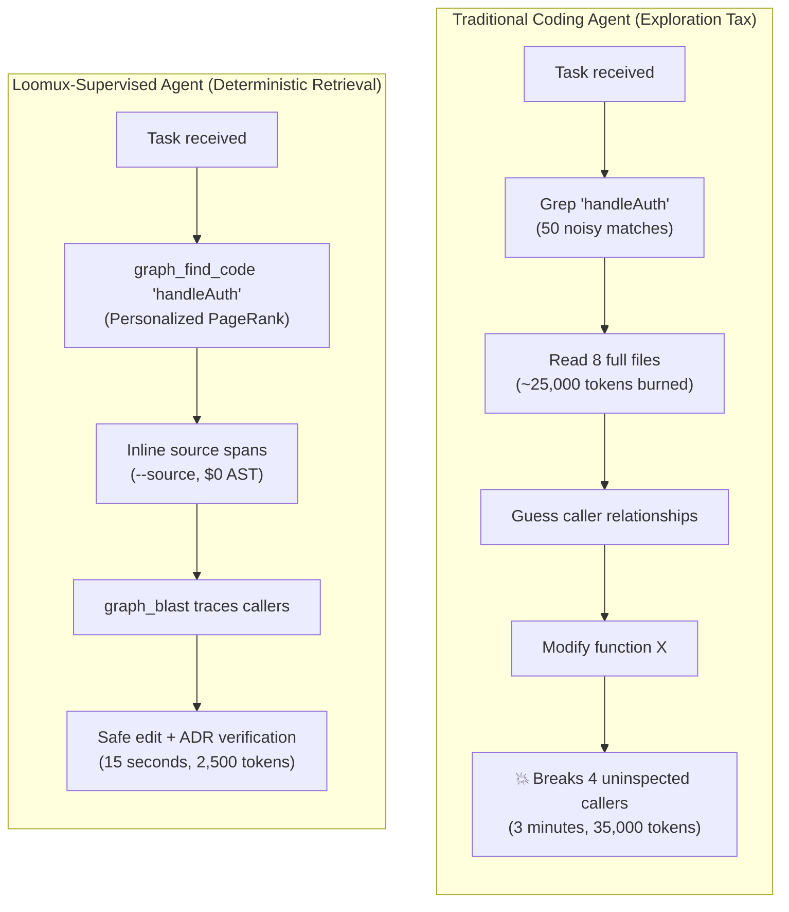
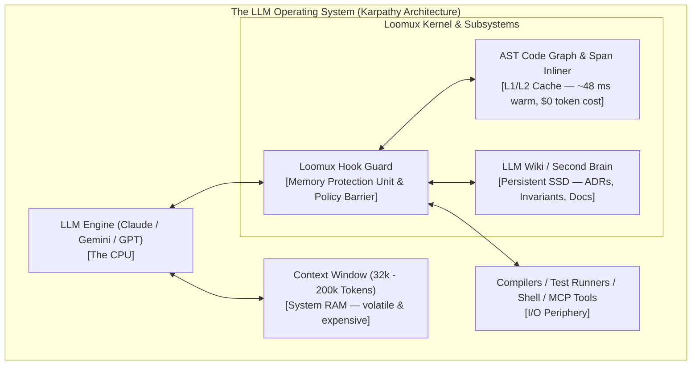
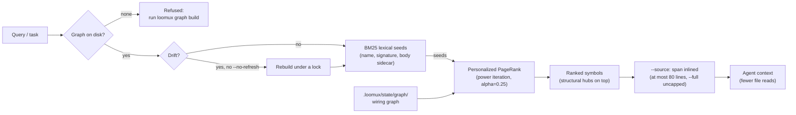
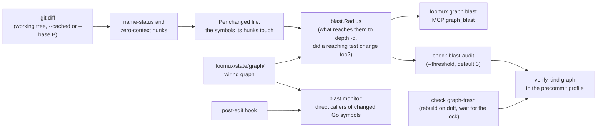
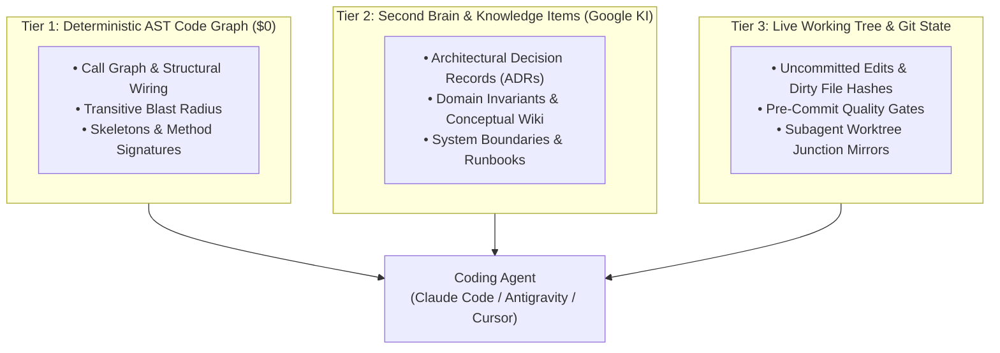

# Loomux Architecture & Conceptual Foundation

> **"Humans onboard to a codebase once. Coding agents onboard every single session."**

Loomux bridges the fundamental gap between modern Large Language Models (LLMs) and production software repositories. It unites **Hooks, Skills, Code Graph + Loop Engineering, Second Brain / LLM Wiki, and LLM OS** into a single, dependency-free, CGo-free Go binary.

---

## 1. The Core Problem: The Agent Exploration Tax

Every time an autonomous coding agent (Claude Code, Antigravity, Cursor) begins a task, it starts with total amnesia. Before making a single line edit, it spends minutes blindly exploring the repository:
1. Grepping for keywords (`grep "auth"`) yielding hundreds of irrelevant hits.
2. Reading whole files into the context window to deduce dependencies.
3. Guessing caller structures and method receivers.
4. Refactoring a function, only to silently break 4 callers in distant packages.
5. Incurring massive token costs, slow turnarounds, and subtle regressions.



Loomux eliminates this exploration tax through a unified runtime providing **memory, structure, and strict governance**.

---

## 2. Conceptual Pillar I: Andrej Karpathy's "LLM OS"

In late 2023, AI researcher Andrej Karpathy framed the LLM not merely as a text generator, but as the **Central Processing Unit (CPU) of an emerging Operating System**:
- **CPU**: The LLM (instruction execution, reasoning, synthesis).
- **RAM**: The Context Window (fast, high bandwidth, but volatile, expensive, and limited).
- **L1/L2 Cache**: The **Deterministic AST Code Graph & Span Inliner** (structural retrieval at zero token cost; `loomux graph ask` answers in ~48 ms warm on this repository, see [benchmarks](benchmarks.md)).
- **Non-Volatile Storage (Disk / SSD)**: The **Second Brain / LLM Wiki** (curated Architectural Decision Records (ADRs), system boundaries, domain invariants, operational runbooks).
- **Kernel & Memory Protection Unit (MPU)**: The **Loomux Hooks & Write Barrier** (enforcing file boundaries, pre-tool policy, preventing destructive system commands).
- **I/O Peripherals**: Terminals, compilers, git, and MCP protocol servers.



In this architecture, Loomux acts as the **OS Kernel and Runtime Supervisor**:
- It ensures the agent does not overwrite forbidden files or execute destructive shell commands (MPU / Write Barrier).
- It provides non-volatile project memory so decisions made last week do not have to be re-discovered today (Disk / Wiki).
- It feeds the CPU with micro-targeted code spans rather than multi-megabyte file dumps (L1 Cache / inlined spans).

---

## 3. Conceptual Pillar II: Google Knowledge Items (KI) & Open Knowledge

Naive Retrieval-Augmented Generation (RAG) fails on large codebases. Splitting code into arbitrary chunks and embedding them into a vector database returns disjointed snippets without semantic intent, architectural context, or relationship boundaries.

Loomux adopts the **Open Knowledge and Knowledge Item (KI)** philosophy pioneered by Google DeepMind and Antigravity:

### 1. Curated Knowledge Artifacts
A Knowledge Item is not a raw file dump. It is a structured markdown document consisting of:
- **Typed Frontmatter**: Declaring the category (`Architecture`, `Decision`, `Runbook`, `Data Model`).
- **Context & Constraints**: The non-obvious *why* behind the code, not just the *what*.
- **Verified References**: Clickable links to code symbols, tests, and active specifications.

### 2. The Ground Truth Principle
> **"Knowledge Items are verified starting points, not ground truth."**

Code evolves. An architectural note written three months ago must never override the active code without verification:
1. The agent reads the Wiki ADR to understand the original intent and architectural boundary.
2. The agent verifies the claim against the live AST Code Graph (`loomux graph ask` / `callers`).
3. If drift is detected, `loomux reconcile` records it as a review case, the agent updates the page, and `loomux lint` and `loomux wiki-gate` check the result.

### 3. Typology & Taxonomies
Loomux enforces strict knowledge categorization:
- **`CORE_TYPES`**:
  - `Architecture`: System topology, module boundaries, dataflow invariants.
  - `Decision`: Architectural Decision Records (ADRs) explaining past trade-offs.
  - `Open Question`: Unresolved technical ambiguity requiring human consensus.
  - `Reference`: Canonical specifications, external protocols, and RFCs.
- **`CATALOGUE_TYPES`**:
  - `API Endpoint`: REST, gRPC, and MCP contract specifications.
  - `Data Model`: Schemas, structs, database entities, and invariants.
  - `Metric`: Performance benchmarks, latency targets, and SLAs.
  - `Runbook`: Operational procedures, failover instructions, deployment guides.
  - `Glossary Entry`: Definitions of project terms.
- **`ORIGIN_TYPES`**:
  - `Source`: Raw external references and citations.
  - `Topic`: Domain concepts and high-level conceptual groupings.
  - `Entity`: Concrete domain entities and identities.
  - `Synthesis`: Cross-cutting analyses and research syntheses.

---

## 4. Conceptual Pillar III: Structural Graph Intelligence

Text embeddings alone cannot determine whether modifying `function A` breaks `function B`. Loomux applies graph engineering principles inspired by [trailhq/Graft](https://github.com/trailhq/Graft):



> **Packages.** The read model and the two calculators are `internal/code/model`,
> `internal/code/pagerank` and `internal/code/blast`; the graph they read comes from
> `sourceset`, the extractors in `extract/all` (`extract/golang` on `go/parser`,
> `extract/python` on the shared tree-sitter core `extract/treesitter`, which runs on
> `gotreesitter` in pure Go), `resolve` and `store`, and `freshness` answers
> whether it still matches the tree. `internal/code/lexicon` tokenizes queries and
> documents and keeps the `ask-index.json` sidecar; `internal/code/ask` blends
> BM25-style relevance over name, signature and body with Personalized PageRank
> (alpha=0.25), inlines source spans and runs the locked rebuild. `ask` does not
> import the extractor: the rebuild arrives as a `Rebuild` function, so the query
> path stays apart from the parser. What is still open (stages G4c and G5b to
> G5d) is on the [roadmap](../../README.md#roadmap); every command is in the
> [CLI reference](cli-reference.md).

### 1. "Lexical Proposes, Graph Disposes"
- **Lexical Step** (G2): BM25 and exact symbol indexing quickly identify candidate nodes matching the prompt keywords.
- **Graph Step** (G1, `internal/code/pagerank`): A **Personalized PageRank** random-walk is initiated, seeded by those candidates. Graph connectivity concentrates probability mass onto structural hubs, naturally filtering out dead code, private helpers, or isolated mock functions.

The rank meets the edges **undirected**, where the blast radius below meets the
very same edges directed. To understand an area, what a function calls weighs as
much as what calls it, so mass has to flow both ways along one call; "who breaks
if this changes" is the other question, and that one has a direction. A parallel
edge is not collapsed: it counts twice in the neighbour list and splits the mass
accordingly, as in the reference. An edge whose target is not a node of the
graph — an unresolved import naming its module — is dropped from the rank,
because it would otherwise gather mass and be reported as a result nobody can
open.

### 2. The Blast Radius Engine
Before any file edit or PR merge, Loomux computes the **transitive closure** over
the incoming edges (G1, `internal/code/blast`):
$$\text{BlastRadius}(S) = \{ u \in V \mid u \rightsquigarrow S \}$$
This immediately warns the agent:
> *"Modifying `guard.go:checkTool` will affect 8 callers across `cli`, `hooks`, and `serve`."*

Five relations carry the walk — `calls`, `references`, `imports`, `implements`
and `extends`. `contains` is excluded on purpose: a file contains every symbol
defined in it, so walking that edge would turn every file into a hub that floods
the walk. Where the rank drops an unresolved target, the walk keeps it as a hit
without a node rather than hide the dependency. A node is reported once, at the
smallest depth any start reached it at, and a start node is never its own hit.

The blast radius of a whole change starts from git's diff and walks the same
edges. All of it is built since Stage G4b:



### 3. Span Inlining Instead of a Crux
Reading an entire 1,000-line file into context just to inspect a 20-line method wastes tokens. `loomux graph ask --source` attaches each hit's own span, at most 80 lines (`--full` lifts the cap), at **$0 token cost** for the lookup. The model's crux — an excerpt an LLM chose and stored on the node — is left out on purpose: no LLM sits in loomux's path, and the span is that model's own fallback for a node without a crux (`internal/code/ask/source.go`).

---

## 5. Conceptual Pillar IV: The Sub-35ms Write Barrier

Agent harnesses invoke hooks synchronously on every single tool call. If a pre-tool hook takes 700ms (standard for Python/Node runtimes), an agent session with 50 tool calls loses 35 seconds just waiting for hook overhead.

Loomux executes as a single compiled Go binary with a **sub-35ms execution budget**:

```
Hook timing (warm medians, see benchmarks, 2026-09-18):
├── Start floor (`loomux version`, SDK linked):  6.4 ms
└── `hook pre-tool-use`, Edit on README.md:     9.0 ms
```

### Absolute Isolation:
- **Hooks never talk to HTTP servers**: `loomux hook pre-tool-use` never calls an API or socket. It reads `stdin`, evaluates policy and exits; it writes no journal (an event journal under `.loomux/state/journal/` is planned with the Web OS, stage W1).
- **Deterministic Deny (Exit Code 2)**: Any write outside registered project areas or violating `.loomux/config.toml` is rejected instantly with an actionable explanation on `stderr`.

---

## 6. The 3-Tier Memory Hierarchy

Loomux coordinates three distinct memory tiers to give coding agents total situational awareness:



Together, these tiers transform autonomous agents from blind guessers into disciplined, context-aware software engineers.
