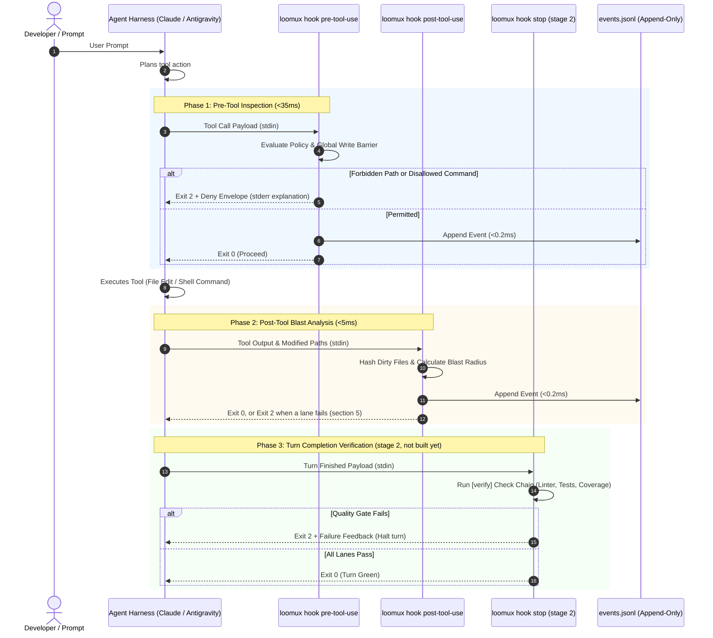
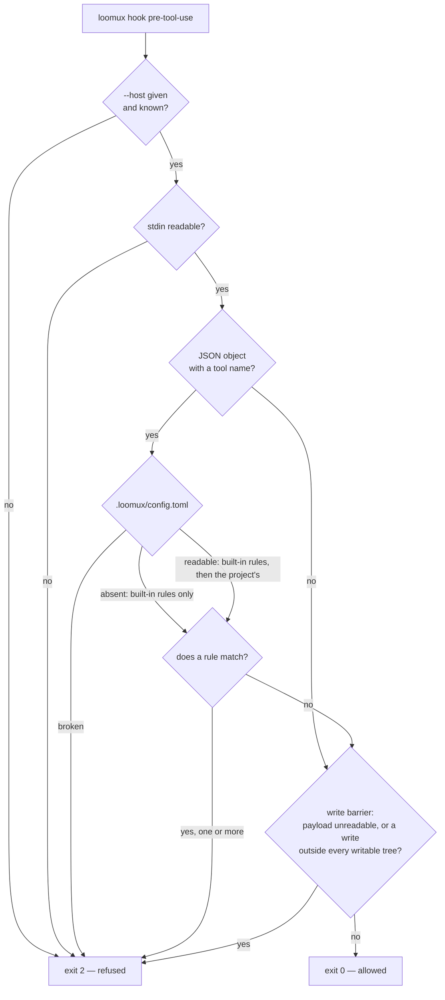
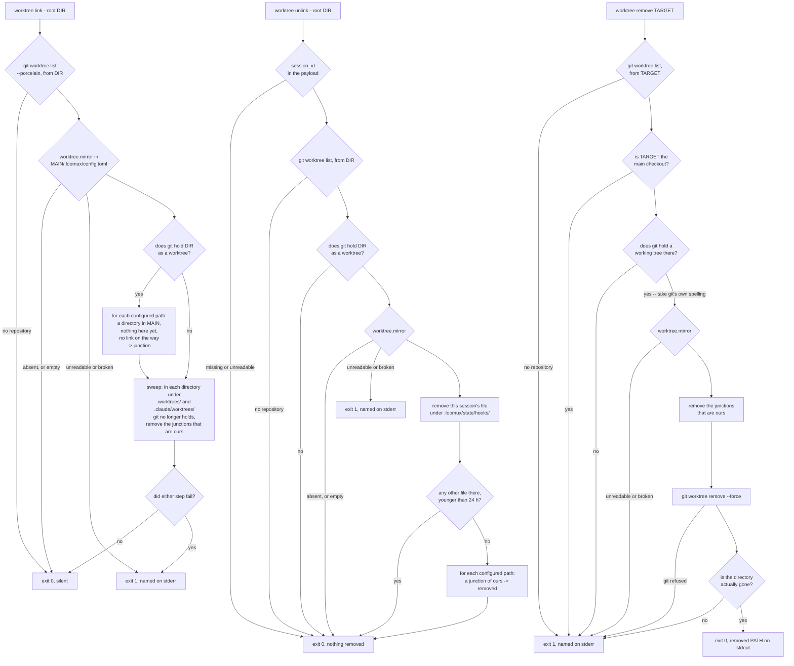

# Loomux Hook Lifecycle & Host Integration

This document details the hook execution lifecycle, payload specifications for different agent harnesses, and the decoupled event stream architecture.

---

## 1. The 4-Phase Hook Lifecycle

Loomux hooks intercept agent interactions at four critical phases:



---

## 2. Host Payload Formats

Loomux automatically normalizes payloads from supported coding agent hosts.

### A. Claude Code
Claude Code pipes standard tool call objects to `stdin`:

```json
{
  "tool_name": "Write",
  "tool_input": {
    "file_path": "C:/Projects/loomux/.env"
  }
}
```

For shell commands (`Bash`):
```json
{
  "tool_name": "Bash",
  "tool_input": {
    "command": "git push origin main"
  }
}
```

### B. Google Antigravity
Antigravity packages tool invocations in camelCase structures:

```json
{
  "toolCall": {
    "name": "write_to_file",
    "args": {
      "TargetFile": "C:/Projects/loomux/.env",
      "CodeContent": "SECRET_KEY=12345"
    }
  }
}
```

For Antigravity shell execution (`run_command`):
```json
{
  "toolCall": {
    "name": "run_command",
    "args": {
      "CommandLine": "git push origin main"
    }
  }
}
```

Loomux parses both representations natively into a unified internal representation (`tool`, `input`).

---

## 3. The Decoupled Event Stream Architecture

A common architectural trap in agent tooling is having hooks make synchronous HTTP calls or IPC requests to a background daemon. This introduces significant latency (>10ms) and creates a catastrophic failure mode if the background service crashes.

Loomux guarantees total isolation through an **append-only file journal**:

```
Hook Process (loomux hook pre/post-tool-use)
   │
   └── Appends single JSON line (O_APPEND, <0.2ms)
       │
       ▼
.loomux/state/journal/events.jsonl
       │
       ▲
       └── Background Tailing Routine (inotify / stat polling)
           │
   ┌───────┴────────────────────────┐
   ▼                                ▼
loomux serve                   Connected Browsers
(Root Gateway)                 (SSE /api/events)
```

1. **Zero-Overhead Write**: Hooks append events using raw file descriptors in `<0.2ms`.
2. **Crash Resilience**: If `loomux serve` is not running, hooks continue working with zero degradation.
3. **Live Sync**: When `loomux serve` runs, it tails `events.jsonl` and broadcasts updates via Server-Sent Events (SSE) to the Web OS dashboard and Kanban boards in real time.

---

## 4. Refusal Envelopes & Diagnostics

When `loomux hook pre-tool-use` blocks an operation, it outputs:

### 1. `stdout` Envelope (for the Agent Harness)
```json
{
  "decision": "deny",
  "reason": "loomux policy refused this tool call:\n  - secrets are not written by an agent",
  "hookSpecificOutput": {
    "hookEventName": "PreToolUse",
    "permissionDecision": "deny",
    "permissionDecisionReason": "loomux policy refused this tool call:\n  - secrets are not written by an agent"
  }
}
```

The envelope is written on one line; the top-level `decision` and `reason`
are the older hook spelling, kept beside `hookSpecificOutput`. The exit code
carries the refusal whether or not a host reads either.

### 2. `stderr` Message (for Terminal & Logs)
```text
loomux policy refused this tool call:
  - secrets are not written by an agent
```

### 3. Exit Code: `2`
Exit code 2 informs the agent harness that the tool call was explicitly rejected and must not be retried with the same parameters.

---

## 5. The Post-Edit Lanes by Stack

`loomux hook post-tool-use` reads the edited path from the payload
(`file_path`, else `notebook_path`) and starts only the lanes of the stack its
extension belongs to — and only when that stack was detected in the project
from its marker files (`go.mod`, `pyproject.toml`, `Cargo.toml`,
`project.godot`, `tsconfig.json` beside `package.json`, …). The lanes run in
parallel; a failing lane ends the hook with exit 2 and its output on stderr.

| Stack | Extensions | Lanes |
|---|---|---|
| Python | `.py` | `ruff check --output-format=concise .` and one type checker: `mypy --no-error-summary --no-pretty`; `dmypy run -- --no-error-summary --no-pretty` where `uv.lock` exists; `pyright` (`uv run pyright` with `uv.lock`) where `pyrightconfig.json` or `[tool.pyright]` exists |
| GDScript | `.gd` | `gdlint <file>`, run in the Godot project's directory |
| C / C++ | `.c`, `.h`, `.cc`, `.cpp`, `.cxx`, `.hpp` | `clang-format -i <file>`, `cmake --build build --parallel` |
| TypeScript / JavaScript | `.ts`, `.tsx`, `.js`, `.jsx` | `npx eslint --cache <file>`, `npx tsc --noEmit` |
| Vue | `.vue` | `npx vue-tsc --noEmit` |
| Svelte | `.svelte` | `npx svelte-check` |
| CSS | `.css`, `.scss`, `.sass`, `.less` | `npx stylelint <file>` |
| HTML | `.html`, `.htm` | `npx htmlhint <file>` |
| Shell | `.sh`, `.bash`, `.zsh` | `shellcheck <file>` |
| SQL | `.sql` | `sqlfluff lint <file>` |
| Rust | `.rs` | `cargo clippy -- -D warnings`, `cargo fmt --check` |
| Go | `.go` | `go vet ./...` |
| Wiki | `.md` inside the bundle | the check of `loomux lint <file>`, inside the hook's own process |
| — | `.md` outside the bundle; `.txt`, `.json`, `.yaml`, `.yml`, `.toml`, `.svg`, `.png`, `.jpg`, `.jpeg`, `.import`, `.lock` | none; the hook exits 0 at once |

- **A package in a subdirectory.** When the edited path's first directory is
  not one of `src`, `lib`, `pkg`, `cmd`, `tests`, `test`, `dist`, `build`,
  `public`, the web lanes run through that directory's package:
  `npx --prefix <dir> eslint --config <dir>/eslint.config.js --cache <file>`
  and `npm --prefix <dir> run typecheck`; Vue runs
  `npm --prefix <dir> run typecheck`, Svelte `npm --prefix <dir> run check`,
  CSS `npx --prefix <dir> stylelint <file>`.
- **Any other extension** starts every lane of every detected stack, the wide
  chain. The wiki lane stays out of it, because it has no page to read.
- **A tool that is not on the `PATH`** skips its lane instead of failing it:
  the exit code stays 0, and the hook names the skipped lane in
  `hookSpecificOutput.additionalContext`.
- **No formatter check for Go.** `gofmt` runs in the pre-commit gate, not after
  an edit.

---

## 6. CRLF Is Not a Formatting Question

`gofmt` writes LF only and calls every Go file checked out with CRLF
unformatted. The pre-commit gate (`.githooks/pre-commit`) then lists it under
`gofmt: these files are not formatted:`, which names the wrong cause.

This repository pins line endings in `.gitattributes` (`* text=auto eol=lf`).
An attribute **takes effect only on the next checkout**, though; it does not
touch files already checked out, and on a machine with `core.autocrlf = true`
those stay CRLF. `git add --renormalize .` does not help either: it rewrites
the index, which holds LF already, and leaves the working tree as it is.

Tell the two cases apart with `git ls-files --eol <path>`: `w/crlf` in the
second column is a checkout problem, not a formatting one. A `grep` for a CR at
the end of a line is no substitute: the `grep` of Git for Windows finds a
carriage return before the line end only with `-U` and a real CR in the
pattern, `grep -U $'\r$' <path>` in Bash (measured 2026-09-17 with GNU grep
3.0). Without `-U` it answers "no CRLF" exactly where the problem is, and a
quoted `'\r$'` matches lines ending in the letter `r`.

Heal the files that were named, one by one:

```sh
rm -f internal/verify/gofmt.go && git checkout -- internal/verify/gofmt.go
```

The wide version heals a whole checkout at once — **and discards every
unstaged change to a `.go` file without a word**. Read `git status` first,
commit or `git stash`, then:

```sh
git ls-files -z -- '*.go' | xargs -0 rm -f && git checkout -- '*.go'
```

---

## 7. The Decision Path of `pre-tool-use`

One tool call, one answer: the host asks before the tool runs, and
`loomux hook pre-tool-use --host <host> --root <project>` answers with an exit
code. The project's policy decides first, the global write barrier second.



**Never exit 1.** A host reads 1 as a non-blocking error and runs the tool
anyway. So every way this hook can fail — a missing or unknown `--host`, stdin
that cannot be read, a payload that is no JSON object, a broken
`.loomux/config.toml`, a panic — refuses with 2 (`internal/cli/hook.go`,
`internal/hooks/pretool.go`). A policy that waved calls through as soon as its
own configuration is unreadable would be exactly the barrier one believes to be
there and which is not.

**Paths and command lines, not content.** A writing tool — `Write`, `Edit`,
`MultiEdit`, `NotebookEdit`, and Antigravity's `write_to_file`,
`replace_file_content` and `multi_replace_file_content` — yields every target
it names under `file_path`, `notebook_path`, `TargetFile` or `target_file`; all
of them are judged, not the first one found. `Bash` and `PowerShell` yield
their `command`. What a tool writes into a file is not judged, and
Antigravity's `run_command` reaches no command rule.

**Paths are compared relative to the root.** A pattern without a slash
(`*.pem`, `go.sum`) matches the base name; a pattern with one (`.aws/**`)
matches from the root. A target outside the root keeps its absolute path, so
only slash-free patterns can still reach it; where such a write lands is the
write barrier's question. Without `--root`, loomux searches upwards for a
`.loomux/config.toml`; where it finds none, only the built-in rules apply.

**Every reason, not the first.** The built-in rules come first, then the
project's in the order of the file, and each matching rule adds its reason; the
refusal lists them all. Otherwise the agent would clear one reason, run into
the next, and need a round per rule. A glob that cannot be evaluated is a
refusal of its own.

**The configuration is read for every call with a tool name**, before any rule
is tried. A broken file therefore refuses every call that reaches the hook, not
only those a rule would have judged.

**No allow mode.** The built-in rules always apply; a project can add rules
(`[policy.paths]`, `[policy.commands]`, see
[Configuration](configuration.md)) but cannot remove or invert them. A
repository without `.loomux/config.toml` is protected by the built-ins without
anyone having set anything up.

The built-in rules (`internal/hooks/guard.go`):

| Kind | Matches | Reason |
|---|---|---|
| Path | ten secret patterns, among them `.env`, `.env.*`, `*.pem`, `*.key`, `id_rsa*`, `credentials.json` and `.aws/**` | secrets are not written by an agent |
| Path | `.claude/.no-verify`, `.loomux/state/hooks/**` | the stop gate's own controls are not written by the party it gates |
| Path | seven lock files, among them `go.sum`, `package-lock.json` and `Cargo.lock` | lock files are written by their package manager, not by hand |
| Command | `(^\|\s)git\s+push(\s\|$)` | Whether commits reach the remote is a human's decision. |

The write barrier after the policy decides only about writing tools with a
target: it resolves each target and refuses a write outside every writable
tree. Which trees those are, and the places that are always open, is in
[Configuration](configuration.md#5-the-write-barrier-and-the-agents-memory).

---

## 8. Session Hooks: What Runs Today, What Comes With Stage 2

The policy refuses a tool call before it happens; session hooks establish
afterwards what happened. The design names five of them. Two run today:

| Claude Code event | loomux hook | Stage | What it establishes |
|---|---|---|---|
| `SessionStart` | `session-start` | 1a, runs | The commit the session starts on; a warning when the pilot binary is older than its sources |
| `PostToolUse` | `post-tool-use` | 1a, runs | The lanes of section 5 for the edited file |
| `SubagentStart` | `subagent-start` | 2 | Where the remote refs and the local `HEAD` stood before a subagent |
| `SubagentStop` | `subagent-stop` | 2 | Every remote ref that moved, appeared or vanished, and the commits `HEAD` gained |
| `Stop` | `stop` | 2 | Whether everything since the last green pass is green — the only one that can hold a turn |

Until stage 2, `loomux hook` knows the events `pre-tool-use`, `post-tool-use`
and `session-start`; any other name is refused with exit 2
(`unknown event`). Phase 3 of the diagram in section 1 is stage 2.

### `session-start` today

```sh
loomux hook session-start --host claude --root <project>   # payload on stdin
```

- **Records the base commit.** `HEAD` of the root goes into
  `.loomux/state/hooks/<session_id>.json` as `base`. Here and nowhere else: by
  the first `Stop` the turn has already run, and whatever it committed would
  sit inside the baseline meant to expose it. Silent when the payload carries
  no session id (nowhere to file it) or the root is no git repository (nothing
  to file). A write that fails is exit 1.
- **Warns about a stale binary.** When the running binary lies inside the
  project and is older than the newest of `go.mod`, `go.sum` and the `.go`
  files under `cmd/` and `internal/`, the hook says so in
  `hookSpecificOutput.additionalContext`, with the rebuild command. Compared
  against the sources and not against `HEAD`: the pre-commit gate builds
  `bin/loomux.exe` before the commit exists. With nothing to say, the hook
  writes nothing.
- **Does not announce paused flow runs.** That comes back with the flow
  migration.
- **Only `--host claude` has an adapter.** `antigravity` and `codex` are
  seams: their session payload is unmeasured, and the hook refuses them with
  exit 1 rather than guessing a shape (`internal/hosts/codex.go`).
- **Exit 0 or 1, never 2.** It is an announcement and has no turn to hold. A
  missing or unknown `--host`, stdin that is no JSON object, and — without
  `--root` — no `.loomux/config.toml` above the working directory are exit 1.

### The session state

One file per session under `.loomux/state/hooks/`, holding `base`, `blocks`
and `snapshots` — the last two for the stage 2 hooks. The session id comes from
outside and may not decide where the file lands: only letters, digits (in the
Unicode sense), `-` and `_` survive, and an id that leaves nothing becomes
`unnamed`. A file that cannot be read counts as empty: raising would end a turn
over a counter. The directory is a built-in path rule of the policy
(section 7), because an agent that resets its own block counter has abolished
the gate.

### What stage 2 brings

As the fusion design puts it: `stop` runs the check chain over what changed
since the base, with a `MAX_BLOCKS` counter in the session state, and
deliberately does not read `stop_hook_active`; `subagent-start` and
`subagent-stop` record the remote state and report drift. Target value: under
100 ms of own time per hook, without the time of the gates themselves.

---

## 9. Worktree Mirroring

`git worktree add` gives a new working tree only what git tracks, so every
gitignored directory is missing there — dependency trees, toolchains, caches.
loomux repairs that with one Windows junction per configured path, leading
into the main checkout:

```sh
loomux worktree link --root <dir>        # session start: make the junctions, sweep leftovers
loomux worktree unlink --root <dir>      # session end: reads session_id from the payload on stdin
loomux worktree remove <worktree path>   # by hand: junctions out first, then git
```

The paths come from `[worktree] mirror` (see
[Configuration](configuration.md)), and all three read them from the
`.loomux/config.toml` of the **main checkout**, not of the working directory.
Junctions exist only on Windows: elsewhere, `link` ends with exit 1 at the
first path it would have to create. Nothing in this repository wires the two hook forms
— `.claude/settings.json` calls neither, and its own `.loomux/config.toml`
declares no `[worktree]` table — so the mechanism is inert here.



Three things in that picture are easy to draw wrong, and
`internal/hooks/worktree.go` decides them:

- **The sweep is not gated on being a worktree.** A session in the main
  checkout is the ordinary way to notice that a worktree is gone.
- **A failed link does not stop the sweep.** Both steps run, and either one
  failing sets exit 1.
- **`unlink` removes its own session file before it counts the others.** The
  other order would count the ending session as somebody else, and the last
  session on a tree would never unlink anything.

### Nothing to do is silent, damage is loud

No `.loomux/config.toml`, one without `[worktree]`, and an empty `mirror` are
all exit 0 without a word — a globally wired hook meets all three in every
unrelated project. A file that cannot be read or parsed, or a `mirror` entry
that is empty, absolute or climbs out with `..`, is exit 1 and named: read as
"nothing to mirror", it would switch the mechanism off, and the next symptom
would be a missing directory failing for an unrelated-looking reason. The two
hook forms write only faults, to stderr; `remove` names the removed path on
stdout, because somebody deleting something should read what was deleted.

### What makes a junction ours

A reparse point, at a configured path, leading into the main checkout — for
`sweep` additionally inside a directory git no longer holds. A real directory
at that path is somebody's data and is never touched; a junction pointing
elsewhere is somebody's own arrangement and is left alone. Removal uses
`os.Remove`, never `os.RemoveAll`: on a reparse point the first removes the
point, the second would walk into the target (`internal/worktree/junction`).
There is no ledger of the junctions made — it would be a second state that
drifts — so hand-made junctions at the same places and pointing at the same
target are adopted.

`link` only fills a path that is absent in the worktree and a directory in the
main checkout, and it creates missing parents. Every component between the tree
and a configured path must be a plain directory — or, for `link`, absent. A
junction at a parent would otherwise make the operation act at the junction's
target: `sweep` and `unlink` would remove the main checkout's own link, `link`
would create one outside the worktree.

Paths are compared by identity (`os.SameFile`), never as text: git prints
forward slashes on Windows, and a stored junction target carries a trailing
separator or not depending on who made it (`mklink /J` without, loomux with).

### A live directory git does not hold is swept anyway

The sweep scans one level below `.worktrees/` and `.claude/worktrees/` of the
main checkout. A directory there that git does **not** hold as a worktree but
that carries a matching junction is swept even while somebody works in it, and
`link` will not put it back, because the directory is no worktree. What that
costs is a junction to make again by hand, never data: relaxing any of the
conditions above is what would make the sweep unsafe.

### The 24-hour cutoff, and why it is weaker in loomux

`unlink` counts the other session files that are younger than 24 hours; a
file's modification time is the only liveness there is to read. In loomux
today exactly one hook writes that file: `session-start`, once. The stage 2
hooks will rewrite it on every block, pass and subagent dispatch; until then a
session file is as young as its session's start. A session running longer than
a day is therefore not counted, and a second session ending on the same tree
takes the junctions from under it. No number closes that hole; the fix is a
write on the live side. Twenty-four hours leans long for the asymmetry: a
junction left standing costs nothing — `link` skips it, and `sweep` takes it
out once git stops holding a tree under `.worktrees/` or `.claude/worktrees/` —
and one taken too early costs a live session its directory.

Whether a session-end event reaches `unlink` at all has not been observed:
the command needs one that carries `session_id` (for Claude Code,
`SessionEnd`). Without it, the sweep in `link` and `remove` are the only two
cleanup paths.

### Why `git worktree remove` needs a wrapper

Measured on 2026-09-07: `git worktree remove --force` on a worktree holding a
junction exits 0, prints nothing, drops the porcelain entry — and leaves the
directory and the junction standing. `remove` puts the order right: the
junctions come out first, then git is asked. Before that it refuses the main
checkout and any directory git holds no working tree at; it hands git git's own
spelling of the path, because the git call runs in the main checkout, where a
relative argument would resolve elsewhere; and after git exits 0 it checks
that the directory is really gone. If git refuses, the junctions are already
out, and the next `link` puts them back.

### Exit codes

    0  in order, or deliberately nothing to do
    1  a fault, named on stderr
    2  loomux worktree without a subcommand, or with an unknown one

None of the three can hold a turn, and none is meant to: a session whose
mirror could not be made should be told so, not stopped.
