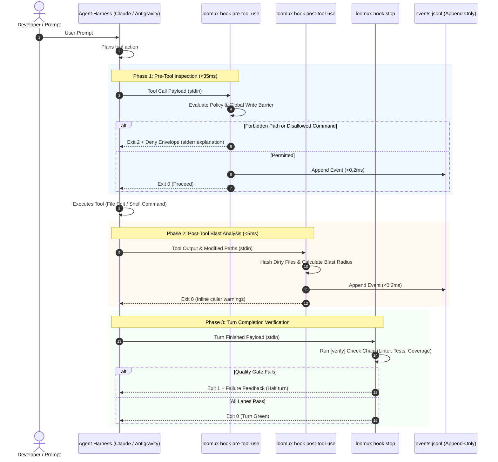

# Loomux Hook Lifecycle & Host Integration

This document details the hook execution lifecycle, payload specifications for different agent harnesses, and the decoupled event stream architecture.

---

## 1. The 4-Phase Hook Lifecycle

Loomux hooks intercept agent interactions at four critical phases:



---

## 2. Host Payload Formats

Loomux automatically normalizes payloads from supported coding agent hosts.

### A. Claude Code
Claude Code pipes standard tool call objects to `stdin`:

```json
{
  "tool_name": "Write",
  "tool_input": {
    "file_path": "C:/Projects/loomux/.env"
  }
}
```

For shell commands (`Bash`):
```json
{
  "tool_name": "Bash",
  "tool_input": {
    "command": "git push origin main"
  }
}
```

### B. Google Antigravity
Antigravity packages tool invocations in camelCase structures:

```json
{
  "toolCall": {
    "name": "write_to_file",
    "args": {
      "TargetFile": "C:/Projects/loomux/.env",
      "CodeContent": "SECRET_KEY=12345"
    }
  }
}
```

For Antigravity shell execution (`run_command`):
```json
{
  "toolCall": {
    "name": "run_command",
    "args": {
      "CommandLine": "git push origin main"
    }
  }
}
```

Loomux parses both representations natively into a unified internal representation (`tool`, `input`).

---

## 3. The Decoupled Event Stream Architecture

A common architectural trap in agent tooling is having hooks make synchronous HTTP calls or IPC requests to a background daemon. This introduces significant latency (>10ms) and creates a catastrophic failure mode if the background service crashes.

Loomux guarantees total isolation through an **append-only file journal**:

```
Hook Process (loomux hook pre/post-tool-use)
   │
   └── Appends single JSON line (O_APPEND, <0.2ms)
       │
       ▼
.loomux/state/journal/events.jsonl
       │
       ▲
       └── Background Tailing Routine (inotify / stat polling)
           │
   ┌───────┴────────────────────────┐
   ▼                                ▼
loomux serve                   Connected Browsers
(Root Gateway)                 (SSE /api/events)
```

1. **Zero-Overhead Write**: Hooks append events using raw file descriptors in `<0.2ms`.
2. **Crash Resilience**: If `loomux serve` is not running, hooks continue working with zero degradation.
3. **Live Sync**: When `loomux serve` runs, it tails `events.jsonl` and broadcasts updates via Server-Sent Events (SSE) to the Web OS dashboard and Kanban boards in real time.

---

## 4. Refusal Envelopes & Diagnostics

When `loomux hook pre-tool-use` blocks an operation, it outputs:

### 1. `stdout` Envelope (for the Agent Harness)
```json
{
  "hookSpecificOutput": {
    "permissionDecision": "deny",
    "permissionDecisionReason": "secrets are not written by an agent: .env"
  }
}
```

### 2. `stderr` Message (for Terminal & Logs)
```text
loomux policy refused this Write:
  - secrets are not written by an agent
```

### 3. Exit Code: `2`
Exit code 2 informs the agent harness that the tool call was explicitly rejected and must not be retried with the same parameters.

---

## 5. The Post-Edit Lanes by Stack

`loomux hook post-tool-use` reads the edited path from the payload
(`file_path`, else `notebook_path`) and starts only the lanes of the stack its
extension belongs to — and only when that stack was detected in the project
from its marker files (`go.mod`, `pyproject.toml`, `Cargo.toml`,
`project.godot`, `tsconfig.json` beside `package.json`, …). The lanes run in
parallel; a failing lane ends the hook with exit 2 and its output on stderr.

| Stack | Extensions | Lanes |
|---|---|---|
| Python | `.py` | `ruff check --output-format=concise .` and one type checker: `mypy --no-error-summary --no-pretty`; `dmypy run -- --no-error-summary --no-pretty` where `uv.lock` exists; `pyright` (`uv run pyright` with `uv.lock`) where `pyrightconfig.json` or `[tool.pyright]` exists |
| GDScript | `.gd` | `gdlint <file>`, run in the Godot project's directory |
| C / C++ | `.c`, `.h`, `.cc`, `.cpp`, `.cxx`, `.hpp` | `clang-format -i <file>`, `cmake --build build --parallel` |
| TypeScript / JavaScript | `.ts`, `.tsx`, `.js`, `.jsx` | `npx eslint --cache <file>`, `npx tsc --noEmit` |
| Vue | `.vue` | `npx vue-tsc --noEmit` |
| Svelte | `.svelte` | `npx svelte-check` |
| CSS | `.css`, `.scss`, `.sass`, `.less` | `npx stylelint <file>` |
| HTML | `.html`, `.htm` | `npx htmlhint <file>` |
| Shell | `.sh`, `.bash`, `.zsh` | `shellcheck <file>` |
| SQL | `.sql` | `sqlfluff lint <file>` |
| Rust | `.rs` | `cargo clippy -- -D warnings`, `cargo fmt --check` |
| Go | `.go` | `go vet ./...` |
| Wiki | `.md` inside the bundle | the check of `loomux lint <file>`, inside the hook's own process |
| — | `.md` outside the bundle; `.txt`, `.json`, `.yaml`, `.yml`, `.toml`, `.svg`, `.png`, `.jpg`, `.jpeg`, `.import`, `.lock` | none; the hook exits 0 at once |

- **A package in a subdirectory.** When the edited path's first directory is
  not one of `src`, `lib`, `pkg`, `cmd`, `tests`, `test`, `dist`, `build`,
  `public`, the web lanes run through that directory's package:
  `npx --prefix <dir> eslint --config <dir>/eslint.config.js --cache <file>`
  and `npm --prefix <dir> run typecheck`; Vue runs
  `npm --prefix <dir> run typecheck`, Svelte `npm --prefix <dir> run check`,
  CSS `npx --prefix <dir> stylelint <file>`.
- **Any other extension** starts every lane of every detected stack, the wide
  chain. The wiki lane stays out of it, because it has no page to read.
- **A tool that is not on the `PATH`** skips its lane instead of failing it:
  the exit code stays 0, and the hook names the skipped lane in
  `hookSpecificOutput.additionalContext`.
- **No formatter check for Go.** `gofmt` runs in the pre-commit gate, not after
  an edit.

---

## 6. CRLF Is Not a Formatting Question

`gofmt` writes LF only and calls every Go file checked out with CRLF
unformatted. The pre-commit gate (`.githooks/pre-commit`) then lists it under
`gofmt: these files are not formatted:`, which names the wrong cause.

This repository pins line endings in `.gitattributes` (`* text=auto eol=lf`).
An attribute **takes effect only on the next checkout**, though; it does not
touch files already checked out, and on a machine with `core.autocrlf = true`
those stay CRLF. `git add --renormalize .` does not help either: it rewrites
the index, which holds LF already, and leaves the working tree as it is.

Tell the two cases apart with `git ls-files --eol <path>`: `w/crlf` in the
second column is a checkout problem, not a formatting one. A `grep` for a CR at
the end of a line is no substitute: the `grep` of Git for Windows does not find
`\r$` unless it gets `-U` (measured 2026-09-17 with GNU grep 3.0), so it answers
"no CRLF" exactly where the problem is.

Heal the files that were named, one by one:

```sh
rm -f internal/verify/gofmt.go && git checkout -- internal/verify/gofmt.go
```

The wide version heals a whole checkout at once — **and discards every
unstaged change to a `.go` file without a word**. Read `git status` first,
commit or `git stash`, then:

```sh
git ls-files -z -- '*.go' | xargs -0 rm -f && git checkout -- '*.go'
```
