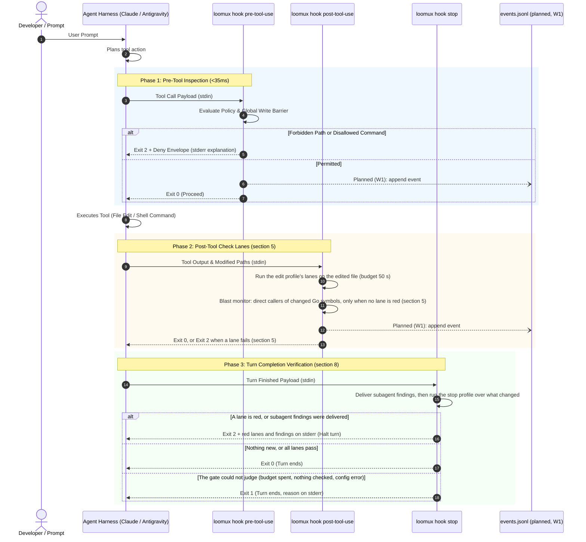
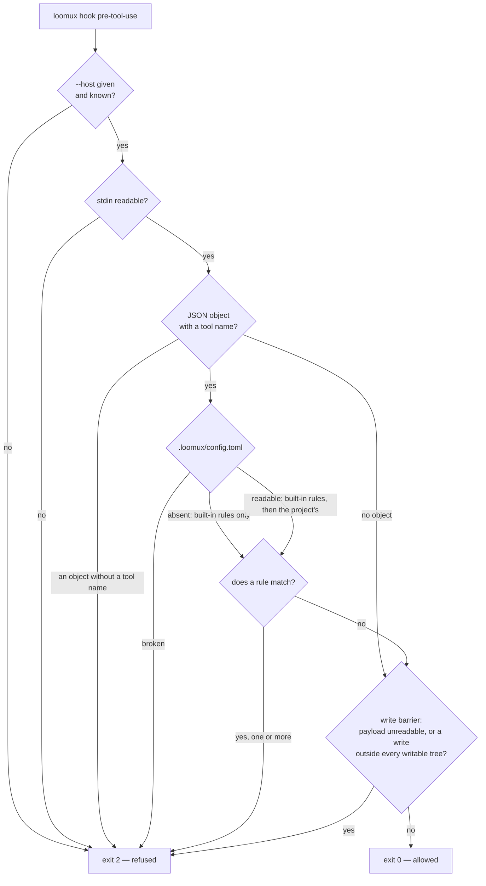
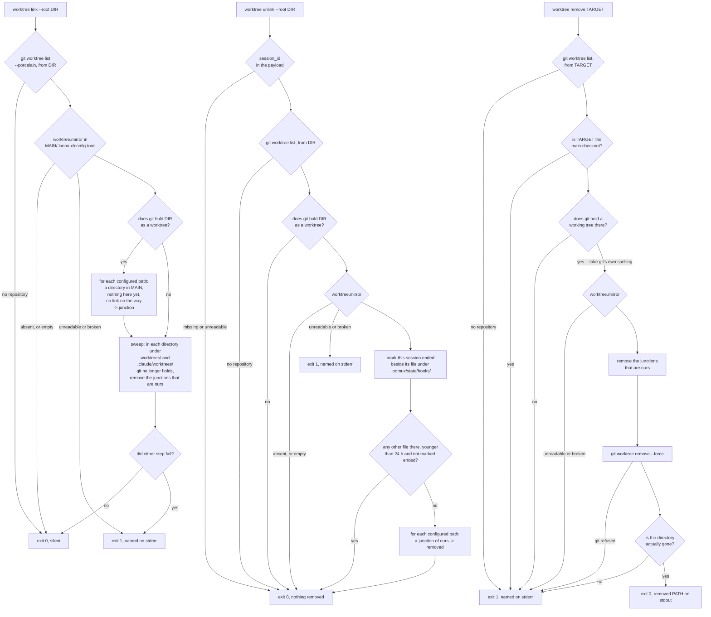

# Loomux Hook Lifecycle & Host Integration

This document details the hook execution lifecycle, payload specifications for different agent harnesses, and the decoupled event stream architecture.

---

## 1. The Hook Lifecycle

Loomux hooks intercept agent interactions before a tool, after it, and at the end of a turn (session and subagent hooks: section 8):



---

## 2. Host Payload Formats

Loomux automatically normalizes payloads from supported coding agent hosts.

### A. Claude Code
Claude Code pipes standard tool call objects to `stdin`:

```json
{
  "tool_name": "Write",
  "tool_input": {
    "file_path": "C:/Projects/loomux/.env"
  }
}
```

For shell commands (`Bash`):
```json
{
  "tool_name": "Bash",
  "tool_input": {
    "command": "git push origin main"
  }
}
```

### B. Google Antigravity
Antigravity packages tool invocations in camelCase structures:

```json
{
  "toolCall": {
    "name": "write_to_file",
    "args": {
      "TargetFile": "C:/Projects/loomux/.env",
      "CodeContent": "SECRET_KEY=12345"
    }
  }
}
```

For Antigravity shell execution (`run_command`):
```json
{
  "toolCall": {
    "name": "run_command",
    "args": {
      "CommandLine": "git push origin main"
    }
  }
}
```

Loomux parses both representations natively into a unified internal representation (`tool`, `input`).

---

## 3. The Decoupled Event Stream Architecture

A common architectural trap in agent tooling is having hooks make synchronous HTTP calls or IPC requests to a background daemon. This introduces significant latency (>10ms) and creates a catastrophic failure mode if the background service crashes.

Loomux guarantees total isolation through an **append-only file journal**:

> **Planned (stage W1).** No hook writes the journal yet, and `loomux serve` tails
> nothing; the isolation itself holds today: `internal/hooks` links none of
> `serve`, which an import-graph test keeps. Status: [roadmap](../../README.md#roadmap).

```
Hook Process (loomux hook pre/post-tool-use)
   │
   └── Appends single JSON line (O_APPEND, <0.2ms)
       │
       ▼
.loomux/state/journal/events.jsonl
       │
       ▲
       └── Background Tailing Routine (inotify / stat polling)
           │
   ┌───────┴────────────────────────┐
   ▼                                ▼
loomux serve                   Connected Browsers
(Root Gateway)                 (SSE /api/events)
```

1. **Zero-Overhead Write**: Hooks append events using raw file descriptors in `<0.2ms`.
2. **Crash Resilience**: If `loomux serve` is not running, hooks continue working with zero degradation.
3. **Live Sync**: When `loomux serve` runs, it tails `events.jsonl` and broadcasts updates via Server-Sent Events (SSE) to the Web OS dashboard and Kanban boards in real time.

---

## 4. Refusal Envelopes & Diagnostics

When `loomux hook pre-tool-use` blocks an operation, it outputs:

### 1. `stdout` Envelope (for the Agent Harness)
```json
{
  "decision": "deny",
  "reason": "loomux policy refused this tool call:\n  - secrets are not written by an agent",
  "hookSpecificOutput": {
    "hookEventName": "PreToolUse",
    "permissionDecision": "deny",
    "permissionDecisionReason": "loomux policy refused this tool call:\n  - secrets are not written by an agent"
  }
}
```

The envelope is written on one line; the top-level `decision` and `reason`
are the older hook spelling, kept beside `hookSpecificOutput`. The exit code
carries the refusal whether or not a host reads either.

### 2. `stderr` Message (for Terminal & Logs)
```text
loomux policy refused this tool call:
  - secrets are not written by an agent
```

### 3. Exit Code: `2`
Exit code 2 informs the agent harness that the tool call was explicitly rejected and must not be retried with the same parameters.

---

## 5. The Post-Edit Lanes by Stack

`loomux hook post-tool-use` reads the edited path from the payload
(`file_path`, else `notebook_path`), finds the stack its extension belongs to,
and runs the lanes of the `edit` profile (by default `lint` and `types`) for
that stack — only when the stack is active: detected in the project from its
marker files (`go.mod`, `pyproject.toml`, `Cargo.toml`, `project.godot`,
`tsconfig.json` beside `package.json`, …) or given a command in
`[verify.<stack>]`. The lanes come from the presets and `[verify]`, as
[Configuration](configuration.md#verify-check-chains--quality-gates)
describes; a lane's `on_file` form runs where it has one, else its `commands`.
Lanes run side by side, each command as argv without a shell. A failing lane
ends the hook with exit 2 and its output on stderr.

The presets, as `loomux status` lists them (`{file}` is the edited file,
relative to its area):

| Stack | Extensions | `lint` | `types` |
|---|---|---|---|
| Go | `.go` | `go vet ./...`, `loomux check gofmt {file}` | — |
| Python | `.py` | `uvx ruff check . --output-format=concise` | `uv run --with mypy mypy --no-error-summary --no-pretty --exclude-gitignore .`; instead `uv run pyright` where `pyrightconfig.json` or `[tool.pyright]` exists, `uv run mypy --no-error-summary --no-pretty` where mypy is configured |
| GDScript | `.gd` | `uvx --from gdtoolkit gdlint {file}` | — |
| C / C++ | `.c`, `.h`, `.cc`, `.cpp`, `.cxx`, `.hpp` | `clang-format --dry-run --Werror {file}` | `cmake --build build --parallel` |
| TypeScript / JavaScript | `.ts`, `.tsx`, `.js`, `.jsx` | `npx eslint --cache {file}`; instead `npx biome check {file}` where `biome.json` exists | `npx tsc --noEmit` |
| Vue | `.vue` | — | `npx vue-tsc --noEmit` |
| Svelte | `.svelte` | — | `npx svelte-check` |
| CSS | `.css`, `.scss`, `.sass`, `.less` | `npx stylelint {file}` | — |
| HTML | `.html`, `.htm` | `npx htmlhint {file}` | — |
| Shell | `.sh`, `.bash`, `.zsh` | `shellcheck {file}` | — |
| SQL | `.sql` | `sqlfluff lint {file}` | — |
| Rust | `.rs` | `cargo clippy -- -D warnings`, `cargo fmt --check` | — |
| Wiki | `.md` inside the bundle | the check of `loomux lint <file>`, inside the hook's own process | — |
| — | `.md` outside the bundle; `.txt`, `.json`, `.yaml`, `.yml`, `.toml`, `.svg`, `.png`, `.jpg`, `.jpeg`, `.import`, `.lock` | none; the hook exits 0 at once | |

- **The area.** A lane runs in the area that holds the file: for
  `web/src/app.ts` in a project where `web/` has its own `package.json` and
  `tsconfig.json`, eslint and tsc run in `web/` with `{file}` = `src/app.ts`.
  A project's own workspace scripts (`npm run typecheck`) are not guessed; a
  project that wants them names them in `[verify.typescript]`.
- **Any other extension**, or one whose stack is not active, gets no lanes: the
  hook exits 0; under `--host codex` the call ends with 1 as soon as the
  payload names a file, since the Codex seam has no adapter.
  `[verify.project]` lanes run only beside the lanes of an active stack, and
  only with `on_file`.
- **Skipped, not failed**: a lane whose tool is not on the `PATH`, a Godot
  project not yet imported, and a lane the budget (`--budget`, default 50 s)
  did not reach. A skip blocks nothing and is named on `stderr`, which is
  what a host reads when another lane is red and the hook exits 2, and, when
  the hook exits 0, in the host's context: `hookSpecificOutput.additionalContext`
  for Claude Code; for a `.go` file the blast monitor below writes into the
  same field. At any other exit code the hook writes nothing to `stdout`.
  Under `--host antigravity` the same context goes out as `injectSteps`,
  which agy shows the model after the tool call (measured with agy 1.2.12,
  2026-09-28).
- **Checks never rewrite.** `clang-format` runs with `--dry-run --Werror`; an
  edit is judged, the file stays as the agent wrote it.
- **`gofmt` checks the edited file only**: an unformatted file elsewhere is not
  the edit's to fix. The pre-commit gate checks everything.

### The blast monitor

After the lanes of a `.go` edit, and only when no lane of the call is red,
the hook tells the model who calls what the edit just changed. It reads the
graph on disk (`.loomux/state/graph/wiring.json`), extracts the edited file
again and compares each symbol's body hash with the graph's nodes of the
same path:

- **Seeds** are the symbols the graph has and the file no longer does
  (removed, named first: their callers break for sure), then those whose body
  hash differs (changed). A new symbol seeds nothing; it has no callers in the
  old graph. The file node never seeds: its incoming edges are imports, which
  arrive at one representative file per package, so a change between
  symbols (an import, a package-level constant) would be reported or not
  depending on which file of the package was edited.
- **It speaks** with the direct callers of the seeds in other files, at most
  ten lines and a count of the rest, in the same
  `hookSpecificOutput.additionalContext` as the skipped lanes:

  ```text
  [graph] internal/code/blast/reach.go: changed Reach; callers in other files:
    EdgeWalk (internal/code/blast/edgewalk.go)
    Radius (internal/code/blast/radius.go)
    signal (internal/code/blast/radius.go)
  ```

- **A changed type gets a note, callers or not.** The Go graph has no edges to
  types, so silence would read as "nothing depends on this". When a seed is a
  `struct`, `interface` or `type`, the context ends with
  `[graph] Modified struct/interface/type: type coupling not wired in graph v1 (check references via grep)`.
- **It is silent** without a graph, on a graph of another schema or one that
  no build with this binary's Go extractor wrote, when the file cannot be
  read or does not parse (an edit half done), when no symbol changed (also when the graph is already fresh), and
  when the only callers are in the edited file itself. It never exits 1 and
  never blocks; neither the freshness probe nor `graph check` runs in the hook.
- **A red lane comes first.** When a lane of the call is red, in any of the
  files it names, the hook exits 2 with the finding on `stderr` and writes
  nothing to `stdout`, the blast context of a green file included: the
  finding matters more, and a host reads only `stderr` at exit 2.
- **It repeats until the graph is rebuilt.** The graph stays as it was until
  the next `graph build`, a query that refreshes it, or the pre-commit gate's
  `graph-fresh`; every further edit to the same file names the same seeds
  again. There is no memory per file.
- **Go only.** An edit to a `.py` file gets no blast context: every such
  edit would pay a grammar load and a parse of the file, against the
  monitor's own-time target of under 100 ms, and a single large file alone
  can take more than a second to parse. The graph stays stale until the next
  build renews it. `internal/hooks` does not import the tree-sitter runtime,
  and `TestHooksNeverReachTreeSitter` keeps it so.
- **Cost**: 24.7 ms on this repository's 7.07 MiB graph, growing by about
  4 ms per MiB of `wiring.json`
  ([benchmarks, 2026-09-23 22:55](benchmarks.md#2026-09-23-2255--post-edit-on-a-go-file-with-the-blast-monitor)).

---

## 6. CRLF Is Not a Formatting Question

`gofmt` writes LF only and calls every Go file checked out with CRLF
unformatted. The pre-commit gate (`.githooks/pre-commit`) then lists it under
`gofmt: these files are not formatted:`, which names the wrong cause.

This repository pins line endings in `.gitattributes` (`* text=auto eol=lf`).
An attribute **takes effect only on the next checkout**, though; it does not
touch files already checked out, and on a machine with `core.autocrlf = true`
those stay CRLF. `git add --renormalize .` does not help either: it rewrites
the index, which holds LF already, and leaves the working tree as it is.

Tell the two cases apart with `git ls-files --eol <path>`: `w/crlf` in the
second column is a checkout problem, not a formatting one. A `grep` for a CR at
the end of a line is no substitute: the `grep` of Git for Windows finds a
carriage return before the line end only with `-U` and a real CR in the
pattern, `grep -U $'\r$' <path>` in Bash (measured 2026-09-17 with GNU grep
3.0). Without `-U` it answers "no CRLF" exactly where the problem is, and a
quoted `'\r$'` matches lines ending in the letter `r`.

Heal the files that were named, one by one:

```sh
rm -f internal/verify/gofmt.go && git checkout -- internal/verify/gofmt.go
```

The wide version heals a whole checkout at once — **and discards every
unstaged change to a `.go` file without a word**. Read `git status` first,
commit or `git stash`, then:

```sh
git ls-files -z -- '*.go' | xargs -0 rm -f && git checkout -- '*.go'
```

---

## 7. The Decision Path of `pre-tool-use`

One tool call, one answer: the host asks before the tool runs, and
`loomux hook pre-tool-use --host <host> --root <project>` answers with an exit
code. The project's policy decides first, the global write barrier second.



**Never exit 1.** A host reads 1 as a non-blocking error and runs the tool
anyway. So every way this hook can fail — a missing or unknown `--host`, stdin
that cannot be read, a payload that is no JSON object, an object that names no
tool, a broken `.loomux/config.toml`, a panic — refuses with 2
(`internal/cli/hook.go`, `internal/hooks/pretool.go`). A policy that waved
calls through as soon as its own configuration is unreadable would be exactly
the barrier one believes to be there and which is not. A call without a tool
name is refused by the policy before the configuration is read, since no rule
can be matched against it; a payload that is no object is left to the write
barrier, which refuses it in its own words.

**Paths and command lines, not content.** A writing tool — `Write`, `Edit`,
`MultiEdit`, `NotebookEdit`, and Antigravity's `write_to_file`,
`replace_file_content` and `multi_replace_file_content` — yields every target
it names under `file_path`, `notebook_path`, `TargetFile` or `target_file`; all
of them are judged, not the first one found. `Bash` and `PowerShell` yield
their `command`, and Antigravity's `run_command` its command line under
`CommandLine` (measured with agy 1.2.11; `commandLine` and `command_line`,
the other spellings agy.exe carries, are judged too). agy types into a task
`run_command` left open with `manage_task`, whose `send_input` action yields
what it types under `Input` (measured with agy 1.2.11);
`send_command_input`, the older tool for the same that agy.exe still carries,
yields `Input`, a name that is not measured. Argument names are matched
without regard to case, and every value found is judged, so a harmless
`Input` cannot hide a forbidden `input`; a value under one of them that is no
string is refused (for `Bash` and `PowerShell` it is ignored, since their
tool always sends a string), and an empty one carries no line. What an agent
types into a task is judged only as whole lines: each value must end with a
line end, carry no control character other than the line ends, and end no
line in a backslash or a backtick, which bash and PowerShell continue on the
next line; it is split at every line end and each line is judged on its own.
A fragment, a lone key, Ctrl-C, an arrow key, a backspace, a tab or a line
continuation is refused, because the terminal could finish, edit or complete
the line after the guard has read it; `kill` still
ends a task. `manage_task`'s `list`, `status` and `kill` carry no line and
pass, but only a call without a line: a line is judged whatever the action
says, and a call counts as quiet only when every key spelled `action` names
one of the three; any other action, or none, is judged. A `run_command`,
`send_command_input` or `manage_task` carrying none of its names is refused.
What a tool writes into a file is not judged.

**Paths are compared relative to the root.** A pattern without a slash
(`*.pem`, `go.sum`) matches the base name; a pattern with one (`.aws/**`)
matches from the root; a leading `**/` stands for any directory, the root
included. A target outside the root keeps its absolute path, so only
slash-free patterns can still reach it, and every rule under `**/` (the
built-in ones among them, which keep loomux's own files under any directory,
a sibling worktree's `.loomux/config.toml` among them); where such a write lands is the write
barrier's question. Without `--root`, loomux searches upwards for a
`.loomux/config.toml`; where it finds none, only the built-in rules apply.

**An older matcher gets a block beside it.** `loomux init` never rewrites a
hook entry of ours. When one of ours stands under a matcher an earlier release
or a hand edit gave it — a loomux command that replaced ulinit's under
`Write|Edit|NotebookEdit|Bash|PowerShell` in `.claude/settings.json`, or an
Antigravity group from before `manage_task` joined `PreToolUse` — init keeps
it, appends a second block with the current loomux command for the tools it
lacks (`MultiEdit`, `manage_task`), and says so in a note. That works only where both
matchers are plain lists of tool names joined by `|`; an entry under a regular
expression such as `.*`, or without a matcher, is kept and named, and what it
misses is added by hand. A second run counts both blocks and adds nothing. An
entry that still runs `ulguard` is not ours: init adds the whole loomux block
beside it and leaves ulguard to you.

**Every reason, not the first.** The built-in rules come first, then the
project's in the order of the file, and each matching rule adds its reason; the
refusal lists them all. Otherwise the agent would clear one reason, run into
the next, and need a round per rule. A glob that cannot be evaluated is a
refusal of its own.

**The configuration is read for every call with a tool name**, before any rule
is tried. A broken file therefore refuses every call that reaches the hook, not
only those a rule would have judged.

**No allow mode.** The built-in rules always apply; a project can add rules
(`[policy.paths]`, `[policy.commands]`, see
[Configuration](configuration.md)) but cannot remove or invert them. A
repository without `.loomux/config.toml` is protected by the built-ins without
anyone having set anything up.

The built-in rules (`internal/hooks/guard.go`):

| Kind | Matches | Reason |
|---|---|---|
| Path | ten secret patterns, among them `.env`, `.env.*`, `*.pem`, `*.key`, `id_rsa*`, `credentials.json` and `.aws/**` | secrets are not written by an agent |
| Path | `**/.loomux/config.toml` | .loomux/config.toml: the manifest is where the barrier reads its own limits, so no agent may write it |
| Path | `.loomux/no-verify`, `**/.loomux/state/hooks/**` | the stop gate's own controls are not written by the party it gates |
| Path | `**/.loomux/state/runs/**`, the journals and markers of [flow runs](flows.md#2-running-a-flow) | a flow's journal and marker are written by loomux, not by the party the gates ask |
| Path | `.loomux/flows/<name>/` under any directory and everything in it, for every flow of this binary's catalog and every name in `[flow] overrides`; every `.loomux/flows` folder in a path counts, a nested one too; a flow under a name of its own stays free | a bundled flow's gates and instructions are a human's to change; give your flow a name of its own, or ask the user to hide or overlay `<name>` |
| Path | seven lock files, among them `go.sum`, `package-lock.json` and `Cargo.lock` | lock files are written by their package manager, not by hand |
| Command | `(^\|\s)git\s+push(\s\|$)` | Whether commits reach the remote is a human's decision. |
| Command | `loomux flow resume … --answer` in every spelling the rule for `loomux config` reads (a path to the binary, quotes, chained commands, `--answer text`, `--answer=text`), and any `Start-Process` of loomux, whose arguments the guard cannot see | a flow's gate asks a human; the answer is theirs. Ask the user to answer it with `flow resume <run> --answer "…"` themselves |

**The built-in path rules match in any case**: Windows and macOS keep
`.LOOMUX/State/Runs` and `.loomux/state/runs` as one folder, so the rule is
compared in lower case against a target in lower case, and the flow folder
rule compares the folder's name the same way. A project's own `[policy]`
rules match as the project spelled them. The flow folder rule reads `[flow]`
of `.loomux/config.toml` once per call, and only for a target under a
`.loomux/flows` folder or a removal (in strict mode also for a path with an
expansion); a `[flow]` that does not read refuses
every write there
(`loomux cannot read [flow] of .loomux/config.toml, so it refuses writes under
.loomux/flows: …`). Why the gates are guarded, and what stays open to an
agent, is in [Flows](flows.md#6-gates-are-a-humans).

**The rules on loomux's own commands know the program by its file name**:
`loomux` or `loomux.exe` under any path, or `go run` of `cmd/loomux`, also
behind a program they do not know (`taskset 0x1 loomux init`). A copied
or renamed binary (`cp bin/loomux.exe x.exe`, then `x.exe flow resume …
--answer yes`) passes every one of them; the path rules above still hold. In
strict mode they know it by its arguments instead: every program that is
neither in the verb table below nor a known tool (`git`, `gh`, `go`, `npm`,
`cargo`, `uv`, `docker`, `terraform`, `make` and a few more, by their bare
name) counts as loomux, and so does a wrapper called by a path (`./nohup`),
which the rules otherwise look behind.

**One check for both roads.** A shell line is read for the paths it writes or
removes, and those go through the same path rules as a writing tool's target:
the built-in ones, the project's `[policy.paths]` and the flow folders. Since
this change a project's path rules hold for the shell too: in this repository,
whose `[policy.paths]` keeps `coverage.out`, `bin/*` and `.loomux/state/**`,
`rm coverage.out`, `mv bin/loomux.exe x.exe`, `rm -rf bin`, `rm -rf
.loomux/state/…` and `git clean -fdx` are refused. A refusal names each reason
once per call, however many targets or rules brought it.

**The verbs it reads** (`internal/hooks/shellwrites.go`), by the program's
base name in any case, without `.exe`:

- every file named is written: `tee`, `Tee-Object`, `Set-Content`,
  `Add-Content`, `Out-File`, `Clear-Content`, `truncate`, `touch`;
- every file or folder named is removed: `rm`, `del`, `erase`, `Remove-Item`,
  `rd`, `rmdir`, `unlink`, `shred`;
- only the destination is written (`-Destination`, `-t`/`--target-directory`
  for all but `rsync`, else the last argument): `cp`, `copy`, `Copy-Item`, `install`, `rsync`,
  `ln`; a move (`mv`, `move`, `Move-Item`, `git mv`) removes its sources as
  well, a rename (`Rename-Item`, `ren`, `rename`) removes the item and writes
  its new name beside it; a copy or move into a folder (a destination that
  ends in a slash, comes from `-t`, takes several sources or is a folder on
  disk) also writes each source under its name there (`cp x/config.toml
  .loomux/`), and a copy of a tree (`cp -r`/`-a`, `Copy-Item -Recurse`,
  `rsync`) counts that place as removed, or the destination itself for a
  source ending in `/.` and rsync's trailing slash (`cp -r /tmp/x/.loomux
  .`);
- the target a flag names: `dd of=`, `tar -C`/`--directory` and, when it
  creates, `-f`/`--file`; `unzip -d`, `Expand-Archive -DestinationPath`,
  `robocopy`/`xcopy` (the second path, robocopy's file names under it,
  xcopy's source under its name in a folder, and the second path as removed
  with `/E`, `/S` or `/MIR`), `New-Item -Path`/`-Name`; downloads
  by `curl -o`/`--output`, `curl -O`, `--remote-name` or `--remote-name-all`
  (the URL's name under `--output-dir`), `wget -O`, `wget` without it (the
  URL's name under `-P`), `-OutFile`;
- `find` with `-delete`, or `-exec`, `-execdir`, `-ok`, `-okdir` running a
  removing verb, removes its start paths (the working folder without one),
  and with a name filter (`-name`, `-iname`, `-path`, `-ipath`) only what
  lies at or below them on disk and matches it;
- in place: `sed -i`, `perl -i` (with a suffix, in a bundle, `--in-place`),
  every file but the script;
- git: `rm` and `mv` (their paths, as the verbs above), `checkout` and
  `restore` (the paths after `--`, or else each argument that exists on disk;
  `restore --staged` without `--worktree` writes nothing), `clean` (its paths, or the root without one;
  `-n` and `--dry-run` only list);
- patches: `patch` writes the file it names and its `-o` and `-r` files;
  without a named file, and for `git apply` and `git am`, every file the
  patch's `diff --git`, `---`, `+++`, `rename` and `copy to` headers name,
  read from disk (`-i`, the words of `git apply`/`am`, a `<` redirection) or
  from a heredoc on the line, with `-p` (git's default 1; `patch` without
  `-p` at every level) and `-d`/`--directory` applied; a patch the guard
  cannot read is refused;
- .NET: `[IO.File]::Write*`, `Append*`, `Create*`, `Copy*`, `Replace*`,
  `Delete`, `Move`, `[IO.Directory]::CreateDirectory`, `Delete`, `Move`;
- redirections `>`, `>>`, `>|`, `2>`, `&>`, `*>`, also glued to a word
  (`echo x>f`); a `>` inside quotes is none (`grep '=>'
  .loomux/config.toml` reads);
- a removing verb fed by a pipe (`find … | xargs rm`, `gci … | ri`, and
  behind `xargs` even with a path or `-I{}` template of its own,
  `find … | xargs -I{} rm {}`) removes the paths of the segment before the
  pipe, or, when that is `find` with a name filter or `Get-ChildItem` with
  `-Include` or `-Filter`, what the filter keeps on disk.

In front of the program it skips `VAR=x`, the shell's reserved words and the
wrappers `sudo`, `env`, `xargs`, `nice`, `ionice`, `stdbuf`, `timeout`,
`exec`, `time`, `unbuffer` (with the separate value of their flags that take
one, read the way getopt reads it, also last in a bundle or as a cut long
option: `sudo -Hu root`, `xargs -n 1`, `nice --adj 5`, `ionice -c 3`,
`stdbuf -o 0`, `timeout -s KILL 60`, `exec -a NAME`, `time -o FILE`,
`unbuffer -ignore HUP`), `command`, `nohup`, `winpty`, `setsid`, `chronic`
and `cmd /c`, each external one also as `<name>.exe`. The string after
`sh`, `bash`, `zsh` or `dash -c` (also `-lc`, and behind `-o`/`-O` with its
value), `pwsh` or `powershell -c` or `-Command`, the decoded string of
`-EncodedCommand`, `cmd /c` or `/k` (also glued, `cmd /c"…"`) and `env -S`
is read as a line of its own, and so are the words after `eval`, `iex` and
`Invoke-Expression`. A shell that reads its script from stdin (`sh`, `bash
-s`, `pwsh -Command -`, `cmd` without `/c`, `iex` without an argument) is
read with the line the segment before its pipe prints (`echo`, `printf`,
`Write-Output`, a bare string: `echo "…" | sh`, `'…' | iex`), and with a
here-string (`bash <<< '…'`). Such lines are read up to three shells deep;
a line that goes deeper is refused. The command rules read them as well,
loomux's own commands and a flow's gate answer included, and in such a line
no `--dry-run` or `--propose` exempts. A variable or alias the line sets
itself (`D=.loomux`, also behind `export`, `declare`, `local`, `readonly`,
`typeset` and cmd's `set`; `$D = '…'`, `${D}=…`, `$env:D = …`,
`Set-Variable`, `alias`, `Set-Alias`) is put in where the line uses it
(`$D`, `${D}`, `$env:D`, `%D%`, an alias as a command word), one line per
value, at most 16. A substitution `$(…)` or
`` `…` `` counts as one word of unknown content as well, so a path that goes
on after it keeps its fixed tail (`$(pwd)/.loomux/config.toml`), and a
PowerShell `(Join-Path A B …)` is read as the path `A/B/…` (`$PWD` as the
working folder). `cd`, `Set-Location` and `pushd` move the place later relative
paths start from, `popd` goes back to the root; behind a wrapper that runs
them as a program of its own (`nohup cd x`) they move nothing, and `env -C`
or `sudo -D` runs only its program in the folder it names. A segment whose quotes do not
close is read word by word: each word that looks like a path counts as
written.

**How a path is spelled.** A target is spelled the way a shell expands it
(`internal/hooks/pathspell.go`): braces unfold (`{a,b}`, `{1..3}`, `{01..03}`,
`{a..c}`, nested), up to 64 variants; past that the call is refused. A glob in
any part of a path (`*`, `?`, `[`) is matched against the disk with bash's
dot rule, so `*` does not match `.loomux`; a glob that matches nothing stays
as written. An NTFS stream name is cut off after the volume
(`config.toml:backup` writes `config.toml`, behind `\\?\` and `\\.\` too).
Each element is also read as Windows opens it, without asking the file
system and so in the default mode too: without its trailing dots and
blanks (`.loomux/config.toml.`), and, when it is an 8.3 alias of a literal
element of a protected glob (`LOOMUX~1`, `CONFIG~1.TOM`, also the hash form
`LO1A2B~1`), as that element. A
removal, or the source of a move, of a folder above a protected path is
refused (`rm -rf .loomux`, `rm -rf src/.loomux`); a copy into such a folder
is not. `git clean` without a path counts as the removal of the root, and
`find … -delete` as the removal of its start paths when no name filter
narrows it (or one that matches every name, `-regex`, a negation, `-o`, a
name test after the action, which find runs first, or a `-Filter` of
`Get-ChildItem` with a three-letter extension or a `~`, which also matches
8.3 short names, widens it again). A pattern is read with find's escapes
(`config\.toml` is `config.toml`). With a name filter the guard walks the start paths once
per call and judges each entry that matches as removed, so `find . -name
'*.orig' -delete` passes and `find . -name '*.jsonl' -delete` is refused
while a run file lies there; past 50000 entries it takes the start paths
whole.

**Modes.** [`[guard] mode`](configuration.md#guard-how-hard-the-guard-reads)
is `default` or `strict`. Strict mode also resolves every target through the
file system (trailing dots and blanks, 8.3 short names, case, junctions) and
judges it as written and as resolved, knows loomux's own commands by their
arguments, refuses a program outside the verb table (the known tools
included) that names a protected path or
a folder above one (``in strict mode loomux refuses `<program>` on <path>: it
does not know whether the program writes there``), its relative paths counted
from where a `cd` moved, and refuses a write whose
path holds an expansion (`$X`, `$(…)`, a backtick, `%X%`) whose fixed part may
lead to a protected path; braces unfold first, and a brace or glob character
before the expansion ends the fixed part as well (`.loomux/c?n$X`). It also
refuses a write whose path goes on after its last expansion with a slash
when a leading part of a protected path in the expansion's place makes it
protected (`$D/config.toml`, `$D/state/hooks/x`). The words of an unknown
program are also cut at blanks and quotes, so a path in the string literals
of code counts (`python -c "open('.loomux/config.toml','w')"`). A shell
that runs a string (`bash -c`, `powershell -Command`, `eval`) is no unknown
program: the line inside is judged, its programs included, and so are the
words after the string, which reach it as `$0`, `$1`, …. A form of a word
that is the working folder itself (`./...` resolved on Windows, the `:` of
`cut -d:`) is not taken for a removal of the root. A human turns it on with `loomux config set
guard.mode strict --propose`, then `loomux config proposals` and `loomux
config apply <id>`. This repository stays on `default`: strict mode would
refuse `go build -o bin/loomux.exe ./cmd/loomux`.

**Limits in the default mode.** The guard reads words, not a shell. It
passes: a path or program in a variable or alias set elsewhere than on the
line (`echo x > $F`), and a function the line defines (`function l {
loomux $args }; l config apply`); a program that opens the file itself
(`python -c "open(…)"`, a script the agent wrote, a build tool); a verb
under another name; a patch fed through a pipe (`cat p.diff | git
apply`), and one that changes between the guard's reading and the run;
`find … -exec loomux …` and `xargs loomux` with its arguments from stdin;
an archive, whose content is unknown (`tar -x`
without `-C`, `unzip a.zip -d .loomux`); `git -C <dir>`, whose paths still
count from the working folder; `git checkout -f` without a path, and
`git checkout .`, `git restore .`, `git checkout -- .loomux`, `git stash` and
`git reset --hard`, which overwrite tracked files from the index or a commit;
a PowerShell expression in parentheses other than `(Join-Path …)`
(`Remove-Item ('.loomux/' + 'config.toml')`); a name filter of `find` or
`Get-ChildItem` that matches nothing on disk when the call is judged, and
what `find -L` reaches through a symbolic link, which the guard's walk does
not follow; `find … | sh -c "xargs rm"` and `gci … | % {
Remove-Item $_ }`, which lose the start path; and `--root` pointed at a copy
of the project. It refuses more than a shell would do: a write verb after
`;`, `|`, `&` or `(` inside quotes (`git commit -m "fix; rm
.loomux/config.toml"`); a heredoc body, whose lines are read as commands
(`cat > notes.md <<'EOF'` … `rm -rf .loomux`); braces PowerShell
does not fold and globs it does not expand; and a removal with braces after a
folder (`rm -rf .loomux/flows/{mine,zz}`), which is also read as the removal
of the folder; a flag inside a string (`sh -c 'loomux init --dry-run'`);
and, under a real folder named like an 8.3 alias of a protected name, a
protected name or the folder's removal (`echo x > LOOMUX~1/config.toml`,
`rm -rf LOOMUX~1`, while `LOOMUX~1/notes.md` passes).

**Limits in strict mode.** A protected glob that begins with a glob character
(`*.pem`, `*.key`) has no fixed part, so no expansion reaches it: `echo x >
src/$X` passes. An expansion that may hold a whole protected folder (`echo x
> $D/x`, D=.loomux/state/hooks) and a tail glued to the expansion (`echo x >
${D}fig.toml`) pass as well, or every such path would be refused. The
resolution through a junction is not tested. And some
programs that are not loomux get the refusal of loomux's configuration
commands because they are not in the list of known tools: `az config …`,
`gcloud config …`, `pulumi config set`, `bun init`, `deno init`, `tofu init`.

The write barrier after the policy decides only about writing tools with a
target: it resolves each target and refuses a write outside every writable
tree. Which trees those are, and the places that are always open, is in
[Configuration](configuration.md#5-the-write-barrier-and-the-agents-memory).

---

## 8. Session Hooks

The policy refuses a tool call before it happens; session hooks establish
afterwards what happened. The design names five of them, and all five run:

| Claude Code event | loomux hook | Stage | What it establishes |
|---|---|---|---|
| `SessionStart` | `session-start` | 1a, runs; flow runs since Flow A | The commit the session starts on; a warning when the pilot binary is older than its sources; the flow runs waiting at a gate |
| `PostToolUse` | `post-tool-use` | 1a, runs; lanes from `[verify]` since 2a | The lanes of section 5 for the edited file |
| `SubagentStart` | `subagent-start` | 2c, runs | Where `origin`, the local branches and `HEAD` stood before a subagent |
| `SubagentStop` | `subagent-stop` | 2c, runs | Every ref of `origin` and every local branch that moved, appeared or vanished, and the commits `HEAD` and the moved branches gained — parked for the main agent's `stop` |
| `Stop` | `stop` | 2c, runs | Whether everything since the last green pass is green — the only one that can hold a turn |

`loomux hook` knows six events: `pre-tool-use`, `post-tool-use`,
`session-start`, `stop`, `subagent-start` and `subagent-stop`; any other name
is refused with exit 2 (`unknown event`). A malformed call to one of the five
session hooks — a missing or unknown `--host`, a flag it does not know, and
without `--root` no `.loomux/config.toml` above the working directory — is
exit 1, which holds nothing: a gate that cannot read its call must not hold
the turn over it. A relative `--root`, such as Antigravity's `..`, is made
absolute before anything is judged against it.

**Claude Code and Antigravity have adapters** for the hooks that read their
payload through `internal/hosts`; `codex` is a seam that refuses with exit 1
rather than guessing a shape (`internal/hosts/codex.go`). `loomux hook`
hands every answer, a panic included, to `hosts.Answer` once. For
`--host antigravity` (measured with agy 1.2.8 and 1.2.11, 2026-09-25):
`pre-tool-use`'s exit 2 refuses the call, `post-tool-use`'s exit 2 reaches
the model as a warning without aborting, and a held stop becomes
`{"decision":"continue","reason":…}` on stdout with exit 0, after which agy
re-enters its loop; the reason is what the gate wrote to stderr. Every other
non-zero code ends with 0. An unknown event stays exit 2 on every host.
What `post-tool-use` writes on stdout at exit 0, the skipped lanes and the
blast monitor's callers, reaches agy as `injectSteps`, which it shows the
model after a PostToolUse (measured with agy 1.2.12, 2026-09-28).
`session-start` runs on `PreInvocation`, which fires before every model call
and counts them in `invocationNum`; only the first one warns about the
binary and the self-update and revives a session that worktree unlink
retired. Nothing retires an agy conversation between two model calls, since
unlink is wired for Claude alone. A later one names only the flow runs that
still wait at a gate and the ignored flow folders, as every start does.
`invocationNum` is read as a number or as a decimal string, protojson's
spelling of a 64-bit integer.
`subagent-start` and `subagent-stop` are not wired for Antigravity: its
payloads carry no `agent_id`.

Antigravity's `PostToolUse` carries the call it follows, `toolCall` with its
`args`, beside `stepIdx` and `error` (measured with agy 1.2.11; its hooks
guide lists only the latter two). `post-tool-use` reads the targets from it
as the guard does, checks each within one budget for them all, and checks
nothing for a call whose `error` is set.

Wired in `.claude/settings.json`, the three stage 2c hooks look like this
(`loomux status` prints the `Stop` line, without the default `--budget`, and
reports which of the six events are installed):

| Event | Command | Timeout |
|---|---|---|
| `Stop` | `loomux hook stop --host claude --root "${CLAUDE_PROJECT_DIR}" --budget 270s` | 300 |
| `SubagentStart` | `loomux hook subagent-start --host claude --root "${CLAUDE_PROJECT_DIR}"` | 30 |
| `SubagentStop` | `loomux hook subagent-stop --host claude --root "${CLAUDE_PROJECT_DIR}"` | 30 |

This repository runs them through its tracked `.claude/settings.json`,
next to its other five hook commands: `session-start` and `worktree link` on
`SessionStart`, `worktree unlink` on `SessionEnd` (section 9),
`pre-tool-use` and `post-tool-use`.

`loomux init` writes Antigravity's `.agents/hooks.json` as:

| Event | Matcher | Command | Timeout |
|---|---|---|---|
| `PreInvocation` | — | `session-start` | 20 |
| `PreToolUse` | `write_to_file\|replace_file_content\|multi_replace_file_content\|run_command\|send_command_input\|manage_task` | `pre-tool-use` | 15 |
| `PostToolUse` | `write_to_file\|replace_file_content\|multi_replace_file_content` | `post-tool-use` | 60 |
| `Stop` | — | `stop --budget 270s` | 300 |

Each calls `%LOCALAPPDATA%/loomux/bin/loomux.exe hook <event> --host antigravity --root ..`,
unquoted and with forward slashes, because agy runs it through cmd.exe, which
expands `%LOCALAPPDATA%` but not `${LOCALAPPDATA}`, and breaks a quoted
program path; `..` is the project root, since agy runs a hook from
`.agents/`. `PreInvocation` and `Stop` take a flat list of handlers: agy
1.2.11 refuses the whole file when either holds a `{"hooks": […]}` block
(`internal/setup/hostfile/table.go`).

### `session-start`

```sh
loomux hook session-start --host claude --root <project>   # payload on stdin
```

- **Records the base commit.** `HEAD` of the root goes into
  `.loomux/state/hooks/<session_id>.json` as `base`. Here and nowhere else: by
  the first `Stop` the turn has already run, and whatever it committed would
  sit inside the baseline meant to expose it. Silent when the payload carries
  no session id (nowhere to file it) or the root is no git repository (nothing
  to file). A write that fails is exit 1.
- **Warns about a stale binary.** When the running binary lies inside the
  project and is older than the newest of `go.mod`, `go.sum`, the `.go`
  files under `cmd/` and `internal/`, and every file under `flows/` whose
  path has no element starting with `_` or `.` (the package's Go source,
  its tests included, and the catalog it embeds), the hook says so in
  `hookSpecificOutput.additionalContext`, with the rebuild command. Compared
  against the sources and not against `HEAD`: the pre-commit gate builds
  `bin/loomux.exe` before the commit exists. With nothing to say, the hook
  writes nothing.
- **Announces the flow runs waiting at a gate**, at every start, a repeated
  one included: a question stays open until a human answers it, and a
  session that heard it once may have dropped it from its context since. One
  context line per run, in run order, with the flow and its origin (for an
  overlay with the files it replaced) and the command a human answers with,
  built from the path the hook runs from (`os.Executable`, with forward
  slashes, in double quotes when it holds a blank or another character a
  shell reads), since loomux is not on every `PATH`:

  ```
  run 0001 (ship, project) is waiting at confirm: Ship it?
    a human answers it with: C:/Users/me/project/bin/loomux.exe flow resume 0001 --answer "your answer"
  ```

  A runs folder that cannot be listed is named on `stderr`
  (`.loomux/state/runs cannot be read as a folder of runs: …`) and announces
  nothing. A journal or a marker that does not read is named on `stderr` with
  its reason and hides only its own run, without blocking. When the journal does
  not read and the marker says another loomux version wrote the run, the hook
  names both versions instead (`run 0001 was written by loomux 0.0.0-dev,
  this is …`); it does not guess which is newer, since a checkout build calls
  itself `0.0.0-dev`.
- **Names ignored flow folders.** An entry under `.loomux/flows/` that carries
  the name of a bundled flow while `[flow] overrides` does not name it gets
  the line `.loomux/flows/<name> is ignored: [flow] overrides does not name
  it`: the bundled flow runs, not the project's files. `[flow]` is read only
  when such an entry exists. A `.loomux/flows` that cannot be listed gets
  `.loomux/flows cannot be read as a folder of flows: …`, the warning
  `loomux flow` gives for it.
- **Exit 0 or 1, never 2.** It is an announcement and has no turn to hold. A
  missing or unknown `--host`, stdin that is no JSON object, and — without
  `--root` — no `.loomux/config.toml` above the working directory are exit 1.

### `stop`

```sh
loomux hook stop --host claude --root <project> [--budget 270s]   # payload on stdin
```

The gate at the end of a turn. It checks that the work is green, and it
delivers what moved on the remote and the branches while a subagent ran. In
this order
(`internal/hooks/stop.go`):

1. **Payload.** No JSON, or no `session_id`: exit 1. There is no shared
   fallback file, because two sessions would count each other's blocks.
   `stop_hook_active` is not read; the block counter is the one source.
2. **Findings of the subagents.** Every finding a stopped subagent left under
   `.loomux/state/hooks/<session_id>/agents/` goes to stderr first, each line
   prefixed `subagent <agent_id>: `. Delivered findings hold the turn
   (exit 2) — see below.
3. **Counter.** After **3 blocks in a row** the gate gives up for one turn:
   `gave up after 3 consecutive blocks; base stays at <sha>. Fix the lanes or
   set .loomux/no-verify.`, the counter goes back to 0, exit 0. The findings
   printed in step 2 stay in their files — stderr at exit 0 reaches nobody —
   so the next turn end delivers them again and holds. On every other turn the
   delivered lines are cleared from their files here.
4. **Marker.** When `.loomux/no-verify` exists, the chain does not run: exit 0,
   or 2 with findings — the marker skips the chain, not the findings. Only a
   human sets it; the policy refuses the path to an agent (section 7). The
   marker neither counts nor resets the counter.
5. **Profile.** The gate lays `[verify]` over the presets and reads the kinds
   of the profile `stop` — by default `lint`, `types`, `test`, `coverage`,
   `graph`, the same as `precommit`. It comes before the fingerprint because
   the fingerprint depends on it (below). A `[verify]` that cannot be loaded
   ends the gate here with exit 1, on an unchanged tree as well.
6. **Fingerprint.** `gitwork.ContentTree` stages the working tree into a copy
   of the index, drops `.loomux/state` from it and writes a tree: a hash of
   the content as git would commit it, untracked files included, ignored ones
   not. The copy lies in the system's temp directory, not in the state, and
   is gone at once — unless the profile has `graph` and the project has a
   graph: then it is `loomux-stop-index-<pid>` in the git directory and stays
   for the graph lane until the chain is done (a copy a killed process left
   there is removed first). When the tree equals the one the last green run
   saw (`green`) or the base's tree, nothing is new: exit 0 (2 with findings)
   and no tool starts. That is a green pass: a counter above 0 goes back to 0,
   and otherwise nothing is written. With the graph lane a tree counts as seen
   only under the `HEAD` it was green at, since that lane judges against
   `HEAD`: after a commit inside the turn the chain runs.
7. **Kinds.** The chain runs those kinds in the check scope, as `loomux check`
   would (the `graph` lane reads the kept copy, so it judges the turn against
   `HEAD`; see [configuration](configuration.md#the-graph-kind)), plus the
   lane `lint/wiki` over the wiki bundle when the profile has `lint`, the
   project has a wiki, and `[verify.wiki] lint = false` does not switch it
   off. That lane checks the bundle's structure only; the drift rule stays
   with `loomux wiki-gate`.
8. **Chain.** Every lane runs within `--budget` (default 270 s, under the
   300 s of its settings entry); each command gets the smaller of its own
   `timeout` and what is left of the budget.

What the run decides:

| Outcome | Exit | Counter | `base`, `green` |
|---|---|---|---|
| Nothing new since the last green run or the base | 0 | reset to 0 | unchanged |
| Every lane green | 0 | reset to 0 | `base` = `HEAD`, `green` = the tree |
| A lane red (`failed`, `timed-out`, `blocked`, `missing-tool`, `unready`) | 2, the **red** lanes and their output on stderr | + 1 | unchanged |
| A git command fails in a repository | 2, the error on stderr | + 1 | unchanged |
| The budget ran out before every lane was judged | 1: `not everything was verified; raise --budget or shrink the stop profile` | unchanged | unchanged |
| A requested kind had no lane that ran | 1: the notes, then `nothing was verified for these kinds; the base stays` | unchanged | unchanged |
| `[verify]` cannot be loaded, or the plan fails | 1, the error on stderr | unchanged | unchanged |

Exit 0 ends the turn, 2 holds it with the reason on stderr, 1 means the gate
could not judge — it ends the turn and says so. Only red lanes reach stderr;
green ones are noise in the agent's context. The coverage files are handled
as by `loomux check`: a green run deletes its own, a red one keeps them for the
agent to read.

**Findings hold the turn, and even a 1 becomes a 2.** The finding files are
gone once delivered; only a held turn makes sure the main agent reads them. So
when findings were delivered in the same call, every outcome that would end
the turn — exit 0 or exit 1 — becomes exit 2, whatever the counter says. That
hold does not count as a block. The turn the counter gives up on is the one
that ends with findings printed, and it leaves them on disk for the next.

**A finding the gate cannot clear counts as a block.** When a finding's file
cannot be removed after delivery, it would arrive again at every turn end and
hold every one, and the marker cannot help because it does not skip
findings. So it counts, and the give-up rule ends the row as it ends a red
chain's: three turns held, the fourth let go, with the finding printed and
still on disk. A green chain does not reset the counter while a finding is
stuck. One turn end is one block: a red chain or a git failure beside a stuck
finding does not count a second time.

**Where the base comes from.** `session-start` writes it, once: a session
resumed, cleared or compacted fires `SessionStart` again under the same id and
keeps the base it has, and only a green run moves it. Without one, the
gate measures from `HEAD` and says so: `no base commit for this session;
measuring from HEAD, so what this session committed stays unseen`. A base
that no longer resolves — after `--amend` or a rebase and a `gc` — is no git
failure: `base <sha> is gone; measuring from HEAD`, and the next green run sets
a new base. In a repository without a commit the base is the empty tree.

**No repository, or a root git ignores:** there is no tree to measure, so the
chain runs at every turn end, without a shortcut. A green run then writes
`base` and `green` empty.

**What it costs.** A turn end with nothing new is about 237 ms warm on this
repository (15,138 files), most of it the fingerprint, and about 20 ms more
with a graph, whose copy is kept; in a three-file world 121.3 ms. The chain
itself costs what its tools cost ([Benchmarks](benchmarks.md), entries of
2026-09-20 and 2026-09-28 16:09).

### `subagent-start` and `subagent-stop`

```sh
loomux hook subagent-start --host claude --root <project>   # payload on stdin
loomux hook subagent-stop  --host claude --root <project>   # payload on stdin
```

A subagent can push, move a branch or commit, and nothing the main agent reads
would say so. The two hooks take a snapshot before and after and leave what
moved in between for the main agent. That is an observation, not an
attribution: another session pushing to `origin` in the same window reads the
same, and nothing here can tell the two apart. Claude Code sends both with the main agent's
`session_id` and the same `agent_id` (measured with Claude Code 2.1.276,
`testdata/cases/2c-payloads/`).

- **The snapshot** holds the refs of `origin` from `git ls-remote origin`
  (10 s deadline, with `GIT_TERMINAL_PROMPT=0` so no credential prompt waits
  for a TTY), the local branches with the ones checked out in another worktree
  of the repository, and `HEAD`. A remote that does not answer —
  no `origin`, no network, the deadline — is written down as `unavailable`,
  not as a remote without refs.
- **`subagent-start`** writes the snapshot into
  `.loomux/state/hooks/<session_id>/agents/<agent_id>.json`, one file per
  subagent, written atomically, so two subagents started in one message do not
  overwrite each other. A finding that an earlier run of the same agent id
  parked there and that no turn end has delivered yet is kept beside the new
  snapshot.
- **`subagent-stop`** takes a second snapshot and compares. One line per
  difference: `origin <ref> is new at <sha>`, `… is gone; it was <sha>`,
  `… moved <old> -> <new>`, the same three for `branch <name>`, and
  `new commit <oneline>` for every commit `HEAD` and each moved branch gained,
  each commit once. A moved default branch gives two `origin` lines, one for
  `HEAD` and one for `refs/heads/<name>`, because `ls-remote` reports both.
  When origin is configured at neither end, there is no `origin` line at all.
  When the remote could not be read at either end — not configured at one
  end, or configured and not answering —, there is one line —
  `remote could not be read at start` or `… at stop` — in place of the
  `origin` lines; the `branch` and `new commit` lines still come.
- **Branches of other worktrees are left out.** Local branches are shared by
  every worktree of a repository, and a branch checked out in another one moves
  with the session working there. Such a branch — checked out elsewhere at the
  start or at the stop, compared by the paths git reports — gets no `branch`
  line and no `new commit` lines. Branches checked out nowhere and the branch
  of this worktree stay in. So a subagent started with `isolation: "worktree"`
  commits on its own worktree's branch without a line here; the Agent tool's
  result names that worktree and branch.
- **The finding is parked, never dropped.** The lines are appended to what the
  file already carries, oldest run first, without deduplication; a file left
  with nothing is removed. Without a file or a snapshot, `subagent-stop` is
  silent.
- **Delivered by `stop`.** A subagent hook's own stdout and exit 2 would reach
  the subagent, not the main agent. So neither writes anything for the model:
  the main agent's next `stop` prints the lines and holds the turn (see above).
- **Exit 0 or 1, never 2.** A payload without `session_id` or `agent_id`, or a
  file that cannot be written, is exit 1.

Known limits: a finding that arises after the session's last `Stop` is never
delivered. A subagent the host ends without a `SubagentStop` leaves its
snapshot behind. Both files stay until someone deletes them: no hook
removes a session's directory, and `loomux worktree unlink` (section 9) only
marks the session ended, so that a resume under the same id still finds its
state. A write that lands exactly between the
gate's re-read of a finding file and its rename loses one line; there is no
lock over a file two processes touch. And in a main checkout that holds its
linked worktrees, a worktree directory git does not ignore enters the
fingerprint as an embedded repository at its `HEAD`: every commit there
changes the main checkout's tree, and its gate runs the chain again (this
repository ignores `.claude/worktrees/` in `.git/info/exclude`).

What they cost is `git ls-remote`: `subagent-start` is 101.4 ms warm against
a local bare remote and 1,038.7 ms against GitHub, a subagent's start and stop
together 201.6 ms and 2,068.6 ms ([Benchmarks](benchmarks.md), entry of
2026-09-20).

### The session state

One file per session under `.loomux/state/hooks/`, holding `base`, `blocks`
and `green` — the last two written by `stop` alone. Beside it a directory
`<session_id>/agents/` with one file per subagent (`snapshot`, `finding`). A
file written before stage 2c still reads; its `snapshots` key is ignored. The
session id comes from outside and may not decide where the file lands: only
letters, digits (in the Unicode sense), `-` and `_` survive, and an id that
leaves nothing becomes `unnamed`. A file that cannot be read counts as empty:
raising would end a turn over a counter. The directory is a built-in path rule
of the policy (section 7), because an agent that resets its own block counter
has abolished the gate.

---

## 9. Worktree Mirroring

`git worktree add` gives a new working tree only what git tracks, so every
gitignored directory is missing there — dependency trees, toolchains, caches.
loomux repairs that with one Windows junction per configured path, leading
into the main checkout:

```sh
loomux worktree link --root <dir>        # session start: make the junctions, sweep leftovers
loomux worktree unlink --root <dir>      # session end: reads session_id from the payload on stdin
loomux worktree remove <worktree path>   # by hand: junctions out first, then git
```

The paths come from `[worktree] mirror` (see
[Configuration](configuration.md)), and all three read them from the
`.loomux/config.toml` of the **main checkout**, not of the working directory.
Junctions exist only on Windows: elsewhere, `link` ends with exit 1 at the
first path it would have to create. `loomux init` does not install the two
hook forms; a project that wants them adds `worktree link` under
`SessionStart` and `worktree unlink` under `SessionEnd` itself. This
repository's tracked `.claude/settings.json` does, but its own
`.loomux/config.toml` declares no `[worktree]` table (only a commented
example), so both exit 0 without doing anything here.



Three things in that picture are easy to draw wrong, and
`internal/hooks/worktree.go` decides them:

- **The sweep is not gated on being a worktree.** A session in the main
  checkout is the ordinary way to notice that a worktree is gone.
- **A failed link does not stop the sweep.** Both steps run, and either one
  failing sets exit 1.
- **`unlink` marks its own session ended before it counts the others.** The
  other order would count the ending session as somebody else, and the last
  session on a tree would never unlink anything. `sessions.Retire` puts a
  `<id>.ended` file beside the session's state and leaves the state itself:
  a session resumed under the same id finds the stop gate's base and green
  tree, and its subagents' undelivered findings, and `session-start`
  takes the marker away again. A marker and not the file's age, because a
  stop still running when the session ends rewrites the file afterwards.

### Nothing to do is silent, damage is loud

No `.loomux/config.toml`, one without `[worktree]`, and an empty `mirror` are
all exit 0 without a word — a globally wired hook meets all three in every
unrelated project. A file that cannot be read or parsed, or a `mirror` entry
that is empty, absolute or climbs out with `..`, is exit 1 and named: read as
"nothing to mirror", it would switch the mechanism off, and the next symptom
would be a missing directory failing for an unrelated-looking reason. The two
hook forms write only faults, to stderr; `remove` names the removed path on
stdout, because somebody deleting something should read what was deleted.

### What makes a junction ours

A reparse point, at a configured path, leading into the main checkout — for
`sweep` additionally inside a directory git no longer holds. A real directory
at that path is somebody's data and is never touched; a junction pointing
elsewhere is somebody's own arrangement and is left alone. Removal uses
`os.Remove`, never `os.RemoveAll`: on a reparse point the first removes the
point, the second would walk into the target (`internal/worktree/junction`).
There is no ledger of the junctions made — it would be a second state that
drifts — so hand-made junctions at the same places and pointing at the same
target are adopted.

`link` only fills a path that is absent in the worktree and a directory in the
main checkout, and it creates missing parents. Every component between the tree
and a configured path must be a plain directory — or, for `link`, absent. A
junction at a parent would otherwise make the operation act at the junction's
target: `sweep` and `unlink` would remove the main checkout's own link, `link`
would create one outside the worktree.

Paths are compared by identity (`os.SameFile`), never as text: git prints
forward slashes on Windows, and a stored junction target carries a trailing
separator or not depending on who made it (`mklink /J` without, loomux with).

### A live directory git does not hold is swept anyway

The sweep scans one level below `.worktrees/` and `.claude/worktrees/` of the
main checkout. A directory there that git does **not** hold as a worktree but
that carries a matching junction is swept even while somebody works in it, and
`link` will not put it back, because the directory is no worktree. What that
costs is a junction to make again by hand, never data: relaxing any of the
conditions above is what would make the sweep unsafe.

### The 24-hour cutoff, and why it is weaker in loomux

`unlink` counts the other session files that are younger than 24 hours and
not marked ended. For a session that ended without a SessionEnd, the file's
modification time is the only liveness there is to read. Two hooks
write that file: `session-start` once, and `stop` whenever a chain ends green
or red, a git failure counts, the counter gives up, or a finding cannot be
cleared. A turn end that finds nothing new or that the gate could not judge
writes nothing, and the subagent hooks write only their own
files in the session's directory, which the count does not read. A session
whose last written turn end lies more than a day back is therefore not counted,
and a second session ending on the same tree takes the junctions from under
it. `stop` narrows that hole; no number closes it. Twenty-four hours leans long for the asymmetry: a
junction left standing costs nothing — `link` skips it, and `sweep` takes it
out once git stops holding a tree under `.worktrees/` or `.claude/worktrees/` —
and one taken too early costs a live session its directory.

Whether a session-end event reaches `unlink` at all has not been observed:
the command needs one that carries `session_id` (for Claude Code,
`SessionEnd`). Without it, the sweep in `link` and `remove` are the only two
cleanup paths.

### Why `git worktree remove` needs a wrapper

Measured on 2026-09-07: `git worktree remove --force` on a worktree holding a
junction exits 0, prints nothing, drops the porcelain entry — and leaves the
directory and the junction standing. `remove` puts the order right: the
junctions come out first, then git is asked. Before that it refuses the main
checkout and any directory git holds no working tree at; it hands git git's own
spelling of the path, because the git call runs in the main checkout, where a
relative argument would resolve elsewhere; and after git exits 0 it checks
that the directory is really gone. If git refuses, the junctions are already
out, and the next `link` puts them back.

### Exit codes

    0  in order, or deliberately nothing to do
    1  a fault, named on stderr
    2  loomux worktree without a subcommand, or with an unknown one

None of the three can hold a turn, and none is meant to: a session whose
mirror could not be made should be told so, not stopped.


---

## 10. Git Repository Hooks

In addition to coding agent harness hooks, loomux integrates with standard Git client hooks (configured via `git config core.hooksPath .githooks`):

### `.githooks/commit-msg`
Triggered by Git when preparing a commit. Runs from the repository root:
```bash
bin/loomux.exe check commit-msg "$1"
```
or `go run ./cmd/loomux check commit-msg "$1"` while the pilot binary is not
built. By hand the check also takes `--language en|de` and `--calibrate N`.

- **Validation Checks**:
  - **Language & Vocabulary**: Scans message lines for foreign-language stop words (Variant B). In the default `en` mode, a word carrying an umlaut counts as a hit, and 82 German developer words are a fourth word source.
  - **Non-Latin Script Runs**: Sequences of non-Latin script characters (CJK, Cyrillic, etc.) count as foreign words.
  - **Spans & Exemptions**: Comments (`#`), text following scissors cut lines (`# ------------------------ >8 ------------------------`), multi-line backtick code blocks, single-line quotes, file paths, name particles (`van`, `von`), and Git trailers (`Signed-off-by:`, `Co-authored-by:`) are exempted.
  - **Allowed Exceptions**: Words or phrases matching patterns in `[[commit.allow]]` are excluded.
  - **Conventional Commits**: When `[commit].conventional = true` (default), verifies the header format `<type>[(<scope>)][!]: <description>`.
- **Exit Codes**: Exits `0` on success. On violation, exits `1` and prints refusal diagnostics with offending lines and hit tokens to `stderr`, aborting the commit.

### `.githooks/pre-commit`
Refuses a commit on `master`; refuses when a gate input (`*.go`, `*.toml`,
`go.mod`, `go.sum`, `testdata`, `.githooks`, `ci`, `.loomux`) differs from the
index or is untracked; then runs `sh ci/gate.sh` and rebuilds
`bin/loomux.exe` through `loomux dev swap-binary`.

### `.githooks/pre-push`
Refuses any push whose target is `refs/heads/master`. `--no-verify` skips it;
once the repository is public, a ruleset on GitHub holds regardless.
