# Migration plan

This file is kept current with every change: a pull request that starts,
finishes, adds or drops migration work updates it here and in
[`docs/de/migration.md`](../de/migration.md) — the status of the stage, what is
left, its dependencies and its priority, and the status of each capability it
touches. A decision (a new stage, a removal, a
changed order) goes into the [fusion spec](../.superpowers/specs/2026-09-14-loomux-fusion-design.md) first,
and this plan follows it.

## Stages

Loomux is executing a staged fusion plan. A second track — the code graph —
runs **alongside** it rather than after it, because neither of its finished
stages pulls in a dependency. *Priority* orders the open rows by three rules in turn:
what its dependencies already allow, what loomux uses on itself, then size. The
[fusion spec](../.superpowers/specs/2026-09-14-loomux-fusion-design.md) sets it under "Reihenfolge der offenen Stufen".

| Stage | Status | Origin | What it delivered | Depends on | Priority |
|---|---|---|---|---|---|
| **1a** | ✅ | ultraloom + ultra-brain | The pilot: repo scaffolding, gates, the unified guard, the post-edit lanes. loomux uses itself | — | — |
| **1b-1** | ✅ | ultra-brain | The brain read commands — `search`, `status`, `catalog`, `read`, `neighbors` — at parity with the Python reference | — | — |
| **1b-2** | ✅ | ultra-brain | `serve` with MCP over Streamable HTTP and the stdio bridge, held to the reference by a recorded case corpus. Upkeep is Stage 3c | — | — |
| **1b-3** | ✅ | ultraloom + ultra-brain | The wiki and the documentation moved in | — | — |
| **2a** | ✅ | ultraloom | The check chain: `[verify]` with presets per stack, `loomux check <profile>`, `check gocover`, post-edit on `[verify]`, process trees killed whole. loomux gates its own commits with `check precommit` | — | — |
| **2b** | ✅ | ultraloom | commit-msg with `--language`, `--calibrate` and `[commit]` | — | — |
| **2c** | ✅ | ultraloom | The stop gate (`loomux hook stop`, profile `stop`, a content fingerprint, 3 blocks in a row, the marker `.loomux/no-verify`) and `subagent-start`/`subagent-stop`, whose findings the stop gate delivers; the wiki bundle as the lane `lint/wiki` in `loomux check` and the gate. Antigravity measured and host adapters implemented for Claude Code and Antigravity. This repository runs the gate through its tracked `.claude/settings.json` | 2a ✅ | — |
| **3a** | ✅ | ultra-brain | Detect: `loomux reindex` and `loomux embed` (moved from `ultra-brain/pkg/index`), `loomux reconcile` with the read and drop side of the event log, `loomux area add`, the catch-up pass before `reindex`; state is written to `LOOMUX_STATE_DIR`, the legacy directory only read. 28 cases against the Python reference, the four git cases through `gitworld` from 2c. Since 2026-09-22 this machine runs `reindex` and `embed` over the real registry; `[index]` in `.loomux/config.toml` limits `project/loomux` to `docs/wiki` (requirement S3 in `parity/stufe-3a.md`) | 1b-1 ✅ | — |
| **3b** | ✅ | ultra-brain | Decide: `loomux cases`, `loomux case`, `loomux approve`; applying a proposal (rewritten from `apply.py`), evidence binding (`evidence`) and the write side of `vcs`, which commits through an index of its own onto the vault's current ref; after a written approval, a catch-up pass and an index run. 24 cases against the Python reference, 19 without a difference after normalization (stderr not compared), 5 with signed-off differences (`parity/stufe-3b.md`). Self-use ran on 2026-09-23 against the real registry: `cases` and `case` identical to the Python reference, `approve` only with `--defer` by the user's decision (`parity/stufe-3b.md`, "Selbstnutzung") | 3a ✅ (the cases) | — |
| **3c** | ✅ | ultra-brain | Maintain: `loomux brain check file\|bundle\|all` (moved from `pkg/check/{okf,house,run}`, the Go binary as the reference), `loomux lint --scope all\|<scope>` with the twelve rules of `lint.py` as a rule set of its own beside the Go form, which `lint <file>`, `wiki-gate` and the lane keep, `loomux wiki init\|types\|retype`, the daily catch-up in `serve` (`reconcile` only, a gate before the first answer, note lines on the answers). `brain check code` is dropped. 35 cases against the reference, 34 without a difference, one signed off (`check code`, `parity/stufe-3c.md`). The reading commands ran against the real registry on 2026-09-23 equal to the reference; the catch-up ran on 2026-09-24 against a copy of the state and the vault (gate, note line and a fresh stamp as specified), `wiki retype` and `wiki init` wait there for the human | 3a ✅ (upkeep calls `reconcile`), 1b-2 ✅ (upkeep runs in `serve`) | — |
| **4a-1** | 🚧 built; human steps open (MCP working-directory measurement, three-terminal check, human config set) | new | Schema and `config`: `internal/config/schema` names every key the readers of `.loomux/config.toml` accept and checks a new text through those same readers; `internal/config/edit` changes one line and keeps every comment, and refuses what it cannot place without guessing; `internal/tui`, a full-screen list and input on `x/term`. `loomux config list\|get\|set\|unset` and the interactive form, each key with its origin (set, default, preset, unset); a default is never written. `[modules]` (`hooks`, `brain`, `graph`) acts at runtime: `hooks = false` silences every hook but the guard, `brain = false` turns off the wiki lane and the `brain_*` tools, `graph = false` the `graph_*` tools. `loomux mcp --root` and the upward search pick the project whose modules count. The guard refuses an agent `loomux init`, a writing `config` and `area add`; an agent proposes a change with `config set`/`unset --propose`, which a human reviews with `config proposals` and applies with `config apply`. `--global` is wired; since 4c-1 it knows the local model's `[model]` keys. The bridge searches upward from the MCP working directory, which a human still measures (`parity/stufe-4a-1.md`) | 3 ✅ | — |
| **4a-2** | 🚧 built; human steps open (`init --yes` on a fresh clone with an empty `git status`, one host set up interactively, a project `.mcp.json` approved once in Claude Code) | ultraloom + ultra-brain | `loomux init`: ulinit rewritten onto the schema and `tui` (`write` and the host-file merge moved with their tests), modules with all/each/none, `--yes`, `--dry-run`, `--detect-only`, `--hosts`; every change as a diff, nothing overwritten, a backup before the first change except `.loomux/config.toml`, which is replaced whole once its readers accept the new text, a host file or `.mcp.json` it cannot read stopping the run with nothing written, `answers.toml` and `installed.toml` under `.loomux/state/`. Parts: the newest release at `${LOCALAPPDATA}/loomux/bin/loomux.exe` (`selfupdate.Install`, a first install) or `bin/loomux.exe` built in a checkout; `.loomux/config.toml`, `.gitignore`, `AGENTS.md`, `.mcp.json`; host entries without a marker; git hooks; `verify-until-green` and the five brain skills, in English; `area add`, the merge hook, `graph build`; tools checked, never installed. `loomux merge-hook install\|status\|remove\|record`: the post-merge hook calls the binary instead of baking paths in; 14 cases against `brain-mcp hook`, eleven without a difference. The guard refuses an agent `merge-hook install` and `remove`. Antigravity (built 2026-09-25, fusion spec #21 and #23): four entries (`PreInvocation`, `PreToolUse`, `PostToolUse`, `Stop`) in the group `loomux` of `.agents/hooks.json` that call the installed binary through `cmd.exe` as `%LOCALAPPDATA%/loomux/bin/loomux.exe … --root ..`, none while `LOCALAPPDATA` contains whitespace or a character `cmd.exe` reads as whitespace or syntax; `PreInvocation` and `Stop` as a flat list of handlers, which agy 1.2.11 requires; the answers measured with agy 1.2.11 on 2026-09-25: `pre-tool-use` refuses with exit 2, `post-tool-use` warns with exit 2 without aborting, a held stop continues with `{"decision":"continue"}` on stdout, context goes out as `injectSteps` at the first `PreInvocation`, and at a later one only to say the session is left uncounted; `run_command` (`CommandLine`, measured) and `send_command_input` (`Input`, not measured) and `manage_task` with `send_input` (`Input`, measured) go through the command rules; post-edit reads its files from the `toolCall` agy's PostToolUse carries; other groups carried over, one running our command named; the skills under `.agents/skills/`; the rules of ultraloom's `internal/agenthooks` built into the host-file merge instead of moving the package (`parity/stufe-4a-2.md`). Meant to replace the two manual commands of a fresh clone | 4a-1 🚧 (built, human steps open), 2b ✅ (commit language), 2c ✅ (`stop`, `subagent-*`), `feat/self-update` ✅ (canonical location, `internal/swap`) | — |
| **4c-1** | 🚧 built 2026-09-26; self-use open (human steps: a wiki page in obsidian-ai, the `pktmon` capture, the measurement against the real model) | ultra-brain | The local model: Ollama client on loopback only (no proxy, no redirect, 2 s to connect, 30 s in all), gate, the prompt `vorschlag-v4`, `[model]` in the machine-wide `config.toml` through `config --global` and per area only `enabled` and `roles`, proposals for `local_only` cases in `reconcile`, checked by the evidence binding; `loomux dev fake-ollama` and seven recorded cases against the reference (`parity/stufe-4c-1.md`). Fixes two bugs inherited in 3b: `approve --reject` advances the page's sources and the register, and halts on a source that moved again; `reindex` and `approve` share a lock per area (`<state>/areas/<scope>.lock`) | 4a-1 🚧 (built; the per-area `[model]` keys are in the schema), 3 ✅ | 3 |
| **4c-2** | open (planned) | ultra-brain | `loomux dev bench search` over the corpus `v1`, the group `dev bench hooks\|repos\|search` (renamed from `dev bench-hooks` and `dev bench`, a major release) and one report schema for all three | 3 ✅ | 3 |
| **4d** | open | ultra-brain | `loomux convert` and `loomux fetch` over `pdftotext` and `yt-dlp`, with the model roles `describe` and `place` and the judges they need | 4c-1 🚧 (built, self-use open) | 3 |
| **4e** | open | — | Host switch-over, a checklist without code: reconcile the machine state, per host `loomux init` and a smoke test, remove old entries by hand (`ulguard` and `brain guard` entries, which `init` leaves and names). A post-merge hook `brain-mcp` set up shows as `unrecorded`, since the old `hooks.tsv` is not read: `loomux merge-hook install` per host takes it over. `loomux migrate` is dropped (fusion spec, addendum #19) | 4a-2 🚧 (built, human steps open), 4c-1 🚧 (built, self-use open), 4d; a remote for `brain-knowledge`; ultra-brain's branch `feature/artefakte-nach-lebensdauer` read against loomux (fusion spec #20) | 3 |
| **G1** | ✅ | new | Ranking and blast radius as libraries, held to the reference by ported test vectors | — | — |
| **G2a** | ✅ | new | The extractor, the resolver, the store, the freshness probe, and `graph build` / `graph check` | — | — |
| **G2b** | ✅ | new | The query: the lexical seed, the ask sidecar, `loomux graph ask` | — | — |
| **G3** | ✅ | new | `graph_find_code` and `graph_check_freshness` on the 1b-2 gateway; a query never builds a first graph | — | — |
| **G4a** | ✅ | new | Navigation palette (`callers`, `skeleton`, `grep`, `map`, `stats`) and 4 MCP tools (`graph_file_api`, `graph_trace_calls`, `graph_find_all`, `graph_repo_map`) with fail-closed privacy | G3 ✅ | — |
| **G4b** | ✅ 2026-09-23 | new | Git-diff blast radius (`blast.Radius`, `graph blast`, MCP `graph_blast`), `check graph-fresh` and `check blast-audit`, the verify kind `graph` (in the profile default `precommit`, `not-applicable` without a graph), and the post-edit blast monitor | G4a ✅ | — |
| **G4c** | open | new | The stop hook with blast logic: a working-tree-against-HEAD form that knows it runs at the turn end; until then `graph` in a `stop` profile is `not-applicable` | G4b ✅ | 2 |
| **G5** | open | new | Multi-language extraction via `wazero` | G4b ✅ | 6 |
| **Flow** | open | ultraloom | Follow-up project: the ulflow runtime, journal, resume and replay, `verify_until_green` as a data flow; agent flows over Gemini and Claude after ultraloom's multi-provider spec (fusion spec #22) | ulflow M1 (branch `feature/agent-harness`, not merged) | 4 |
| **W1 – W5** | open | ultra-brain + new | Web OS: shell (W1), the brain web app (W2), graph visualizer (W3), skill suites and review (W4), flow editor and Kanban (W5) | W1 on 1b-2 ✅; W2 on W1; W3 on W1 and G4a ✅; W4 on G4b ✅ and 4; W5 on W1 and Flow | 5 |

The stages and what each waits for, drawn from the "Depends on" column above
(`P` is the priority of an open stage, 1 first). A pull request that changes a
row changes the node with it:

```mermaid
flowchart TD
    subgraph Fusion["Fusion track"]
        s1a["1a pilot, guard, post-edit"]:::done
        s1b1["1b-1 brain read commands"]:::done
        s1b2["1b-2 serve, MCP, stdio bridge"]:::done
        s1b3["1b-3 wiki and docs moved in"]:::done
        s2a["2a check chain"]:::done
        s2b["2b commit-msg"]:::done
        s2c["2c stop gate, subagent hooks"]:::done
        s3a["3a detect: reindex, embed, reconcile"]:::done
        s3b["3b decide: cases, case, approve"]:::done
        s3c["3c maintain: brain check, wiki types"]:::done
        s4["4 init, migrate, local model, host switch-over · P3"]:::planned
    end

    subgraph Code["Code graph track"]
        g1["G1 ranking and blast libraries"]:::done
        g2a["G2a extractor, graph build and check"]:::done
        g2b["G2b graph ask"]:::done
        g3["G3 graph MCP tools"]:::done
        g4a["G4a navigation palette"]:::done
        g4b["G4b diff blast, graph kind, edit monitor"]:::done
        g4c["G4c stop hook with blast logic · P2"]:::planned
        g5["G5 multi-language via wazero · P6"]:::planned
    end

    subgraph WebOS["Web OS · P5"]
        w1["W1 shell"]:::planned
        w2["W2 brain web app"]:::planned
        w3["W3 graph visualizer"]:::planned
        w4["W4 skill suites and review"]:::planned
        w5["W5 flow editor and Kanban"]:::planned
    end

    ulflow["ulflow M1<br/>(branch feature/agent-harness, not merged)"]:::external
    flow["Flow: ulflow runtime, journal, replay · P4"]:::planned

    s2a --> s2c
    s1b1 --> s3a
    s3a --> s3b
    s3a --> s3c
    s1b2 --> s3c
    s2b --> s4
    s2c --> s4
    s3b --> s4
    s3c --> s4
    g3 --> g4a
    g4a --> g4b
    g4b --> g4c
    g4b --> g5
    ulflow --> flow
    s1b2 --> w1
    w1 --> w2
    w1 --> w3
    g4a --> w3
    g4b --> w4
    s4 --> w4
    w1 --> w5
    flow --> w5

    classDef done fill:#d4edda,stroke:#28a745,color:#155724
    classDef partial fill:#fff3cd,stroke:#d39e00,color:#664d03
    classDef planned fill:#f1f3f5,stroke:#868e96,stroke-dasharray:5 5,color:#495057
    classDef external fill:#ffffff,stroke:#6f42c1,stroke-dasharray:2 2,color:#6f42c1
```

What the two source repositories can do and no stage had taken on yet is listed
in the [fusion spec](../.superpowers/specs/2026-09-14-loomux-fusion-design.md) under "Nachgetragen", each item with a
proposed stage or a proposed removal; the assignment holds once it is signed off.
Signed off are items 1 and 2 (Stage 3c, built with 3c), 3 and 17 (Stage 3a), all on
2026-09-19, and item 18 (dropping `brain check code`) on 2026-09-23. Item 17 — `reindex` and `embed` as commands — had no stage until
then; the gap has been closed since 2026-09-19, built with 3a. Items 5 (the
post-merge hook, as `loomux merge-hook`), 7 (the brain skills), 8
(`verify-until-green`), 10 (the generated `AGENTS.md`), 11 (the `.gitignore`
entries), 15 (the binary at its canonical place) and 16 (`init --detect-only`)
were built with 4a-2 on 2026-09-24.

Each stage ends green and is handed over on its own, with its own plan and — once
it is done — its own parity file recording every ruling it made.

## Capabilities

Where each capability stands:

| Pillar / Capability | Origin | Description | Status |
|---|---|---|---|
| **1. Hooks & Guard** | | | |
| Unified Pre-Tool Guard | ultraloom + ultra-brain | Single-pass validation of write barriers, path protections, and forbidden commands (<35ms budget; 32–34ms measured on predecessor; a write in a linked worktree measured 34.6 ms warm (2026-09-16)). Linked git worktrees of a registered workspace are writable without a registry entry of their own. Registry and area declarations are read through the same checks as the brain commands; a broken entry refuses every write. | ✅ **Implemented** (Stage 1a) |
| Post-Tool Check Lanes | ultraloom | The `edit` profile of `[verify]` on the file that was just edited, for its stack and in its area — `go vet` and `gofmt` of the one file, the in-process wiki lint, ruff/mypy, eslint/tsc, stylelint and the rest, from the same presets `loomux check` runs. Commands start as argv, without a shell. A failing lane exits 2; lanes skipped for a missing tool or a spent budget (`--budget`, default 50 s) are named back to the model. | ✅ **Implemented** (Stage 1a; lanes from `[verify]` since 2a) |
| Post-Tool Blast Monitor | new | After a `.go` edit with no red lane, the post-edit hook re-extracts the file, compares each symbol's body hash with the graph on disk, and names the direct callers in other files of what changed or went missing (at most ten), plus a note for a changed type, whose coupling the graph does not wire. Silent without a graph, on a foreign graph or a parse error; never blocks. Costs 24.7 ms on this repository's 7.07 MiB graph (2026-09-23). | ✅ **Implemented** (Stage G4b) |
| Stop-Hook Blast Audit | new | The blast audit at the turn end, working tree against `HEAD`, for the stop gate. | 💡 **Planned** (Stage G4c) |
| Session Start | ultraloom | Records the commit a session starts on and warns when the binary in the project is older than `go.mod`, `go.sum` or a `.go` file under `cmd/` or `internal/`. Announces only; never blocks a turn. | ✅ **Implemented** (Stage 1a) |
| Subagent Drift & Stop Gate | ultraloom | `loomux hook stop` runs the `stop` profile (by default `lint`, `types`, `test` and `coverage`, within a 270 s budget; `graph` stays out, see Stage G4c) at every turn end with new content, holds the turn with exit 2 on a red lane and gives up after 3 blocks in a row; a turn end with nothing new costs 169.5 ms on this repository. `subagent-start` and `subagent-stop` snapshot `origin`, the local branches and `HEAD`, and park what moved for the main agent's stop gate. Host adapters implemented for Claude Code and Antigravity. | ✅ **Implemented** (Stage 2c) |
| Check Commands | ultraloom | `loomux check commit-msg` (the language of every line, the Conventional Commits header, `--language`, `--calibrate` and `[commit]`), `check gofmt` (formatting, with the exit code `gofmt -l` does not give), `check gocover` (100% per function against a profile, or a total with `--floor`), and the two halves of the graph lane, `check graph-fresh` (rebuild on drift, red only on a failed rebuild, a probe error or a held lock) and `check blast-audit` (red when a changed area with enough callers has no changed test). `dev covergate` is gone. | ✅ **Implemented** (Stage 1a; `gocover` 2a; `commit-msg` 2b; `graph-fresh`, `blast-audit` G4b) |
| Check Chain Table | ultraloom | One `[verify]` table drives `loomux check <profile>` and the post-edit hook: presets per stack that work without any config, one lane per kind, stack and area, `after` edges instead of stages, a verdict per kind, and `--show` to print what runs. A lane can name files it `needs`: the C++ lanes on the build tree wait for `build/CMakeCache.txt` and are `unready` until the build is configured, while an edit still runs `clang-format` on the file. Child process trees are killed whole on a timeout (a Job Object on Windows). | ✅ **Implemented** (Stage 2a) |
| Worktree Mirroring | ultraloom | Isolated subagent git worktrees with symlink/junction mirroring and session tracking. | ✅ **Implemented** (Stage 1a) |
| Configuration and Setup | ultraloom + new | `loomux config` shows every setting of `.loomux/config.toml` with its origin (set, default, preset) and changes it line by line after confirmation; `loomux init` sets a project up in modules (hooks, wiki, graph) and writes the choice to `[modules]`, which applies at runtime. Replaces ulinit, `install.ps1` and the hook half of `brain init`. Built with 4a-1: `loomux config` and `[modules]` with its runtime effect; built with 4a-2: `loomux init` with its parts (binary, configuration, `.gitignore`, `AGENTS.md`, `.mcp.json`, host entries, git hooks, skills, area, merge hook, graph), `--dry-run`, `--detect-only` and `--yes`. Its runs by a human on a fresh clone and a host are open | 🚧 **In migration** (4a-1 and 4a-2 built, human steps open) |
| Zone-Free Start Path | new | Go's local time zone stays off the hook path: the TOML parser builds its local zones on first use (`third_party/toml`), and a gate test fails any package init over 500 allocations. `hook pre-tool-use` 7.5 ms warm against 26.5 ms before (measured 2026-09-17). | ✅ **Implemented** (no stage) |
| Claude Mods Adapter | new | Seat the write barrier in a `tool.check` function hook ([claude-code#91870](https://github.com/anthropics/claude-code/issues/91870)) talking to a long-lived loomux over `$.mcp.call` — removes the spawn, adds an `ask` verdict and a rendered reason. Claude-Code-only; the exec hook stays the portable path. | 💡 **Optional** (no stage) |
| **2. Skills & Best Practices** | | | |
| Brain and Verify Skills | ultra-brain + ultraloom | `loomux init` lays the five brain skills (`brain-ingest`, `brain-land`, `brain-research`, `brain-review`, `brain-wiki-plan`), translated into English and calling loomux commands, and `verify-until-green` (`loomux check all` instead of `uv run ultraloom check all`) into `.claude/skills/` of a host, and for Antigravity into `.agents/skills/`; an existing skill stays. `session-handover` is dropped (fusion spec #9). Not yet in use on a host | 🚧 **In migration** (Stage 4a-2 built, human steps open) |
| Curated Language Suites | new | Embedded best-practice rules for Go (zero-alloc, err-handling, no-init), Python, TypeScript, and Rust. | 📋 **Specified** (Stage W4) |
| Graph-Aware Code Review | new | Review skills that leverage `graph_blast` to inspect caller impact and enforce ADR conformance. | 📋 **Specified** (Stage W4) |
| 3-Channel Distribution | new | Configured via `.loomux/config.toml`, synced to host folders, served via MCP prompts, or run via Web UI. | 📋 **Specified** (Stage W4) |
| **3. Code Graph & Loop** | | | |
| Go Native AST Extractor | new | Deterministic symbol & call extraction via `go/parser` and `go/ast` alone — no `go/types`, no build ($0, zero dependencies). Wired behind `loomux graph build`; takes on the order of a tenth of a second on this repository, measured with its command and raw output in `docs/en/benchmarks.md`. | ✅ **Implemented** (Stage G2a) |
| Personalized PageRank | new | Power-iteration random-walk ranking over call and dependency graphs, undirected over five relations, max-normalized with a deterministic tie order. Blended with BM25 lexical candidate scoring in `loomux graph ask` (~48 ms warm retrieval). | ✅ **Implemented** (Stage G2b) |
| Blast Radius Engine | new | Transitive closure and impact analysis (`In`/`Out`, depth limits, smallest depth wins). `EdgeWalk`, `Resolve`, and `InDegree` power graph navigation; `blast.Radius` takes a git diff to the symbols its hunks touch, what reaches them, a test signal (`changed`, `stale`, `none`, `na`) and quoted evidence, behind `loomux graph blast` and the MCP tool `graph_blast`. | ✅ **Implemented** (Stage G1, extended in G4a and G4b) |
| Symbol-Coupled Grep | new | Regex search grouped by enclosing symbol and ranked by incoming edge degree (`inDegree`). Provided via CLI `loomux graph grep` and MCP tool `graph_find_all` with fail-closed privacy. | ✅ **Implemented** (Stage G4a) |
| Graph Navigation Palette | new | Complete structural and caller navigation over the deterministic AST graph: `loomux graph callers`, `skeleton`, `map`, and `stats`, plus MCP tools `graph_file_api`, `graph_trace_calls`, and `graph_repo_map` with fail-closed privacy on the cloud channel. | ✅ **Implemented** (Stage G4a) |
| Multi-Language AST | new | CGo-free Tree-sitter extraction via WebAssembly (`wazero`) with persistent AOT cache. | 💡 **Planned** (Stage G5) |
| MCP Service & stdio Bridge | ultra-brain | `loomux serve` holds two loopback listeners, one per channel, each with its own token, and answers twelve tools over Streamable HTTP — the five `brain_*` tools and, since Stages G3, G4a and G4b, the seven `graph_*` tools (`graph_find_code`, `graph_check_freshness`, `graph_file_api`, `graph_trace_calls`, `graph_find_all`, `graph_repo_map`, `graph_blast`); `loomux serve status` and `stop [--force]` control it, and `loomux mcp` is the stdio bridge a host starts, which starts and replaces the service itself. Since stage 3c the service catches up on a due `reconcile` itself at start and daily after that, holds every `brain_*` tool for the first pass and appends what it found to the answers. `internal/hooks` links none of it: a gate test reads the import graph. The front is held to the Python reference's own MCP front by a recorded case corpus, which compares the text of each `CallToolResult` and `isError` rather than the envelope two different SDKs negotiate. | ✅ **Implemented** ((Stages 1b-2, G3, G4a, 3c, G4b)) |
| **4. Second Brain & Wiki** | | | |
| Local Markdown Wiki | ultra-brain | The bundle itself lives in `docs/wiki/` (area `project/loomux`, moved page by page on 2026-09-16 and released line by line). `loomux lint <file>` checks one page's links and frontmatter, `loomux wiki-gate` checks the bundle's freshness and structure, and the lane `lint/wiki` checks its structure in `loomux check lint` and at every turn end. Identity registers and the topic graph are written by `loomux reindex` from stage 3a, not by the move; the page rules of `brain check` (OKF, house, federation) and the lint over every bundle came with stage 3c. | ✅ **Implemented** (Stages 1b-3, 3a, 3c) |
| Semantic QMD Index | ultra-brain | Embedding and neural search integration with local caching in `~/.cache/qmd`. `loomux reindex` enters the collections into qmd's `index.yml`, and `loomux embed` generates the pending vectors (row "Reindex and Embedding"). | ✅ **Implemented** (Stage 3a) |
| Reindex and Embedding | ultra-brain | `loomux reindex` rebuilds each area's identity register, catalogs, link graph and qmd collections, running the catch-up pass (`reconcile`) first so that no change of knowledge slips past the review gate; `loomux embed` generates the vectors `reindex` leaves pending, through `QmdMcpPort.Embed`. Moved from `ultra-brain/pkg/index` with its tests. Neither had a stage until 2026-09-19 (item 17 of the fusion spec's gap list). | ✅ **Implemented** (Stage 3a) |
| Reconciliation | ultra-brain | `loomux reconcile` measures every source of the registered areas against its identity register and opens a case in the review centre for a changed source or a merge event, with a package carrying the diff and the evidence. Rewritten from `src/brain/maintenance/` (`reconcile`, `case`, `package`, `derive`, the read side of `vcs`, the read and drop side of the event log). Since 4c-1 (built, self-use open) a case of a `local_only` area carries the local model's proposal when `[model]` is on and the proposal passes the evidence binding; otherwise it opens without one. The cases are decided with stage 3b (row "Deciding Review Cases"). | ✅ **Implemented** (Stage 3a) |
| Deciding Review Cases | ultra-brain | `loomux cases` lists the waiting cases, `loomux case <id>` shows the head, package and proposal (withheld for `local_only` until `--package`), `loomux approve <id>` decides: approve, approve a proposal of one's own with `--amend`, discard with `--reject` or put off with `--defer`. Every claim of a proposal needs a verbatim quote from the package; an approval writes the page, frontmatter, registers, `log.md` and `audit.md`, removes the case and commits exactly those paths. Rewritten from `apply.py` and `vcs.commit_paths`; `evidence`, `patch`, `frontmatter`, `format`, `lookup` and `cases` moved. 26–27 ms warm against 841–852 ms for the Python form for `cases`, `case` and `approve --defer`; a writing approval is not measured (`docs/en/benchmarks.md`, 2026-09-23). | ✅ **Implemented** (Stage 3b) |
| Area Onboarding | ultra-brain | `loomux area add` registers an area, writes `[area]` and `[layout]` into `.loomux/config.toml`, lays out the wiki scaffold and the routing rule in the project instructions, then runs `reindex` (off with `--no-reindex`). From `src/brain/init.py`, **without** the hook half: `.mcp.json` and the hook files are written by `loomux init` (stage 4a-2), which also runs `area add` as its part `area`. | ✅ **Implemented** (Stage 3a) |
| Merge Hook | ultra-brain | `loomux merge-hook install\|status\|remove` puts the post-merge hook into every repository of an area whose manifest says `[maintenance] on_merge = true`, reports it in seven states and takes it back; the hook calls `loomux merge-hook record`, which notes the merge for `reconcile` from the registry, never prints and never fails a merge. `brain-mcp hook` of the reference without the baked-in paths; 14 cases, eleven without a difference. `loomux init` installs it as its part `merge-hook`. Not yet in use on a host | 🚧 **In migration** (Stage 4a-2 built, human steps open) |
| Wiki Upkeep | ultra-brain | `loomux brain check file\|bundle\|all` checks pages, bundles and the federation against OKF and the house rules (Go reference); `loomux lint --scope` lints every registered bundle by the twelve rules of `lint.py`; `loomux wiki init` lays out a bundle, `wiki types` counts the page types across every area with their rank, `wiki retype` renames one type in one bundle. `brain check code` is dropped (fusion spec #18). | ✅ **Implemented** (Stage 3c) |
| Brain Data Commands | ultra-brain | `loomux brain search`, `catalog`, `read`, `neighbors` and `status` over the one registry, held to the Python reference by a recorded case corpus. A registry or area declaration loomux cannot use refuses the call and names the file, entry and reason. | ✅ **Implemented** (Stage 1b-1) |
| Self-Update | new | The machine-wide binary the MCP bridge and `serve` run from lives in `%LOCALAPPDATA%\loomux\bin\loomux.exe` and comes from a release, never from a checkout. `serve` checks the newest release of its own channel through `gh` once a day, verifies `SHA256SUMS` and swaps the file; the next bridge then replaces `serve`. `loomux self-update` does the same by hand, and session start warns when `serve` runs from elsewhere or the update failed. Windows only. Installed by hand on 2026-09-23 after the bridge had run for days from a stale checkout. | ✅ **Implemented** |
| Brain-to-Graph Bridge | new | Code symbols link directly to architectural decisions (ADRs) and design documentation. | 📋 **Specified** (Stage W3) |
| Local Model | ultra-brain | Ollama on loopback only writes proposals for `local_only` cases, checked by the same evidence binding as every approval; an outage leads to a case without a proposal, never to the cloud. Plus `loomux dev bench search`, which measures the rank of search hits | 🚧 **In migration** (Stage 4c-1 built for `propose`, self-use open; `describe` and `place` with 4d; `dev bench search` with 4c-2) |
| Inbox | ultra-brain | `loomux convert` turns PDFs and transcripts in an area's inbox into markdown with a provenance head; `loomux fetch` pulls a video's subtitles | 📋 **Specified** (stage 4d) |
| **5. LLM OS & Web Interface** | | | |
| Embedded Web OS Dashboard | ultra-brain | Self-contained React/Vite SPA embedded via `go:embed` on `http://127.0.0.1:<port>` with `embed_stub.go` fallback. | 📋 **Specified** (Stage W1) |
| Interactive Graph Visualizer | new | D3-Force / WebGL interactive graph with edge chips, type filtering, and blast overlays. | 📋 **Specified** (Stage W3) |
| Kanban Board & Loop Tracker | new | Real-time visual tracking of multi-step agent loops, verification lanes, and subagent state. | 📋 **Specified** (Stage W5) |
| Graphical Flow Editor | new | Visual DAG canvas for designing, replaying, and debugging agent verification loops. | 💡 **Future** (Stage W5) |

*Origin: `ultraloom` or `ultra-brain` — migrated from that repository; `new` — built for loomux, not carried over.*

*Legend: ✅ Implemented & Verified in Binary · 🧩 Library implemented, no command wired to it yet · 🚧 In Active Migration / Fusion, or built and not yet in loomux's own use · 📋 Fully Specified & Ready for Build · 💡 Planned Vision*
